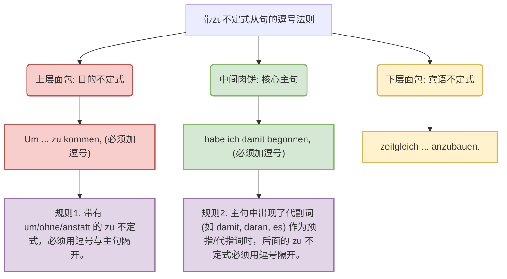

# 带zu不定式从句的“三明治”句型与逗号法则
### 一、 句子结构大解剖：为什么主句在中间？
> [!question]
> Um die Lebenshaltungskosten zu senken und in den Genuss von frischem Gemüse zu kommen, habe ich damit begonnen, zeitgleich weitere Gemüsesorten anzubauen.
> 
> 您问：“为什么中间这个主句要用两个逗号隔起来？”

其实，并不是德语语法规定“主句必须用逗号包围”，而是**因为主句的“前面”和“后面”恰好各自连接了一个需要用逗号隔开的“从属结构”**。

让我们把您的句子切成三块：

1. **前置成分（目的状语）：** `Um die Lebenshaltungskosten zu senken und in den Genuss von frischem Gemüse zu kommen,`

    _(为了降低生活成本并享受新鲜蔬菜，)_

2. **核心主句：** `habe ich damit begonnen,`

    _(我开始了这件事情，)_

3. **后置成分（宾语补足语）：** `zeitgleich weitere Gemüsesorten anzubauen.`

    _(同时种植其他种类的蔬菜。)_

#### 类比讲解：德语语法的“三明治”结构

想象您正在制作一个丰盛的**三明治**。

- 中间的肉饼（核心主句）是整句话的灵魂：“我开始了这件事情（habe ich damit begonnen）”。
- 上面的面包片（um...zu 结构）交代了您做这件事的“目的”。
- 下面的面包片（带 zu 不定式）具体解释了这件“事情”到底是什么。
- 而那两个**逗号（Komma）**，就像是用来隔开肉饼和面包片的“生菜叶”，防止汁水混在一起，让阅读者（或听众）能够一眼看清每一层的成分！

为了让您看得更清晰，我们用图表来展示这套逻辑：

### 二、 B 2 核心考点：到底什么时候必须加逗号？

在德语新正字法（Neue Rechtschreibung）中，普通的“带 zu 不定式”很多时候是可以省略逗号的。但在**以下三种情况**下，绝对必须（Zwingend!）使用逗号。您的这句话，刚好精准踩中了其中的两条死规定！

**规则 1：引导词法则 (Signalwörter)**

只要不定式是由 `um` (为了), `ohne` (没有/不), `anstatt / statt` (代替/而不是) 这几个词引导的，**必须打逗号**。

- _您的句子印证：_ 句首是 **Um** ... zu kommen，所以第一个逗号不可省略。

**规则 2：指示词/代副词法则 (Verweiswörter)**

如果主句中出现了一个“占位词”（比如 es, das, 或者是 damit, daran, dazu 等代副词），用来提示后面马上要跟着一个不定式短语，**必须打逗号**。

- _您的句子印证：_ 主句是 habe ich **damit** begonnen。这个 **damit** 就是一个指示词，意思是“我开始了**这件事**”。哪件事？逗号后面的“种植其他蔬菜”。所以第二个逗号不可省略。

**规则 3：名词依赖法则（补充扩展）**

如果带 zu 不定式是用来修饰主句中的某个名词的，也必须打逗号。

- _例子：_ Ich habe den **Plan**, nach Deutschland zu fliegen. (我有一个飞往德国的**计划**。)

### 三、 移民生活场景实战造句

掌握了这个“三明治”句式，您在德国的书面表达（如发邮件、写动机信）将立刻提升到 B 2 的水平！我们来看看它在不同场景下的应用：

**场景 1：行政事务（外管局延签）**

- _情境：_ 为了延长签证，我已下定决心，尽快提交所有缺失的文件。
- _德语（三明治结构）：_ **Um** das Visum zu verlängern, habe ich mich **dazu** entschlossen, alle fehlenden Dokumente so schnell wie möglich einzureichen.

**场景 2：找工作（面试跟进邮件）**

- _情境：_ 与其什么都不做地等待，我拿定主意，直接给贵公司的人力资源部打电话。
- _德语（三明治结构）：_ **Anstatt** nichts tuend abzuwarten, habe ich mir **es** vorgenommen, die Personalabteilung Ihrer Firma direkt anzurufen.

### 四、 六个月通关 B 2：您的当期学习坐标

在我们的六个月 B 2 通关路线图中，您目前提出的这个问题属于**第 3-4 个月的“长难句与书面语攻坚阶段”**。

这个阶段您的核心任务是：**把短句缝合成长句**。德国人非常喜欢这种严丝合缝的“套娃/三明治”式表达。在接下来的练习中，您可以刻意地在写作时多使用 `um...zu`, `ohne...zu`, `anstatt...zu` 配合主句的 `damit/daran/dazu`。这在 B 2 的写作考试（比如写投诉信或提建议）中是极其亮眼的加分项！

**您的专属互动时间：**

现在，为了验证您是否完全吸收了这条“逗号法则”和“三明治结构”，我想请您挑战一下，用德语翻译下面这个与医疗（看病）相关的句子：

_“为了治好我的背痛，我已经习惯了，每天早上去游泳。”_

_(词汇提示：治好=heilen；背痛=Rückenschmerzen；习惯于某事=sich daran gewöhnen)_

请大胆写出您的翻译，期待看到您的完美断句！您准备好写下您的答案了吗？
