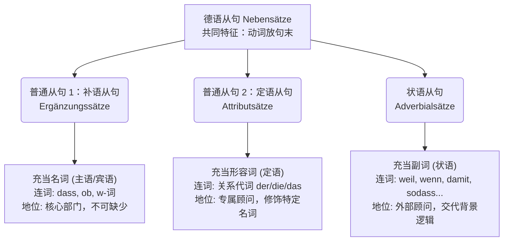

# 状语从句和普通从句区别
### 德语从句 (Nebensätze) 的三大基本分类

首先要明确一个概念：在德语语法的大家族里，不管是状语从句还是你口中的“普通从句”，它们统称为 **Nebensätze（从句）**。

从外表（句法结构）上看，它们是完全一样的：**必须由一个连词（或代词）引导，并且核心动词必须放在句子的最末尾。**

但从**内在功能**上看，它们在句子中扮演的角色完全不同。为了让你更直观地理解，我们可以把一个完整的德语复合句想象成一家**公司**。主句 (Hauptsatz) 就是这家公司的“老板”（核心骨架），而各种从句则是老板手下的不同“部门”。

为了清晰展示这个公司的组织架构，我参考了 The Mermaid Guide to Text-Based Diagramming and Visualization，为你绘制了下面这张从句家族结构图：

代码段

### 1. 普通从句之“补语从句” (Ergänzungssätze)

**类比：公司的核心部门（如财务部、人事部）**

这类从句在句子中直接充当**主语**或**宾语**（相当于一个名词）。如果没有这个从句，主句的意思根本就不完整，老板就成了“光杆司令”。

- **常见连词**：`dass` (也就是...), `ob` (是否), 疑问词 (`wann`, `wie` 等)
- **职场/技术生活场景**：
    - _宾语从句_：Ich habe sofort bemerkt, **dass** mein API-Schlüssel geleakt wurde.

        （我立刻注意到，**我的 API 密钥被泄露了**。）

        _解释_：主句“我注意到”是不完整的，你必须补充“注意到了**什么**”。这里的 `dass` 从句就是“什么”本身。

    - _宾语从句_：Können Sie mir bestätigen, **ob** mein AdMob-Konto erfolgreich verifiziert ist?

        （您能向我确认，**我的 AdMob 账户是否已成功验证**吗？）

### 2. 普通从句之“定语从句” (Attributsätze/Relativsätze)

**类比：为某位特定高管聘请的“专属个人顾问”**

定语从句的作用相当于一个**形容词**，它永远紧紧跟在主句中的某一个**名词**后面，只负责给这个名词提供额外的信息。

- **常见连词**：关系代词 (`der`, `die`, `das` 等)
- **职场/技术生活场景**：
    - Das Cloud-Konto, **das** ich gestern bei AWS erstellt habe, funktioniert einwandfrei.

        （我昨天在 AWS 创建的**那个**云账户运行完美。）

        _解释_：这个从句只负责修饰主语“Das Cloud-Konto (云账户)”，告诉别人具体是“哪一个”账户。

### 3. 状语从句 (Adverbialsätze)

**类比：公司的外部环境调查顾问**

这就是你提到的各种“条件、原因、目的、结果”从句。它们在句子中充当**状语（相当于副词）**。

它们不修饰某一个特定的词，而是给**整个主句的动作**提供背景信息：交代动作发生的**时间、原因、目的、结果或方式**。就算把状语从句砍掉，主句的语法结构依然是完整的（只是信息没那么丰富了）。

这里我们重点讲解你额外提到的**目的、结果和方式状语从句**：

- **Finalsatz (目的状语从句)** - 回答 "Wozu?" (为了什么目的？)
    - **常见连词**：`damit` (以便...)
    - **场景**：Ich richte eine Zwei-Faktor-Authentifizierung ein, **damit** meine Daten sicherer sind.

        （我设置了双因素认证，**以便**我的数据更安全。）

- **Konsekutivsatz (结果状语从句)** - 回答 "Mit welcher Folge?" (导致了什么后果？)
    - **常见连词**：`sodass` (以至于...)，或者 `so ..., dass ...` (如此...以至于...)
    - **场景**：Ich hatte gestern Probleme mit der Zahlungsautorisierung, **sodass** ich den Cloud-Service nicht nutzen konnte.

        （我昨天在支付授权上遇到了问题，**以至于**我无法使用这项云服务。）

- **Modalsatz (方式状语从句)** - 回答 "Wie / Auf welche Weise?" (通过什么方式？)
    - **常见连词**：`indem` (通过...方式), `dadurch, dass` (通过...)
    - **场景**：Man kann Serverkosten sparen, **indem** man eine kostenlose Testversion nutzt.

        （人们可以通过使用免费试用版**来**节省服务器费用。）

### 核心区别总结

|**特征**|**补语从句 (如 dass-从句)**|**状语从句 (如 damit, sodass, indem)**|
|---|---|---|
|**词性功能**|相当于**名词** (作主语/宾语)|相当于**副词** (作状语)|
|**省略后主句是否完整?**|❌ **不完整** (缺少主谓宾)|✅ **完整** (只缺少背景细节)|
|**提问方式**|Was? Wer? (什么？谁？)|Wozu? Wie? Warum? (为何？怎么做？)|

通过上面的梳理，你能感受到它们在逻辑上的本质差异了吗？状语从句就像是给主句加上的“各种滤镜”（目的滤镜、结果滤镜、方式滤镜），而 `dass` 从句则是主句不可或缺的“器官”。

**现在，轮到你来实战演练了！** 只有亲自输出，才能把知识变成你自己的。

请结合你日常可能接触到的事物（比如配置软件环境、处理工作邮件或者办理生活业务），向我提供两个句子：

1. 造一个含有 ** `dass` (补语从句)** 的句子。
2. 造一个含有 ** `indem` (方式状语从句)** 的句子。

大胆地写出来，哪怕有错误也没关系，我会在这里为你逐字纠正！期待你的作品！
