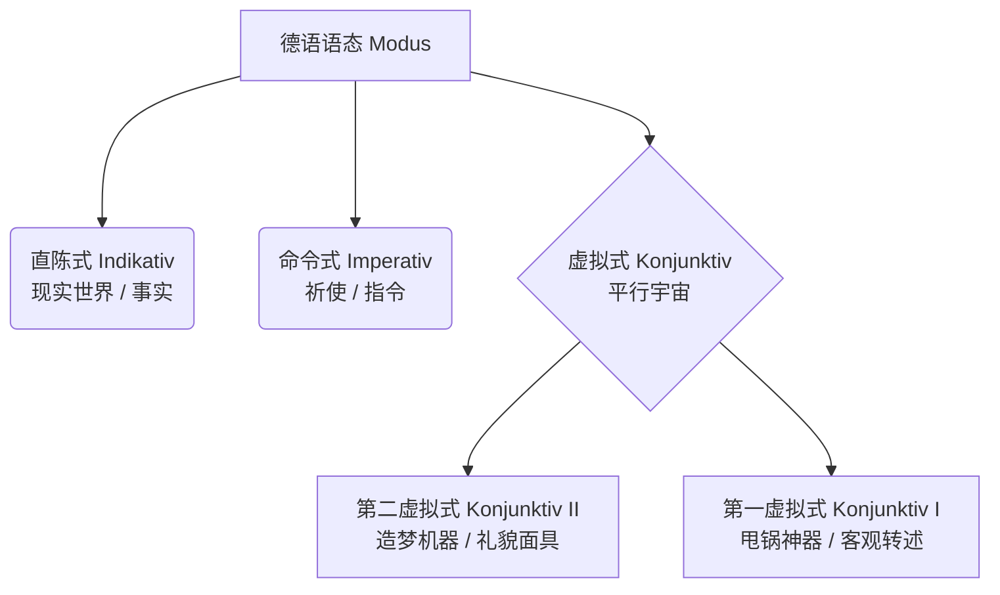

# 第一，二 虚拟式

### 🌟 核心概念：什么是虚拟式？

你可以把德语的语态想象成**“漫威宇宙”**：

1. **直陈式（Indikativ）**：这是**“现实世界”**。你陈述的是发生的事实。（例：我没有钱。_Ich habe kein Geld._）
2. **虚拟式（Konjunktiv）**：这是**“平行宇宙”**。你谈论的是愿望、假设、如果不那么做会怎样，或者你在客气地请求，亦或是你在转述别人的话。

为了让你一目了然，我们来看下面这张“德语语态家族树”：

德语的虚拟式分为两位大将：**第二虚拟式（Konjunktiv II）和第一虚拟式（Konjunktiv I）**。我们今天系统地把它们挨个拿下！

---

### 🛡️ 第一部分：第二虚拟式（Konjunktiv II）—— 你的“造梦机器”与“礼貌面具”

在德国生活，**第二虚拟式是你每天都会用到的保命技能**。外管局（Ausländerbehörde）办事员的脸有多臭，你的第二虚拟式就要有多礼貌！

它主要用于表达：**非真实的条件（假如...）、美好的愿望（但愿...）、委婉的请求（您能不能...）、以及建议（你应该...）。**

#### 1. 结构大揭秘：怎么变？

不要去背繁琐的词尾变化，大师教你一个 B 1/B 2 阶段最实用的“偷懒法则”：

- <mark style="background:#d4b106">**黄金万能公式**</mark>：`würden + 动词原形` （就相当于英语里的 would do）
- **四大金刚（必须记特殊变形）**：
    - **sein (是)** 变成 $\rightarrow$ **wäre** (ich wäre, du wärst, er wäre...)
    - **haben (有)** 变成 $\rightarrow$ **hätte** (ich hätte, du hättest, er hätte...)
    - **werden (成为)** 变成 $\rightarrow$ **würde**
    - **情态动词** (können, müssen, dürfen...) $\rightarrow$ 加乌姆劳特音变（变音符），如 **könnte, müsste, dürfte**。

#### 2. 实战场景应用（移民生活必备）

**🎬 场景一：外管局 / 市民中心（委婉请求 Höfliche Bitte）**

在德国办签证或落户（Anmeldung），直接用直陈式（Ich will... 我要...）会显得像来砸场子的。戴上“礼貌面具”：

> ❌ _Ich will einen Termin._ (太生硬了，办事员可能会翻白眼)
> 
> ✅ **Ich hätte gern einen Termin.** (我想要一个预约。— _hätte_ 瞬间拉满好感度)
> 
> ✅ **Könnten Sie mir bitte helfen?** (您能帮帮我吗？— _könnten_ 比 _können_ 听起来柔和十倍)

**🎬 场景二：找工作与租房（非真实条件 Irrealer Bedingungssatz）**

你在“平行宇宙”里幻想自己条件更好：

> 🏠 **Wenn ich einen unbefristeten Arbeitsvertrag hätte, würde ich diese Wohnung sofort mieten.**
> 
> (如果我有一份无限期工作合同（现实是我没有），我就会马上租下这套公寓（现实是我租不到）。)

**🎬 场景三：看医生（给出建议 Ratschlag）**

医生给你开药，或者你给朋友建议：

> 🩺 **Sie sollten mehr Wasser trinken und sich ausruhen.**
> 
> (您应该多喝水多休息。 — _sollten_ 是 _sollen_ 的虚拟式，表达温和的建议，而不是强制命令。)

#### 3. 进阶：过去的第二虚拟式（B 2 必考点！）

如果你要抱怨**过去**搞砸的事情（早知道我就...），你需要用到：

`wäre/hätte + 动词的过去分词 (Partizip II)`

> 🏢 找工作被拒后的顿悟：
> 
> **Wenn ich mich besser vorbereitet hätte, hätte ich den Job bekommen.**
> 
> (如果我当时准备得更好，我就拿到那个工作了。—— 现实是：没准备好，工作黄了。)

---

## 📰 第一虚拟式（Konjunktiv I）—— 你的“甩锅神器”

### 🎤 1. 核心心法：为什么要用第一虚拟式？

正如我们在教材中看到的，第一虚拟式的核心功能是**间接引语（Indirekte Rede）**。

- **功能：** 转述他人的话，表达**中立的态度**，与转述内容**保持距离**（即“客观甩锅”）。
- **场景：** 极其常用于正式场合，如新闻报道（Nachrichten）、报纸（Zeitung）以及法庭或警方的笔录中。
- **引语标志词：** `sagen` (说), `behaupten` (声称), `meinen` (认为), `berichten` (报道) 等。

### ⏱️ 2. 第一虚拟式的现在时 (Präsens)

**构成公式：** **动词的现在时词干 + 第一虚拟式专属词尾** (`-e`, `-est`, `-e`, `-en`, `-et`, `-en`)

|**人称**|**规则动词 (kaufen)**|**情态动词 (müssen)**|**👑 绝对特殊词 (sein)**|
|---|---|---|---|
|ich|kauf**e**|müss**e**|**sei**|
|du|kauf**est**|müss**est**|sei**est**|
|**er/sie/es**|**kaufe**|**müsse**|**sei**|
|wir|kauf**en**|müss**en**|sei**en**|
|ihr|kauf**et**|müss**et**|sei**et**|
|Sie/sie|kauf**en**|müss**en**|sei**en**|

💡 **大师敲黑板：**

你会发现，最常用的其实只有**第三人称单数 (er/sie/es)**！因为我们在转述时，绝大多数情况都是在说“他/她/它/媒体说……”。

### 🔄 3. 核心考点：“变身替代”法则 (Ersatzform)

这是第一虚拟式最容易让人困惑的地方，但其实逻辑非常简单：**为了防止混淆！**

当你按照上面的表格变位时，你会发现 `ich`, `wir`, `sie/Sie` 的第一虚拟式长得和**直陈式（普通现在时）一模一样**（比如 _ich kaufe, wir kaufen_）。如果长得一样，听众就不知道你是在“客观转述”还是在“陈述事实”了。

- **规则：** 当第一虚拟式与直陈式形式相同时，**必须用第二虚拟式 (Konjunktiv II) 来替代**第一虚拟式！
- **现状：** `du` 和 `ihr` 的第一虚拟式虽然长得不一样，但在现代德语中也已经渐渐过时，通常也直接用第二虚拟式替代。

**实战对比：**

- _原话：_ Die Leute sind faul. (人们很懒。)
- _转述 (由于 sie sind 无法体现虚拟式)：_ Der Politiker sagt, die Leute **seien** faul. (这里用 `seien`，因为 `sein` 的变位很特殊，长得不一样，不需要替代)。
- _转述 (如果是普通动词)：_ Er sagt, wir **kaufen** das Auto. (❌ 无法区分) ➡️ Er sagt, wir **würden** das Auto **kaufen**. (✅ 用 K 2 替代)。

### ⏪ 4. 第一虚拟式的过去时：降维打击

德语的直陈式有三种过去的时间（过去时 Präteritum、现在完成时 Perfekt、过去完成时 Plusquamperfekt），但在第一虚拟式的世界里，**只有一种过去时形式！** 无论原话用的是哪种过去，转述时统统“降维”成这一种。

**构成公式：** **haben/sein 的第一虚拟式 (habe/sei) + 过去分词 (Partizip II)**

- _原话三种形态：_
    
    1. Er **kam** gestern. (过去时)
    2. Er **ist** gestern **gekommen**. (完成时)
    3. Er **war** gestern **gekommen**. (过完时)
        
- _转述只有一种：_ Sie sagte, er **sei** gestern **gekommen**.

⚠️ **独立法则：** 转述的句子时态，只和原话发生的时间有关，和引导句的时态（Er sagt / Er sagte / Er hat gesagt）**完全无关**！

### 🧩 5. 进阶特殊句式：被动、情态与疑问句

在 B 2 的阅读和写作中，你还会遇到以下复合结构：

1. **第一虚拟式的将来时：** `werden` 的第一虚拟式 + 动词原形
    
    - _原话：_ Ich werde morgen gehen.
    - _转述：_ Sie sagt, sie **werde** morgen **gehen**.
        
2. **第一虚拟式过去时的被动语态：** `sein` (虚拟式) + 过去分词 + `worden`
    
    - _转述：_ Er behauptet, die Dose **sei** geworfen **worden**. (他声称罐子被扔了。)
        
3. **带有情态动词的过去时：** `haben` (虚拟式) + 动词原形 + 情态动词原形 (双不定式)
    
    - _转述：_ Er sagt, er **habe** das Haus **kaufen wollen**. (他说他本来想买那栋房子的。)
        
4. **间接疑问句：** 如果原话是个问句，转述时不仅要改虚拟式，还要把句子变成**尾语序**。
    
    - _原话 (W 问句)：_ "Wann sprechen Sie?" ➡️ Er fragte, **wann** er **spreche**.
    - _原话 (一般疑问句)：_ "Kennen Sie ihn?" ➡️ Er fragte, **ob** er ihn **kenne**.

现在，第一虚拟式的整张拼图已经完整了！为了检验一下“降维打击”和“替代法则”你是否已经内化，我给你一个简短的实战挑战：

假设昨天发生了一起小车祸，肇事司机（der Fahrer）对警察说了两句话：

1. "Ich **habe** das rote Auto nicht **gesehen**." (我没看见那辆红色的车。)
2. "Wir **fahren** immer sehr vorsichtig." (我们一直开得很小心。)

如果你是报纸的记者，要用第一虚拟式（必要时使用第二虚拟式替代）来转述这两句话，你会怎么写呢？

- "Der Fahrer behauptet, er..."
- "Außerdem sagt er, sie (他们)..."

# k 17-53-10

动词变化

![[Pasted image 20260226162057.png]]

![[Pasted image 20260226162203.png]]

![[Pasted image 20260226162431.png]]
