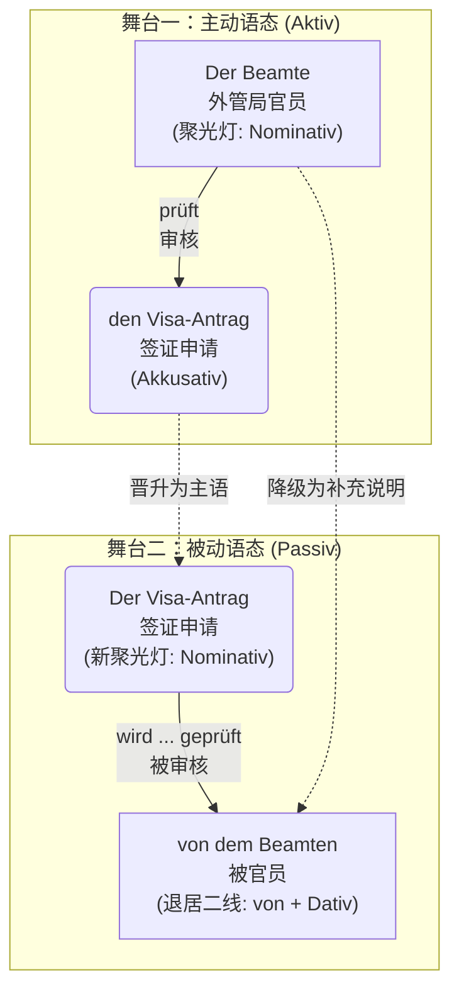
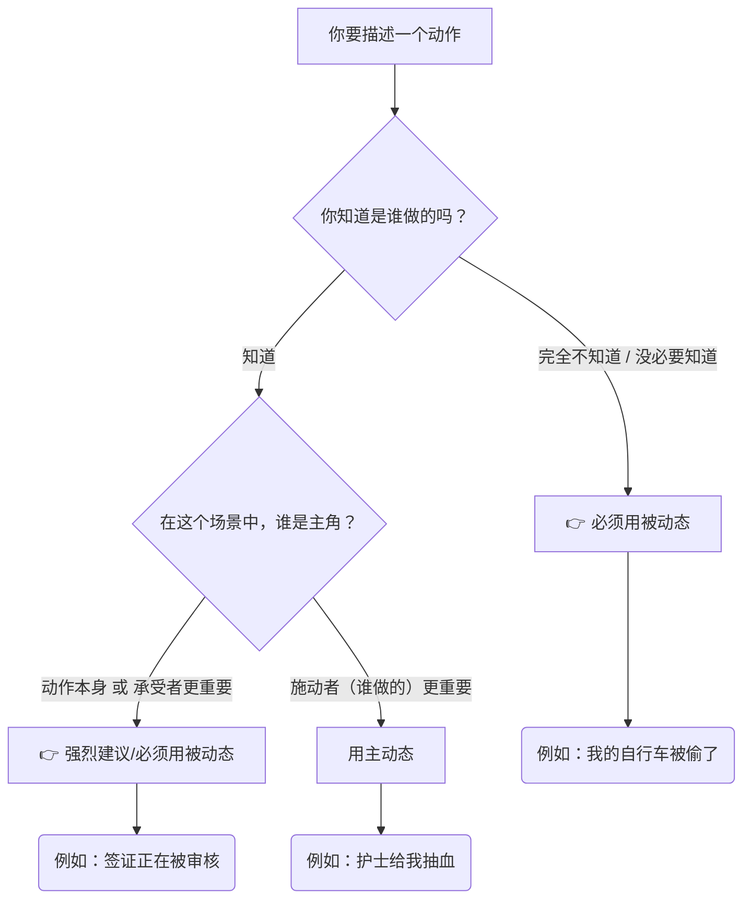
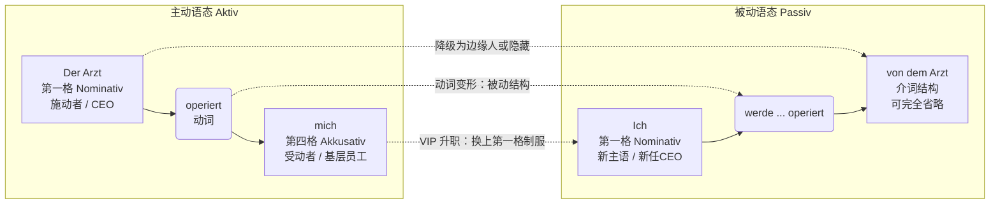
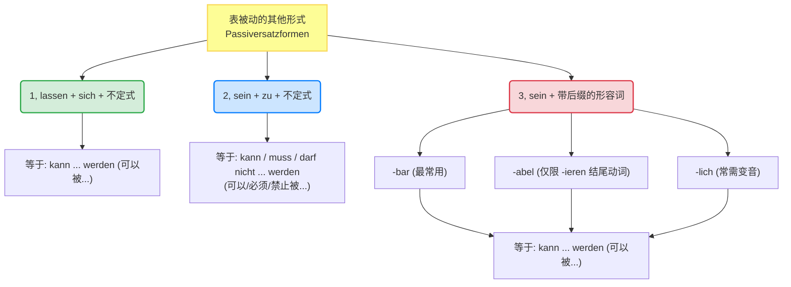

# 被动态

德语母语者特别偏爱被动态，因为它显得客观、官方，而且——如果你不想承担责任的话，它是最 ^372k8d好的语言外衣！

### 规则变化：

[[语言学习/德语/公共知识语法/时态.md#^hbAN22QX|100%]]

![[PixPin_2026-06-15_14-00-36.png|549]] ![[PixPin_2026-06-15_14-00-44.png|522]]

### 核心思维：被动态的“聚光灯效应”

想象你在看一场舞台剧。

* **主动语态**：聚光灯打在**动作的执行者（主语）**身上。大家都在看“谁”干了这件事。
* **被动语态**：导演把聚光灯移走了，直接打在**动作的承受者**或者**动作本身**上。执行者要么被赶下舞台（省略不提），要么退居二线充当背景板。

为了让你更直观地理解主动句如何“华丽转身”变成被动句，我们来看下面这个图解 ：

---

### 最基础的框架

过程被动态强调的是**“动作正在进行的过程”**。

它的万能公式是：**werden 的变形 + 动词的第二分词 (Partizip II)**。

首先，你必须把助动词 `werden` 的现在时变位刻在脑子里：

* ich **werde**
* du **wirst** (注意不规则)
* er/sie/es **wird** (注意不规则)
* wir **werden**
* ihr **werdet**
* sie/Sie **werden**

#### 🏗️ 德语的灵魂：框形结构 (Satzklammer)

^01a2eh

在主句中，`werden` 永远占据**第二位（Position 2）**，而第二分词 `Partizip II` 被一脚踢到了**句末（Position End）**。它们俩就像一个巨大的括号，把其他的信息（时间、地点、原因）死死抱在中间。

> **移民生活场景：医疗 (Beim Arzt)**
> * **主动**：Der Arzt operiert den Patienten heute. (医生今天给病人做手术。)
> * **被动**：Der Patient **wird** heute **operiert**. (病人今天被做手术。)
> * *你看，在这个语境中，“谁”做手术不重要（肯定是医生），重要的是病人“正在经历手术”这个过程。*

---

### 各种时态中的用法

被动语态也可以在时间的河流里穿梭。改变时态时，**只有助动词 werden 在变形，句末的第二分词稳如泰山！** 我们以“找工作/入职”场景为例：`Der Vertrag (合同) wird unterschrieben (被签署)`。

| 时态 (Tempus)                 | 公式形态                        | 例句 (租房/工作场景)                                                          | 中文解析                       |
| :-------------------------- | :-------------------------- | :-------------------------------------------------------------------- | :------------------------- |
| **Präsens (现在时)**           | **wird** + PII              | Der Mietvertrag **wird** heute **unterschrieben**.                    | 租房合同今天**被**签署。（正在发生）       |
| **Präteritum (过去时)**        | **wurde** + PII             | Der Vertrag **wurde** gestern **unterschrieben**.                     | 合同昨天**被**签署了。（常用于官方书面语）    |
| **Perfekt (完成时)**           | **ist** + PII + **worden**  | Der Vertrag **ist** gestern **unterschrieben worden**.                | 合同昨天**已经/被**签署了。（日常口语常用）   |
| **Plusquamperfekt (过去完成时)** | **war** + PII + **worden**  | Der Vertrag **war** schon **unterschrieben worden**, bevor ich ankam. | 在我到达之前，合同早就**被**签完了。       |
| **Futur I (将来时)**           | **wird** + PII + **werden** | Der Vertrag **wird** morgen **unterschrieben werden**.                | 合同明天**将要被**签署。（带有一种官方的承诺感） |

🚨 **大师避坑警告 (B 2 必考点)**：

在 Perfekt 和 Plusquamperfekt 中，werden 的第二分词本来是 *geworden*。但是！在被动态里，为了避免发音过于累赘，德国人把前缀 ge- 扔掉了，变成了 **worden**！

* ❌ Der Vertrag ist unterschrieben *geworden*. (错！)
* ✅ Der Vertrag ist unterschrieben **worden**. (对！)
![[PixPin_2026-06-15_14-01-19.png|1090]]

> [!question] werden 二分词不是 geworden 吗, 表里没有 ge-?
>
> 由于被动语态 werben中扮演的角色是助动词所以不用加ge-，而在平常需要加 ge- 的情况下他扮演的是实意动词翻译为成为等的含义。

---

### 被动态遇到情态动词

![[PixPin_2026-06-15_14-01-51.png|1090]]

这是 B 1 升 B 2 的重点！在实际生活中，我们很少只说“房子被打扫”，我们通常说“房子**必须**被打扫”。

公式：**情态动词的变位 (Pos 2) + ... + PII + werden (句末)**。

这里框架结构变得更大了，句末变成了“两个动词”。

**1. 现在时 (Präsens)：**

> **场景：租房退房 (Wohnungsübergabe)**
> Die Wohnung **muss** beim Auszug besenrein **übergeben werden**.
> (退房时，公寓**必须被**打扫得干干净净地交接。)
> *框架：muss (Pos 2) ...... übergeben werden (句末)*

**2. 过去时 (Präteritum)：**

> **场景：行政事务 (Behördengänge)**
> Das Formular **musste** bis gestern **abgegeben werden**.
> (这份表格**昨天之前必须被**提交。)

**3. 完成时 (Perfekt) - 🔥 B 2 顶级难度：**

在完成时中，当情态动词、被动态相遇时，会出现传说中的**“双不定式 (Doppelinfinitiv)”**现象。此时不需要 Partizip II，而是把所有动词堆在句末！

> **场景：抱怨房东**
> Die Heizung **hat** schon gestern **repariert werden müssen**!
> (暖气本来昨天**就必须要被**修好的！)
> *框架：hat (助动词放第二位) ...... repariert (实义动词 PII) + werden (被动助动词) + müssen (情态动词原型).*
> *(大师建议：在口语中，面对这种情况，德国人也会绕道走，直接用过去时 musste repariert werden，但 B 2 考试阅读和写作里你必须能认出来！)*

---

### 第四步：谁干的？(von vs. durch)

既然执行者退居二线了，如果我们非要交代是谁干的，该怎么办？用介词 `von` 或 `durch` 把它请回舞台边缘。

* **von + Dativ (第三格)**：通常用于**人、机构**等“主动的执行者”。
    * *Das Visum wird **von der Ausländerbehörde** (外管局) erteilt.* (签证由外管局发放。)
* **durch + Akkusativ (第四格)**：通常用于**方法、手段、抽象的原因或自然力量**。
    * *Die Stadt wurde **durch das Unwetter** zerstört.* (城市被暴风雨摧毁了。)
    * *Ihr Deutsch wird **durch regelmäßiges Üben** verbessert.* (您的德语通过规律的练习得到了提高。)

---

### 第五步：动作结束后的余波——状态被动态 (Zustandspassiv)

刚才讲的都是“正在被做”（Vorgangspassiv，用 werden）。

如果动作已经做完了，尘埃落定，我们只看**结果和状态**，这时候就要用**状态被动态**。

公式：**sein 的变形 + Partizip II**。

对比一下：

1.  **Vorgangspassiv (动作进行中)**: Um 8 Uhr **wird** die Arztpraxis **geöffnet**. (早上 8 点，诊所门正在被打开。你仿佛听到了钥匙转动和开门的声音。)
2.  **Zustandspassiv (动作已完成，状态持续)**: Um 8:15 Uhr **ist** die Arztpraxis **geöffnet**. (8 点 15 分，诊所门已经是开着的了。你看到的是敞开的大门这个状态。)

> **移民生活场景**：你去超市买面包，发现门关了。
> 墙上挂着牌子："Das Geschäft **ist** sonntags **geschlossen**." (商店周日是关闭状态的。)

---

### 第六步：B 2 进阶避坑指南 (注意事项)

想要完美驾驭被动态，你还要避开这几个陷阱：

**1. 幽灵主语 "Es"**

如果一个主动句没有第四格宾语（Akkusativ），变成被动句时就没有东西可以提拔为主语。这时候我们需要一个幽灵主语 `es` 来占位（占住第一位）。

* *主动*: Man tanzt heute Abend. (人们今晚跳舞。)
* *被动*: **Es** wird heute Abend getanzt. (今晚有舞会/今晚跳舞。)
* *灵活变位*: 如果你把时间提前，"es" 就会像幽灵一样消失！-> *Heute Abend wird getanzt.* (这也是极其地道的德语表达！)

**2. 哪些动词天生与被动态“绝缘”？**

不是所有动词都能变成被动句！如果你的句子属于以下情况，千万别用被动态：

* **表示拥有的动词**：haben, besitzen, bekommen (你不能说“一辆车被我拥有” *Ein Auto wird von mir gehabt* ❌，这在德语里是灾难级的错误)。
* **表示“知道/认识”的动词**：wissen, kennen。
* **所有反身动词 (Reflexive Verben)**：比如 sich interessieren, sich freuen。
* **量度动词**：kosten (花费), wiegen (重)。

您提的问题非常关键，它涉及**德语语法与中文表达习惯的根本差异**。简单说：**在德语里，“被”字（即被动语态结构）是不能随便省略的，否则要么句子不通顺，要么意思完全改变。**

让我们一步步拆解您的疑问。

---

# _Der Mietvertrag muss unterschrieben werden._ 省略被 werden 行不行？

### 1. 中文的“模糊被动” vs 德语的“强制被动”

- **中文**：说“合同必须签署”，**没有“被”字，但大家自动理解成“合同必须（被）签署”**。因为合同不会自己签，所以即使没写“被”，意思也是被动。中文允许这种**零标记被动**。
- **德语**：德语语法**没有“零标记被动”**。如果主语是动作的承受者（合同），谓语动词必须用被动语态（`werden + 过去分词`），否则**每个词的位置、词尾、语法意义都会错**。

所以，不是“一定要交个被”，而是**德语语法强迫你显式表达动作方向**。

---

### 2. 如果硬要去掉“werden”（不加被）会怎样？

对比下面三个句子：

| 句子 | 语法分析 | 意思 |
|------|---------|------|
| (a) `Der Mietvertrag muss unterschrieben werden.` | 被动不定式（werden+过去分词） | 合同必须**被**签署 |
| (b) `Der Mietvertrag muss unterschrieben.` | 去掉 werden → 只剩过去分词 | ❌ 语法错误，不完整 |
| (c) `Der Mietvertrag ist unterschrieben.` | 用 sein+过去分词（状态被动） | 合同已签署（状态，不是动作） |

- 句子 (b) 在德语中是**病句**，因为情态动词 `muss` 后面必须接**动词原形（不定式）**，而 `unterschrieben` 是过去分词，不是不定式。只有 `unterschrieben werden` 整个才是不定式（被动不定式）。
- 如果换成 `sein`（如 c），则意思变成“已签署状态”，和“必须被签署”完全不同。

---

### 3. 用主动语态不行吗？比较一下：

**主动语态**（主语是执行者）：

> `Wir müssen den Mietvertrag unterschreiben.`  
> 我们必须签署合同。

**被动语态**（主语是承受者）：

> `Der Mietvertrag muss unterschrieben werden.`  
> 合同必须被签署。

如果您想表达“合同必须签署”而不指明谁签，德语只能选用被动语态（因为不出现执行者）。**主动语态必须有一个主语（如 wir, man）**，否则句子不成立。

- 用 `man` 也可以：`Man muss den Mietvertrag unterschreiben.` （人们必须签署合同）—— 这是主动语态，主语是“人们”，合同是宾语。但原句以“合同”为主语，所以必须被动。

---

### 4. 总结：为什么“被”不能省？

| 语言 | 主动 | 被动（显式） | 被动（隐式） |
|------|------|-------------|-------------|
| 中文 | 我们必须签署合同 | 合同必须**被**签署 | 合同必须签署 ✅（隐式被动） |
| 德语 | Wir müssen den Vertrag unterschreiben. | Der Vertrag muss **unterschrieben werden.** | ❌ 没有隐式被动，必须显式加 werden |

**所以回答您的问题：**  
“不加‘被’（werden）意思一样”——这句话只在中文成立。在德语里，**不加 werden，语法不通，意思无法正确传达**。德语必须用显式的被动结构，这是语法规则，不是可有可无的装饰。

如果您还有其他疑问，我们继续讨论 😊

# 使用场景

^j6wv61

[[语言学习/德语/公共知识语法/动词.md#^lwYndODE|100%]]

![[image-356.png|922x1147]]

> [!question]
被动态在什么情况下必须使用，因为我遇到了一些必须使用的场景而我分不清什么时候一定要用什么时候主观使用

现在，我们用一个生动的“舞台聚光灯”类比来深入拆解。

想象一下，每一个句子都是一出舞台剧。在主动态（Aktiv）**里，聚光灯打在“做事的人”（施动者/Täter）身上；而在**被动态（Passiv）**里，导演（也就是你）觉得“做事的人”太不重要了，直接把他踢下了舞台，把聚光灯死死地打在**“承受动作的人/物”**或者**“动作本身”上！

那么，什么时候你**必须**把施动者踢下舞台，强行使用被动态呢？主要有以下三大“必须”场景：

---

## 下面是三种情况

### 1. 必用：施动者“查无此人”或“完全不重要”

当你不知道动作是谁发出的，或者在这个语境下，谁发出的根本不重要时，如果你强行用主动态，句子会显得非常诡异且不符合逻辑。

- **生活场景：治安/突发事件**
    - ❌ _Jemand hat mein Fahrrad gestohlen._ (某人偷了我的自行车。—— 语法没错，但听起来像你在强调“有个人”干的，而不是你的车没了。)
    - ✅ **Mein Fahrrad wurde gestohlen.** (我的自行车被偷了。—— 绝对的重点是你可怜的自行车，小偷是谁你根本不知道，必须用被动态！)
- **生活场景：医疗/医院就诊**
    - 你在医院做完手术，你想表达手术很成功。
    - ✅ **Ich wurde gestern erfolgreich operiert.** (我昨天被成功手术了。—— 重点是你得到了救治，至于到底是 Müller 医生还是 Schmidt 医生拿的柳叶刀，在宏观表达上并不重要。)

### 2. 必用：强调“流程”和“规则”，屏蔽个人色彩（必须使用）

在德国，行政流程和规章制度是神圣不可侵犯的。官方文件、租房合同、工作手册为了显示**客观性和强制性**，会强制使用被动态。这种时候如果不使用被动态，就不符合德语的语言习惯（Idiomatik）。

- **生活场景：外管局办签证**
    - 你去问签证进度，办事员绝不会说：“我们办公室的 Peter 正在看你的材料（Peter prüft Ihre Unterlagen）”，因为这显得太私人、太随意了。
    - ✅ **Ihre Unterlagen werden zurzeit geprüft.** (您的材料目前正在被审核。—— 典型的官方回复，强调流程正在推进，这也是你必须听懂和使用的句型。)
- **生活场景：职场指令/租房规矩**
    - 公司规定报销单必须签字。
    - ✅ **Der Antrag muss unterschrieben werden.** (申请表必须被签字。—— 强调的是“签字”这个硬性规定，针对所有人，不针对特定的你我他。)

### 3. 必用：无人称被动态（Unpersönliches Passiv）：表达群体行为或绝对禁令（必须使用）

这是德语中非常有魅力（也很霸道）的一个用法。当动作本身就是全部的焦点，连宾语都没有的时候，我们用 "es" 或者把地点放在句首来占位。这种句子常用于公共场所的标语。

- **生活场景：公共场所/邻里关系**
    - 星期天在德国是休息日，邻居在院子里大声放音乐，你可以抱怨：
    - ✅ **Hier wird nicht laut Musik gehört!** (这里不准大声听音乐！—— 比 "Ihr dürft hier nicht..." 更有威慑力，表示“这是普遍的规矩”。)
    - 诊所候诊室的牌子上写着：
    - ✅ **Es wird um Ruhe gebeten.** (请保持安静。—— 字面意思是“安静正在被请求”，极为正式且不容拒绝。)

---

### 总结：如何区分“主观选择”还是“必须使用”？

- **主观选择：** 当你明明知道是谁干的，也完全可以说出他的名字，但你为了**礼貌、委婉或者推卸责任**，故意用被动态。比如在工作中犯了错：_Der Fehler wurde gemacht._（错误被犯了，暗指：不知道谁干的，反正不是我）。这就是主观选择的修辞手法。
- **必须使用：** 当你**不知道谁干的**，或者是在**谈论官方流程、法律法规、客观事实**时，请毫不犹豫地把那个不知名的人踢下舞台，打开被动态的聚光灯！

#### 1. 施动者（动作发出者）未知或不重要（Täter unbekannt / unwichtig）

当谁做的这件事并不重要，或者大家都心知肚明时，必须用被动语态。

- **行政事务场景：**
    - _主动：_ Der Beamte bearbeitet mein Visum. (办事员正在处理我的签证。—— 没人关心是哪个办事员处理的。)
    - _被动：_ Mein Visum **wird** gerade **bearbeitet**. (我的签证正在**被处理**。—— 重点是签证有进展了！)
- **医疗场景：**
    - _被动：_ Der Patient **wurde** gestern **operiert**. (病人昨天**被做手术了**。—— 显然是医生做的，不需要刻意提及医生。)

#### 2. 强调动作或过程本身（Fokus auf der Handlung）

当你想让听众的注意力完全集中在正在进行的活动上。

- **租房场景：**
    - _被动：_ Die Wohnung **wird** vor dem Einzug komplett **renoviert**. (入住前公寓会**被**全面**翻新**。—— 房东强调的是公寓会焕然一新，至于请哪个装修队，你不需要管。)

#### 3. 表达普遍规则或禁令（无人称被动语态 Unpersönliches Passiv）

德国人非常喜欢用被动语态来宣布规矩。当一个动作没有特定的宾语，只是想表达“这里（不）允许做某事”时，我们会用 `es` 占位（或者直接倒装省略 `es`）。

- **行政 / 日常生活：**
    - _被动：_ Hier **wird** nicht **geraucht**! (这里**禁止吸烟**！—— 动作本身就是核心，充满了不可违抗的权威感。)
    - _被动：_ **Es wird** heute viel **diskutiert**. (今天讨论得很热烈。)

### 什么时候绝对不能使用被动语态？

这是一个极度重要的排雷区！记住，不是所有句子都能变被动。以下四种情况，**绝对不能**用被动：

#### 1. 表达状态、拥有或感知的动词

像 _haben_ (有), _sein_ (是), _wissen_ (知道), _kennen_ (认识), _es gibt_ (存在) 这些词，它们没有实际的“物理动作”，不能转换。

- ✅ Ich habe ein Auto. (我有一辆车。)
- ❌ ~~Ein Auto wird von mir gehabt.~~ (语法灾难，绝对不可！)

#### 2. 反身动词（Reflexive Verben）

如果一个动作是施加在自己身上的，比如 _sich freuen_ (高兴), _sich beeilen_ (赶快)，它就不能变成被动。

- ✅ Wir beeilen uns. (我们得快点。)
- ❌ ~~Es wird sich beeilt.~~ (错误！)

#### 3. 表示位置移动或状态改变的不及物动词

那些在完成时中用 _sein_ 构成的动词，比如 _gehen_ (走), _fahren_ (开), _sterben_ (死), _aufwachen_ (醒来)。

- ✅ Der Mann stirbt. (这男人快死了。)
- ❌ ~~Der Mann wird gestorben.~~ (错误！)

#### 4. 施动者是全句最重要的信息时

如果你想强调具体的责任人或功臣，必须用主动语态。

- ✅ **Der Chef persönlich** hat mich gekündigt! (是老板亲自开除的我！—— 强调愤怒和对象。)

### B 2 级核心进阶：被动语态替代形式（Passiversatzformen）

要想在六个月内达到 B 2 并在职场游刃有余，你必须掌握德国人的“高级偷懒技巧”：**用主动的壳子，表达被动的意思**。这在职场和公文中极为常见。

|**替代形式语法结构**|**例句 (找工作/行政场景)**|**对应的被动语态含义**|
|---|---|---|
|**sich lassen + Infinitiv** (最常用)|Das Problem **lässt sich** leicht **lösen**.|Das Problem _kann gelöst werden_. (问题可以被解决)|
|**sein + zu + Infinitiv** (极其公文化)|Die Miete **ist** bis zum 3. des Monats **zu zahlen**.|Die Miete _muss gezahlt werden_. (租金必须被支付)|
|**Adjektiv 带有 -bar / -lich 后缀**|Dieses Formular ist online nicht **verfügbar**.|Dieses Formular _kann_ online nicht _verfügt werden_. (此表格无法在线获取)|

### 结构化总结与实战演练

被动语态的底层公式非常简单：

**助动词 werden (根据时态变化) + 句子核心内容 + Partizip II (动词第二分词)**

- **现在时 (Präsens):** Der Mietvertrag **wird** heute **unterschrieben**. (租房合同今天被签署。)
- **过去时 (Präteritum):** Der Mietvertrag **wurde** gestern **unterschrieben**. (租房合同昨天被签署了。)
- **完成时 (Perfekt):** Der Mietvertrag **ist** gestern **unterschrieben worden**. (注意这里是 worden 而不是 geworden！)

#### 🎯 德语大师的随堂小练习

**请尝试将以下这句“找工作场景”的中文翻译成德语。**

_提示：思考一下这是普通被动，还是可以用 B 2 的“替代形式”。_

**情境：** 你在面试，HR 告诉你：“这份文件必须在明天之前提交（einreichen）。”

1. **基础被动语态要求：** ____________________
2. **B 2 高级替代形式 (sein + zu + Infinitiv)：** ____________________

> **大师参考答案（建议自己先思考再看）：**
>
> 1. Das Dokument **muss** bis morgen **eingereicht werden**. (带情态动词的被动语态)
>     
> 2. Das Dokument **ist** bis morgen **einzureichen**. (更加专业、官方的 B 2 表达)

干得漂亮！被动语态并不难，它只是换了一个看待世界的视角。把这些场景融入到你接下来的租房、签证和面试准备中，你会发现你的德语听起来已经像个地道的德国人了！保持这股冲劲，我们下次见！

# 举例

## Ich werde operiert.我是主语也可以用被动态吗

这是一个非常敏锐且极具价值的问题！你的直觉非常准，很多初学者在刚接触被动语态时，都会卡在这个逻辑转折点上：“我明明是‘被’做手术的，为什么我还能做主语（Nominativ）？”

直接回答你的问题：**当然可以！而且在大多数情况下，你“必须”成为主语。**

这正是德语（也是很多印欧语系语言）被动语态的**核心魔法**。为了彻底帮你扫清这个 B 1/B 2 级别的理解障碍，我们今天就来拆解这个语法变形过程。

### 核心概念：受动者的“VIP 身份升级”

在语法世界里，我们可以把句子的成分想象成一家公司的职位体系。 **“主语（Nominativ）”**是这家公司的 **CEO**，永远占据句子的 C 位。 **“第四格宾语（Akkusativ）”**则是**基层员工**，是动作的直接承受者。

当我们将一个句子从主动语态（Aktiv）**转换成**被动语态（Passiv）时，实际上发生了一场“人事调动”：**原来的基层员工获得了 VIP 身份升级，直接空降成了新公司的 CEO（主语）！**

让我们用你的句子 `Ich werde operiert.`（我被做手术了）在**医疗场景**下来还原这场升职记：

1. **主动语态（聚焦施动者）：**
$1
    - **Der Arzt** operiert **mich**. (医生给我做手术。)
    - _Der Arzt_ = 医生是动作的发起者，他是目前的 CEO（第一格 Nominativ 主语）。
    - _mich_ = 我是动作的承受者（病人），我是基层员工（第四格 Akkusativ 宾语）。
$1
2. **被动语态（焦点转移，身份升级）：**
$1
    - 现在，我们要把聚光灯从医生身上移开，打在病人（你）身上。医生被“降级”或者直接“开除”（省略不提）。
    - 原本的基层员工 **mich**（第四格）立刻获得了 VIP 身份升级，换上了 CEO 的制服，变成了 **Ich**（第一格 Nominativ）。
    - **Ich** werde (von dem Arzt) operiert.

为了让你更直观地理解，请看下面的语法变形图表：

代码段

### 移民生活场景实战演练

一旦你理解了“**主动句的第四格宾语（Akkusativ）会变成被动句的第一格主语（Nominativ）**”这个黄金定律，你在德国的日常生活就会如鱼得水。

我们来看看这套“身份升级”魔法在不同场景下的应用：

**场景 1：找工作面试 (Jobsuche)**

- **主动：** Der Chef lädt **mich** zum Vorstellungsgespräch ein. (老板邀请我去面试。)
- **被动：** **Ich** werde zum Vorstellungsgespräch eingeladen. (我被邀请去面试了！—— _mich 升级为 Ich_)

**场景 2：外管局延签 (Ausländerbehörde)**

- **主动：** Der Beamte ruft **den nächsten Antragsteller** auf. (办事员呼叫下一位申请人。)
- **被动：** **Der nächste Antragsteller** wird aufgerufen. (下一位申请人被叫到了。—— _den Antragsteller 升级为 der Antragsteller_)

**场景 3：租房纠纷 (Wohnungssuche)**

- **主动：** Der Vermieter hat **uns** gestern gekündigt. (房东昨天把我们解约了。)
- **被动：** **Wir** sind gestern gekündigt worden. (我们昨天被解约了。—— _uns 升级为 Wir，注意这里是完成时_)

### ⚠️ B 2 级高能预警：第三格的“倔强” (Dativ-Falle)

既然你已经懂了第四格（Akkusativ）可以升级为主语，那么作为德语大师，我必须马上给你抛出一个 B 2 考试和日常口语中最容易踩坑的**地雷**！

在德语中，有些动词不带第四格宾语，而是带**第三格宾语（Dativ）**，比如：_helfen_ (帮助), _danken_ (感谢), _gratulieren_ (祝贺)。

**核心规则：第三格（Dativ）是个非常“倔强”的员工，它拒绝升职！** 在变成被动语态时，**第三格必须保持第三格原样，绝对不能变成第一格主语（Nominativ）！**

让我们继续用**医疗场景**来看：

- **主动：** Der Arzt hilft **mir**. (医生帮助我。—— _helfen 要求加 Dativ_)
- **被动（错误示范）：** ~~Ich werde geholfen.~~ (❌ 绝对错误！这是德国人听了会抓狂的语法灾难。)
- **被动（正确示范）：** **Mir** wird geholfen. (✅ 我得到了帮助。)

在 `Mir wird geholfen.` 这个句子里：

1. **Mir** 依然是第三格，它**不是**主语。
2. 这个句子实际上**没有真正的主语**！动词 _werden_ 只能无奈地使用第三人称单数形式（wird）。
3. 如果你想让句子显得完整，可以在句首用一个虚假的主语（占位符） **Es**：`Es wird mir geholfen.` (一旦 Mir 移到句首，Es 就自动消失了。)

#### 对比记忆：

- **untersuchen (检查) + Akkusativ:** Der Arzt untersucht _mich_. ➡️ **Ich** werde untersucht. (我可以做主语！)
- **helfen (帮助) + Dativ:** Der Arzt hilft _mir_. ➡️ **Mir** wird geholfen. (我不能做主语，保持 Mir！)

明白了吗？在 `Ich werde operiert.` 中，你不仅是可以作为主语，而且是**理所应当、必须**作为主语的，因为 _operieren_ 这个动词要求的是第四格宾语！

记住这套“身份升级”和“倔强第三格”的规则，你在处理德国那些繁杂的公文和专业对话时，思路就会像德国的高速公路一样畅通无阻！继续加油！

# 其他疑问

- 被动态时态为什么用的是 sind 而不是 haben? ^zp2s58
	- sind 用于状态转变，被动态则是描述状态， 所以非常契合

# 其他形式的被动

^9atki7

在德国，标准的被动语态（`werden + 过去分词`）就像是一件厚重的军大衣，虽然严谨保暖，但穿起来稍显笨重。在日常生活、职场交流或外管局的公文中，德国人更喜欢穿轻便的“冲锋衣”——也就是用主动的句型来表达被动的意思。这不仅让语言更加简练，还能体现出你极高的德语水平。

根据提供的教材内容，我们将这个章节拆解为**三大核心句型**和**时态变换法则**，并结合你在德国的移民生活场景进行深度拓展。准备好了吗？我们开始！

### 第一部分：三大核心“伪装被动”句型

为了让你一目了然，我们先用一张图表来鸟瞰这三种形式及其对应的真实含义：

代码段

#### 1. `lassen + sich + 不定式` —— “自我服务型”被动

**【类比讲解】**：这就好比一件物品“允许它自己”被人类操作。它永远只等同于带有情态动词 `können` 的被动语态。

- **教材公式**：`Das Problem lässt sich lösen.` = `Das Problem kann gelöst werden.`
- **大师解析**：“这个问题允许自己被解决”，也就是“这个问题是可以被解决的”。

> **💼 移民生活实战（找工作场景）**
>
> - **普通表达**：Der Termin für das Interview kann leicht verschoben werden. (面试时间可以轻易被推迟。)
>     
> - **B 2 优雅表达**：Der Termin für das Interview **lässt sich** leicht **verschieben**.

#### 2. `sein + zu + 不定式` —— “任务清单型”被动

**【类比讲解】**：这就仿佛是一张贴在物品上的“任务标签”。这个标签的具体含义取决于上下文的语气，它就像一个变色龙，可以表示“可以(kann)”、“必须(muss/soll)”或者“禁止(darf nicht)”。

- **教材例句**：
    - **表示“可以”**：`Das Problem ist zu lösen.` = `Das Problem kann gelöst werden.`
    - **表示“必须”**：`Mein Vorschlag ist sofort zu diskutieren!` = `Mein Vorschlag muss/soll sofort diskutiert werden.`
    - **表示“禁止”**：`Die Diskussion ist nicht zu vermeiden.` = `Die Diskussion darf nicht vermieden werden.`

> **🏠 移民生活实战（租房与行政事务）**
>
> - **租房合同里常见的“必须”**：Die Miete **ist** bis zum 3. des Monats **zu überweisen**. (租金必须在每月 3 号前转账。)
>     
> - **外管局告示里的“禁止”**：Dieses Dokument **ist nicht zu kopieren**. (此文件严禁复印。)

#### 3. `sein + 形容词后缀 (-bar / -abel / -lich)` —— “变形金刚型”被动

**【类比讲解】**：这是一种“词性变身魔法”，我们通过给动词加上特定的后缀，直接把它变成形容词，表示“具有某种可以被...的属性”。这同样等同于带有 `können` 的被动语态。

- **后缀 `-bar` (最常用)**
    - **规则**：动词词干 + bar。当“-bar”附加在动词或名词之后时，它赋予这个词“可以被……的”或“能够被……的”的含义。
    - **教材例句**：`Das Problem ist unlösbar.` = `Das Problem kann nicht gelöst werden.`
    - **⚠️ 教材特殊标注**：对于以 `-igen` 结尾的动词，教材提到变为 `-igen + bar` (如 `entschuldigenbar`)。_(大师提示：在标准高阶德语中，更常见的拼写其实是 `entschuldbar`，但请先了解教材的规则)_。
- **后缀 `-abel` (仅限外来语)**
    - **规则**：只适用于 `-ieren` 结尾的动词。表示"具有...能力/性质"，在德语中衍生为形容词后缀"-abel"（或"-ibel"），含义为"可被...的"、"具有...特性的"。
    - **教材例句**：`Der Vorschlag ist diskutabel.` = `Der Vorschlag kann diskutiert werden.`
    - **⚠️ 致命例外**：`kontrollieren` 变成 `kontrollierbar`（而不是 kontrollierabel！）。考试最爱考这个坑！
- **后缀 `-lich` (常需变音)**
    - **规则**：动词词干 + lich。大多数都需要元音变音 (Umlaut)。用于表示“具有某种特征或性质”的意思。
    - **教材例句**：`Der Vorschlag ist verständlich.` (verstehen -> verständlich) = `Der Vorschlag kann wirklich verstanden werden.`

**🔥 词汇进阶三大避坑指南：**

1. **不规则变形**：有些词使用动词词干的派生形式，如 `gehen` -> `gangbar` (可通行的)，`sehen` -> `sichtbar` (可见的)。
2. **同源不同义**：同一个动词加不同后缀，意思完全不同。`Das Medikament ist in Wasser löslich.` (这药在水里是**可溶解的**) VS `Das Problem ist lösbar.` (这个问题是**可解决的**)。
3. **假被动属性**：并非所有以 `-bar` 结尾的词都有被动含义，比如 `dankbar` (感激的) 是主动的个人情绪。

### 第二部分：时态与虚拟式的大变身 (Time Travel)

| **时态 / 虚拟式**                | **形式 1 (sich lassen + Inf.)侧重：可以被解决**                                  | **形式 2 (sein + zu + Inf.)侧重：可以/必须被解决** | **移民生活实战例句与翻译 (以形式1/形式2呈现)**                                                                                                                                                               |
| --------------------------- | ---------------------------------------------------------------------- | -------------------------------------- | ------------------------------------------------------------------------------------------------------------------------------------------------------------------------------------------ |
| 现在时 (Präsens)**             | ... **lässt** sich lösen.                                              | ... **ist** zu lösen.                  | **生活场景：宽慰室友**      Keine Sorge, das Problem mit dem Vermieter **lässt** sich leicht **lösen**.      _(别担心，和房东的这个问题很容易**能被解决**。)_                                   |
| **过去时 (Präteritum)**        | ... **ließ** sich lösen.                                               | ... **war** zu lösen.                  | **职场场景：向老板汇报**      Der Fehler im System **war** gestern schnell **zu lösen**.      _(系统里的那个错误昨天很快**就被解决**了。)_                                                     |
| **现在完成时 (Perfekt)**         | ... **hat** sich lösen **lassen**.      _(大师提示：双不定式，重难点！)_ | ... ist zu lösen **gewesen**.          | **行政事务：外管局经历**      Gott sei Dank **hat** sich das Visa-Problem rechtzeitig **lösen lassen**.      _(谢天谢地，签证问题及时**得以解决**了。)_                                       |
| **过去完成时 (Plusquamperfekt)** | ... **hatte** sich lösen **lassen**.                                   | ... **war** zu lösen **gewesen**.      | **事后追溯：租房纠纷**      Bevor wir auszogen, **hatte** sich das Problem mit der Heizung **lösen lassen**.      _(在我们搬走之前，暖气的问题**本来已经被解决**了。)_                            |
| **将来时 (Futur I)**           | ... **wird** sich lösen **lassen**.                                    | ... **wird** zu lösen **sein**.        | **未来规划：医保咨询**      Die Versicherung sagt, diese Frage **wird** sich nächste Woche **lösen lassen**.      _(保险公司说，这个问题下周**将能得到解决**。)_                               |
| **第二虚拟式现在时 (KII Präs)**     | ... **würde** sich lösen **lassen** / (**ließe** sich lösen).          | ... **wäre** zu lösen.                 | **委婉假设：寻求帮助**      Mit Ihrer Hilfe **ließe** sich dieses Problem viel schneller **lösen**.      _(如果有您的帮助，这个问题**本可以被**更快地**解决**。)_                                 |
| **第二虚拟式过去时 (KII Prät)**     | ... **hätte** sich lösen **lassen**.                                   | ... **wäre** zu lösen **gewesen**.     | **事后诸葛亮：错失良机**      Wenn wir früher einen Anwalt gefragt hätten, **hätte** sich der Konflikt leichter **lösen lassen**.      _(如果咱们早点问律师，这场冲突**本可以被**更轻松地**解决**。)_ |
| **第一虚拟式现在时 (KI Präs)**      | ... **lasse** sich lösen.                                              | ... **sei** zu lösen.                  | **客观转述：新闻或官方发言**      Der Beamte erklärte, das Problem **lasse** sich nur schriftlich **lösen**.      _(官员解释称，该问题只能通过书面形式**予以解决**。)_                               |
| **第一虚拟式过去时 (KI Prät)**      | ... **habe** sich lösen **lassen**.                                    | ... **sei** zu lösen **gewesen**.      | **客观转述：复述已发生的事**      Mein Kollege berichtete, der Fall **habe** sich am Freitag **lösen lassen**.      _(我同事报告称，这个案子在周五已经**被解决**了。)_                              |

> **🏥 移民生活实战（医疗场景）**
>
> 想象你给医生打电话，询问昨天的血液检查结果是否可以拿了：
>
> - 医生可能会用**过去时**回复你：Das Ergebnis **war** schon gestern **zu sehen**. (结果昨天就能看出来了/昨天必须被看出来。)
>     
> - 或者用**第二虚拟式**表达客气和假设：Wenn Sie gestern gekommen wären, **hätte** sich das Problem sofort **lösen lassen**. (如果您昨天来了，问题本来是可以立刻被解决的。)

德语语法的学习就像是在搭乐高积木，只要你认清了每一块积木的功能（是表示“可以”还是“必须”），掌握了拼接规则，就能搭出极其精密、漂亮的句子。今天的内容信息量很大，建议你将最后那张时态表手抄一遍，贴在书桌上。等你把这些替代形式用进你的 B 2 口语和写作考试中，考官一定会被你的专业素养惊艳到！Viel Erfolg! (祝你成功！)

# 被动态常用的介词

^y2e8xz

### 介词 von + Dativ (第三格) - 所属

在这里，您可以将 `von` 理解为“幕后主使” (Der Urheber)**。 当动作的发出者是有主观意愿的**人、官方的**机构**，或者是不可抗拒的**自然力量**（如暴风雨）时，我们使用 `von`。它是导致事情发生的直接主导者。

在被动句通常翻译成：由；由于

- **语法规则：** `von` 永远支配第三格（Dativ）。
- **移民生活场景例句：**
    - **行政事务：** 签证是由外管局签发的。
        - _德语：_ Das Visum wird **von der Ausländerbehörde** ausgestellt.
        - _解析：_ 外管局（die Ausländerbehörde）是具有决定权的官方机构，是发签证的主使。
    - **医疗就诊：** 这位病人正在被医生检查。
        - _德语：_ Der Patient wird **vom (von dem) Arzt** untersucht.
        - _解析：_ 医生（der Arzt）是有生命的直接动作发出者。

### 介词 durch + Akkusativ (第四格) - 抽象/渠道

您可以将 `durch` 理解为“中间媒介”或“快递员” (Das Mittel / Die Vermittlung)。 当某人或某物仅仅是一个通道、一种途径、一个过程，或者是一个被主使指派的中间人时，我们使用 `durch`。它本身没有最终的决定权，只是事情得以发生的媒介。

- **语法规则：** `durch` 永远支配第四格（Akkusativ）。
- **移民生活场景例句：**
    - **找工作：** 这份工作是通过一则招聘广告找到的。
        - _德语：_ Die Stelle wurde **durch eine Anzeige** gefunden.
        - _解析：_ 招聘广告（die Anzeige）是一个媒介，真正找工作的人是你，广告只是途径。
    - **医疗就诊：** 这种病毒是通过空气传播的。
        - _德语：_ Das Virus wird **durch die Luft** übertragen.
        - _解析：_ 空气（die Luft）是病毒传播的物理通道和媒介。

> **核心对比（von vs. durch）：** 想象一个寄件场景： Das Paket wird **von meiner Mutter** geschickt. (包裹是我妈妈寄的。妈妈是幕后主使，用 `von`。) Das Paket wird **durch den Postboten** geliefert. (包裹是由邮递员派送的。邮递员只是中间渠道，用 `durch`。)

### 介词 mit + Dativ (第三格) - 死物

您可以将 `mit` 理解为“手中利器” (Das Werkzeug)。 当动作的来源是一个完全没有生命、无法自己行动的纯工具或材料时，必须使用 `mit`。这类物品必须被“幕后主使”（人）拿在手里或使用才能发挥作用。

- **语法规则：** `mit` 永远支配第三格（Dativ）。
- **移民生活场景例句：**
    - **行政事务：** 申请表必须用黑色签字笔填写。
        - _德语：_ Das Formular muss **mit einem schwarzen Stift** ausgefüllt werden.
        - _解析：_ 笔（der Stift）是没有生命的纯工具，没有人的手它无法自己写字。
    - **租房生活：** 门是用备用钥匙打开的。
        - _德语：_ Die Tür wurde **mit dem Ersatzschlüssel** geöffnet.
        - _解析：_ 备用钥匙（der Ersatzschlüssel）纯粹是一个工具。
