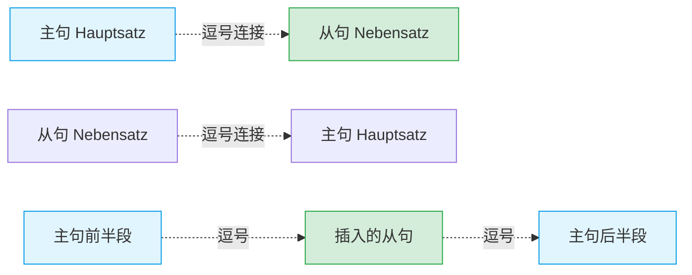

---
aliases:
---

# 逗号规则

在 B 2 的写作考试（比如写正式投诉信、求职信）中，标点符号的准确性直接关系到您的语法评分。逗号点错了，不仅会被扣分，在现实生活中甚至可能引发“命案”！

您看图片左上角那个让人哭笑不得的漫画：

> ❌ **Er isst seine Katze auch.** (他把他的猫也吃了？？？—— _这就是不加逗号的恐怖后果！_)
> 
> ✅ **Er isst, seine Katze auch.** (他在吃东西，他的猫也在吃东西。—— _加了逗号，猫才保住了一命。_)

这就是标点符号的威力。为了帮助您理清这些规则，我们将这两页纸的内容分为两大核心法则。咱们这就开始！

### 核心法则一：逗号用作“车厢连接器”（分隔句子）

**【大师类比时间】**

德语的复合句就像是一列火车。主句是动力车头，从句是后面的车厢。逗号就是车厢之间的“连接铰链”，它的作用是告诉读者：**哪里是一节车厢的结束，哪里是另一节的开始。**

为了更清晰地展示这种结构，大师为您绘制了一张句法结构图：

代码段

接下来，我们逐一拆解书面上的规则，并为您配上最实用的移民生活例句。

#### 1. 主句和从句之间

无论从句在主句前面、后面，还是**插在主句中间**，都必须用逗号隔开。特别是当从句插在中间时，开头和结尾都要有逗号。关系从句（Relativsatz）也是从句的一种，规则相同。

- _例句 1 (行政办事):_ Ich werde, **sobald ich meinen neuen Pass erhalte**, sofort zur Ausländerbehörde gehen. (我一拿到新护照，就会立刻去外管局。—— _时间从句插在主句中间_)
- _例句 2 (医疗看诊):_ Der Arzt, **den ich gestern besucht habe**, hat mir dieses Medikament verschrieben. (我昨天看的那位医生给我开了这种药。—— _关系从句插在中间_)

#### 2. 带 zu 的不定式 (Infinitiv mit zu)

在 B 2 级别，带 `zu` 的不定式结构（如 `um...zu`, `anstatt...zu`, `ohne...zu` 或单纯的 `zu` + 动词）越来越长。虽然最新正字法规定有些短的可以不加，但教材明确建议：**强烈推荐加上逗号！** 这能让阅卷老师一眼看清您的句子结构。

- _例句 1 (求职面试):_ Ich freue mich sehr darauf, **in Ihrem innovativen Team zu arbeiten**. (我非常期待能在您创新的团队中工作。)
- _例句 2 (寻找租房):_ Der Vermieter hat mir geraten, **den Mietvertrag vor der Unterschrift genau zu prüfen**. (房东建议我在签字前仔细核对租房合同。)

#### 3. 【极易踩坑】无需逗号的情况

如果**两个从句**是由 `und` 或者 `oder` 连接的，它们之间**绝对不能**加逗号！这就好比两节车厢已经被电缆（und/oder）死死焊住了，不需要再加额外的铰链。

- _例句 1 (职场沟通):_ Ich hoffe, dass ich das Projekt rechtzeitig abschließe **und** **dass** der Kunde zufrieden ist. (我希望我能按时完成项目，**并且**客户能满意。—— _注意 `und` 前面没有逗号！_)
- _例句 2 (行政事务):_ Die Beamtin fragte mich, ob ich die Gebühr bar bezahle **oder** **ob** ich eine Karte benutze. (办事员问我是付现金**还是**刷卡。)

#### 4. 主句和主句之间

如果是两个独立的完整主句连在一起，规则如下：

- **没有连词 / 由连接副词 (如 deshalb, trotzdem) 连接：必须加逗号。**
    - _例句 1 (医疗看诊):_ Ich habe heute starkes Fieber, deshalb kann ich nicht zur Arbeit kommen. (我今天发高烧了，因此我不能来上班了。)
    - _例句 2 (租房纠纷):_ Die Heizung ist seit drei Tagen kaputt, trotzdem hat der Hausmeister nichts getan. (暖气坏了三天了，尽管如此，房屋管理员什么都没做。)
- **由并列连词 (aber, sondern, jedoch, doch, denn) 连接：必须加逗号，即使后面有省略成分！**
    - _例句 1 (寻找租房):_ Die Wohnung ist wirklich wunderschön, aber (sie ist) leider viel zu teuer für uns. (这套房子真的很美，但对我们来说实在太贵了。)
    - _例句 2 (职场沟通):_ Ich arbeite heute nicht im Büro, sondern (ich arbeite) im Homeoffice. (我今天不在办公室工作，而是在家办公。)
- **由 und 或 oder 连接的两个主句：逗号是可选的（可以加，也可以不加，建议不加）。**
    - _例句 1 (生活规划):_ Wir lernen fleißig Deutsch(**,**) **und** wir suchen gleichzeitig nach einer Wohnung. (我们在努力学德语，同时也在找房子。)
    - _例句 2 (日常出行):_ Fahren wir mit dem Zug nach Berlin(**,**) **oder** nehmen wir das Auto? (我们是坐火车去柏林，还是开车去？)

### 核心法则二：逗号用作“分类挡板”（分隔句子成分）

**【大师类比时间】**

在单个句子内部，逗号就像是德国超市收银台上的“分类挡板（Warentrenner）”。它可以把不同的短语、并列的名词隔开，防止它们混在一起造成误解。

#### 1. 列举 (Aufzählung)

当您列举三个或三个以上的事物时，前几个用逗号隔开，但**最后一个用 `und`, `oder` 或 `sowie` 连接，且前面绝对不加逗号！**

- _例句 1 (行政延签):_ Bitte bringen Sie zur Verlängerung Ihren Pass, ein biometrisches Passbild, den Arbeitsvertrag **und** die Meldebescheinigung mit. (延签时请携带您的护照、一张生物识别证件照、工作合同**和**住址登记证明。)
- _例句 2 (日常租房):_ Die moderne Wohnung verfügt über ein Schlafzimmer, ein helles Wohnzimmer, eine Einbauküche **sowie** einen großen Balkon. (这套现代化的公寓拥有一间卧室、一间明亮的客厅、一套整体厨房**以及**一个大阳台。)

#### 2. 同位语 (Apposition)

同位语就是用来“补充说明前面那个名词”的成分。它像是一个额外的注解，必须用逗号从前后完全“隔离”出来。

- _例句 1 (职场求职):_ Herr Müller, der Leiter der Personalabteilung, hat mir den Arbeitsvertrag per E-Mail geschickt. (穆勒先生，**人事部主管**，通过电子邮件把工作合同发给我了。)
- _例句 2 (医疗看诊):_ Ibuprofen, ein sehr bekanntes Schmerzmittel, ist in deutschen Apotheken rezeptfrei erhältlich. (布洛芬，**一种非常有名的止痛药**，在德国药房无需处方即可买到。)

#### 3. 【绝对禁区】位于第 1 位（句首）的成分后

这一点是中国学生最容易犯的致命错误！在中文里，我们习惯说：“昨天，我去了超市。”或者“下个月，我要搬家。” **但在德语中，占据句子第一位的时间状语、地点状语等成分后面，绝对不能加逗号！** （除非它本身就是一个长长的从句）。

- _例句 1 (职场求职):_ **Nach dem erfolgreichen Vorstellungsgespräch** _(绝对不加逗号!)_ warte ich nun geduldig auf eine Rückmeldung. (在成功的面试之后，我现在正耐心等待回复。)
- _例句 2 (寻找租房):_ **Aufgrund der hohen Mieten im Stadtzentrum** _(绝对不加逗号!)_ müssen wir weiter am Stadtrand suchen. (由于市中心租金高昂，我们必须在市郊继续寻找。)

这就是 "image_405 c 29.jpg" 这页纸上所有的逗号规则秘籍。掌握了这些，您的 B 2 书面表达不仅不会丢分，还会让德国考官觉得您的逻辑极度清晰！

作为您的导师，我必须让您立刻实战演练一下。**请您使用今天学到的“主句与主句之间(使用 deshalb 连接)”以及“同位语”的规则，把下面这个找房子的场景翻译成德语：**

_"这套公寓太贵了，因此我们拒绝了房东（der Vermieter），一位非常不友好的男士。"_
