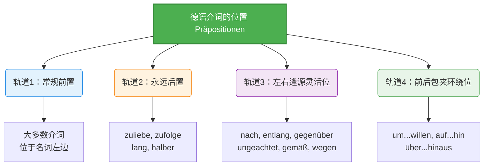

# 三种名词变格形式

### 介词的位置 (Davor, dahinter und um das Nomen herum)

面对抽象的介词位置，我们可以使用一个“卫星与行星”的类比来理解：

在德语的宇宙里，名词（Nomen）**是一颗巨大的行星，而**介词（Präpositionen）则是围绕它运转的专属卫星。

- 大多数卫星习惯在行星的正前方（左侧）领航；
- 有一小部分硬核卫星，永远只在行星的正后方（右侧）殿后；
- 还有一些灵活的卫星，既可以在前面也可以在后面，甚至有些会一前一后把行星包夹（环绕）起来！

为了让你一目了然，我们先来看下面这张“卫星轨道分布图”：

代码段

接下来，我们将结合你在德国生活、找工作、租房和办签证等真实场景，逐一破解这些轨道上的“介词卫星”！

### 第一类：常规前置队（大多数介词）

正如教材图片中第 1 点所述：**大多数介词位于它们所支配的名词的左边。**

这是你从 A 1 阶段就非常熟悉的规则。比如 _in der Wohnung_（在公寓里）, _mit dem Arzt_（和医生一起）。这里我们不过多赘述，把精力留给 B 2 的核心考点。

### 第二类：硬核后置队（永远位于名词右边）

教材图片第 2 点指出了四个**必须后置**的介词，它们永远紧紧跟在名词（或代词）的屁股后面。请务必记住它们支配的格：

**1. zuliebe (+ 第三格 Dativ) —— 为了...的缘故 / 迁就...**

- **生活场景（家庭与融入）：**
    - _Meiner Familie **zuliebe** habe ich diesen anstrengenden Job im Lager angenommen._

        (为了我家庭的缘故，我接受了这份在仓库的辛苦工作。)

**2. zufolge (+ 第三格 Dativ) —— 根据... / 依照...（常用于引用消息来源）**

- **行政事务场景（外管局/新闻）：**
    - _Dem Schreiben der Ausländerbehörde **zufolge** müssen Sie den Nachweis bis Freitag einreichen._

        (根据外管局的信件，您必须在周五前提交证明。)

**3. lang (+ 第四格 Akkusativ) —— 长达...（表示时间或空间的延续）**

- **职场场景（工作经验）：**
    - _Ich habe ein Jahr **lang** in einem deutschen Krankenhaus als Pfleger gearbeitet._

        (我在一家德国医院当了一年的护工。)

**4. halber (+ 第二格 Genitiv) —— 为了...起见 / 因为...的缘故（非常正式）**

- **行政场景（书面声明）：**
    - _Der guten Ordnung **halber** schicke ich Ihnen die Dokumente noch einmal per Post._

        (为了妥当起见，我把文件再通过邮寄给您发一次。)

### 第三类：灵活变位队（核心重灾区！）

教材第 3 点提到：某些介词可以位于名词的左边或右边。**位置不同，名词的格有可能不同，意义也略有区别！** 这张表格是 B 2 考试和日常高级德语交流的绝对重点。

#### 1. nach (+ 第三格 Dativ)

- **规则解析：**
    - 当表示“根据 / 按照”（Meinung/Ansicht）时，可以放左边，也可以放右边。
    - **⚠️ 绝对禁忌：** 当 `nach` 表示**时间**或**地点**（比如去柏林 _nach Berlin_，一小时后 _nach einer Stunde_）时，**只能**放在名词左边！
- **移民职场场景（表达观点）：**
    - _(左边)_ **Nach** meiner Meinung ist dieses Mietangebot zu teuer.
    - _(右边)_ Meiner Meinung **nach** ist dieses Mietangebot zu teuer.

        (在我看来，这个租房报价太贵了。)

#### 2. entlang (左右格不同！B 2 必考点！)

- **规则解析：**
    - **位于左边：支配第二格 (Genitiv)。** 呈**静态**，表示位置，回答 "Wo?" (在哪？)
    - **位于右边：支配第四格 (Akkusativ)。** 呈**动态**，表示方向，回答 "Wohin?" (去哪？)，必须跟表示运动的动词（如 _gehen, fahren_）连用。
- **租房与出行场景：**
    - _(左边/第二格/静态)_ **Entlang** des Flusses gibt es viele teure Wohnungen.

        (沿着河边有很多昂贵的公寓。—— 房子定在那里不动)

    - _(右边/第四格/动态)_ Wir gehen den Fluss **entlang**, um das Jobcenter zu suchen.

        (我们沿着河边走，为了寻找就业中心。—— 人在移动)

#### 3. gegenüber (+ 第三格 Dativ)

- **规则解析：**
    - 跟普通名词连用时，可以放左边也可以放右边（但在现代德语中放左边更常见）。
    - **⚠️ 黄金法则：** 当与**人名**、**人称代词**连用时，**必须后置（放在右边）**！
- **医疗与生活场景：**
    - _(普通名词)_ **Gegenüber** dem Krankenhaus / Dem Krankenhaus **gegenüber** gibt es eine Apotheke. (医院对面有一家药房。)
    - _(人称代词)_ Der Arzt sitzt **mir gegenüber** und erklärt mir den Befund. (医生坐在**我**对面，向我解释诊断结果。绝对不能说 _gegenüber mir_)。

#### 4. ungeachtet (+ 第二格 Genitiv) —— 尽管 / 不顾

- **规则解析：** 极少后置。绝大多数情况下放在左边。只有在极其正式的书面语中才会放在右边。
- **求职场景：**
    - _(常见左边)_ **Ungeachtet** seiner fehlenden Zeugnisse bekam er den Job.
    - _(罕见右边)_ Seiner fehlenden Zeugnisse **ungeachtet** bekam er den Job.

        (尽管他缺少证书，他还是得到了这份工作。)

#### 5. gemäß (+ 第三格 Dativ) —— 依照 / 根据

- **规则解析：** 左右皆可。常用于法律、行政管理相关文章中（你的老朋友：信件和合同）。
- **行政事务场景（看懂租房合同）：**
    - _(左边)_ **Gemäß** § 5 des Mietvertrages müssen Sie die Nebenkosten nachzahlen.
    - _(右边)_ § 5 des Mietvertrages **gemäß** müssen Sie die Nebenkosten nachzahlen.

        (根据租房合同第 5 条，您必须补交附加费。)

#### 6. wegen (+ 第二格 Genitiv) —— 因为

- **规则解析：**
    - 标准语法中支配**第二格**，可以前置或后置（后置极少，主要用于书面语或固定搭配，如 _der Liebe wegen_）。
    - **⚠️ 口语补充：** 在日常口语中（比如和房东、德国同事聊天时），`wegen` 经常支配**第三格 (Dativ)**。
- **工作请假场景：**
    - _(左边/二格/标准)_ **Wegen** eines Arzttermins komme ich heute später zur Arbeit.
    - _(左边/三格/口语)_ **Wegen** einem Arzttermin komme ich heute später zur Arbeit. (语法不严谨，但德国人天天这么说)
    - _(右边/二格/极少)_ Eines Arzttermins **wegen**... (太过于诗意或书面化，不建议日常使用)

### 第四类：前后包夹队（环绕型介词 Circumpositionen）

这部分虽然表格里没有详细列出，但图片最上方的“云图”中赫然出现了它们的身影！为了让你毫无死角地掌握本章，德语大师必须为你补齐这块拼图。它们一前一后，把名词像汉堡肉饼一样夹在中间：

**1. um ... willen (+ 第二格 Genitiv) —— 为了...的缘故（强调强烈的愿望或呼吁）**

- _Bitte, unterschreiben Sie den Vertrag **um** des lieben Friedens **willen**!_

    (拜托，为了家庭的和睦，请您把合同签了吧！)

**2. auf ... hin (+ 第四格 Akkusativ) —— 针对... / 鉴于... / 应...的要求**

- **签证申请场景：**
    - _**Auf** meinen Antrag **hin** habe ich endlich die Niederlassungserlaubnis bekommen._

        (应我的申请要求，我终于拿到了永久居留许可。)

**3. über ... hinaus (+ 第四格 Akkusativ) —— 超出... / 超过...范围**

- **职场场景：**
    - _Sein Engagement geht weit **über** die normalen Arbeitszeiten **hinaus**._

        (他的投入远远超出了正常的工作时间要求。)

### 德语大师的通关秘籍 (Zusammenfassung)

要在六个月内达到 B 2 水平并在真实生活中流畅使用，请你把以下三句话刻在脑海里：

1. **遇事不决放左边：** 除了几个特殊的硬性规定，绝大多数介词还是老老实实呆在名词前面的。
2. **死磕这几个“右派”：** _zuliebe, zufolge, lang, halber_ 永远在右边。遇到人称代词的 _gegenüber_ (_mir gegenüber_) 必须在右边！
3. **搞清方向与位置：** 看到 _entlang_，大脑雷达要立刻启动！房子**在**街边（静态位置）用前置+二格；你**顺着**街走（动态方向）用后置+四格！

希望这次细致的拆解能帮你扫清介词位置的迷雾！掌握了这些，下次去外管局或者面试，当你抛出一句带有漂亮后置介词的从句时，签证官或面试官一定会对你的德语水平刮目相看！ Viel Erfolg beim Lernen! (祝学习顺利！)
