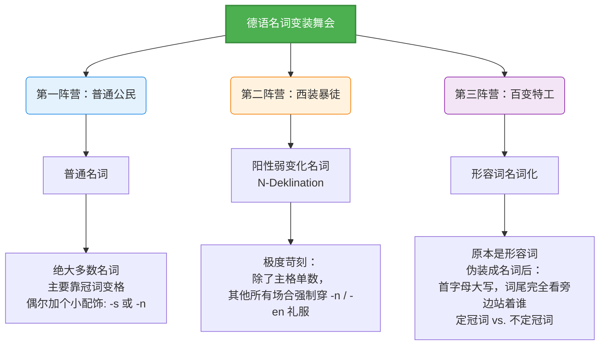

# 三种名词变格形式

Guten Tag! 欢迎来到“德语大师”的语法冲刺集训营！很高兴能陪伴你在这关键的六个月里，向着 B 2 的巅峰发起冲锋。

在德国的每一天，无论是搭建复杂的系统架构、处理各种云平台的账单，还是去外管局办理居留，都离不开精准的德语表达。今天我们要啃下的这块“硬骨头”，是 B 2 级别最核心、也最容易让人在开口时结巴的知识点：**image_8 cce 58.jpg** 中展示的**三种名词变格形式 (des Mannes, des Herrn, des Alten)**。

为了让你不再死记硬背，我们把德语的“名词变格”想象成一场“高级变装舞会”。在德语宇宙中，名词参加句子这场舞会时，必须根据自己在句中的身份（主格、宾格、与格、属格）穿上合适的“礼服”（词尾）。

让我们先通过一张全景图，看看这场舞会的三大阵营：

代码段

图片顶部的这句话非常经典地概括了这三种情况：

> _Glück bedeutet etwas anderes ... für ein Kind (普通名词) ... für einen Studenten (阳性弱变化) ... oder für einen Berufstätigen (形容词名词化)._
> 
> （幸福的意义因人而异……对一个孩子、对一个大学生、或对一个在职人员来说都不一样。）

接下来，我们将结合真实生活与职场场景，逐一破解这三大阵营！

### 第一阵营：普通公民 (普通名词)

这是你从 A 1 就开始打交道的老朋友，占了德语名词的绝大多数。

**核心规则：** 变格主要依靠前面的冠词 (_der/das/die_)。名词本身很懒，只有在**阳性和中性的第二格单数**（加 _-s_ 或 _-es_），以及**第三格复数**（加 _-n_，如果本身以-n 或-s 结尾则不加）时，才会稍微改变一下自己。

**【实战场景：行政事务与账单验证】**

想象你正在验证一个 Google AdMob 广告账户的账单和电话信息。你需要提供一份男士的账单证明：

- **第一格 (Nom)：** **Der Mann** muss seine Adresse verifizieren. (这位男士必须验证他的地址。)
- **第二格 (Gen)：** Die Verifizierung der Telefonnummer **des Mannes** war erfolgreich. (这位**男士的**电话号码验证成功了。 -> 阳性第二格，词尾加 _-es_)
- **第三格 (Dat)：** Das System schickt **dem Mann** eine Bestätigungs-E-Mail. (系统发给这位男士一封确认邮件。)
- **第四格 (Akk)：** Ich kenne **den Mann** nicht. (我不认识这位男士。)

### 第二阵营：西装暴徒 (阳性弱变化名词)

这群名词非常特殊（我们在第 50 章会有更详细的总结）。它们绝大多数是**阳性名词**，且通常指代人或动物。

**核心规则：** 它们有着强迫症般的变格要求——**除了第一格单数（主格）保持原形外，只要出现在其他任何格（第四格、第三格、第二格）甚至复数形式中，必须在词尾加上 _-n_ 或 _-en_。**

我们来看教材中的代表人物：_der Herr_ (先生)。

单数词尾加 _-n_，复数词尾加 _-en_。

**【实战场景：职场沟通与客户对接】**

假设你负责维护几个重要的企业级云服务架构（比如 Google Cloud、AWS 和 Oracle Cloud 的集成）。你在邮件里需要礼貌地提到你的客户（Herr）：

- **第一格 (Nom)：** Ein neuer **Herr** hat heute unser Cloud-Projekt übernommen. (今天一位新先生接手了我们的云项目。)
- **第四格 (Akk)：** Wir müssen **den Herrn** über die Server-Ausfallzeit informieren. (我们必须通知**这位先生**服务器的宕机时间。 -> 加 _-n_)
- **第三格 (Dat)：** Ich habe **dem Herrn** die neuen Zugangsdaten geschickt. (我已经把新的登录凭证发给**这位先生**了。 -> 加 _-n_)
- **第二格 (Gen)：** Das Konto **des Herrn** wurde erfolgreich migriert. (**这位先生的**账户被成功迁移了。 -> 加 _-n_，**注意！绝不加 -s！**)

### 第三阵营：百变特工 (形容词名词化指人与物)

这是 B 2 考试的重灾区，也是图片中下半部分花大篇幅讲解的内容。

这类词原本是形容词（比如 _alt_ 老的，_angestellt_ 被雇佣的，_erwachsen_ 成年的）。当它们“篡位”变成名词后，必须遵守两条铁律：

1. **必须首字母大写！** (z.B. _der Alte_, _der Erwachsene_)
2. **身体是名词，灵魂依然是形容词！** 它们变格时，**完全按照形容词词尾变化规则来！** 因此，当它们前面是定冠词（der/die/das）和不定冠词（ein/eine）时，词尾是不一样的。

**【实战场景：求职与建立个人项目】**

假设你在 Google AI Studio 中开发了一个生成式媒体的工具，并打算把它商业化。这个时候，你的身份就从一个“雇员”变成了一个“自由职业者”。看看这些词尾是怎么像变色龙一样变化的：

- **带定冠词 (已知身份，词尾较弱 -e / -en)：**
    - **Der Selbstständige** braucht einen neuen API-Key. (这个自由职业者需要一个新的 API 密钥。 -> 主格阳性单数)
    - Wir helfen **dem Angestellten**. (我们帮助这个雇员。 -> 与格阳性单数，加 _-en_)
- **带不定冠词 (未知身份，词尾较强，体现性别 -er / -es / -e)：**
    - Ich bin jetzt **ein Selbstständiger**. (我现在是一个自由职业者了。 -> 主格阳性单数，无冠词词尾显示性别，故加 _-er_)
    - Das ist das Projekt **eines Berufstätigen**. (这是一个在职人员的项目。 -> 属格阳性单数，加 _-en_)

**💡 教材中必须掌握的高频词表：**

_der Angestellte_ (雇员), _der Verwandte_ (亲戚), _der Bekannte_ (熟人), _der Arbeitslose_ (失业者), _der Erwachsene_ (成年人), _der Berufstätige_ (在职人员), _der Kranke_ (病人), _der Verlobte_ (未婚夫/妻), _der Jugendliche_ (青少年), _der Deutsche_ (德国人), _der Verrückte_ (疯子), _der Selbstständige_ (自由职业者)。

#### 特别行动组：形容词名词化指“物”（中性）

除了指人，形容词还可以指代抽象的“事物”。规则非常死：它们统统是**中性 (das)**，且首字母大写。

- **跟在 _alles_ 和 _das_ 后面，词尾永远是 _-e_：**
    - Ich wünsche dir **alles Gute** für deinen neuen Job! (祝你新工作一切顺利！)
    - **Das Gute** an diesem System ist die hohe Sicherheit. (这个系统的好处是安全性高。)
- **跟在 _etwas, viel, wenig, nichts, ein bisschen_ 后面，词尾永远是 _-es_：**
    - Ich habe heute **etwas Neues** gelernt. (我今天学了一些新东西。)
    - Gestern ist **nichts Wichtiges** passiert. (昨天没发生什么重要的事情。)
- **遇到第三格介词 (_mit / zu_)，词尾变成 _-em_：**
    - Das führt **zu etwas Gutem**. (这会带来好结果。)

### 一个重要的脚注提示 (复数第二格的补救措施)

请看图片最下方的脚注“1”：

不管是普通名词还是弱变化名词，如果在复数第二格时，它的**左边既没有冠词，也没有形容词**，那么词尾是体现不出“第二格”属性的。为了避免歧义，德语规定：这个时候**必须用 "von + 第三格 (Dativ)" 来代替第二格**。

- **普通名词复数：**
    - (有定冠词) Die Meinung **der Leute**... (这些人的观点...)
    - (无冠词，用 von 替代) Die Meinung **von Leuten**... (人们的观点...)
- **但形容词名词化没有这个问题！** 因为它们自带强词尾属性，就算光秃秃地站着，复数第二格也能靠词尾 _-er_ 认出来：
    - Das ist das Leben **Alter**. (这是老年人的生活。)

这三大阵营的“变装规则”在初期确实需要大脑飞速运转，但随着你不断地代入真实场景去练习，它们会逐渐变成你的肌肉记忆。

那么，结合你自己的情况，在这三种名词变格（普通、弱变化、形容词名词化）中，你觉得哪一种在实际开口说话时最容易让你“卡壳”或者反应不过来呢？
