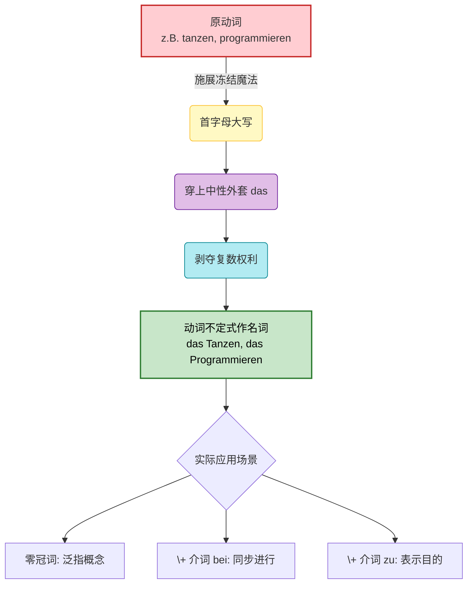
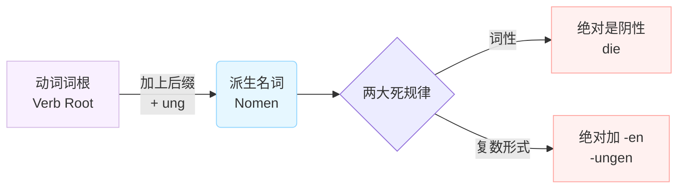

# 动词不定式作名词

### 魔法时间：将动作“冻结”为名词

在德语中，动词（如 _arbeiten_ 工作、_tanzen_ 跳舞）原本是充满活力、到处乱跑的“动作”。

但是，当我们需要把一个动作当作一个“概念”或一件事来谈论时，我们可以对它施展一个“冻结魔法”。

一旦被施法，这个动词就被瞬间冻结成了一座静态的冰雕（名词）。既然变成了冰雕，它就不再有动作的属性，而是穿上了一件统一的“隐形中性西装”。

我们先通过下面这张图表，看看这个“冻结魔法”是如何运作的：

代码段

### 核心规则深度解析

#### 1. 一律为中性

所有的动词不定式变成名词后，它的冠词永远是 **das**。比如，跳舞是 _tanzen_，变成名词就是 _das Tanzen_。

- **职场场景：** ==_Das Programmieren_== von Cloud-Diensten erfordert viel Konzentration. (云端服务的编程需要高度集中注意力。)

#### 2. 没有复数

动作一旦变成概念，它就是一个不可数的整体，你不可能说“两个工作”或“三个等待”。

- **行政场景（外管局）：** _Das Warten_ auf die Niederlassungserlaubnis dauert manchmal Monate. (等待永久居留许可有时需要好几个月。)

#### 3. 常常以零冠词的形式出现，或与介词连用

这是 B 1 跨越到 B 2 最核心的得分点！在实际使用中，我们很少干巴巴地说 "das xxx"，而是把它融入到高级句型中。

### B 2 实战进阶：零冠词与介词的绝妙搭配

在这个部分，我们将结合你在德国找工作、租房和办公的真实场景，教你如何用这个语法点写出漂亮的“官方德语”（Nominalstil 名词化结构）。

#### A. 零冠词形式：表达普遍事实或爱好

当我们在谈论某种一般性的行为时，可以省略 "das"。

- _图片例句：_ Ich finde _Tanzen_ toll. (我觉得跳舞很棒。)
- **职场场景：** _Verwalten_ von API-Schlüsseln ist eine große Verantwortung. (管理 API 密钥是一项重大的责任。)

#### B. 与介词连用：B 2 考试与职场的“杀手锏”

这是你必须掌握的结构，尤其是 `beim` (bei + dem) 和 `zum` (zu + dem)。

**1. Beim + 大写动词 = 正在做某事时（表达同时发生）**

当你想要表达“在做...的过程中”发生了一件事，用 `beim` 是最简洁、最高级的。

- _图片例句：_ _Beim Tanzen_ bin ich glücklich. (在跳舞时我很快乐。)
- **工作/安全场景：** Bitte seien Sie **beim Verwalten** des Accounts sehr vorsichtig, um Leaks zu vermeiden. (在管理账户时请务必非常小心，以避免泄露。)
- **租房场景：** **Beim Unterschreiben** des Mietvertrags müssen Sie auf die Kündigungsfrist achten. (在签署租房合同时，您必须注意解约期限。)

**2. Zum + 大写动词 = 为了做某事（表达目的）**

当你想要表达某件物品或某个动作的“用途”时，用 `zum`。

- _图片例句：_ _Zum Tanzen_ brauche ich gute Musik. (为了跳舞我需要好音乐。)
- **云架构场景：** Wir nutzen Google Cloud **zum Hosten** unserer neuen Applikation. (我们使用谷歌云来托管我们的新应用。)
- **医疗场景：** Diese Tabletten sind **zum Schlafen**. Bitte nehmen Sie eine vor dem Zubettgehen. (这些药片是用来助眠的。请在就寝前服用一片。)

**3. 大师拓展：Vor dem / Nach dem**

除了 `bei` 和 `zu`，在德国的日常和行政信件中，你还会频繁遇到用 `vor` (在...之前) 和 `nach` (在...之后) 加上动词名词化的结构。

- **面试场景：** **Vor dem Vorstellen** des Projekts sollten wir die Technik testen. (在展示项目之前，我们应该测试一下设备。)
- **行政事务：** **Nach dem Bestätigen** der Zahlungsdaten wird Ihr AdMob-Konto freigeschaltet. (在确认支付数据之后，您的 AdMob 账户将被激活。)

### 大师的通关秘籍 (Zusammenfassung)

在未来六个月备考 B 2 和写德语邮件时，请记住这个口诀：

**“动作想变物，首字母大写穿 das 服；同步用 beim，目的用 zum，复数永远不出现！”**

只要你能熟练地在工作和生活中抛出几个像 _Beim Einrichten..._ (在配置...时) 或者 _Zum Verifizieren..._ (为了验证...) 这样的高级短语，德国同事和外管局的官员一定会对你的德语水平刮目相看！ Viel Erfolg beim Lernen! (祝你学习顺利！)

# 动词词根+-ung

Guten Tag! 欢迎来到德语大师的课堂。看到你在钻研词缀和构词法，我非常高兴。掌握了德语的构词法，就等于拿到了迅速扩大词汇量的“作弊代码”，这对你想要在六个月内达到 B 2 水平并在德国顺利生活至关重要。

你在图片中指出的倒数第二行——**动词词根加上后缀 -ung**，展示的是德语中极其强大且高频的一种构词方式：**动词名词化 (Nominalisierung)**。

为了让你一目了然，我们先来看一张图解：

代码段

### 🧠 核心概念拆解：什么是加 "-ung"？

**1. 它的作用：把“动作”变成“概念”或“结果”**

这就好比给一个正在播放的视频按下了暂停键，然后把它打印成了一张照片。

- **类比理解：** 它非常像英语里动词后面的 **"-tion"** 或 **"-ing"**。比如英语里 "to invite" (邀请，动作) 变成 "invitation" (邀请函，名词)。在德语里，就是 _einladen_ (动词) 变成 _die Einladung_ (名词)。

**2. 两条“铁律”（闭着眼睛都要记住）：**

- **词性铁律：** 只要是以 `-ung` 结尾的名词，**100% 是阴性 (die)**。这是德语给我们的温柔，再也不用瞎猜词性了！
- **复数铁律：** 它们的复数形式，**100% 是在词尾加上 `-en` **。所以永远是 `-ungen`。

### 🏢 德国移民生活实战场景 (B 1-B 2 核心词汇)

在德国处理行政事务、租房或找工作时，政府机关和企业非常喜欢使用带有 `-ung` 的名词，因为这会让语言听起来更加正式和官方（所谓的“官腔”）。

我们来看看这些由动词“变身”而来的重要词汇：

|**动词 (动作)**|**词根 + ung = 名词 (概念/结果)**|**德国生活应用场景**|
|---|---|---|
|**anmelden** (登记/注册)|**die Anmeldung** (登记/户口注册)|**行政事务：** 刚到德国去市政厅 (Bürgeramt) 办理户口登记，你拿到的那张至关重要的纸就叫 _Meldebescheinigung_ (登记证明)。|
|**wohnen** (居住)|**die Wohnung** (公寓/住房)|**租房：** 找房子时你最关心的词。复数是 _die Wohnungen_。|
|**bewerben** (申请/求职)|**die Bewerbung** (求职申请)|**找工作：** 投递简历的过程。_Ich schreibe eine Bewerbung._ (我在写一份求职申请。)|
|**versichern** (保险/保障)|**die Versicherung** (保险)|**医疗与生活：** 德国是万物皆可保险的国家。_Krankenversicherung_ (医疗保险), _Haftpflichtversicherung_ (第三方责任险)。|
|**kündigen** (解雇/解约)|**die Kündigung** (解约信/辞退信)|**职场与租房：** 不管是你想辞职退房，还是老板房东想解雇赶人，都需要出具书面的 _Kündigung_。|
|**überweisen** (转账)|**die Überweisung** (转账/汇款)|**财务：** 交房租或支付账单时使用的银行转账操作。|

**实战例句对比体会：**

- _动词表达：_ Ich möchte mich für den Job **bewerben**. (我想**申请**这份工作。)
- _名词表达 (更高级/正式)：_ Ich schicke Ihnen meine **Bewerbung** für den Job. (我发给您我的工作**申请**。)

### ⚠️ 德语大师的额外叮嘱：与最后一行作对比

你提供的图片最后一行是“动词不定式作名词”（比如 _tanzen_ 变成 _das Tanzen_）。很多同学会把这两个搞混，这里帮你理清：

- **动词词干 + ung (如 die Einladung):** 侧重于动作的**结果**或一个具体的**事物**（一张邀请函）。
- **动词原形直接大写 (如 das Tanzen):** 侧重于动作**本身的过程**（跳舞这件事情）。永远是中性 (das)，且没有复数。

掌握了 `-ung` 的规律，你今天至少一次性记住了几百个德语阴性名词的词性。继续保持这种钻研精神，六个月拿下 B 2，我们稳扎稳打！
