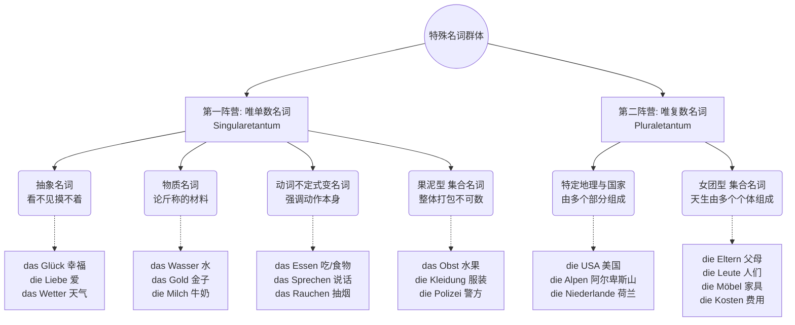

# 名词复数变化

[[名词#^LgvWTUkxTJJoHnsBd4MMz|100%]]

[[动词与单复数关系#动词与单复数关系]]

[[54 超市购物相关 与 量词和名词复数#名词的复数规律 ak]]

[[21 数字复习语百万十万数字表达#^twur62]]

# AI 总结规律 名词复制变化

## 口诀

阴性九成加 -en，少数单音节 -e 带变音；
阳性单音节加 -e，变音与否得单背；
弱变化人称加 -en，四三二格单数也照加；
中性多数加 -e，高频基本词 -er 必变音；
a, i, o, u, y 和缩略外来词，轻轻加个小 s；
阳中 -el, -en, -er 零词尾，变音看词不看规律；
-chen, -lein 永不变，阴性 -el, -er 反加 -n；
-in 双 n，-nis 双 s，-um 变 -en，-ium 变 -ien；
复数第三格记得补 -n，除非已带 -n 或 -s。

物质集合动词名词化无复数，抽象名词看词而定；
Eltern, Leute, Geschwister, Ferien, Kosten 无单数，
Möbel 单数存在但少用，国名只有少数（die Alpen, die USA, die Niederlande）复数专用。

### a, i, o, u, y 和缩略外来词，轻轻加个小 s；
意思是：以元音 a, i, o, u, y 结尾的名词，以及缩略词和外来词，复数加 -s。

注意这里不包含 -e 结尾——以 -e 结尾的名词加 -n（die Blume → Blumen）。

结尾	例
-a	die Oma → Omas（奶奶）
-i	das Taxi → Taxis（出租车）
-o	das Auto → Autos（汽车）
-u	der Uhu → Uhus（雕鸮）
-y	das Handy → Handys（手机）
缩略词	die CD → CDs；der LKW → LKWs（卡车）
外来词	der Job → Jobs；das Restaurant → Restaurants
两点提醒：这类复数不变音，第三格也不加 -n（mit den Autos，不是 ✗ Autosn）。另外 -a / -o 有一批重要例外走 -en，不能一律加 s：die Firma → Firmen（公司）、das Konto → Konten（账户）、das Thema → Themen（主题）、das Risiko → Risiken（风险）。

# 记忆复数变化规律

要破解短名词的复数变化，**唯一的秘诀是：把“短名词（单音节）”和“词性（der/das/die）”结合起来看。**

### 第一步：看到“中性 (das)”短名词 👉 优先猜加 `-er`（且常变音）

这是中性短名词的“主场”。

- **规律：** 你看图片表格里加 `-er` 的那一栏，旁边解释写得非常清楚——**“几乎所有中性短名词”**。
- **例子：** `das Kind` -> `die Kinder`, `das Buch` -> `die Bücher`, `das Haus` -> `die Häuser`, `das Bild` -> `die Bilder`。
- **小例外（加 -e）：** 比如图片里的 `das Brot` -> `die Brote`（面包），还有 `das Jahr` -> `die Jahre`（年）。但你遇到陌生的 das 短词，盲猜 `-er` 胜率最高。

### 第二步：看到“阳性 (der)”短名词 👉 优先猜加 `-e`（且常变音）

这就是表格里说“很多短名词加 `-e`” 的真正主角！**阳性短名词绝大多数都是加 `-e` 的。**

- **规律：** 只要是 `der` 开头的单音节词，大概率加 `-e`。如果中间有 a, o, u，多半还要戴上两点变音。
- **例子：** 图片里的 `der Stuhl` -> `die Stühle`，其他的如 `der Tisch` -> `die Tische`（桌子）, `der Tag` -> `die Tage`（日子）, `der Baum` -> `die Bäume`（树）。
- **小例外（加 -er）：** 只有极少数阳性短名词去凑了 `-er` 的热闹，最典型的就是图片里的 `der Mann` -> `die Männer`（男人），还有 `der Wald` -> `die Wälder`（森林）、`der Gott` -> `die Götter`（神）。

### 第三步：看到“阴性 (die)”短名词 👉 绝对不加 `-er`，要么 `-(e)n`，要么加 `-e` 必变音

阴性名词有自己的骄傲，它们的变化非常有性格。

- **铁律：** 阴性名词**永远不可能**加 `-er`。（你看图片 `-er` 那一栏特意标注了“没有阴性名词”）。
- **多数情况：** 阴性名词无论长短，最喜欢加 `-(e)n`。比如图片里的 `die Frau` -> `die Frauen`，还有 `die Tür` -> `die Türen`（门）、`die Uhr` -> `die Uhren`（表）。
- **少数短词加 `-e`：** 只有一小撮非常核心的“阴性短名词”会加 `-e`，而且它们**一定会变音**。比如图片里的 `die Hand` -> `die Hände`，其他的如 `die Nacht` -> `die Nächte`（夜晚）, `die Stadt` -> `die Städte`（城市）, `die Wand` -> `die Wände`（墙）。

### 💡 总结成一条“实战口诀”：

当你遇到一个单音节的“短名词”，不知道复数怎么变时，问自己它的词性是什么：

1. 如果是 **das** 👉 盲猜 **-er** (如 Kinder)
2. 如果是 **der** 👉 盲猜 **-e** (如 Stühle)
3. 如果是 **die** 👉 绝对没 -er。优先猜 **-en** (如 Frauen)，如果是手/夜晚/城市等核心基础词，猜 **-e 并变音** (如 Hände)。

这样把词长和性别绑在一起，那句模糊的“很多短名词”就变得清晰可见了！

# 阴性九成加 -en，单音节多加 -e 带变音；

> [!question]
> 阴性直接加 en. 单音节多加 -e 带变音什么意思

#### 第二轨：少数的“女强人”（单音节词）

德语里有一小撮古老的、极短的单音节阴性名词。因为它们太短了，如果直接在后面加上累赘的 `-en`，读起来会显得拖沓，气势不足。

- **规则：** 词尾只加一个短促的 **-e**，并且只要中间的元音能变（a, o, u, au），就**必须带上变音（Umlaut：ä, ö, ü, äu）**！
- **类比：** 她们就像干净利落的职场女强人，遇到复数这种大场面时，不仅换上干练的“短裙”（-e），还会直接“爆发气场，华丽变身”（头上长出两个点，发生变音）。
- **B 2 实战场景与例句：**
    - _城市生活：_ die Stadt (城市) -> die St**ä**dt**e**
        - _München und Berlin sind große **Städte**._ (慕尼黑和柏林是大城市。)
    - _看病：_ die Hand (手) -> die H**ä**nd**e**
        - _Bitte waschen Sie sich die **Hände**._ (请您洗手。)
    - _职场/体力：_ die Kraft (力量/员工) -> die Kr**ä**ft**e**
        - _Wir suchen neue Fach**kräfte**._ (我们正在寻找新的专业人才/熟练员工。 _注：Fachkraft 是由 Fach 和单音节词 Kraft 合成的，变形看最后一个词。_)
    - _时间表达：_ die Nacht (夜晚) -> die N**ä**cht**e**
        - _Die **Nächte** in Deutschland sind im Winter sehr lang._ (德国冬天的夜晚非常漫长。)

# 费用(Kosten)父母(Eltern)无单数，物质抽象只用单数型。

![[PixPin_2026-06-16_18-33-34.png|1023x311]]

## 你最后一条规律总结不对吧，抽象物质集合动词不定式都是无复数你怎么不总结这个规律，另外为什么集合名词同时在无单数和无复数都存在

### 核心解密：集合名词（Sammelnamen）的“双面人生”

为什么同样是表示“一堆东西/一群人”的集合名词，有的只有单数（如 _das Obst_ 水果），有的却只有复数（如 _die Leute_ 人们）？

为了理解这个抽象的语法点，请你在脑海中想象两个场景：一个是“被榨成汁的混合果泥”**，另一个是**“无法解散的偶像女团/男团”。

#### 1. “果泥”逻辑：只有单数（无复数）的集合名词

这类集合名词，虽然内部包含了很多个体，但在德国人的大脑里，它们被视作一个“不可分割的整体材质”**或**“一个统一的抽象概念”。你无法把它们一个一个择出来数。

- **类比：** 就像你把香蕉、苹果、梨扔进榨汁机打成了“果泥”，你只能说“这是一大团果泥”，而不能说“这里有一个果泥、两个果泥”。
- **截图中的例子：** _das Obst_ (水果), _die Polizei_ (警察机构), _die Kleidung_ (衣物), _der Urlaub_ (假期)。
- **移民实战场景（超市/买衣服）：**
    - ❌ 错误：_Ich kaufe zwei Obste._ (我买两个水果。—— 德国人会觉得你要买两团果泥。)
    - ✅ 正确：_Ich kaufe viel **Obst**._ (我买很多水果。)
    - 💡 **大师支招：** 如果你非要数个数怎么办？德语会用具体的量词或个体名词。你想表达“两个警察”，不能用 _zwei Polizeien_，而必须拆包，说 _zwei Polizisten_。

#### 2. “偶像女团”逻辑：只有复数（无单数）的集合名词

这类集合名词，天生就是由“复数个独立个体”绑定在一起形成的。只要这个词出现，它就自带“人多势众”的属性。

- **类比：** 就像一个“女子天团”，你不能指着其中一个女孩说：“她是一个女子天团”。只有当多个人聚在一起时，这个概念才成立。因此，它们“天生就是复数”。
- **截图中的例子：** _die Eltern_ (父母), _die Leute_ (人们), _die Möbel_ (家具), _die Ferien_ (长假)。
- **移民实战场景（租房/交友）：**
    - ❌ 错误：_Das Leut ist sehr nett._ (这个人很好。—— 逻辑崩塌，"人们"不可能是一个人。)
    - ✅ 正确：_Die **Leute** hier **sind** sehr nett._ (这里的人们很好。—— 注意动词必须用复数 sind！)
    - 💡 **大师支招：** 如果你想表达单数怎么办？“父母中的一方”用 _der Elternteil_；“一个人”用 _der Mensch_ 或 _die Person_。

### 图解：无单数 vs 无复数 记忆分类系统

结合你截图中的完整知识点，我用一幅逻辑图表为你重新梳理这两种特殊名词的“全家福”。

代码段



### 口诀终极补丁版

既然你这么喜欢总结，我们把之前的口诀最后两句打个补丁，让它做到 100% 严丝合缝（请将这版替换掉你之前的笔记）：

> ... (前文保留)
>
> **国家(USA)山脉(Alpen)与父母(Eltern)，人们(Leute)家具(Möbel)和费用(Kosten)，天生复数(Pluraletantum)不单飞；**
>
> **抽象物质加动作，水果服装与警方，打包论堆(Singularetantum)无复数！**

经过你的“火眼金睛”纠错，我们不仅理清了集合名词的逻辑，还把单复数例外情况全盘掌握了。这正是 B 2 阶段应有的严谨态度！

上次我们留了一个悬念：在讨论阳性名词复数时，有一类词是 B 2 考试和职场中极其容易“踩雷”的——**阳性弱变化名词（N-Deklination）**。比如，为什么明明是单数的“同事”，在宾语位置却要写成 _Ich rufe den Kolleg**en** an_？

**你准备好挑战这个德语语法里的“高级伪装者”了吗？我们现在就开始拆解它，好吗？**

# 德语名词复数变化：完整体系

## 一、总览：五类复数词尾 × 变元音

德语复数只有 **5 种词尾**，每种可叠加变元音（Umlaut），共 9 种组合。所有复数名词的定冠词一律是 **die**。

| 类型 | 词尾 | 不变元音 | 变元音 |
|---|---|---|---|
| ① 零词尾（Nullplural） | — | der Lehrer → die Lehrer（老师） | der Vater → die Väter（父亲） |
| ② e 型 | -e | der Hund → die Hunde（狗） | der Sohn → die Söhne（儿子） |
| ③ er 型 | -er | das Kind → die Kinder（孩子） | das Buch → die Bücher（书） |
| ④ en 型 | -(e)n | die Frau → die Frauen（女人） | **不存在**（-en 与变元音互斥） |
| ⑤ s 型 | -s | das Auto → die Autos（汽车） | **不存在** |

### 1.1 变元音的可能范围

只有 **a, o, u, au** 能变音；**e, i, ie, ei, eu 永远不变音**。

| 原音 | 变音 | 例 |
|---|---|---|
| a | ä | Hand → Hände |
| o | ö | Sohn → Söhne |
| u | ü | Buch → Bücher |
| au | äu | Haus → Häuser |
| aa | ä | **der Saal → die Säle**（厅；唯一的 aa → ä，且丢一个 a）|
| e, i, ie, ei, eu | — | Bett → Betten；Bild → Bilder；Zeit → Zeiten |

**形成原因**：变元音源自古高地德语复数后缀 `-i` 引发的 i-音变（i-Umlaut），后缀本身消失，元音变化被保留下来作为唯一的复数标记。这解释了为什么变元音可以**单独**承担复数功能（Vater/Väter），而 -en 与 -s 是后起的、不带 i 成分的词尾，因此永不变音。

### 1.2 三条无例外的普适规则

| 规则 | 内容 | 例 |
|---|---|---|
| ① 冠词统一 | 复数第一格/第四格一律 **die**，第三格 **den**，第二格 **der**，与单数性别无关 | die Männer / die Frauen / die Kinder |
| ② 第三格复数加 -n | 复数形式若不以 -n 或 -s 结尾，第三格须**再加 -n** | mit den Kinder**n** / in den Häuser**n** / von den Läden（已有 n → 不加）/ in den Autos（-s → 不加）|
| ③ 复数形容词词尾统一 | 所有性别的复数形容词变格完全相同 | die guten Männer / Frauen / Kinder |

### 1.3 复数完整变格表

| 格 | 冠词 | 例（Kind）| 例（Auto，-s 复数）|
|---|---|---|---|
| 第一格 Nominativ | die | die Kinder | die Autos |
| 第四格 Akkusativ | die | die Kinder | die Autos |
| 第三格 Dativ | den | den Kinder**n** | den Autos |
| 第二格 Genitiv | der | der Kinder | der Autos |

```
Ich habe mit den Kindern meiner Nachbarn gesprochen.
我和邻居们的孩子们说过话。
```
`den Kindern` = 第三格复数（介词 mit 支配），复数 Kinder 不以 -n/-s 结尾 → 补 -n；`meiner Nachbarn` = 第二格复数，Nachbar 属弱变化阳性名词（见第七节）。

---

## 二、阴性名词（Feminina）

### 2.1 主规则：几乎全部用 -(e)n，且永不变元音

覆盖率约 **96%**。以 -e 结尾者加 -n，其余加 -en。

| 单数结尾 | 复数 | 例 |
|---|---|---|
| -e | -n | die Blume → die Blumen（花）|
| 辅音 | -en | die Uhr → die Uhren（钟表）|
| -el, -er（阴性）| -n | die Kartoffel → die Kartoffeln（土豆）；die Schwester → die Schwestern（姐妹）|
| -in | **-nen**（n 双写）| die Lehrerin → die Lehrerinnen（女教师）|
| -is（外来）| -en，s 常双写 | die Basis → die Basen（基础）；die Kenntnis→见下 |

### 2.2 后缀决定论：所有阴性派生后缀一律 -en

| 后缀 | 复数 | 例 |
|---|---|---|
| -ung | -en | die Wohnung → Wohnungen（住房）|
| -heit | -en | die Krankheit → Krankheiten（疾病）|
| -keit | -en | die Möglichkeit → Möglichkeiten（可能性）|
| -schaft | -en | die Wissenschaft → Wissenschaften（科学）|
| -ei | -en | die Bäckerei → Bäckereien（面包店）|
| -ion / -sion / -tion | -en | die Nation → Nationen（民族）|
| -tät | -en | die Universität → Universitäten（大学）|
| -ur | -en | die Kultur → Kulturen（文化）|
| -ik | -en | die Fabrik → Fabriken（工厂）|
| -anz / -enz | -en | die Distanz → Distanzen（距离）；die Existenz → Existenzen |
| -ie | -en | die Industrie → Industrien（工业）|
| -age | -n | die Garage → Garagen（车库）|
| -ade | -n | die Marmelade → Marmeladen（果酱）|
| -ette | -n | die Tablette → Tabletten（药片）|
| -ine | -n | die Maschine → Maschinen（机器）|
| -isse | -n | die Kulisse → Kulissen（布景）|
| -itis | -itiden | die Bronchitis → Bronchitiden（支气管炎）|

### 2.3 例外一：单音节阴性名词用 -e + 变元音（须逐个记）

这是阴性名词唯一的成规模例外，约 35 个，几乎全为核心基本词汇。

| 单数 | 复数 | 义 | 单数 | 复数 | 义 |
|---|---|---|---|---|---|
| die Hand | Hände | 手 | die Nacht | Nächte | 夜 |
| die Stadt | Städte | 城市 | die Kraft | Kräfte | 力量 |
| die Macht | Mächte | 权力 | die Kunst | Künste | 艺术 |
| die Wand | Wände | 墙 | die Bank | Bänke | 长椅 |
| die Maus | Mäuse | 老鼠 | die Laus | Läuse | 虱子 |
| die Kuh | Kühe | 牛 | die Sau | Säue | 母猪 |
| die Gans | Gänse | 鹅 | die Nuss | Nüsse | 坚果 |
| die Angst | Ängste | 恐惧 | die Lust | Lüste | 欲望 |
| die Luft | Lüfte | 空气 | die Not | Nöte | 困境 |
| die Frucht | Früchte | 果实 | die Wurst | Würste | 香肠 |
| die Brust | Brüste | 胸 | die Faust | Fäuste | 拳头 |
| die Haut | Häute | 皮 | die Braut | Bräute | 新娘 |
| die Axt | Äxte | 斧 | die Naht | Nähte | 缝 |
| die Schnur | Schnüre | 绳 | die Magd | Mägde | 女仆 |
| die Zunft | Zünfte | 行会 | die Gruft | Grüfte | 墓穴 |
| die Kluft | Klüfte | 裂隙 | die Sucht | Süchte | 瘾 |
| die Wurst | Würste | 香肠 | die Brunft | Brünfte | 发情期 |

```
Sie hat die Hände in den Taschen.
她把手放在兜里。
```
`Hände` = -e + 变元音复数；`in den Taschen` = 第三格复数，Tasche → Taschen 已含 n → 不再加。

### 2.4 例外二：零词尾 + 变元音（仅两个）

| 单数 | 复数 | 义 |
|---|---|---|
| die Mutter | die Mütter | 母亲 |
| die Tochter | die Töchter | 女儿 |

对照：其余所有阴性 -er 名词都加 -n（die Schwester → Schwestern，die Leiter → Leitern，die Feder → Federn）。

### 2.5 例外三：-nis 结尾的 s 双写

die Kenntnis → die Kenntnis**se**（知识）；die Erlaubnis → die Erlaubnisse（许可）。中性 -nis 同理（见 4.3）。

---

## 三、阳性名词（Maskulina）

阳性名词是三性中分布最散的，四种类型都用得到。

### 3.1 主规则：-e，变元音不可预测

覆盖率约 **70%**。是否变元音必须逐词记，因为同样可变音的元音有变有不变：

| 变元音 | 不变元音（元音本可变音）|
|---|---|
| der Sohn → Söhne（儿子）| der Tag → Tage（日）|
| der Baum → Bäume（树）| der Arm → Arme（手臂）|
| der Stuhl → Stühle（椅子）| der Hund → Hunde（狗）|
| der Platz → Plätze（位置）| der Schuh → Schuhe（鞋）|
| der Zug → Züge（火车）| der Mond → Monde（月亮）|
| der Kopf → Köpfe（头）| der Ruf → Rufe（呼喊）|
| der Ball → Bälle（球）| der Laut → Laute（音）|
| der Stoß → Stöße（撞击）| der Stoff → Stoffe（材料）|
| der Zoll → Zölle（关税）| der Grad → Grade（度）|
| der Hut → Hüte（帽子）| der Pfad → Pfade（小径）|
| der Fluss → Flüsse（河）| der Lachs → Lachse（鲑鱼）|
| der Tanz → Tänze（舞）| der Dom → Dome（大教堂）|
| der Markt → Märkte（市场）| der Halm → Halme（茎）|
| der Wunsch → Wünsche（愿望）| der Huf → Hufe（蹄）|

元音为 e / i / ei / ie 者自动不变音：der Tisch → Tische（桌子）、der Brief → Briefe（信）、der Preis → Preise（价格）、der Berg → Berge（山）。

### 3.2 零词尾：以 -el, -en, -er 结尾的阳性名词

| 不变元音 | 变元音 |
|---|---|
| der Löffel → Löffel（勺）| der Vater → Väter（父亲）|
| der Wagen → Wagen（车）| der Bruder → Brüder（兄弟）|
| der Lehrer → Lehrer（教师）| der Mantel → Mäntel（外套）|
| der Computer → Computer（电脑）| der Garten → Gärten（花园）|
| der Kuchen → Kuchen（蛋糕）| der Laden → Läden（商店）|
| der Finger → Finger（手指）| der Boden → Böden（地面）|
| der Onkel → Onkel（叔伯）| der Ofen → Öfen（炉）|
| der Sessel → Sessel（扶手椅）| der Hammer → Hämmer（锤）|
| der Käfer → Käfer（甲虫）| der Apfel → Äpfel（苹果）|
| der Tunnel → Tunnel（隧道）| der Vogel → Vögel（鸟）|
| der Sommer → Sommer（夏）| der Nagel → Nägel（钉）|
| der Braten → Braten（烤肉）| der Sattel → Sättel（鞍）|
| der Adler → Adler（鹰）| der Graben → Gräben（沟）|
| der Zylinder → Zylinder（圆柱）| der Schwager → Schwäger（姐夫）|
| der Panzer → Panzer（装甲）| der Mangel → Mängel（缺陷）|
| | der Kasten → Kästen（箱）|
| | der Schaden → Schäden（损害）|
| | der Bogen → Bögen / Bogen（弓、拱）|

**辨识要点**：单数复数同形时，复数身份只靠冠词、形容词词尾和动词一致来体现：

```
Die neuen Mäntel hängen im Schrank, der alte Mantel liegt auf dem Stuhl.
新外套挂在柜里，那件旧外套放在椅子上。
```
`Die neuen Mäntel … hängen` = 复数（冠词 die + 形容词 -en + 动词复数）；`der alte Mantel … liegt` = 单数。

### 3.3 -er 复数（少数，全部变元音）

| 单数 | 复数 | 义 |
|---|---|---|
| der Mann | Männer | 男人 |
| der Wald | Wälder | 森林 |
| der Geist | Geister | 精神／鬼 |
| der Gott | Götter | 神 |
| der Rand | Ränder | 边缘 |
| der Wurm | Würmer | 虫 |
| der Leib | Leiber | 身体 |
| der Strauch | Sträucher | 灌木 |
| der Irrtum | Irrtümer | 错误 |
| der Reichtum | Reichtümer | 财富 |
| der Bösewicht | Bösewichter | 恶棍 |
| der Geschmack | Geschmäcker（口语）| 口味 |

注意 **-tum** 后缀：阳性的 Irrtum / Reichtum 与中性的 das Königtum → Königtümer 变化相同，是唯一跨性别一致的后缀。

### 3.4 -(e)n 复数：弱变化阳性名词 + 外来后缀

弱变化（n-Deklination）详见第七节。此外以下外来后缀一律 -en：

| 后缀 | 复数 | 例 |
|---|---|---|
| -or（重音在前）| -oren（重音后移）| der Prof**e**ssor → die Profess**o**ren（教授）；der Motor → Motoren（马达）|
| -or（重音在后）| -ore | der Korridor → Korridore（走廊）；der Major → Majore（少校）|
| -ant | -anten | der Demonstrant → Demonstranten（示威者）|
| -ent | -enten | der Student → Studenten（大学生）|
| -ist | -isten | der Journalist → Journalisten（记者）|
| -at | -aten | der Soldat → Soldaten（士兵）|
| -et | -eten | der Planet → Planeten（行星）|
| -oge | -ogen | der Biologe → Biologen（生物学家）|
| -graf/-graph | -grafen | der Fotograf → Fotografen（摄影师）|
| -krat | -kraten | der Demokrat → Demokraten（民主派）|
| -nom | -nomen | der Astronom → Astronomen（天文学家）|
| -soph | -sophen | der Philosoph → Philosophen（哲学家）|
| -ismus | -ismen | der Mechanismus → Mechanismen（机制）|
| -us（希腊/拉丁）| -en | der Rhythmus → Rhythmen（节奏）；der Virus → Viren（病毒）|

而 -al, -är, -eur, -ier, -ist 之外的人物后缀多用 -e：der General → Generäle/Generale（将军）、der Millionär → Millionäre（百万富翁）、der Ingenieur → Ingenieure（工程师）、der Offizier → Offiziere（军官）、der Friseur → Friseure（理发师）。

---

## 四、中性名词（Neutra）

### 4.1 -er 复数（+ 变元音必变）：中性名词的标志性类型

阳性只有零星几个用 -er，中性则成批使用，且凡可变音必变音。

| 单数 | 复数 | 义 | 单数 | 复数 | 义 |
|---|---|---|---|---|---|
| das Kind | Kinder | 孩子 | das Buch | Bücher | 书 |
| das Bild | Bilder | 图 | das Haus | Häuser | 房子 |
| das Lied | Lieder | 歌 | das Glas | Gläser | 玻璃杯 |
| das Ei | Eier | 蛋 | das Land | Länder | 国家 |
| das Kleid | Kleider | 衣裙 | das Dorf | Dörfer | 村 |
| das Licht | Lichter | 灯 | das Volk | Völker | 民族 |
| das Nest | Nester | 巢 | das Blatt | Blätter | 叶／页 |
| das Rind | Rinder | 牛 | das Rad | Räder | 轮／自行车 |
| das Glied | Glieder | 肢 | das Fach | Fächer | 科目 |
| das Lid | Lider | 眼皮 | das Dach | Dächer | 屋顶 |
| das Schwert | Schwerter | 剑 | das Loch | Löcher | 洞 |
| das Gesicht | Gesichter | 脸 | das Tuch | Tücher | 布巾 |
| das Geschlecht | Geschlechter | 性别 | das Holz | Hölzer | 木 |
| das Gemüt | Gemüter | 心性 | das Horn | Hörner | 角 |
| das Weib | Weiber | 女人（贬）| das Huhn | Hühner | 鸡 |
| | | | das Kalb | Kälber | 小牛 |
| | | | das Lamm | Lämmer | 羊羔 |
| | | | das Amt | Ämter | 官职 |
| | | | das Bad | Bäder | 浴室 |
| | | | das Fass | Fässer | 桶 |
| | | | das Grab | Gräber | 坟 |
| | | | das Gras | Gräser | 草 |
| | | | das Gut | Güter | 货物 |
| | | | das Korn | Körner | 谷粒 |
| | | | das Kraut | Kräuter | 草药 |
| | | | das Maul | Mäuler | 兽嘴 |
| | | | das Schloss | Schlösser | 城堡／锁 |
| | | | das Tal | Täler | 谷 |
| | | | das Wort | Wörter | 单词 |

### 4.2 -e 复数（中性几乎不变元音）

das Jahr → Jahre（年）、das Spiel → Spiele（游戏）、das Werk → Werke（作品）、das Boot → Boote（船）、das Brot → Brote（面包）、das Haar → Haare（头发）、das Heft → Heftе（本子）、das Meer → Meere（海）、das Paar → Paare（对）、das Pferd → Pferde（马）、das Problem → Probleme（问题）、das Schaf → Schafe（羊）、das Schiff → Schiffe（船）、das Stück → Stücke（块）、das Telefon → Telefone（电话）、das Tier → Tiere（动物）、das Zelt → Zelte（帐篷）、das Ziel → Ziele（目标）、das Beispiel → Beispiele（例子）、das Geschenk → Geschenke（礼物）、das Gedicht → Gedichte（诗）。

唯一常见的中性 -e + 变元音：**das Floß → die Flöße**（木筏）。

### 4.3 -(e)n 复数（数量有限，须记）

| 单数 | 复数 | 义 | 说明 |
|---|---|---|---|
| das Auge | Augen | 眼 | 所有以 -e 结尾的中性名词都加 -n |
| das Ende | Enden | 结束 | 同上 |
| das Interesse | Interessen | 兴趣 | 同上 |
| das Ohr | Ohren | 耳 | 不规则 |
| das Bett | Betten | 床 | 不规则 |
| das Hemd | Hemden | 衬衫 | 不规则 |
| das Herz | Herzen | 心 | 中性唯一的弱变化名词（见 7.3）|
| das Insekt | Insekten | 昆虫 | 外来 |
| das Verb | Verben | 动词 | 外来 |
| das Juwel | Juwelen | 宝石 | 外来 |
| das Ergebnis | Ergebnisse | 结果 | **-nis → -nisse**，s 双写 |
| das Zeugnis | Zeugnisse | 证书 | 同上 |
| das Verhältnis | Verhältnisse | 关系 | 同上 |
| das Erlebnis | Erlebnisse | 经历 | 同上 |

### 4.4 零词尾中性名词

| 类别 | 例 |
|---|---|
| 指小后缀 **-chen**（永不变复数）| das Mädchen → Mädchen（女孩）；das Brötchen → Brötchen（小面包）|
| 指小后缀 **-lein** | das Fräulein → Fräulein（小姐）|
| -el | das Segel → Segel（帆）；das Kabel → Kabel（电缆）；das Mittel → Mittel（手段）|
| -en | das Zeichen → Zeichen（符号）；das Kissen → Kissen（枕）；das Leben → Leben（生命）|
| -er | das Fenster → Fenster（窗）；das Messer → Messer（刀）；das Zimmer → Zimmer（房间）|
| Ge- …-e 框架 | das Gebäude → Gebäude（建筑）；das Gebirge → Gebirge（山脉）；das Gemälde → Gemälde（画）|
| 零词尾 + 变元音（仅一个）| **das Kloster → die Klöster**（修道院）|

`-chen` 与 `-lein` 同时解释了 das Mädchen 为中性：**指小后缀强制中性**，与所指对象的自然性别无关；其复数永远同形。

---

## 五、-s 复数：外来词与特殊类别

-s 复数是德语中唯一**不受性别影响、不变元音、第三格不加 -n** 的类型，覆盖以下六类：

| 类别 | 例 |
|---|---|
| 以非 -e 元音结尾的名词 | das Auto → Autos（车）；die Oma → Omas（奶奶）；der Uhu → Uhus（雕鸮）；das Sofa → Sofas（沙发）；das Kino → Kinos（电影院）；das Büro → Büros（办公室）；das Taxi → Taxis（出租车）|
| 英语借词 | der Job → Jobs；das Team → Teams；der Song → Songs；das Handy → Handys（手机）；die Party → Partys；das Baby → Babys；das Hobby → Hobbys |
| 法语借词 | das Restaurant → Restaurants；der Chef → Chefs；das Café → Cafés；das Genre → Genres |
| 缩写词 | die CD → CDs；der LKW → LKWs（卡车）；die GmbH → GmbHs；der Azubi → Azubis（学徒）|
| 人名／家族名 | die Müllers（米勒一家）；die Buddenbrooks |
| 航海用语 | das Deck → Decks；das Wrack → Wracks；der Kai → Kais（码头）|

**注意 -y 的写法**：德语标准正字法保留 y 并加 s（Handys, Partys, Babys），**不写** ✗ Handies。

**元音结尾但不用 -s 的重要例外**：die Firma → Firmen（公司）、die Villa → Villen（别墅）、das Konto → Konten（账户）、das Risiko → Risiken（风险）、der Saldo → Salden（余额）、das Thema → Themen（主题）、das Drama → Dramen（戏剧）。

---

## 六、拉丁语／希腊语／意大利语复数（穷尽表）

| 单数结尾 | 复数 | 例 |
|---|---|---|
| -um | **-en** | das Museum → Museen（博物馆）；das Album → Alben（相册）；das Individuum → Individuen（个体）|
| -um | **-a**（保留拉丁形）| das Praktikum → Praktika（实习）；das Datum → Daten（数据，已德化为 -en）；das Maximum → Maxima |
| -ium | **-ien** | das Studium → Studien（学业）；das Gymnasium → Gymnasien（文理中学）；das Stadium → Stadien（阶段）|
| -rum | -ren | das Zentrum → Zentren（中心）|
| -on | **-a** 或 **-en** | das Lexikon → Lexika（词典）；das Stadion → Stadien（体育场）；das Neutron → Neutronen |
| -us（拉丁阳性）| **-en / -i / -se** | der Rhythmus → Rhythmen；der Zyklus → Zyklen（周期）；der Modus → Modi（语式）；der Bus → Busse（公交，s 双写）；der Zirkus → Zirkusse |
| -us（双形）| | der Kaktus → Kakteen / Kaktusse（仙人掌）；der Globus → Globen / Globusse（地球仪）|
| -os | -en | der Mythos → Mythen（神话）；das Epos → Epen（史诗）|
| -ma | **-men** | das Thema → Themen；das Dogma → Dogmen |
| -ma（双形）| -mata / -s | das Komma → Kommas / Kommata（逗号）；das Schema → Schemata / Schemas / Schemen（图式）；das Klima → Klimata / Klimas（气候）|
| -a（阴性拉丁）| -en | die Firma → Firmen；die Aula → Aulen / Aulas（礼堂）；die Pizza → Pizzas / Pizzen |
| -ex / -ix | -izes / -izen | der Index → Indizes / Indexe（索引）；die Matrix → Matrizen（矩阵）；der Appendix → Appendizes（附录）|
| 语法学术语 | -ora / -era | das Tempus → Tempora（时态）；das Genus → Genera（性）；das Korpus → Korpora / Korpusse（语料库）|
| -men（拉丁中性）| -men / -mina | das Examen → Examen / Examina（考试）；das Pronomen → Pronomen / Pronomina（代词）|
| 意大利语音乐术语 | **-i** 或 **-s** | das Cello → Celli / Cellos（大提琴）；das Solo → Soli / Solos（独奏）；das Tempo → Tempi（速度，音乐）/ Tempos（步伐）|

`das Tempo` 的双复数是"义项决定复数形"的典型：音乐义用意大利语形 Tempi，日常义（步伐、节奏）用 Tempos。

---

## 七、弱变化阳性名词（n-Deklination）

这类名词的特殊性在于：**除单数第一格外，所有格、所有数都加 -(e)n**。中文母语者常只记住复数形式，而漏掉单数第三格/第四格/第二格的词尾。

### 7.1 完整变格表

| 格 | 单数 | 复数 |
|---|---|---|
| Nominativ | der Student | die Studenten |
| Akkusativ | den Student**en** | die Studenten |
| Dativ | dem Student**en** | den Studenten |
| Genitiv | des Student**en** | der Studenten |

```
Ich habe den Studenten nach dem Namen des Professors gefragt.
我问了那个大学生教授的名字。
```
`den Studenten` = 单数第四格（弱变化 → 加 -en，**不是**复数）；`des Professors` = 强变化，第二格加 -s。

### 7.2 完整成员清单

| 组别 | 成员 |
|---|---|
| 以 -e 结尾的阳性人称名词 | der Junge（男孩）, Kollege（同事）, Kunde（顾客）, Neffe（侄）, Zeuge（证人）, Experte（专家）, Erbe（继承人）, Gefährte（伙伴）, Hirte（牧人）, Riese（巨人）, Sklave（奴隶）, Bote（信使）, Bursche（小伙）, Insasse（乘员）, Pate（教父）, Gatte（配偶）, Lotse（引水员）|
| 民族名称（-e 结尾）| der Franzose, Chinese, Russe, Däne, Schwede, Türke, Pole, Ire, Brite, Grieche, Finne, Bulgare, Schotte |
| 阳性动物名（-e 结尾）| der Löwe（狮）, Affe（猴）, Hase（兔）, Ochse（牛）, Rabe（乌鸦）, Falke（隼）, Bulle（公牛）|
| 外来后缀 | -ant, -ent, -ist, -at, -et, -oge, -graf, -krat, -nom, -soph, -arch, -it（详见 3.4）|
| 单音节不规则成员 | der Herr（先生，**单数 -n / 复数 -en**）, Mensch（人）, Held（英雄）, Prinz（王子）, Graf（伯爵）, Fürst（侯）, Christ（基督徒）, Zar（沙皇）, Narr（傻子）, Bär（熊）, Spatz（麻雀）, Tor（愚人）, Ahn（祖先）|
| 词尾 -er/-ar 的例外 | der Nachbar（邻居）, Bauer（农民）, Ungar（匈牙利人）, Vorfahr（祖先）——这些在口语中单数常不变，规范语仍加 -n |

**der Herr 的特殊性**：单数加 **-n**，复数加 **-en**：dem Herr**n** / die Herr**en**。

### 7.3 混合变化（gemischte Deklination）：单数第二格 -ns

这组名词在单数第二格加 **-ns**，其余同弱变化。

| 名词 | 单二格 | 复数 | 义 |
|---|---|---|---|
| der Name | des Namens | die Namen | 名字 |
| der Buchstabe | des Buchstabens | die Buchstaben | 字母 |
| der Gedanke | des Gedankens | die Gedanken | 思想 |
| der Glaube | des Glaubens | die Glauben（罕）| 信仰 |
| der Wille | des Willens | die Willen（罕）| 意志 |
| der Funke | des Funkens | die Funken | 火花 |
| der Same | des Samens | die Samen | 种子 |
| der Friede(n) | des Friedens | —（无复数）| 和平 |
| **das Herz**（中性）| des Herzens | die Herzen | 心 |

das Herz 是唯一进入这个体系的中性名词，且第四格单数**不变**（`ich sehe das Herz`，非 ✗ das Herzen）。

### 7.4 形容词性名词（Adjektivische Deklination）

由形容词/分词转化而来的名词按形容词规则变格，其"复数"随冠词变化：

| 冠词情况 | 单数 | 复数 |
|---|---|---|
| 定冠词 | der Beamte（公务员）| die Beamten |
| 不定冠词 | ein Beamter | Beamte（零冠词）|
| 定冠词 | der Deutsche（德国人）| die Deutschen |
| 不定冠词 | ein Deutscher | Deutsche |

同类：der/die Angestellte（职员）、Verwandte（亲属）、Erwachsene（成年人）、Bekannte（熟人）、Arbeitslose（失业者）、Kranke（病人）、Fremde（陌生人）、Vorgesetzte（上级）、Jugendliche（青少年）。

```
Zwei Deutsche und die beiden Angestellten warteten.
两个德国人和那两位职员在等候。
```
`Zwei Deutsche` = 零冠词复数 → 强变化词尾 -e；`die beiden Angestellten` = 定冠词复数 → 弱变化词尾 -en。同一句中两种词尾对照，说明这类名词的"复数形"由冠词决定，不是固定词形。

---

## 八、双复数：一词两形，意义分工

这是德语复数中最需精确记忆的部分，形式选错会直接造成语义错误。

| 单数 | 复数 A | 义 A | 复数 B | 义 B |
|---|---|---|---|---|
| die Bank | Bänke | 长椅 | Banken | 银行 |
| das Wort | Wörter | 孤立的单词 | Worte | 连贯的话语、言辞 |
| die Mutter | Mütter | 母亲 | Muttern | 螺母 |
| der Mann | Männer | 男人 | Mannen（古）| 随从 |
| das Tuch | Tücher | 手帕、围巾等成品 | Tuche | 布料的种类 |
| das Band | Bänder | 带子、缎带 | Bande | 纽带、联系（抽象）|
| der Strauß | Sträuße | 花束 | Strauße | 鸵鸟 |
| das Licht | Lichter | 灯、光点 | Lichte（专业）| 蜡烛 |
| das Wasser | Wasser | 水（一般）| Wässer | 水的种类、香水 |
| das Ding | Dinge | 事物 | Dinger（贬/口语）| 玩意儿 |
| der Ort | Orte | 地点 | Örter（海事、古）| 测位点 |
| das Gesicht | Gesichter | 脸 | Gesichte（雅）| 幻象、异象 |
| das Denkmal | Denkmäler | 纪念碑（常用）| Denkmale（雅）| 同义，文学语体 |
| der Stock | Stöcke | 棍、手杖 | Stockwerke | 楼层 |
| der Rat | Räte | 顾问、委员会 | Ratschläge | 建议（补充复数）|
| das Gemüt | Gemüter | 心性、人们 | — | — |
| der General | Generäle | 将军（常用）| Generale | 同义，书面 |

### 8.1 同形异义词（Homographen）的复数区分

这类词单数就因性别不同而分立，复数各走各路：

| 词形 | 性别 A | 复数 A | 性别 B | 复数 B |
|---|---|---|---|---|
| Band | das Band（带子）| Bänder | der Band（书卷）| Bände；die Band（乐队）→ Bands |
| Schild | der Schild（盾）| Schilde | das Schild（招牌）| Schilder |
| See | der See（湖）| Seen | die See（海）| —（无复数）|
| Steuer | die Steuer（税）| Steuern | das Steuer（方向盘）| Steuer |
| Kiefer | der Kiefer（颌骨）| Kiefer | die Kiefer（松树）| Kiefern |
| Leiter | der Leiter（领导）| Leiter | die Leiter（梯子）| Leitern |
| Bauer | der Bauer（农民）| Bauern | das Bauer（鸟笼）| Bauer |
| Junge | der Junge（男孩）| Jungen/Jungs | das Junge（幼崽）| Jungen |
| Erbe | der Erbe（继承人）| Erben | das Erbe（遗产）| —（无复数）|
| Verdienst | der Verdienst（收入）| Verdienste | das Verdienst（功绩）| Verdienste |

```
Der zweite Band der Reihe liegt auf dem Regal; das rote Band hängt daran.
这套书的第二卷放在架上，红丝带挂在上面。
```
`Der zweite Band` = 阳性，"卷"；`das rote Band` = 中性，"带子"；二者复数分别是 Bände 与 Bänder。

---

## 九、只有单数或只有复数的名词

### 9.1 单数专用名词（Singulariatantum）及其复数替代式

物质名词、抽象名词、集合名词通常无复数。需要表达"多种/多次"时用**复合词替代**：

| 单数专用 | 义 | 复数替代式 |
|---|---|---|
| das Obst | 水果 | Obstsorten（水果种类）|
| das Fleisch | 肉 | Fleischsorten |
| die Milch | 牛奶 | Milchsorten |
| der Käse | 奶酪 | Käsesorten |
| der Regen | 雨 | Regenfälle（降雨）|
| der Schnee | 雪 | Schneefälle |
| das Glück | 幸运 | Glücksfälle |
| das Unglück | 不幸 | Unglücksfälle |
| der Tod | 死 | Todesfälle |
| der Rat | 建议 | Ratschläge |
| das Wetter | 天气 | Wetterlagen |
| der Sport | 体育 | Sportarten |
| die Kritik | 批评 | Kritikpunkte |
| das Wissen | 知识 | Kenntnisse |
| der Fortschritt | 进步 | Fortschritte（本身有复数）|
| das Gepäck | 行李 | Gepäckstücke |
| das Möbel | 家具 | Möbelstücke / Möbel |
| die Polizei | 警察（机构）| Polizeikräfte |
| das Geld | 钱 | Gelder（款项）/ Geldbeträge |
| die Information | 信息 | Informationen（本身有复数）|

### 9.2 复数专用名词（Pluraliatantum）

这些名词**没有单数形式**，选动词时必须用复数：

die Eltern（父母）、die Geschwister（兄弟姐妹）、die Leute（人们）、die Ferien（假期）、die Kosten（费用）、die Lebensmittel（食品）、die Trümmer（废墟）、die Spesen（开支）、die Einkünfte（收入）、die Personalien（个人资料）、die Textilien（纺织品）、die Masern（麻疹）、die Pocken（天花）、die Alpen（阿尔卑斯山）、die Gebrüder（兄弟商号）、die Flitterwochen（蜜月）、die Zwillinge（双胞胎，有单数 Zwilling）。

```
Meine Eltern sind angekommen.  ✓
我父母到了。
✗ Mein Elter ist angekommen.
```
`Eltern` 无单数；表达单个需用 `ein Elternteil`（中性单数，父母中的一方）。

**die Leute 的补充功能**：它是 der Mensch 与 der Mann 的口语复数替代。`Männer` 强调男性，`Leute` 中性泛指，`Menschen` 强调"人类个体"。

---

## 十、复合名词与度量名词

### 10.1 复合名词：随最后一个成分（Grundwort）变化

| 复合词 | 复数 | 决定成分 |
|---|---|---|
| das Wörterbuch | Wörterbücher | Buch → Bücher |
| der Handschuh | Handschuhe | Schuh → Schuhe |
| die Haustür | Haustüren | Tür → Türen |
| der Bahnhof | Bahnhöfe | Hof → Höfe |
| das Krankenhaus | Krankenhäuser | Haus → Häuser |

**-mann 结尾的例外**：表职业群体时用 **-leute**，表个体男性时用 **-männer**：

| 复合词 | -leute（职业群体，不分性别）| -männer（个别男性）|
|---|---|---|
| der Kaufmann | Kaufleute（商人）| —（不用）|
| der Seemann | Seeleute（海员）| — |
| der Landsmann | Landsleute（同乡）| — |
| der Fachmann | Fachleute（专业人士）| Fachmänner（少见）|
| der Ehemann | —（不用）| Ehemänner（丈夫）|
| der Schneemann | — | Schneemänner（雪人）|
| der Staatsmann | — | Staatsmänner（政治家）|

判别依据：**是否可涵盖女性**。Kaufleute 可包含女商人，Ehemänner 只能是男性，故不能说 ✗ Eheleute 表"丈夫们"—— `Eheleute` 义为"夫妻双方"。

### 10.2 度量、货币、单位名词：数词后不变复数

| 名词 | 数词后形式 | 例 |
|---|---|---|
| das Stück | Stück | drei **Stück** Kuchen（三块蛋糕）|
| der Euro | Euro | fünf **Euro**（五欧元）|
| der Cent | Cent | zwanzig **Cent** |
| der Dollar | Dollar | hundert **Dollar** |
| das Pfund | Pfund | zwei **Pfund** Mehl |
| das Kilo | Kilo | drei **Kilo** Kartoffeln |
| der Meter | Meter | zehn **Meter** |
| das Grad | Grad | fünf **Grad** unter Null |
| das Prozent | Prozent | zehn **Prozent** |
| das Paar | Paar | zwei **Paar** Schuhe（两双鞋）|
| das Glas / die Tasse | Glas / Tasse | drei **Glas** Bier（三杯啤酒）|
| der Mann（军事集体）| Mann | eine Truppe von zwanzig **Mann** |

区别：指**实物个体**时正常变复数。`Wir haben neue Gläser gekauft.`（我们买了新杯子。）对比 `Er trank drei Glas Wein.`（他喝了三杯酒。）

**Euro/Euros 的分工**：作货币单位不变（fünf Euro），指硬币实物可用 Euros（Er hat ein paar Euros in der Tasche.）。

---

## 十一、中文母语者高频错误

| 错误 | 正确 | 错因 |
|---|---|---|
| ✗ die Studentin → die Studentinen | die Student**innen** | 未双写 n；-in 的复数是 -nen |
| ✗ das Ergebnis → die Ergebnise | die Ergebni**sse** | 未双写 s；-nis → -nisse |
| ✗ Ich sehe den Student. | Ich sehe den Student**en**. | 只记复数 -en，忽略弱变化名词的单数第四格也加 -en |
| ✗ mit den Kinder | mit den Kinder**n** | 遗漏第三格复数 -n |
| ✗ mit den Autos**n** | mit den Autos | -s 复数不加第三格 -n |
| ✗ die Muttern（指母亲）| die Mütter | 双复数选错，Muttern 义为"螺母" |
| ✗ Wir lernen 500 neue Worte. | 500 neue **Wörter** | 指孤立词汇须用 Wörter |
| ✗ Meine Eltern ist gekommen. | Meine Eltern **sind** gekommen. | Pluraletantum 须配复数动词 |
| ✗ Ich habe zwei Kaufmänner getroffen. | zwei **Kaufleute** | -mann 复合词的 -leute 规则 |
| ✗ die Fensters / die Zimmers | die Fenster / die Zimmer | 按英语类推加 s；中性 -er 名词零词尾 |
| ✗ die Handies | die Handys | 按英语正字法改 y→ie；德语保留 y |
| ✗ die Museums | die Museen | 未用拉丁后缀规则 |
| ✗ die Praktikums | die Praktika | 同上 |
| ✗ die Infos**e** / die Firmas | die Firmen | -a 结尾不一律加 -s |
| ✗ Es gibt viele Informations. | viele **Informationen** | -ion 一律 -en |
| ✗ drei Stücke Kuchen（量词义）| drei **Stück** Kuchen | 度量名词数词后不变 |
| ✗ fünf Euros（价格）| fünf **Euro** | 同上 |
| ✗ die Väters / die Brüders | die Väter / die Brüder | 变元音已是复数标记，不再加词尾 |
| ✗ Die Mädchen ist nett.（指一人）| **Das** Mädchen ist nett. | -chen 单复同形，靠冠词区分，单数须用 das |
| ✗ Ich kenne viele Deutschen.（零冠词）| viele **Deutsche** | 形容词性名词的词尾随冠词，不是固定词形 |
| ✗ ein Elter | ein **Elternteil** | 为 Pluraletantum 硬造单数 |

---

## 十二、进阶：语体与地区差异

### 12.1 地区变体（德国／奥地利／瑞士）

| 名词 | 德国标准语 | 奥地利／南德 | 瑞士 |
|---|---|---|---|
| der Wagen | die Wagen | die **Wägen** | die Wägen |
| der Kragen（领子）| die Kragen | die **Krägen** | die Krägen |
| der Bogen | die Bogen / Bögen | die Bögen | die Bögen |
| der Erlass（法令）| die Erlasse | die **Erlässe** | die Erlässe |
| der Park | die Parks | die Parks | die **Pärke** |
| das Knie | die Knie | die Knie | die **Knie**（发音双音节）|
| der Junge | die Jungen / Jungs | die **Buben** → Buben | — |
| die Pension | Pensionen | Pensionen | Pensionen |

奥地利与瑞士的这些变元音形式在当地属**标准语变体**（Standardvarietät），不是错误；德国 DaF 考试（Goethe、TestDaF、DSH）按德国标准评分，答题建议采用左列。

### 12.2 书面语 / 口语差异

| 项目 | 书面／正式 | 口语 |
|---|---|---|
| Junge 的复数 | die Jungen | die **Jungs**（北德尤甚）|
| Mädchen 的复数 | die Mädchen | die **Mädels** |
| 弱变化单数词尾 | dem Nachbar**n**, dem Bauer**n** | dem Nachbar, dem Bauer（词尾脱落，规范语视为错误但极普遍）|
| Herz 的单数第四格 | das Herz | das Herzen（口语误推，非规范）|
| 拉丁复数 | Praktika, Indizes, Korpora | Praktikums, Indexe, Korpusse（口语化德式复数，部分已被 Duden 收录）|
| Geschmack | die Geschmäcke（雅）| die **Geschmäcker**（口语，现更常用）|
| Denkmal | Denkmale（文学）| Denkmäler（日常主流）|
| Wort（言辞义）| Worte | 口语倾向一律用 Wörter，导致语义区分弱化 |
| Sofa/Kamera 等 | Sofas, Kameras | 同（-s 是口语原生扩张方向）|

**-s 复数的语体地位**：它是德语中唯一仍在扩张的复数类型，在口语和新借词中生产力最强，但在正式书面语中被拉丁／希腊语形式和 -en 压制。这解释了 Praktikum → Praktika / Praktikums 一类双形的语体分布。

### 12.3 学习策略

复数不可能靠单一规则算出来，可靠度依次是：

1. **后缀最可靠**（近 100%）：所有派生后缀（-ung, -heit, -keit, -schaft, -ion, -tät, -ur, -ik, -in, -nis, -chen, -lein, -ant, -ent, -ist, -or…）的复数完全固定，记住 20 个后缀等于掌握上万个词。
2. **性别 + 音节结构次之**（约 85%）：阴性 → -(e)n；单音节阳性 → -e；中性单音节 → -er 或 -e；阳/中 -el/-en/-er → 零词尾。
3. **变元音与不规则必须逐词记**：记单词时不要只记 `Buch`，而要记 `das Buch, "-er`（Duden 标注法：`"` 表变元音，`-er` 表词尾），即把**性别 + 复数**作为词条的两个必备属性一起录入，与动词把助动词当第四基本形式（vierte Stammform）背下来同理。