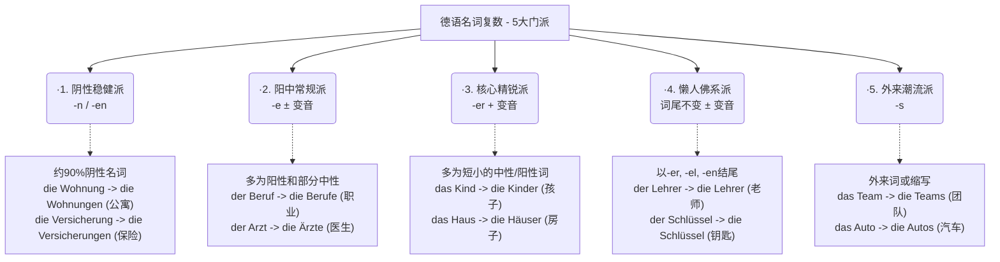

# 名词复数变化

[[名词#^LgvWTUkxTJJoHnsBd4MMz|100%]]

[[动词与单复数关系#动词与单复数关系]]

[[54 超市购物相关 与 量词和名词复数#名词的复数规律 ak]]

[[21 数字复习语百万十万数字表达#^twur62]]

# AI 总结规律 名词复制变化

### 定冠词变化为 die

在德语中，名词在**单数**时有三个性（der/die/das），但在**复数**时，它们就像进入了一个“大熔炉”，**词性的区别消失了**。

- **Der** Vater (阳性) → **die** Väter (复数)
- **Die** Mutter (阴性) → **die** Mütter (复数)
- **Das** Kind (中性) → **die** Kinder (复数)

**注意：** `die` 只是一个**定冠词**，而不是一个“格”。

### 变化二

你觉得德语名词复数像是一团乱麻，对吧？英语加个 "s" 就完事了，德语却要加 "e", "er", "n", "en", "s"，甚至还要在头上加上两点（变音 Umlaut），有时候居然还什么都不加！

# 记忆复数变化规律

要破解短名词的复数变化，**唯一的秘诀是：把“短名词（单音节）”和“词性（der/das/die）”结合起来看。**

### 第一步：看到“中性 (das)”短名词 👉 优先猜加 `-er`（且常变音）

这是中性短名词的“主场”。

- **规律：** 你看图片表格里加 `-er` 的那一栏，旁边解释写得非常清楚——**“几乎所有中性短名词”**。
- **例子：** `das Kind` -> `die Kinder`, `das Buch` -> `die Bücher`, `das Haus` -> `die Häuser`, `das Bild` -> `die Bilder`。
- **小例外（加 -e）：** 比如图片里的 `das Brot` -> `die Brote`（面包），还有 `das Jahr` -> `die Jahre`（年）。但你遇到陌生的 das 短词，盲猜 `-er` 胜率最高。

### 第二步：看到“阳性 (der)”短名词 👉 优先猜加 `-e`（且常变音）

这就是表格里说“很多短名词加 `-e`” 的真正主角！**阳性短名词绝大多数都是加 `-e` 的。**

- **规律：** 只要是 `der` 开头的单音节词，大概率加 `-e`。如果中间有 a, o, u，多半还要戴上两点变音。
- **例子：** 图片里的 `der Stuhl` -> `die Stühle`，其他的如 `der Tisch` -> `die Tische`（桌子）, `der Tag` -> `die Tage`（日子）, `der Baum` -> `die Bäume`（树）。
- **小例外（加 -er）：** 只有极少数阳性短名词去凑了 `-er` 的热闹，最典型的就是图片里的 `der Mann` -> `die Männer`（男人），还有 `der Wald` -> `die Wälder`（森林）、`der Gott` -> `die Götter`（神）。

### 第三步：看到“阴性 (die)”短名词 👉 绝对不加 `-er`，要么 `-(e)n`，要么加 `-e` 必变音

阴性名词有自己的骄傲，它们的变化非常有性格。

- **铁律：** 阴性名词**永远不可能**加 `-er`。（你看图片 `-er` 那一栏特意标注了“没有阴性名词”）。
- **多数情况：** 阴性名词无论长短，最喜欢加 `-(e)n`。比如图片里的 `die Frau` -> `die Frauen`，还有 `die Tür` -> `die Türen`（门）、`die Uhr` -> `die Uhren`（表）。
- **少数短词加 `-e`：** 只有一小撮非常核心的“阴性短名词”会加 `-e`，而且它们**一定会变音**。比如图片里的 `die Hand` -> `die Hände`，其他的如 `die Nacht` -> `die Nächte`（夜晚）, `die Stadt` -> `die Städte`（城市）, `die Wand` -> `die Wände`（墙）。

### 💡 总结成一条“实战口诀”：

当你遇到一个单音节的“短名词”，不知道复数怎么变时，问自己它的词性是什么：

1. 如果是 **das** 👉 盲猜 **-er** (如 Kinder)
2. 如果是 **der** 👉 盲猜 **-e** (如 Stühle)
3. 如果是 **die** 👉 绝对没 -er。优先猜 **-en** (如 Frauen)，如果是手/夜晚/城市等核心基础词，猜 **-e 并变音** (如 Hände)。

这样把词长和性别绑在一起，那句模糊的“很多短名词”就变得清晰可见了！

# 阴性九成加 -en，单音节多加 -e 带变音；

> [!question]
> 阴性直接加 en. 单音节多加 -e 带变音什么意思

#### 第二轨：少数的“女强人”（单音节词）

德语里有一小撮古老的、极短的单音节阴性名词。因为它们太短了，如果直接在后面加上累赘的 `-en`，读起来会显得拖沓，气势不足。

- **规则：** 词尾只加一个短促的 **-e**，并且只要中间的元音能变（a, o, u, au），就**必须带上变音（Umlaut：ä, ö, ü, äu）**！
- **类比：** 她们就像干净利落的职场女强人，遇到复数这种大场面时，不仅换上干练的“短裙”（-e），还会直接“爆发气场，华丽变身”（头上长出两个点，发生变音）。
- **B 2 实战场景与例句：**
    - _城市生活：_ die Stadt (城市) -> die St**ä**dt**e**
        - _München und Berlin sind große **Städte**._ (慕尼黑和柏林是大城市。)
    - _看病：_ die Hand (手) -> die H**ä**nd**e**
        - _Bitte waschen Sie sich die **Hände**._ (请您洗手。)
    - _职场/体力：_ die Kraft (力量/员工) -> die Kr**ä**ft**e**
        - _Wir suchen neue Fach**kräfte**._ (我们正在寻找新的专业人才/熟练员工。 _注：Fachkraft 是由 Fach 和单音节词 Kraft 合成的，变形看最后一个词。_)
    - _时间表达：_ die Nacht (夜晚) -> die N**ä**cht**e**
        - _Die **Nächte** in Deutschland sind im Winter sehr lang._ (德国冬天的夜晚非常漫长。)
