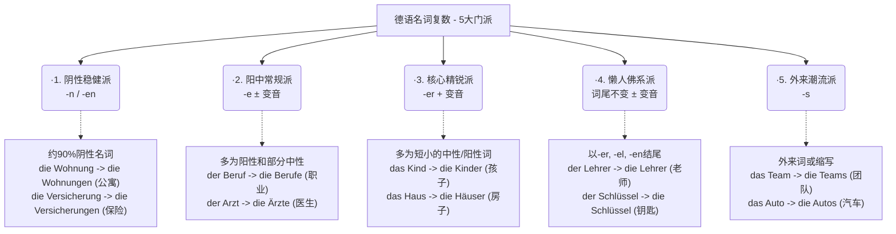

# 名词复数变化

[[名词#^LgvWTUkxTJJoHnsBd4MMz|100%]]

[[动词与单复数关系#动词与单复数关系]]

[[54 超市购物相关 与 量词和名词复数#名词的复数规律 ak]]

[[21 数字复习语百万十万数字表达#^twur62]]

# AI 总结规律 名词复制变化

### 定冠词变化为 die

在德语中，名词在**单数**时有三个性（der/die/das），但在**复数**时，它们就像进入了一个“大熔炉”，**词性的区别消失了**。

- **Der** Vater (阳性) → **die** Väter (复数)
- **Die** Mutter (阴性) → **die** Mütter (复数)
- **Das** Kind (中性) → **die** Kinder (复数)

**注意：** `die` 只是一个**定冠词**，而不是一个“格”。

### 变化二

你觉得德语名词复数像是一团乱麻，对吧？英语加个 "s" 就完事了，德语却要加 "e", "er", "n", "en", "s"，甚至还要在头上加上两点（变音 Umlaut），有时候居然还什么都不加！

---

### 🕵️‍♂️ 深度解析：五大门派的“着装规则”

我们结合你未来在德国的生活场景（租房、找工作、办手续），来看看这五大门派是如何运作的：

#### 1. 阴性稳健派（后缀：-n 或 -en）

这是最让人省心的一个门派！**大约90%的阴性名词（die）都在这里。** 它们非常规矩，变成复数时只要在词尾加上 `-n` 或 `-en`。

- **生活场景（行政/租房）：**
    - _die Wohnung_ (公寓) -> _die Wohnung**en**_
    - _die Rechnung_ (账单) -> _die Rechnung**en**_
    - _die Frist_ (期限) -> _die Frist**en**_
- **大师诀窍：** 只要看到词尾是 `-ung`, `-heit`, `-keit`, `-schaft`, `-tion`，闭着眼睛加 `-en`，绝对错不了！

#### 2. 阳中常规派（后缀：-e，阳性常伴随变音符号 ¨）

这是人数最多的一个中庸门派，主要由阳性（der）和中性（das）名词组成。它们聚会时喜欢在尾巴上加个 `-e`。如果是阳性名词，常常还要在核心元音（a, o, u）上加两点（Umlaut），表示自己“升级”了。

- **生活场景（求职/医疗）：**
    - _der Beruf_ (职业) -> _die Beruf**e**_ (中规中矩加 e)
    - _der Arzt_ (男医生) -> _die **Ä**rzt**e**_ (阳性，核心元音变音 + e)
    - _das Formular_ (表格) -> _die Formular**e**_ (中性，加 e)

#### 3. 核心精锐派（后缀：-er + 变音 ¨）

这个门派人不多，但都是德语里最古老、最核心的词（大多是中性名词）。它们聚会时特别高调，不仅词尾加 `-er`，元音（a, o, u）还必须变音！

- **生活场景（家庭/安居）：**
    - _das Kind_ (孩子) -> _die Kind**er**_
    - _das Haus_ (房子) -> _die **Hä**us**er**_
    - _das Buch_ (书) -> _die **Bü**ch**er**_

#### 4. 懒人佛系派（词尾无变化，有时变音 ¨）

这些词觉得变身太麻烦了。它们的特征是**以 `-er`, `-el`, `-en` 结尾的阳性和中性名词**。它们变成复数时，词尾**原封不动**，最多在元音上加个变音做做样子。

- **生活场景（日常/职场）：**
    - _der Arbeitgeber_ (雇主) -> _die Arbeitgeber_ (完全不变)
    - _der Schlüssel_ (钥匙) -> _die Schlüssel_ (完全不变)
    - _der Vertrag_ 属于第二派（die Verträge），但要注意 _der Apfel_ (苹果) -> _die **Ä**pfel_ (懒人派，只变音)。

#### 5. 外来潮流派（后缀：-s）

这些词是从英语、法语借来的，或者是一些缩写。它们不遵守德国传统的规矩，直接套用国际通用的 `-s`。

- **生活场景（现代生活）：**
    - _das Auto_ -> _die Auto**s**_
    - _das Handy_ (手机) -> _die Handy**s**_
    - _das Büro_ (办公室) -> _die Büro**s**_

---

### 🧠 大师的终极记忆心法（B2冲刺必备）

了解了门派，你还是会问：“我怎么知道一个新词属于哪个门派？”

大师给你一句金玉良言：**永远不要孤立地记一个德语名词！** 从今天开始，你的单词本上绝对不能只写：“桌子 = Tisch”。

你必须把它当作一个人的“全名”来记：**词性 + 名词 + 复数后缀**。

比如：

👉 **der Tisch, -e** (桌子)

👉 **die Wohnung, -en** (公寓)

👉 **das Krankenhaus, -häuser** (医院)

当你每次读单词时，把它当成一个顺口溜读出来（_der Tisch, die Tische_），你的大脑会自动形成肌肉记忆。在6个月的时间里，你的语感会建立起来，你会发现自己能本能地猜出大多数词的复数。

# 记忆复数变化规律

要破解短名词的复数变化，**唯一的秘诀是：把“短名词（单音节）”和“词性（der/das/die）”结合起来看。**

### 第一步：看到“中性 (das)”短名词 👉 优先猜加 `-er`（且常变音）

这是中性短名词的“主场”。

- **规律：** 你看图片表格里加 `-er` 的那一栏，旁边解释写得非常清楚——**“几乎所有中性短名词”**。
- **例子：** `das Kind` -> `die Kinder`, `das Buch` -> `die Bücher`, `das Haus` -> `die Häuser`, `das Bild` -> `die Bilder`。
- **小例外（加 -e）：** 比如图片里的 `das Brot` -> `die Brote`（面包），还有 `das Jahr` -> `die Jahre`（年）。但你遇到陌生的 das 短词，盲猜 `-er` 胜率最高。

### 第二步：看到“阳性 (der)”短名词 👉 优先猜加 `-e`（且常变音）

这就是表格里说“很多短名词加 `-e`” 的真正主角！**阳性短名词绝大多数都是加 `-e` 的。**

- **规律：** 只要是 `der` 开头的单音节词，大概率加 `-e`。如果中间有 a, o, u，多半还要戴上两点变音。
- **例子：** 图片里的 `der Stuhl` -> `die Stühle`，其他的如 `der Tisch` -> `die Tische`（桌子）, `der Tag` -> `die Tage`（日子）, `der Baum` -> `die Bäume`（树）。
- **小例外（加 -er）：** 只有极少数阳性短名词去凑了 `-er` 的热闹，最典型的就是图片里的 `der Mann` -> `die Männer`（男人），还有 `der Wald` -> `die Wälder`（森林）、`der Gott` -> `die Götter`（神）。

### 第三步：看到“阴性 (die)”短名词 👉 绝对不加 `-er`，要么 `-(e)n`，要么加 `-e` 必变音

阴性名词有自己的骄傲，它们的变化非常有性格。

- **铁律：** 阴性名词**永远不可能**加 `-er`。（你看图片 `-er` 那一栏特意标注了“没有阴性名词”）。
- **多数情况：** 阴性名词无论长短，最喜欢加 `-(e)n`。比如图片里的 `die Frau` -> `die Frauen`，还有 `die Tür` -> `die Türen`（门）、`die Uhr` -> `die Uhren`（表）。
- **少数短词加 `-e`：** 只有一小撮非常核心的“阴性短名词”会加 `-e`，而且它们**一定会变音**。比如图片里的 `die Hand` -> `die Hände`，其他的如 `die Nacht` -> `die Nächte`（夜晚）, `die Stadt` -> `die Städte`（城市）, `die Wand` -> `die Wände`（墙）。

### 💡 总结成一条“实战口诀”：

当你遇到一个单音节的“短名词”，不知道复数怎么变时，问自己它的词性是什么：

1. 如果是 **das** 👉 盲猜 **-er** (如 Kinder)
2. 如果是 **der** 👉 盲猜 **-e** (如 Stühle)
3. 如果是 **die** 👉 绝对没 -er。优先猜 **-en** (如 Frauen)，如果是手/夜晚/城市等核心基础词，猜 **-e 并变音** (如 Hände)。

这样把词长和性别绑在一起，那句模糊的“很多短名词”就变得清晰可见了！
