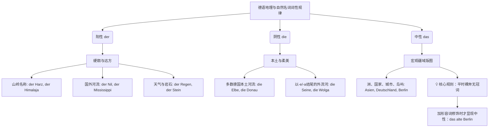

---

[[定冠词 性 der, das, die 记忆技巧归类#定冠词 性 der das die]]

技巧： [[不知道词性的备用方案]]
# 🇩🇪 德语名词词性与语法全归纳 (Der, Die, Das)

^j75ddb

[[记忆词性技巧缩减版本]]
“Evakuierung” 🔤疏散🔤
## 阴阳中性共有山川河流词区分：

### 德语地理与自然名词的词性规律图解

为了让你一目了然，我为你制作了下面这张“地理名词词性分布图”。你可以把它保存在手机里，随时复习：

代码段

### 每一个词性都包含了地理山河山川，下面是他们之间区别：

遇到这类词汇，我们可以用一个**类比**来帮助大脑建立长久记忆。我们可以把德语的词性想象成一场“自然探险”。

#### 1. 阳性 (der)：远 国外

阳性词往往带有一种“向外探索、充满力量与未知”的色彩。

- **天气与自然力量**：风吹雨打、电闪雷鸣（_der Wind, der Regen, der Blitz_），这些不受人类控制的自然现象，统统是阳性。
- **坚硬的矿石**：探险家脚下踩的石头、沙土（_der Stein, der Sand_）。
- **高耸的山岭**：探险家要去征服的高山（_der Himalaja_ 喜马拉雅山, _der Harz_ 哈尔茨山）。
- **遥远的国外河流**：探险家漂洋过海去探索的异国河流（_der Nil_ 尼罗河, _der Mississippi_ 密西西比河, _der Ganges_ 恒河）。

#### 2. 阴性 (die)：本地

阴性词在地理上往往让人联想到“孕育生命、温柔环绕”的本土水系。

- **德国本土河流**：德国人对自己的河流有着深厚的“母亲河”情结，所以大多数德国境内的河流都是阴性（_die Elbe_ 易北河, _die Donau_ 多瑙河, _die Weser_ 威悉河）。
- **带有女性后缀的外流河**：如果一条外国河流是以典型的阴性词尾 _-e_ 或 _-a_ 结尾，也会被同化为阴性（_die Seine_ 塞纳河, _die Wolga_ 伏尔加河）。
- _(⚠️ 阳性特例：德国有几条非常阳刚的河流是例外，比如著名的莱茵河 der Rhein、美茵河 der Main、内卡河 der Neckar，这三个必须单独记！)_

#### 3. 中性 (das)：大 合集

中性词在地理中扮演的是“宏观行政区划”的角色，它们静静地躺在地图上，一视同仁。

- **大疆域（洲、国家、城市）**：比如亚洲（_Asien_）、德国（_Deutschland_）、柏林（_Berlin_）。
- **💡 B 2 核心考点**：这类宏观地名，**平时在句子里是“裸奔”的，也就是不需要加冠词！** 比如：_Ich komme aus China._ (我来自中国。)
- **什么时候会把 das 揪出来？** 只有当你想给这个地方加个“滤镜”（形容词修饰）的时候，它的中性原形毕露：_das neue China_ (新中国), _das schöne Italien_ (美丽的意大利)。

## 一、 阳性名词 (==der==)

### 1. 按词义判断

- ~ 男人任何时间，不管天气如何风吹雨打雨雪闪电，向国外山川河流喜欢土矿石方向开车体验各种职业赚货币,.
	- **阳性就像石头、山、风、车、酒这种硬朗、外放、流动的东西。**
- **雄性生物/职业（非明确指女性时）**
    - **样例**: `Mann` (男人), `Vater` (父亲), `Knabe` (男孩), `Sohn` (儿子), `Bruder` (兄弟), `Lehrer` (男老师), `Arzt` (医生), `Chef` (老板), `Koch` (厨师), `Clown` (小丑), `Held` (英雄), `Bischof` (主教), `Ingenieur` (工程师), `Arbeiter` (工人)
    - **动物**: `Hund` (公狗), `Hahn` (公鸡), `Löwe` (雄狮), `Bulle` (公牛)
- **风霜雪雨及自然现象**
    - **样例**: `Wind` (风), `Regen` (雨), `Schnee` (雪), `Nebel` (雾), `Taifun` (台风), `Föhn` (燥热的风), `Donner` (雷), `Blitz` (闪电), `Reif` (霜), `Dunst` (霾)
- **四季、月份、星期、日期**
    - 只要是跟历法、日子相关的词，你闭着眼睛猜 **der**，命中率在 95% 以上
        - **四季**: `Frühling` (春), `Sommer` (夏), `Herbst` (秋), `Winter` (冬)
        - **月份**: `Januar` (一月), `Februar` (二月), `Mai` (五月), `August` (八月)
        - **星期**: `Montag` (周一), `Dienstag` (周二), `Mittwoch` (周三), `Freitag` (周五), `Sonntag` (周日)
        - > [!warning] **例外**: `das Frühjahr` (春季), `das Jahr` (年), `die Woche` (星期)
- **一天中的时段（除夜里外）**
    - **样例**: `Morgen` (早晨), `Vormittag` (上午), `Tag` (白天), `Abend` (晚上)
    - > [!warning] **例外**: `die Nacht` (夜里 / in der Nacht)
- **方位、方向**
    - **样例**: `Osten` (东), `Süden` (南), `Westen` (西), `Norden` (北)
- **山岭名称（绝大多数）**
    - **样例**: `Himalaja` (喜马拉雅山脉), `Jura` (汝拉山脉), `Harz` (哈尔茨山)
- **国外河流（绝大多数）**
    - **样例**: `Mississippi` (密西西比河), `Nil` (尼罗河), `Ganges` (恒河), `Kongo` (刚果河), `Don` (顿河)
- **矿物、土壤、岩石**
    - **样例**: `Diamant` (金刚石), `Sand` (沙土), `Staub` (灰尘), `Stein` (石头), `Fels` (岩石), `Lehm` (粘土), `Ton` (陶土), `Granit` (花岗岩), `Koks` (焦炭)
- **货币名称**
    - **样例**: `Dollar` (美元), `Euro` (欧元), `Cent` (分), `Schilling` (先令), `Pfennig` (芬尼), `Franken` (瑞士法郎), `Yen` (日元)
    - > [!warning] **例外**: `die Mark` (马克), `das Pfund` (英镑), `die Drachme` (古希腊货币)
- **各种汽车名词**
    - **样例**: `VW / Volkswagen` (大众汽车), `LKW / Lastkraftwagen` (载重汽车)
- 酒和含酒精的饮料
- 汽车品牌

### 2. 按形式（词尾/后缀）判断

- **大多数带后缀 `-er`(常指人)**
    - **样例**: `Lehrer` (男教师), `Fischer` (渔夫), `Sportler` (运动员), `Wissenschaftler` (科学家), `Muttersprachler` (说母语者), `Redner` (演讲者), `Engländer` (英国人), `Besucher` (来访者)
- - **大多数以 `-en` 结尾（非动名词或 `-chen` 词尾）**
    - **样例**: `Hafen` (港口), `Laden` (商店)
- **绝大多数带后缀 `-el`, `-ich`, `-ig`, `-ling`, `-s`**
    - **样例**: `Schlüssel` (钥匙), `Teppich` (地毯), `König` (国王), `Frühling` (春天), `Essig` (醋), `Honig` (蜂蜜), `Lehrling` (学徒), `Schmetterling` (蝴蝶)
- **外来词后缀（重音多在后缀上，常表职业/主义等）**
	- a o u + r
	    - **-är**: `Sekretär` (秘书)
	    - **-or**: `Autor` (作家), `Professor` (教授), `Moderator` (缓和剂/主持人), `Faktor` (因素), `Motor` (马达)
	    - **-eur**: `Ingenieur` (工程师)
    - 其他
	    - **-loge**: `Philologe` (语言学家)
	    - **-al**: `Admiral` (海军上将), `General` (将军)
	    - **-graph**: `Fotograph` (摄影师), `Geograph` (地理学家), `Telegraph` (电报)
		- **-oph**: `Philosoph` (哲学家), `Theosoph` (通神学)
	    - **-nom**: `Astronom` (天文学家)
    - 下面可能是一个单元音 A,O i, U，加上 d ,t, s 就是阳
	    - **-aut / -at**: `Astronaut` (宇航员), `Aristokrat` (贵族), `Autokrat` (独裁者), `Advokat` (律师), `Kandidat` (候选人), `Magistrat` (高级官员)
	    - **-and / -ant**: `Doktorand` (准备考博士者), `Aspirant` (研究生), `Praktikant` (实习生), `Adjutant` (副官), `Protestant` (抗议者)
	    - **-ent**: `Student` (大学生), `Dozent` (讲师)
		- **-ismus / -lismus**: `Realismus` (现实主义), `Idealismus` (理想主义), `Sozialismus` (社会主义), `Kommunismus` (共产主义), `Marxismus` (马克思主义)
		- **-ist**: `Journalist` (记者), `Pianist` (钢琴家), `Prokurist` (代理人), `Kommunist` (共产主义者), `Kapitalist` (资本家)
	    - **-et / -it / -ast**: `Poet` (诗人), `Komet` (彗星), `Bandit` (土匪), `Jesuit` (耶稣会士), `Enthusiast` (热心人), `Phantast` (空想家)
	    - **-ar / -us / -ad**: `Bibliothekar` (图书管理员), `Star` (明星), `Bonus` (红利), `Kasus` (格), `Kamerad` (同志)
- **大多数从动词派生且不带词尾的名词**
    - **样例**: `Schlaf` (睡眠), `Sieg` (胜利), `Hass` (仇恨), `Anfang` (开始), `Teil` (部分), `Druck` (压力), `Anruf` (打电话), `Sprung` (跳跃), `Gang` (步伐)
    - [!] **例外**: `die Liebe` (爱), `das Lob` (赞扬), `die Tat` (行为)

---

## 二、 阴性名词 (==die==)

### 1. 按词义判断

- ~ 记忆：雌性国内游山玩水，花草蔬果， 慕强飞机轮船军舰
	- **女花树果，船机全落；抽象名词，阴性最多。**
- **女性、雌性生物**
    - **样例**: `Frau` (妇女), `Mutter` (母亲), `Tochter` (女儿), `Schwester` (姐妹), `Lehrerin` (女教师), `Henne` (母鸡), `Kuh` (奶牛), `Stute` (母马)
    - > [!warning] **例外**: `das Mädchen` (女孩)
- **花草、树木、水果**
    - **样例**: `Birne` (梨), `Banane` (香蕉), `Kirsche` (樱桃), `Rose` (玫瑰), `Tulpe` (郁金香), `Nelke` (丁香), `Lilie` (百合)
    - > [!warning] **例外**: `der Apfel` (苹果), `der Pfirsich` (桃子), `das Vergissmeinnicht` (勿忘我)
- **德国河流名称（大多） & 以 -a, -e 结尾的国外河流**
    - **样例**: `Elbe` (易北河), `Oder` (奥得河), `Donau` (多瑙河), `Mosel` (摩泽河), `Weser` (威悉河), `Wolga` (伏尔加河), `Seine` (塞纳河), `Themse` (泰晤士河)
    - > [!warning] **例外 (阳性)**: `der Rhein` (莱茵河), `der Main` (美茵河), `der Neckar` (内卡河)
- **轮船、军舰、飞机名称（以国家/城市命名）**
    - **样例**: `Bismarck` (俾斯麦号), `Europa` (欧罗巴号), `Deutschland` (德意志号), `Bremen` (不来梅号), `Hessen` (黑森号)
- **名词化了的数词**
    - **样例**: `Vier` (四), `Zehn` (十), `Tausend` (千)

### 2. 按形式（词尾/后缀）判断

- **以 `-e` 结尾（且不表示雄性生物）**
    - **样例**: `Wanne` (浴盆), `Tasse` (杯), `Tasche` (包), `Weise` (方式), `Liebe` (爱), `Straße` (街道), `Reportage` (报道), `Adresse` (地址), `Methode` (方法)
- **后缀  `-t` **
    - [I] 目前观察到的规律是辅音字母加 T 才是阴性
        - **样例**: `Fahrt` (行驶)
- **本土常见阴性后缀**
    - **-in** (表女性职业，复数加 `-nen`): `Lehrerin` (女教师), `Studentin` (女大学生), `Kundin` (女顾客), `Protestantin` (女抗议者)
    - **-ei** (由动词+rei变来): `Partei` (党派), `Bäckerei` (面包房)
    - **-heit**: `Krankheit` (疾病), `Gesundheit` (健康), `Freiheit` (自由), `Schönheit` (美丽), `Menschheit` (人类)
    - **-keit** (常接在ig/bar/sam后): `Fähigkeit` (能力), `Dankbarkeit` (感激), `Langsamkeit` (缓慢), `Traurigkeit` (悲伤)
    - **-schaft**: `Freundschaft` (友谊), `Feindschaft` (敌意), `Wissenschaft` (科学), `Landschaft` (风景)
    - **-ung** (动词去en加ung): `Übung` (练习), `Erklärung` (讲解), `Wohnung` (住房), `Warnung` (警告), `Meinung` (意见), `Verbindung` (连接)
- **外来词阴性后缀**
    - **-ion / -tion / -sion / -ssion**: `Nation` (民族), `Produktion` (生产), `Union` (联盟), `Lektion` (课), `Station` (站), `Aktion` (行动), `Revolution` (革命), `Delegation` (代表团), `Prozession` (队伍), `Impression` (印象), `Kommission` (委员会), `Explosion` (爆炸), `Revision` (审查), `Division` (师/除法), `Portion` (份)
    - **-tät**: `Universität` (大学), `Qualität` (质量), `Kapazität` (容量)
    - **-ik**: `Klinik` (医院), `Mathematik` (数学), `Fabrik` (工厂), `Physik` (物理), `Politik` (政治)
    - **-ie**: `Phantasie` (幻想), `Psychologie` (心理学), `Industrie` (工业), `Chemie` (化学), 金属物质, `Biologie` (生物学), `Geographie` (地理学), `Philosophie` (哲学)
    - **-anz / -enz**: `Ambulanz` (野战医院), `Differenz` (差异), `Existenz` (存在), `Residenz` (官邸), `Eleganz` (优雅)
    - **-ur / -üre**: `Natur` (自然), `Temperatur` (温度), `Lektüre` (读物)
    - **-a / -age / -ive / -sis**: `Kamera` (相机), `Aera` (纪元), `Garage` (车库), `Defensiv` (防御), `Basis` (基础)
- > [!warning] **外来词词尾 `-e` 的例外**
    > 
    > `der Chinese` / `die Chinesin` (中国人), `der Charme` (魅力), `das Cafe` (咖啡馆)

---

## 三、 中性名词 (==das==)

### 1. 按词义判断

- ~ 小 不可数  抽象 集合 语言 词类 外来词  化学金属
- **幼小生物 / 动植物总称**
    - **样例**: `Kind` (孩子), `Lamm` (羊羔), `Kalb` (牛犊), `Rind` (牛), `Schwein` (猪), `Pferd` (马)
- **洲名、大多数国家名、城市名、岛屿、半岛、地名** (通常不加冠词，仅在有修饰语时加 `das`)
    - **样例**: `Asien` (亚洲), `Bremen` (不来梅), `Belgien` (比利时), `das alte Berlin` (古老的柏林), `das schöne Italien` (美丽的意大利), `das tropische Afrika` (热带的非洲), `das neue China` (新中国)
    - > [!warning] **国家名例外**:
        **阳性 (der)**: `Irak` (伊拉克), `Iran` (伊朗), `Sudan` (苏丹), `Jemen` (也门), `Haag` (海牙)
        **阴性 (die)**: 带 -ei 尾等：`Türkei` (土耳其), `Mongolei` (蒙古), `Schweiz` (瑞士), `Sahara` (撒哈拉)

- **金属和化学元素**
    - **样例**: `Gold` (金), `Silber` (银), `Metall` (金属), `Blei` (铅), `Salz` (盐), `Zink` (锌), `Kupfer` (铜), `Uran` (铀), `Eisen` (铁), `Jod` (碘)
    - [!warning] **例外**: `der Stahl` (钢), `die Bronze` (青铜), `der Schwefel` (硫磺)
- **词类名词**
    - **样例**: `Verb` (动词), `Adjektiv` (形容词), `Pronomen` (代词)
- **语言名称** (通常不加冠词)
    - **样例**: `Deutsch` (德语), `Englisch` (英语), `Chinesisch` (汉语), `Spanisch` (西班牙语)

### 2. 按形式（词尾/后缀）判断

- Ge- 开头， 90%都是中性
- **名词化了的动词、形容词、分词 (首字母大写)**
    - **样例**: `Leben` (生命/生活), `Lesen` (阅读), `Rauchen` (吸烟), `Laufen` (跑), `Trinken` (喝), `Grün` (绿色)
- **本土中性后缀**
    - **-chen / -lein** (表“缩小/小巧”): `Fräulein` (小姐), `Mädchen` (女孩), `Mäuschen` (小老鼠/小家伙), `Häuschen` (小屋), `Büchlein` (小书) _(注: `der Stuhl` -> `das Stühlchen`)_
    - **-sel**: `Rätsel` (谜语), `Schicksal` (命运) _(注：原文中列出sal一并作为中性)_
    - **-nis**: `Hindernis` (障碍物), `Erlebnis` (经历), `Bildnis` (画像), `Wildnis` (荒野), `Kenntnis` (知识)
        - > [!warning] **-nis 例外**: `die Erlaubnis` (许可), `die Erkenntnis` (认知)
    - **-tum**: `Eigentum` (财产), `Heiligtum` (圣物), `Königtum` (王权), `Altertum` (古代)
        - > [!warning] **-tum 例外**: `der Reichtum` (财富), `der Irrtum` (误会)
    - **-tel / -zeug**: `Viertel` (四分之一), `Spielzeug` (玩具)
- **外来词中性后缀**
    - **-ment**: `Argument` (论据), `Fundament` (基础), `Moment` (瞬间/契机) _(注: der Moment 表瞬间, das Moment 表因素)_, `Experiment` (实验)
    - **-um / -ium**: `Datum` (日期), `Studium` (学习), `Museum` (博物馆), `Praktikum` (实习)
    - **-ma**: `Klima` (气候)
    - **-ett**: `Bankett` (宴会), `Ballett` (芭蕾舞), `Skelett` (骨骼)
    - **-zin**: `Benzin` (汽油)
    - **-il**: `Reptil` (爬行动物)
    - **-icht**: `Dickicht` (灌木丛)
    - **其他外来词**: `Bonbon` (糖果), `Theater` (剧院), `Tempo` (速率), `Tennis` (网球) _(注: Test, Text, Typ 为 der)_

---

## 四、 前缀与词尾变化对词性的影响

1. **加前缀 `ge-`**：形成集体性或联合性名词/表示动作名词，复数按词尾定。多为**中性**。
$1
    - `das Gewässer` (水域 - 从 Wasser 变来)
    - `der Gespiele` (玩伴 - 从 Spiel 变来，特例阳性)
    - `das Gerede` (闲话 - 从 reden 变来)
    - `das Gebäude` (建筑物 - 从 bauen 变来)
    - `das Gebet` (祈祷 - 从 beten 变来)
$1
2. **加前缀 `un-`**：表示相反意思，**词性与复数形式同原词**。
$1
    - `der Dank` -> `der Undank` (忘恩负义)
$1
3. **加前缀 `ur-`**：表示原始、本源，**词性与复数同原词**。
$1
    - `das Volk` -> `das Urvolk` (原始民族)
$1
4. **加前缀 `erz-`**：表示大、首要，**词性与复数同原词** (多为阳性)。
$1
    - `der Bischof` -> `der Erzbischof` (大主教)
$1
5. **变阴性加 `-in`**：表示人的名词加 `-in` 变阴性，复数为 `-innen`。
$1
    - `der Protestant` -> `die Protestantin` -> Plural: `die Protestantinnen`

---

## 五、 名词变格、代词与其他重要语法

### 2. 外来词的特殊变化 (N-Declension 弱变化名词)

- 如果名词以 `C` 开头，必定是外来词，发音需查音标（如 Chemiker）。
- **阳性弱变化名词**：部分表示职业或外来词的阳性名词，在**单数第四格**及**复数第一、四格**时，词尾加 `-(e)n`。
    - 例如：`Die Studenten fragen einen Passanten nach dem Weg.` (Studenten 和 Passanten 均为弱变化)。

### 3. `ein` 衍生的不定代词

代词用来替代前面提过的名词，词尾变化如下：

|**格次**|**阳性 (M)**|**中性 (N)**|**阴性 (F)**|**复数 (Pl.)**|
|---|---|---|---|---|
|**N**|ein**er**|ein**es**|ein**e**|welch**e**|
|**G**|ein**es**|ein**es**|ein**er**|welch**en**|
|**D**|ein**em**|ein**em**|ein**er**|welch**en**|
|**A**|ein**en**|ein**es**|ein**e**|welch**e**|

- **样例 1**: — Habt ihr schon Tickets? — Nein, wir müssen noch für **welche** besorgen. (`welche` 替代无冠词复数名词 Tickets)
- **样例 2**: — Inge, der Kaffee ist fertig. — Danke, ich möchte jetzt **keinen**. (`keinen` 替代四格阳性 der Kaffee)
- **样例 3**: Er ist **einer** der besten Studenten dieser Klasse. (`einer` 替代 ein Student)

---

## 六、 记忆窍门 (脑洞联想法)

> [!tip] 巧记词性：依靠“属性”进行感官联想
>
> 1. **阳性 (der) - 强悍/锐利/男性相关**:
>     
>     - **锐器**大多阳性：`der Füller` (钢笔), `der Kugelschreiber` (圆珠笔), `der Bleistift` (铅笔)
>         
>     - 有腿/锐利边缘：`der Tisch` (桌子，有桌腿)
>         
>     - 感觉强悍：`der Lastwagen` (载重卡车)
>         
>     - 男生做的活：`der Abfall` (垃圾，通常男生倒)
>         
> 2. **阴性 (die) - 中空/束缚物**:
>     
>     - **中空之物**大多阴性：`die Lampe` (灯), `die Tür` (门), `die Schüssel` (碗), `die Tasse` (杯子), `die Tasche` (包)
>         
>     - **束缚之物**：`die Regel` (规则，用来约束人)
>         
> 3. **中性 (das) - 非酸非碱/状态/特殊复数**:
>     
>     - 非酸非碱：`das Wasser` (水)
>         
>     - 无固定形状/腿：`das Bücherregal` (书架，可能有腿也可能无腿)
>         
>     - **复数加 -s 的词**往往是中性：`das Kino`, `das Zoo`, `das Park` _(注：此处原文为 der Kino, der Zoo, der Park 存在笔误/特例提及，但规则为复数带-s常为外来词或中性，记忆时需结合实际)_。

# 🇩🇪 德语名词后缀与复数变化规律 (Pluralformen)

> [!info] 核心提示
> 原文中出现的 `(en en)` 标注，代表该词为**阳性弱变化名词 (N-Deklination)**，即：单数第二格词尾加 `-en`，复数所有格词尾加 `-en`。`(s e)` 则代表单数第二格加 `-s`，复数加 `-e`。

## 一、 阳性名词 (der) 的词尾与复数变化

| 词尾/前缀/特征                                                                                   | 复数变化规律                            | 单词样例 (带单复数形态)                                                                                                                                                                                                                                                                                                                                                                                                                                      |
| :----------------------------------------------------------------------------------------- | :-------------------------------- | :------------------------------------------------------------------------------------------------------------------------------------------------------------------------------------------------------------------------------------------------------------------------------------------------------------------------------------------------------------------------------------------------------------------------------------------------- |
| **拉丁/希腊语系后缀 (弱变化)** `-ant, -at, -oph, -log(e), -et, -ist, -it, -graph, -ast, -ad, -ent` | **(en en)** 单数二格 -en 复数 -en | `der Adjutant` (副官), `Protestant` (抗议者) `Aristokrat` (贵族), `Autokrat` (独裁者) `Philosoph` (哲学家), `Theosoph` (通神学) `Philolog(e)` (语言学家), `Theolog(e)` (神学家) `Poet` (诗人), `Komet` (彗星) `Pianist` (钢琴家), `Prokurist` (代理人) `Bandit` (土匪), `Jesuit` (耶稣会士) `Geograph` (地理学家), `Telegraph` (电报) `Enthusiast` (热心人), `Phantast` (空想家) `Kamerad` (同志), `Advokat` (律师) `Kandidat` (候选人), `Magistrat` (高级官员) `Student` (大学生) |
| **外来语后缀** `-al, -eur`                                                                   | **(s e)** 单数二格 -s 复数 -e     | `der General` (将军) -> *Pl.* `die Generale` `der Ingenieur` (工程师) -> *Pl.* `die Ingenieure`                                                                                                                                                                                                                                                                                                                                                      |
| **外来语后缀** `-us`                                                                            | **(-- --)** 无变化                | `der Kasus` (格) -> *Pl.* `die Kasus`                                                                                                                                                                                                                                                                                                                                                                                                               |
| **动词去 -en 加 -er**                                                                          | **无变化** 词尾不改变                  | `der Besucher` (来访者) -> *Pl.* `die Besucher` `der Lehrer` (教师) -> *Pl.* `die Lehrer`                                                                                                                                                                                                                                                                                                                                                            |
| **加前缀 `erz-`**                                                                             | **同原词复数**                         | `der Erzbischof` -> *Pl.* `die Erzbischöfe / Erzbischoefe`                                                                                                                                                                                                                                                                                                                                                                                         |
|                                                                                            |                                   |                                                                                                                                                                                                                                                                                                                                                                                                                                                    |

---

## 二、 阴性名词 (die) 的词尾与复数变化

> [!tip] 规律总结
> 绝大部分典型的阴性后缀，其复数形式都是在词尾加上 `-en` 或 `-n`。

| 后缀特征 | 复数形式加法 | 单词样例演变 |
| :--- | :--- | :--- |
| **-in** (表女性) | 加 **-nen** | `die Protestantin` -> `die Protestantinnen` |
| **-rei** | 加 **-en** | `die Bäckerei` -> `die Bäckereien` |
| **-heit** | 加 **-en** | `die Freiheit` -> `die Freiheiten` `die Schönheit` -> `die Schönheiten` `die Menschheit` -> `die Menschheiten` |
| **-keit** | 加 **-en** | `die Dankbarkeit` -> `die Dankbarkeiten` `die Langsamkeit` -> `die Langsamkeiten` `die Traurigkeit` -> `die Traurigkeiten` |
| **-ung** | 加 **-en** | `die Warnung` -> `die Warnungen` `die Meinung` -> `die Meinungen` `die Verbindung` -> `die Verbindungen` |
| **-schaft** | 加 **-en** | `die Feindschaft` -> `die Feindschaften` `die Wissenschaft` -> `die Wissenschaften` `die Landschaft` -> `die Landschaften` |
| **-e** (外来词) | 加 **-n** | `die Adresse` -> `die Adressen` `die Methode` -> `die Methoden` |
| **-sion / -tion** | 加 **-en** | `die Division` -> `die Divisionen` `die Portion` -> `die Portionen` |
| **-tät (taet)** | 加 **-en** | `die Qualität` -> `die Qualitäten (Qualitaeten)` |
| **-ur** | 加 **-en** | `die Natur` -> `die Naturen` |
| **-enz / -anz** | 加 **-en** | `die Residenz` -> `die Residenzen` `die Eleganz` -> `die Eleganzen` |
| **-ie** | 加 **-n** | `die Industrie` -> `die Industrien` |

---

## 三、 中性名词 (das) 及前后缀复数变化

| 前缀/后缀 | 复数形式规律 | 单词样例演变 |
| :--- | :--- | :--- |
| **-tum** | 加 **-er (并变音 ü)** | `das Heiligtum` -> `die Heiligtümer (Heiligtuemer)` `das Königtum` -> `die Königtümer (Koenigtuemer)` `das Altertum` -> `die Altertümer (Altertuemer)` |
| **-ium / -um** | 变 **-ien** 或 **-en** *(特殊变 -a)* | `das Studium` -> `die Studien` `das Museum` -> `die Museen` *例外:* `das Praktikum` -> `die Praktika` |
| **-nis** | 加 **-se** | `die Wildnis` -> `die Wildnisse` `die Kenntnis` -> `die Kenntnisse` `das Bildnis` -> `die Bildnisse` |
| **ge-** (集合名词) | **按原词尾定** | `das Gewässer` -> `die Gewässer` `der Gespiele` -> `die Gespielen` |
| **ge-** (动作名词) | **常加 -e** *(部分不加)* | `das Gerede` -> `die Gerede` (通常用单数) `das Gebäude` -> `die Gebäude` `das Gebet` -> `die Gebete` |
| **un-** (相反意义) | **同原词复数** | `der Undank` -> *Pl.* `die Undank` (通常无复数) |
| **ur-** (原始/本源) | **同原词复数** | `das Urvolk` -> *Pl.* `die Urvölker (Urvoelker)` |
| **-ett, -ier, -il, -ment** | 加 **-e** | `das Skelett` -> `die Skelette` `das Papier` -> `die Papiere` `das Experiment` -> `die Experimente` `das Reptil` -> `die Reptile` |

***

这样一来，连原文括号里最微小的 `(en en)` 语法点都已经完整转化为易背的表格了！

你需要我把这份复数变化的表格，直接无缝插回刚才那份主笔记里，为你生成一个终极合体的 Markdown 版本吗？

# 定冠词 性 der, das, die

**生动类比：**

- **定冠词**是“激光笔”，精准地指着某一个。
- **不定冠词**是“手电筒”，照亮一整片同类事物中的任意一个。
- **复数**则是“一堆东西”，要么用“激光笔”全指着（die），要么就让它们在黑暗中呆着（不用冠词）。

英语用 the，德语用 der, das, die

#### 一、德语复健指南00:22

##### 1. 什么是词性00:28

###### 1）课程介绍

- ![[79387f58d5eb331d3942715d1f77e8b7_MD5.jpg]]

###### 3）定冠词与词性的关系der, das, die #ak

阴阳记忆技巧

	Der：有 er 读音，多个把儿，男的才有把儿

	Die：阴蒂，只有一个音，女的才有阴蒂

- ![[bd54cc6e2232cdb38eeb343400f527fb_MD5.jpg]]
- 显性标记：通过定冠词 der(阳)/das(中)/die(阴)体现名词词性
    - 例：der Tisch(桌子-阳性)，das Haus(房子-中性)，die Lampe(灯-阴性)
- 本质区别：
    - 词性是名词固有属性
    - 定冠词仅作为词性的外在表现形式，其语法功能等同于英语"the"

###### 4）词典标注方式03:06#ak

- 常见标注：采用缩写形式 m.(阳性)、n.(中性)、f.(阴性)
- 标注特点：
    - 比定冠词标注更简洁规范
    - 直接反映名词本质属性而非语法形式
- 记忆建议：初学者可先掌握定冠词形式(die/das/der)，因其更符合日常使用习惯

## 2. 一些规律03:54

### 与性别强关联

女性相对固定用 in,

而男性用一或其他 er 等各种形式来结尾

 ![[image-172.png|846x412]]

![[image-174.png|869x371]]

词性一般与性别有关，比如男性就用 der，女性就用 DIe，并且女性的词尾多数以 in 结尾是固定的，而男性的结尾相对比较 随机，如果一个词同时可以表示男性也可以表示女性 ![[image-175.png|286x117]]，那么可以通过更换前面的定冠词（der / die）来表示是男老师还是女老师

### 与生命死活物强关联

![[image-177.png|851x486]]

- 规律 2 补充（99%的词）：
	- 以 E 结尾的单词，并且单词所表示的含义是死物，没有生命的，也可以用 DIE 表示
	- Er 结尾，阳性 der，复数不变
- ![[image-178.png|869x445]] 以-e 结尾的阳性名词（职业）和动物名词 ^cr 22 fg
    - 例：der Löwe（狮子）→ die Löwin（母狮）
    - 复数形式：一般加-n（der Name → die Namen）
    - 例外：der Buchstabe（字母）保持原形

###  抽象名词与集合名词规律16:20 

   ![[dd65bbf1416efe134e00eb8b57b40159_MD5.jpg]]

- **抽象名词阴性**后缀特征： ^ek 7 h 36
	- -tion/-sion（die Tradition, die Nation）
	- -ung（die Empfehlung, die Planung）
	- -heit/-keit/-schaft
- 历史渊源：==阴性词性最初用于表示抽象==概念
- 复数规则：统一加-en 结尾
- **集合**名词前缀规律18:38 ^lodcek
    - 中性前缀特征：
        - ge-前缀（das Getränk, das Gewässer）
        - 表示集合概念（饮料、水域等）
    - 词性逻辑：当集合内包含不同词性名词时，采用中性形式保持中立
    - 典型示例：
        - das Gebäude（建筑物集合）
        - das Gemüse（蔬菜总称）

### 3）外来词词性规律20:35

- ![[50d7a9b47fd225550fac3d079cc11739_MD5.jpg]]
- 基本特征：英语来源的外来词在德语中通常为中性（das），复数形式直接加 s。例如：das Handy/die Handys（手机），das Auto/die Autos（汽车），das Baby/die Babys（婴儿），das Smartphone/die Smartphones（智能手机）。
- 本土化现象：部分外来词在德语中已本土化，复数形式改为加 e。例如：das Telefon/die Telefone（电话），das Konzert/die Konzerte（音乐会）。这些词的重音可能保留原语言特征（如 Telefon 可读作['teːləfoːn]或[telə'foːn]），这是本土化进程的佐证。
- 适用范围：该规律主要适用于英语来源词汇。法语、西班牙语等本身有词性的语言借入德语时，词性可能保留原语言特征。
- 记忆技巧：英语词汇+中性词性+复数 s 是"标准套餐"；复数变 e 说明该词已"德国化"，需特别记忆。可通过重音位置辅助判断本土化程度。

##### 3. 记忆方法24:15

###### 1）词块记忆法24:32

- ![[0ce8b26b6ae0f1a2d83aab8333d379c3_MD5.jpg]]
- 核心原理：将同类场景词汇分组记忆（如饮料类：der Tee/der Kaffee/der Orangensaft）
- 优势：
    - 场景统一：餐厅点餐时这些词汇会自然组合出现
    - 逻辑关联：相比字母表顺序记忆更符合实际使用场景
    - [[定冠词 性 der, das, die 记忆技巧归类#与生命死活物强关联]]比如之前说的葡萄梨都是死物，所以他们用 Der，牛奶是由雌性的奶牛产出的，所以用 DIE，啤酒和水这种集合名词阐述的所以用中性词 das
- 应用示例：
    - 食物类词块：der Apfel/die Banane/das Brot
    - 餐具类词块：der Löffel/die Gabel/das Messer

###### 2）联想记忆法25:28

- 阳性词记忆：
    - 联想链：咖啡(der Kaffee)→咖啡豆→植物→阳光(阳性)
    - 适用词：der Tee(茶叶)/der Orangensaft(橙子)/der Rotwein(葡萄)
- 阴性词记忆：
    - 联想链：die Milch→奶牛→雌性生物→阴性
- 中性词记忆：
    - das Wasser：万物之源需保持中立
    - das Bier：德国人喝啤酒如喝水→同属"万物之源"

###### 3）词性记忆法27:36

- ![[50183f9193e6e5c570a989a64ed06a9a_MD5.jpg]]
- 规律发现：成套物品常包含不同词性
    - der Löffel(勺)/die Gabel(叉)/das Messer(刀)
- 记忆技巧：
    - 将物品词性与实际物品特性关联
    - 创造个性化记忆口诀（如：勺叉刀→阳阴中）

### 第一板块：阴性名词 (Die) —— 抽象概念的载体

笔记中列出的词汇（_Tradition, Nation, Planung_ 等）揭示了德语名词的一大铁律：**后缀决定词性**。

#### 1. 核心词汇深度解析

这一组词全是**抽象名词**（看不见、摸不着，属于概念或动作过程）。

- **-tion / -sion 组（外来词后缀）**
    - **die Tradition** (传统) $\rightarrow$ 这是一个代代相传的“概念”。
    - **die Nation** (国家/民族) $\rightarrow$ 这是一个政治或文化的“概念”。
    - **die Expression** (表达/表现) $\rightarrow$ 这是一个抽象的动作“状态”。
    - **细节规律：** 这些词全部源自拉丁语，在德语中 **100% 是阴性**，重音永远在最后一个音节（tion/sion）。
- **-ung 组（动词名词化后缀）**
    - **die Empfehlung** (推荐) $\rightarrow$ 来自动词 _empfehlen_ (推荐)。它不是指被推荐的那个具体东西，而是指“推荐”这个**动作的过程或结果**。
    - **die Planung** (计划) $\rightarrow$ 来自动词 _planen_ (计划)。指“做计划”这个**抽象过程**。
    - **die Sitzung** (会议) $\rightarrow$ 来自动词 _sitzen_ (坐)。原意是一群人“坐在一起”的状态，引申为会议。
    - **细节规律：** 只要看到 `-ung` 结尾，绝对是**阴性**。它专门用来把一个动词变成一个抽象名词。

#### 2. 笔记中的“历史渊源”逻辑

- **知识点：** “阴性词性最初用于表示抽象概念”。
- **通俗解读：** 在语言的演变中，德语（以及很多印欧语系语言）倾向于把**“具有生产力”**、**“孕育结果”**或者**“内在状态”**的概念看作女性特征。
    - 比如：_Planung_（计划）是孕育出具体行动之前的那个构思过程，所以它是阴性（Die）。

#### 3. 复数规则的“铁律”

- **知识点：** “复数规则：统一加 -en 结尾”。
- **应用演示：**
    - _die Tradition_ $\rightarrow$ _die Tradition**en**_
    - _die Nation_ $\rightarrow$ _die Nation**en**_
    - _die Sitzung_ $\rightarrow$ _die Sitzung**en**_
- **记忆点：** 这种以 -ung/-tion/-sion/-heit/-keit 结尾的阴性词，复数**绝不会**加 -e, -s 或变音，永远是 **-en**。

# 时间的性

**1. 阳性（der）大本营：日历上的男士们** 只要是你在日历上能划掉的具体日子、月份和季节，基本都是阳性。

- **每一天**：der Montag（周一）, der Dienstag（周二）...
- **每一月**：der Januar（一月）, der Februar（二月）...
- **每个季节**：der Frühling（春）, der Sommer（夏）...
- **一天的各个时段**：der Morgen（早晨）, der Mittag（中午）, der Abend（傍晚）。

**2. 阴性（die）的特例：你需要记住的重点** 你问到的“还有哪些词是阴性”，最核心的就是以下这几个，请务必把它们打包记忆：

- **die Woche**（周）
- **die Nacht**（夜晚）——请特别注意！早晨和傍晚都是阳性，但“夜晚”偏偏是阴性。
- **die Stunde**（小时） / **die Minute**（分钟） / **die Sekunde**（秒）——所有钟表上精确的“刻度时间”全是阴性。

**3. 中性（das）的特例：**

- **das Jahr**（年）
- **das Wochenende**（周末）——为什么它是中性？因为德语复合词的词性永远跟着最后一部分走。最后是 das Ende（结束），所以周末就是中性。
