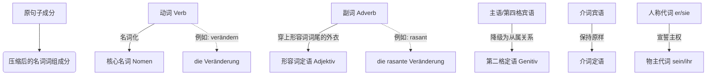

# 名词化
[[形容词名词化]]
[[动词变名词化]]

### 核心概念：语言的“ZIP 压缩包”类比
在初级（A 1-A 2）阶段，我们习惯于“一个萝卜一个坑”，一句话表达一个动作。
到了中级（B 1），我们学会了用连词（weil, wenn, obwohl）把两个句子连起来，变成主从复合句（连体婴）。
而到了中高级（B 2-C 1），德国人嫌主从复合句太啰嗦、动词太多（因为每个从句都要有自己的动词，还要放在句末，读起来很喘），于是他们发明了名词化压缩（Nominalisierung/Verdichtung）。

操作原理如下：
您把一个原本活蹦乱跳的句子（包含主语、动词、宾语），扔进“脱水机”里，把最占地方的动词（Verb）脱水变成名词（Nomen）。这样，整个句子就失去了一套独立句子的资格，变成了一块“没有动词的、高度浓缩的名词短语积木（Nominalphrase）”。

然后，您就可以把这块巨大的积木，无缝“塞进”另一个主干句子里，充当它的主语（Subjekt）、宾语（Objekt）或者介词短语（Präpositionalobjekt）！

在压缩的过程中：

- **动词（核心引擎）** 变成了 **名词**（如：benutzen $\rightarrow$ die Benutzung）。
- 其他所有的句子成分，都必须改变自己的“词性身份”，变成这个核心名词的“附属配件”（定语）。

为了让您一目了然，我们先用一张图表看看这个“压缩”过程的整体框架：

代码段

正如图片最上方所展示的：

> **句子：** _Die Gesellschaft **verändert** sich **rasant**._ (社会**正在迅速改变**。)
>
> **名词词组：** _die **rasante Veränderung** der Gesellschaft_ (社会的**迅速改变**...)

看！原本一长串的句子，变成了一个随时可以塞进另一个大句子里的“名词积木”。

### 逐个击破：句子成分大变身

#### 第一战区：核心人物的降级（主语与宾语 $\rightarrow$ 第二格）

当动词变成名词后，它就成了“国王”。原本句子里的主语（执行者）和宾语（承受者），都必须降级为“国王的财产”，也就是变成**第二格（Genitiv）**。

**1. 不及物动词或反身动词的主语 $\rightarrow$ 第二格**

- **句子：** Der Arzt erscheint. (医生出现了。) $\rightarrow$ _主语是 der Arzt_
- **压缩：** Das Erscheinen **des Arztes** (医生的出现)
- **移民生活场景：** Der Mieter zieht aus. (房客搬走) $\rightarrow$ Der Auszug **des Mieters** (房客的搬离)

**2. 第四格宾语 $\rightarrow$ 第二格**

- **句子：** Er verstand den Text. (他理解了这篇文章。) $\rightarrow$ _宾语是 den Text_
- **压缩：** Das Verstehen **des Textes** (对这篇文章的理解)
- **移民生活场景：** Ich beantrage das Visum. (我申请签证) $\rightarrow$ Die Beantragung **des Visums** (签证的申请)

**3. 【难点突破】当主语和第四格宾语同时存在时，怎么办？**

如果“医生”和“病人”都在，谁变成第二格？德语的规则是：**宾语优先占领第二格！主语被挤走，用介词 durch（由/通过）连接。**

- **句子：** Der Arzt operiert den Patienten. (医生给病人做手术。)
- **压缩：** Die Operation **des Patienten** (第二格，宾语) **durch den Arzt** (durch+第四格，原来的主语)。
- **翻译：** 由医生对病人进行的手术。
- **移民生活场景：** Die Ausländerbehörde prüft meine Unterlagen. (外管局审核我的材料。) $\rightarrow$ Die Prüfung **meiner Unterlagen** (第二格) **durch die Ausländerbehörde** (durch 带出执行者)。(由外管局对我材料的审核)。

#### 第二战区：修饰语的换装（副词、代词、否定词）

**4. 介词宾语 $\rightarrow$ 保持不变（还是介词结构）**

- **句子：** Er bemühte sich **um den Patienten**. (他尽力照顾病人。)
- **压缩：** Die Bemühungen **um den Patienten**. (对病人的照顾/努力。)
- **移民生活场景：** Ich warte auf die Aufenthaltsgenehmigung. (我等待居留许可) $\rightarrow$ Das Warten **auf die Aufenthaltsgenehmigung**. (对居留许可的等待)。

**5. 人称代词 $\rightarrow$ 物主代词**

- **句子：** **Er** bemühte sich... (他尽力...)
- **压缩：** **Seine** Bemühungen... (他的努力...)

**6. 副词 $\rightarrow$ 形容词（加词尾）**

- **类比：** 副词原本是跟着动词混的。现在动词变成了名词，副词也必须换上配套的制服——加上形容词词尾，变成名词的修饰语。
- **句子：** Er half **unermüdlich**. (他不知疲倦地帮忙。—— _unermüdlich_ 在这里是副词，没词尾)
- **压缩：** Seine **unermüdliche** Hilfe. (他不知疲倦的帮助。—— 变成了形容词，加上了 -e 词尾修饰 Hilfe)

**7. 【高频公文用法】否定和限制 $\rightarrow$ 表示“缺乏”的名词或形容词**

德国官方文件不喜欢用 _nicht_，他们觉得不够严谨，他们喜欢用 _fehlen_ (缺乏)、_mangelnd_ (不足的)。

- **句子：** Man half **nicht**. / Man war **wenig** hilfsbereit. (没有人帮忙。/ 人们不太乐于助人。)
- **压缩：** Die **fehlende/mangelnde** Hilfe. / Die **unzureichende** Hilfsbereitschaft. (缺失的帮助。/ 不足的乐于助人精神。)
- **移民生活场景（重要）：** Sie haben die Dokumente **nicht** abgegeben. (您没有提交文件。) $\rightarrow$ Das **Fehlen** der Dokumente... (文件的缺失...)

#### 第三战区：复杂语法的终极转化（被动、连词、情态动词）

在 B 2/C 1 的写作和阅读中，动词词组（Verbalstil）和名词词组（Nominalstil）的互相转换是必考题。

**8. 被动句中的 von $\rightarrow$ durch (+第四格)**

- **句子：** Er wurde **vom Arzt** operiert. (他被医生做了手术。)
- **压缩：** Die Operation **durch den Arzt**. (由医生进行的手术。)

**9. 从句连词 $\rightarrow$ 介词**

这是德语语法中最神奇的魔术，从句直接被压缩成一个介词短语！

- **句子：** **Wenn** (当) der Arzt erscheint, ... / **Weil** (因为) der Arzt erscheint, ...
- **压缩：** **Bei** (在...时) Erscheinen des Arztes... / **Wegen** (因为) des Erscheinens des Arztes...
- _(注：这部分在图片中指向了第 84-86 章，我们后续会详细展开各种连词对应的介词对，比如 obwohl $\rightarrow$ trotz)。_

**10. 情态动词 $\rightarrow$ 含有情态意义的名词**

- **句子：** Der Arzt **muss** dem Patienten helfen. (医生必须帮助病人。)
- **压缩：** Die **Pflicht** des Arztes... (医生的义务...)
- **拓展：** 如果是 _kann_ (能) $\rightarrow$ _die Möglichkeit_ (可能性)；如果是 _darf_ (允许) $\rightarrow$ _die Erlaubnis_ (许可)。

### ⚠️ 大师的警告：歧义的陷阱 (图片的彩蛋)

在 `image_abdc4c.jpg` 的最下方，有一幅画着国王的插图，配文是：“有时候名词化成分的意义并不明确，只能结合上下文进行理解。”

这是什么意思呢？我们来看这个经典例子：

**das Bild des Königs** (国王的画)

由于第二格（des Königs）既可以代表原来的主语，也可以代表原来的宾语，甚至可以代表所有格，这个短语可能包含三种意思：

1. **国王画的画** (国王是动作执行者 / 主观第二格)
2. **画中画的是国王** (国王是动作承受者 / 客观第二格)
3. **国王买下来的画** (单纯的所有权)

所以，在阅读德文合同时，一定要结合上下文（Kontext）来判断！

### 实战演练：一封外管局的拒信

让我们把今天学的知识融合在一个移民真实场景中。假设您提交了签证材料，但少了一份文件。

- **普通人说话（动词风格 Verbalstil）：**
$1

    **Weil** Sie die Dokumente **nicht vollständig** eingereicht haben, **können** wir Ihren Antrag nicht bearbeiten.

$1

    _(因为您没有完整地提交文件，我们无法处理您的申请。)_

$1
- **外管局写信（名词化风格 Nominalstil - 您的 B 2 目标）：**
$1

    **Wegen** der **unvollständigen** Einreichung der Dokumente ist die Bearbeitung Ihres Antrags **unmöglich**.

$1

    _(由于文件的提交不完整，对您申请的处理是不可能的。)_

**拆解分析：**

1. Weil (连词) $\rightarrow$ Wegen (介词，要求第二格)
2. nicht vollständig (否定副词) $\rightarrow$ unvollständig (形容词作定语)
3. eingereicht (动词) $\rightarrow$ die Einreichung (名词)
4. die Dokumente (第四格宾语) $\rightarrow$ der Dokumente (第二格)
5. können nicht (情态动词否定) $\rightarrow$ unmöglich (形容词：不可能的)

这就是名词化（Verdichtung）的威力！它让语言变得极其紧凑、正式、严密。

如果您能彻底理解并将普通句子转化为这种“压缩包”形式，您的德语水平就已经妥妥踏入 B 2 的大门，面对德国任何繁文缛节（Bürokratie）都能游刃有余了！建议您将最后这个实战演练的句子多读几遍，体会这种结构的变化。
