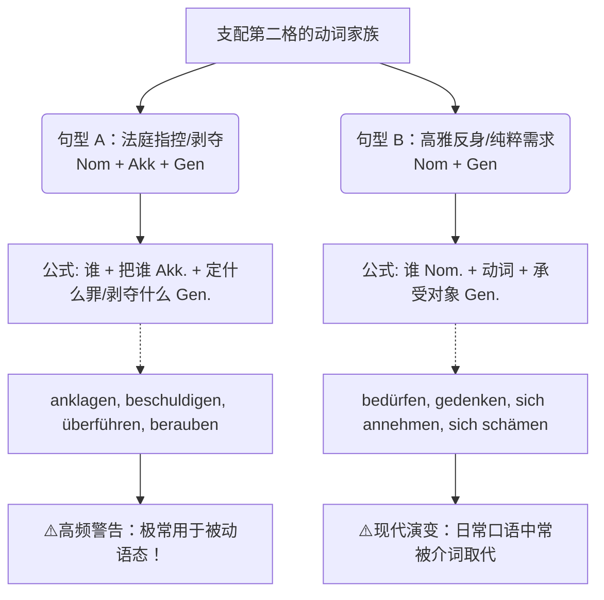

# 支配第二格宾语的动词

Guten Tag! 欢迎再次来到德语大师的硬核语法课堂！

看到这张图，大师不禁要倒吸一口凉气，然后再为你热烈鼓掌！为什么？因为你上传的这张图右上角赫然写着 **C 1**。没错，**支配第二格（Genitiv）的动词**，绝对是德语语法金字塔塔尖的明珠。在 B 2 向 C 1 跨越的这 6 个月里，掌握它们，你的德语将褪去“生活化”的泥土气息，穿上笔挺的“燕尾服”，在正式书信、看新闻（如 Tagesschau）或应对高级别行政事务时，展现出碾压级别的专业度。

咱们把德语第二格（Genitiv）想象成“古代欧洲的贵族阶层”**。平时我们用第二格，多半是表示“谁的”（比如 das Auto meines Vaters），但这属于“平民用法”。一旦**动词**主动要求搭配第二格，那就相当于发出了“皇家诏书”。这类动词天生自带一种**严肃、庄重、甚至充满法律气息的语体色彩（书面语/高雅德语）。

为了让你看透这群“贵族动词”的家族结构，大师先为你绘制一张家族族谱：

代码段

下面，大师结合这张图中的法庭漫画和日常生活，为你庖丁解牛！

---

### 第一大门派：法庭与刑侦专属动词 (Nom. + Akk. + Gen.)

这是这节课绝对的重头戏！请看图片右侧的结构图：**主语（第一格） + 宾语 1（第四格：人） + 宾语 2（第二格：物/罪名）。**

**底层逻辑：** 某个权威机构（警察/检察官），抓着一个**人（Akk. 身体被控制）**，给他安上了一个**罪名（Gen. 抽象的定性）**。

_图中铁律：第四格永远是人，第二格永远是物（罪名/事物）！_

#### 核心词汇与实战场景：

- ** `anklagen` (起诉) / `beschuldigen` (指控) / `verdächtigen` (怀疑)**
    - _漫画原句：_ Man hat Sie **des Diebstahls** _angeklagt_. (人们起诉您犯有**盗窃罪**。)
    - _新闻实战：_ Die Polizei verdächtigt ihn **des Mordes**. (警方怀疑他犯有**谋杀罪**。) —— _警察抓着他(ihn)，罪名是谋杀(des Mordes)。_
- ** `berauben` (抢劫 / 剥夺)**
    - _生活实战：_ Man hat mich **meines Geldes** beraubt. (有人抢走了**我的钱**。) —— _注意，这里不说 hat mein Geld gestohlen，用 berauben 显得案情非常严重，你在警察局做笔录时可以用。_
- ** `entbinden` (免除 / 解除)**
    - _职场/法律实战：_ Ich beantrage, die Zeugin **der Schweigepflicht** zu _entbinden_. (我申请免除证人的**保密义务**。)

🔥 **大师的 B 2/C 1 终极考点提示（必考！）：**

这类动词在实际生活中，极少用主动语态（因为“谁”起诉的不重要，重要的是嫌疑人），它们是被动语态（Passiv）的超级 VIP 客户！

当变成被动语态时，**原来的第四格（人）变成了主语（第一格），而第二格（罪名）像泰山一样纹丝不动！**

- _主动：_ Man klagt **den Mann** (Akk.) **des Mordes** (Gen.) an.
- _被动：_ **Der Mann** (Nom.) wurde **des Mordes** (Gen.) angeklagt. (这个男人被指控犯有谋杀罪。) -> _记住这个句型，考试写作直接套用，考官会惊呆的。_

---

### 第二大门派：高雅与古典动词 (Nom. + Gen.)

看图片左侧的结构。这一派不需要第四格当中间人，主语直接和第二格发生关系。它们往往带有一种“悲天悯人”或者“极其正式”的色彩。主语和第二格都可以是人或物。

#### 核心词汇与实战场景：

- ** `bedürfen` (需要)** —— 这就是 `brauchen` (需要) 的“穿西装打领带”版本。
    - _行政沟通实战：_ 如果你在外管局（Ausländerbehörde）遇到极其复杂的问题，你写信时可以说：Die Sache **bedarf der Klärung**. (此事**需要澄清**。) —— _瞬间显得你受过高等教育！而不是干瘪地说 Die Sache braucht Klärung._
- ** `sich annehmen` (关心 / 照料 / 接管)** —— 相当于 `sich kümmern um` 的高级版。
    - _职场实战：_ Herr Müller **nimmt sich des Problems an**. (米勒先生接管/负责**处理这个问题**。)
- ** `gedenken` (纪念)** —— 只有在极其庄重的场合才会用。
    - _新闻实战：_ Wir **gedenken der Opfer**. (我们纪念**受害者**。)

---

### 第三大门派的没落：图底部的“避坑指南”

仔细阅读图片最下方的三条黑点注释，那是编书老师给你的“保命锦囊”：

1. **书面语警告：** “这类动词常用于文雅的书面语中。” —— **大师叮嘱：** 除非是在做学术报告、法庭辩护或写正式申诉信，否则千万不要在超市买菜或者和邻居聊天时用这些词，你会像个穿越来的中世纪老古董！日常生活中，请乖乖用它们的平民替代品（比如用 _brauchen_ 替代 _bedürfen_）。
2. **形容词也来凑热闹：** 有些形容词也必须配第二格。比如自信满满地说：“Er ist **sich seiner Sache** sicher.” (他对**自己的事情**很有把握。)
3. **时代的眼泪（现代德语的退化）：** 语言是懒惰的。很多要求第二格的反身动词，现在已经被“介词 + 第四格”无情取代了。
    
    - _古典学霸版（第二格）：_ Er schämt sich **seiner Tat**. (他为自己的行为感到羞耻。)
    - _现代平民版（介词）：_ Er schämt sich **für seine Tat**.
    - **大师建议：** 在你的 B 2 口语考试中，用介词版 (`für + Akk.`)；在你的 C 1 阅读中，看到第二格版 (`seiner Tat`) 能看懂即可。

---

### 🚀 德语大师的“半年 B 2/C 1 冲刺”学习规划建议

针对这块难啃的骨头，结合你 6 个月的备考周期，我给你定制以下策略：

1. **建立“降维打击”意识（第 1-2 个月）：**

    不要强求在日常口语里输出这些词。把你目前的任务定为“被动词汇的积累”。把 `anklagen`, `verdächtigen`, `bedürfen` 写在卡片上，标注 `+ Genitiv`。看懂即胜利。

2. **新闻听力与阅读实战（第 3-4 个月）：**

    下载 _Tagesschau_ 的 App。这里面简直是“支配第二格动词”的天然语料库！只要一有案件报道，你就会疯狂听到 _wurde des Diebstahls angeklagt_, _wird des Betrugs verdächtigt_。把这些真实的新闻句子抄下来，感受它们的庄重感。

1. **写作大招储备（第 5-6 个月）：**

    在备考 B 2/C 1 的书信写作（Beschwerdebrief 投诉信 / formelle E-Mail 正式邮件）时，刻意准备 1-2 个带有这类动词的句子作为“提分神器”。比如结尾写一句：_Dieses Problem bedarf einer schnellen Lösung._ (这个问题需要快速解决。) 考官看到 `bedarf + Genitiv`，笔一抖，直接给你打高分！

语言学习就像打怪升级，你现在已经走进了高级副本。记住第二格的“贵族与法庭”属性，下次再看到它们，你就能从容应对了！如果你想尝试一下，不妨用 `bedürfen` (需要) 造个句子，描述一下你在德国找房子的感受？大师随时为你批改！
