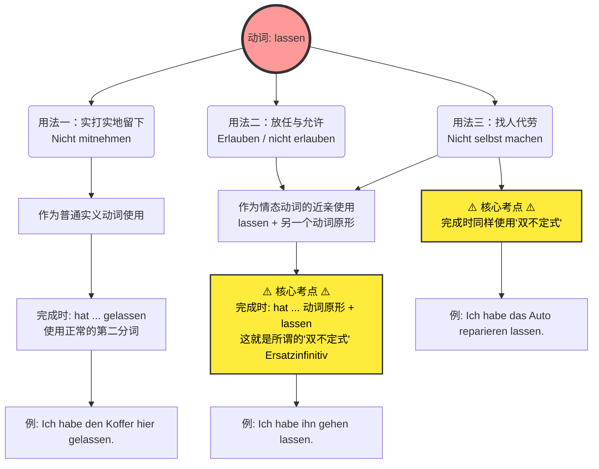

# lassen

- [!] 错题：[[lassen错误#1]]

### 为什么 `werden` 和 `lassen` 能享受“单独开篇”的 VIP 待遇？

在德语里，绝大多数动词都是“单面人”，比如 `essen`（吃）就是吃，`schlafen`（睡）就是睡。但 `werden` 和 `lassen` 是德语动词界的**“瑞士军刀”**和**“变形金刚”**。它们不仅词义多变，更要命的是，**它们在不同的语境下，会改变整个句子的语法结构。**

- **关于 `werden`（B 2 核心中的核心）：** 它不仅可以作实义动词表示“变成”（Ich werde alt. 我变老了），它还是**将来时**的助动词（Ich werde nach Deutschland fliegen. 我将飞往德国），更是**被动语态**的核心助动词（Das Haus wird gebaut. 房子正在被建造）。在德国的职场、租房合同、政府公文中，被动语态满天飞，没有 `werden` 你寸步难行。
- **关于 `lassen`（也就是你图片里的主角）：** 它不仅可以当普通的实义动词（留下），还能像**情态动词**一样带出另一个动词（允许/让别人做）。最让初学者头疼的是，**它在变成完成时（Perfekt）的时候，有两种截然不同的变法（正常变位 vs. 双不定式）**。

如果不把它们单独拿出来把规则讲透，学习者到了 B 1/B 2 阶段遇到各种长难句绝对会一头雾水。

---

![[PixPin_2026-06-05_17-15-52.png|1882x584]]

### 图解解析：`lassen` 的三重影分身

为了让你更直观地理解，我为你准备了一张图表，梳理了图片中 `lassen` 的三种核心用法以及它们在完成时（Perfekt）中的致命考点。

代码段



现在，我们结合你未来在德国的生活场景，把图片里的三个例子揉碎了喂给你：

#### 第一层境界：不带走 (Nicht mitnehmen) —— “实打实地留下”

- **书上例句：** Kann ich meine Koffer hier **lassen**? （我可以把行李箱留在这吗？）
- **大师解析：** 在这里，`lassen` 就是一个普普通通的动词，意思是“把某物留在某地”。
- **移民生活场景：** 你刚到德国，去外管局（Ausländerbehörde）办居留卡，工作人员需要审核你的材料原件。你可以问：
    - _Kann ich meinen Pass hier **lassen**?_ (我可以把护照留在这里吗？)
- **语法重点（现在完成时）：** 因为它是普通动词，所以过去分词规规矩矩地变成 **gelassen**。
    - _Ich habe meinen Pass hier **gelassen**._ (我把护照留在那里了。)

#### 第二层境界：（不）允许 (Erlauben) —— “放任、让步”

- **书上例句：** Ich **lasse** mein Kind nicht **fernsehen**. (我不让/不允许我的孩子看电视。)
- **大师解析：** 这里 `lassen` 充当了类似 `dürfen` (允许) 的角色，句子里出现了第二个动词 `fernsehen`（看电视）。
- **移民生活场景：** 你在德国租房，房东立了规矩，不允许在阳台烧烤（很常见的德国生活痛点）：
    - _Der Vermieter **lässt** uns nicht auf dem Balkon **grillen**._ (房东不让我们在阳台烧烤。)
- **语法重点（现在完成时）：** **注意！前方高能！** 图片里标了红色的 ⚠️ 警告符号。当 `lassen` 后面跟着另一个动词时，它的<font color="#d83931">完成时**绝对不能**用 gelassen</font>，而是要用**动词原形 + lassen 的原形**（这叫 Ersatzinfinitiv 替代不定式，B 1/B 2 必考）。
    - _Ich habe mein Kind nicht **fernsehen lassen**._ (不是 fernsehen gelassen!)

#### 第三层境界：不自己做 (Nicht selbst machen) —— “花钱消灾 / 找人代劳”

- **书上例句：** Ich **lasse** meine Haare **schneiden**. (我让人给我剪头发。)
- **大师解析：** 这是 `lassen` 最地道、最高频的用法！中文我们说“我去剪头发”，但在德语逻辑里，如果你说 _Ich schneide meine Haare_，德国人会以为你自己拿着剪刀对着镜子剪。在德国，只要是**请别人/雇别人**帮你做的事，都必须用 `lassen`！
- **移民生活场景：** 德国人工费极贵，很多事德国人喜欢 DIY。但如果你的车坏了，你自己修不了，送去了修车厂（Werkstatt）：
    - _Ich **lasse** mein Auto **reparieren**._ (我让别人修我的车。)
- **语法重点（现在完成时）：** 和第二层境界一样，带有第二个动词，完成时使用**双不定式**：
    - _Ich habe mein Auto **reparieren lassen**._ (我把车送去修了。)

##### 其他时态示例
2. Präteritum（过去时）
过去时通常用于书面语，比如你给房东写邮件，或者填写官方表格时。

场景： 租房事务（Mietangelegenheiten）

例句： Wir ließen den Mietvertrag vom Mieterverein prüfen.

中文翻译： 我们（过去）让租房协会审查了租房合同。

语法要点： lassen 的过去时词干是 ließ-。这里加上了 vom Mieterverein（由租房协会），用介词 von + Dativ 引出真正干活的“打工人”。

3. Perfekt（现在完成时）—— 【重点与难点警告 ⚠️】
这是口语中最常用的过去表达方式，也是 B 1 考试中最容易失分的“深水区”。

如果你查字典，你会发现 lassen 的第二分词（Partizip II）是 gelassen。但是！ 当 lassen 搭配另一个实义动词（即“代劳”用法）出现在完成时里时，绝对不能用 gelassen！

这里必须使用德语语法中著名的 “替代不定式”（Ersatzinfinitiv） 原则：当 lassen 和另一个动词原形连用时，它在完成时中也要保持原形！

公式： haben (变位) + 宾语 + 实义动词原形 + lassen (原形)

场景： 医疗（Medizinische Versorgung）

例句： Ich habe mir gestern Blut abnehmen lassen.

中文翻译： 我昨天让人（医生/护士）给我抽血了。

语法要点： 句子第二位是助动词 habe。句尾出现了双原形动词（abnehmen 和 lassen 紧紧挨在一起，lassen 永远在最后）。千万不要说成 ...abnehmen gelassen！

# 关于 lassen 的用法有 3 种用法其中有两个结构都很一样，，那怎么区分代劳和允许

## 德语动词 "lassen" 的核心用法解析：如何区分“代劳”与“允许”

遇到抽象的语法，最好的办法就是代入角色。其实，区分这两个用法的核心在于**主语在事件中扮演的角色权力**。

### 💡 类比讲解：你是“老板”还是“门卫”？

当你看到 `A lässt B + 动词原形` 这个结构时，请立刻在脑海里问自己：主语 A 此时是老板，还是门卫？

**1. “代劳” (veranlassen) = 老板模式 (The Boss)**

- **内在逻辑：** 作为老板，你不想自己动手，或者你没有能力自己动手。于是你**主动发起**了这个动作，通过花钱、下指令或者委托，让别人替你完成。
- **动作的渴望者：** 是主语自己（我想修车，我想理发）。
- **生活场景（行政/生活）：**

    > **Ich lasse mein Auto reparieren.**
    > 
    > (我让别人修我的车。—— 你是老板，你出钱，修理工干活。)
    > 
    > **Ich lasse meine Zeugnisse übersetzen.**
    > 
    > (我找人翻译我的毕业证书。—— 找工作必备，你委托宣誓翻译去翻译。)

**2. “允许” (erlauben / zulassen) = 门卫模式 (The Security Guard)**

- **内在逻辑：** 作为门卫，你本身对这个动作没有任何渴望，是**别人（宾语）想要做这件事**，而你手握决定权。你选择了开门，不加阻拦，放行了。
- **动作的渴望者：** 是宾语（孩子想玩，租客想养狗）。
- **生活场景（租房/医疗）：**

    > **Der Vermieter lässt mich einen Hund halten.**
    > 
    > (房东允许我养一只狗。—— 房东是门卫，是你想养狗，房东只是点头同意。)
    > 
    > **Der Arzt lässt den Patienten nach Hause gehen.**
    > 
    > (医生允许病人回家。—— 病人迫不及待想出院，医生检查后放行。)

### 🔍 实战技巧：如何一秒看穿句子的真实意图？

既然结构完全一样，在真实的德国生活里，我们通过以下两个核心技巧来精准区分：

#### 技巧一：依靠常识与语境 (Weltwissen)

语言是用来沟通的，90%的情况下，生活常识会自动帮你做出选择。

- _Die Mutter lässt das Kind draußen spielen._ (妈妈让孩子在外面玩。 -> 显然是孩子想玩，妈妈**允许**。)
- _Ich lasse mir beim Arzt Blut abnehmen._ (我在医生那里抽血。 -> 显然你不会“允许”医生抽着玩，而是你为了体检**委托/代劳**医生这么做。)

#### 技巧二：寻找隐藏的“反身代词” (Sich im Dativ)

这是一个 B 2 级别非常实用的“作弊”技巧！当表达“代劳”时，因为动作的结果往往作用于主语自身（为了自己好），德国人非常喜欢加上一个**第三格反身代词 (mir/dir/sich...)**。一旦看到这个词，99%都是“代劳”！

|**德语句子**|**语法成分分析**|**模式分类**|**中文释义**|
|---|---|---|---|
|Ich lasse **mir** die Haare schneiden.|mir (Dativ), schneiden (动作)|代劳 (老板)|我去理发。(我让理发师给我剪头发)|
|Er lässt **sich** einen Zahn ziehen.|sich (Dativ), ziehen (动作)|代劳 (老板)|他去拔牙。(他让牙医给他拔牙)|

### 🧠 你的大脑思考流程图 (Mermaid 图解)

为了让你在遇到 `lassen` 时能形成条件反射，我为您准备了大脑决策流程图。每次阅读或者造句时，请按照这个逻辑走一遍：

代码段

```mermaid
flowchart TD
    A["遇到: 主语 + lassen + 宾语 + 动词原形"] --> B{"谁是这个动作真正的'渴望者/发起者'？"}
    
    B -->|主语自己想做，但自己不动手| C["代劳模式 (veranlassen)"]
    B -->|宾语想做，主语只是手握否决权不阻拦| D["门卫模式 (erlauben)"]
    
    C --> E["特点：常伴随第三格反身代词 (mir/sich)"]
    D --> F["特点：常出现否定词 (nicht/kein) 表示禁止"]
    
    E --> G["例：Ich lasse mir ein Visum ausstellen. \n(我让人给我签发签证)"]
    F --> H["例：
```
