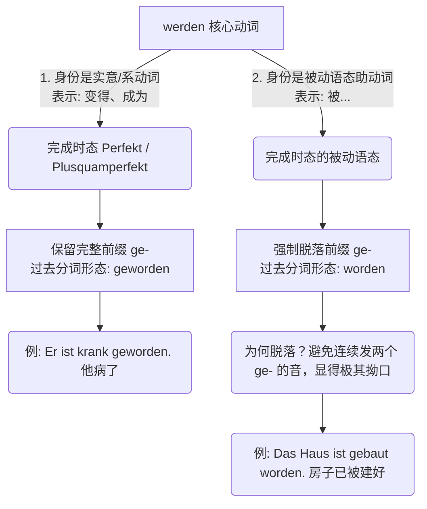

---
aliases:
  - werde
  - wird
  - wurde
  - worden
  - würde
---

# werden 所有变化 . 用法： [[语言学习/德语/公共知识语法/动词.md#^lwYndODE|100%]]

^0ynl3x

### 🧱 矩阵一：`werden` 核心变位全家福 (按人称与核心语式)

#### . 直陈式 (Indikativ) —— 表达“客观存在的事实”

> 💡 **大师提示**：除了现在时变化 du/第三行 er/sie/es，其他都是词干变化 u / e / ü + 固定后缀变化。

|**人称**|**现在时 (Präsens)(当下)**|**过去时 (Präteritum)(过去)**|**现在完成时 (Perfekt)(过去已发生)**|**过去完成时 (Plusquamperfekt)(过去的过去)**|**第一将来时 (Futur I)(将来/猜测)**|**第二将来时 (Futur II)(将来已完成)**|
|---|---|---|---|---|---|---|
|**ich**|werde|wurde|bin geworden|war geworden|werde werden|werde geworden sein|
|**du**|wirst|wurdest|bist geworden|warst geworden|wirst werden|wirst geworden sein|
|**er/sie/es**|wird|wurde|ist geworden|war geworden|wird werden|wird geworden sein|
|**wir**|werden|wurden|sind geworden|waren geworden|werden werden|werden geworden sein|
|**ihr**|werdet|wurdet|seid geworden|wart geworden|werdet werden|werdet geworden sein|
|**sie/Sie**|werden|wurden|sind geworden|waren geworden|werden werden|werden geworden sein|

#### 2. 第一虚拟式 (Konjunktiv I) —— B2核心：“新闻发言人”与“客观转述”

_绝对不能漏掉的重头戏！它专门用于转述别人的话（Indirekte Rede）。_

| **人称**        | **K1: 表达当下 (Gegenwart)(对应直陈式的 Präsens)** | **K1: 表达过去 (Vergangenheit)(对应直陈式的 Perfekt/Präteritum)** | **K1: 表达将来 (Zukunft)(对应直陈式的 Futur I)** |
| ------------- | ---------------------------------------- | ------------------------------------------------------- | -------------------------------------- |
| **ich**       | werde                                    | sei geworden                                            | werde werden                           |
| **du**        | **werdest**                              | **seiest** geworden                                     | **werdest** werden                     |
| **er/sie/es** | **werde**                                | **sei** geworden                                        | **werde** werden                       |
| **wir**       | werden                                   | seien geworden                                          | werden werden                          |
| **ihr**       | **werdet**                               | **seiet** geworden                                      | **werdet** werden                      |
| **sie/Sie**   | werden                                   | seien geworden                                          | werden werden                          |

#### 3. 第二虚拟式 (Konjunktiv II) —— “非真实假设”与“委婉客气”

_用于表达遗憾、如果、愿望，或者极其礼貌的请求。_

|**人称**|**K2: 表达当下的假设 (Gegenwart)(由 Präteritum 变音而来)**|**K2: 表达过去的假设 (Vergangenheit)(由 Plusquamperfekt 变音而来)**|
|---|---|---|
|**ich**|würde|wäre geworden|
|**du**|würdest|wärest geworden|
|**er/sie/es**|würde|wäre geworden|
|**wir**|würden|wären geworden|
|**ihr**|würdet|wäret geworden|
|**sie/Sie**|würden|wären geworden|

### 🌐 矩阵二：`werden` 语法功能与时态大通关

这是整篇总结的灵魂所在。`werden` 在不同的语法场景下，搭配的公式和自身的形态完全不同。

⚠️ **大师绝对铁律：**

- 当 `werden` 作为**实意/系动词**表示“变得、成为”时，它的过去分词是 ** `geworden` **。
- 当 `werden` 作为**被动态助动词**表示“被...”时，它的过去分词剥落了 `ge-`，变成了 ** `worden` **。

|**语法角色**|**具体时态 / 语态**|**核心公式结构**|**德语实战例句**|**中文深度解析**|
|---|---|---|---|---|
|**1. 实意/系动词**      _(表示"变得"、"成为")_|现在时|werden + 形容词/名词|Er **wird** alt. / Er **wird** Arzt.|他**变**老了。/ 他**成为**了医生。|
||过去时|wurden + 形容词/名词|Er **wurde** berühmt.|他过去**变**出名了。|
||**现在完成时**|sein ... **geworden**|Sie ist Mutter **geworden**.|她**成为了**母亲。_(注意用 geworden)_|
|**2. 虚拟式助动词**      _(表达非现实)_|K 2 替补形式|**würden** + 动词原形|Ich **würde** dir **helfen**, aber...|我本**会帮助**你的，但是...|
|**3. 将来时助动词**      _(表达未来/猜测)_|第一将来时 (Futur I)|**werden** + 动词原形|Wir **werden** morgen **abreisen**.|我们明天**将要离开**。|
||第二将来时 (Futur II)|**werden** + P.II + sein/haben|Er **wird** die Prüfung **bestanden haben**.|_(预测)_ 他肯定**已经通过**考试了。|
|**4. 被动态助动词**      _(过程被动态)_|现在时被动|**werden** + P.II|Das Haus **wird gebaut**.|房子**正在被建**。|
||过去时被动|**wurden** + P.II|Das Haus **wurde gebaut**.|房子过去**被建了**。|
||**现在完成时被动**|sein + P.II + **worden**|Das Haus ist **gebaut worden**.|房子**已经被建好了**。_(注意只用 worden)_|
||过去完成时被动|war + P.II + **worden**|Das Haus war **gebaut worden**.|房子那时**已经被建好了**。|
||第一将来时被动|**werden** + P.II + **werden**|Das Haus **wird gebaut werden**.|房子未来**将被建造**。_(出现两个 werden)_|
||第二将来时被动 _(C 1 级)_|**werden** + P.II + **worden** sein|Das Haus **wird gebaut worden sein**.|房子到那时**肯定已经被建好了**。|

### 🧩 矩阵三：词法边角料 (分词与命令式)

除了在句子中当动词，`werden` 本身还可以变成形容词或者发出命令。

|**词法形态**|**构成 / 形式**|**用法与例句**|
|---|---|---|
|**动词不定式**|**werden**|带 zu 的不定式: Es ist schwer, Arzt **zu werden**. (成为医生很难。)|
|**现在分词 (Partizip I)**|**werdend**|作定语 (主动进行): eine **werdende** Mutter (一位准妈妈 / 正在成为母亲的人)|
|**过去分词 (Partizip II)**|**geworden / worden**|_(详见下文矩阵四的深度解析)_|
|**命令式 (Imperativ)**|**Werde!** (du)      **Werdet!** (ihr)      **Werden Sie!** (Sie)|对“你”命令: **Werde** endlich erwachsen! (你总该变得成熟点吧！)|

### 🛡️ 矩阵四：被动态的专属记号 —— `worden` 深度解析（为你补全的拼图）

这是无数 B 1/B 2 考生在阅读长难句、处理德国官方文件（如外管局信件、租房合同）时最容易栽跟头的地方。

为了让你一目了然，我们先用一张逻辑关系图，看懂 `geworden` 和 `worden` 的分水岭：

代码段

#### 过去分词前缀脱落机制

在这里，我们用一个贴切的类比来理解这个抽象的语音规则：

你可以把 `ge-` 这个前缀想象成一顶“**主角皇冠**”。

- 当 `werden` 自己当老板（表示“成为/变得”）时，它是句子的绝对主角，必须戴着这顶皇冠出场，也就是 **ge**worden。
- 但当它在被动语态中做“打工仔”（助动词）时，真正的主角是前面的那个实意动词（比如 gebaut, operiert）。那个实意动词通常已经带了一个 `ge-`。如果作为助动词的 `werden` 再戴一顶 `ge-`，句子读起来就会变成 _“... ist **ge**baut **ge**worden”_。德国人非常讨厌这种发音上的重复和臃肿！所以，`werden` 非常识趣地脱下了皇冠，变成了素颜的 **worden**。

掌握了这个机制，我们来看看 `worden` 在 B 1-B 2 级别中，最常出现的 **三大移民生活实战场景**：

**1. 现在完成时被动 (Perfekt Passiv)**

- **公式：** 主语 + sein (变位) + Partizip II (实意动词的过去分词) + **worden**.
- **场景 A：行政事务 (Behördengänge)**
    - 🇩🇪 **德语：** Mein Visum **ist** gestern vom Ausländeramt erfolgreich verlängert **worden**.
    - 🇨🇳 **中文：** 我的签证昨天已经被外管局成功延期了。
    - 💡 **解析：** `verlängern` (延长) 的过去分词是 `verlängert`。这是已经发生并完成的被动事实，日常口语和邮件中极其常用。
- **场景 B：找工作 (Jobsuche)**
    - 🇩🇪 **德语：** Ihre Bewerbungsunterlagen **sind** von unserer Personalabteilung geprüft **worden**.
    - 🇨🇳 **中文：** 您的申请材料已经被我们的人事部审核过了。

**2. 过去完成时被动 (Plusquamperfekt Passiv)**

- **公式：** 主语 + war (sein 的过去时变位) + Partizip II + **worden**.
- **场景：租房 (Wohnungssuche)**
    - 🇩🇪 **德语：** Der Mietvertrag **war** bereits von einem anderen Mieter unterschrieben **worden**, bevor ich die Wohnung besichtigte.
    - 🇨🇳 **中文：** 在我看房之前，这份租房合同就已经被另一位租客签走了。
    - 💡 **解析：** 看房是过去发生的事 (besichtigte)，而合同被签走发生得更早（过去的过去），因此用过去完成时被动。

**3. 【高阶拓展】情态动词的完成时被动**

- **场景：医疗 (Gesundheit)**
    - 🇩🇪 **德语：** Der Zahn **hat** gestern gezogen **werden müssen**.
    - 🇨🇳 **中文：** 昨天那颗牙齿必须得被拔掉。
    - 💡 **大师提醒：** 这里没有 worden，也没有 gemusst！当情态动词、被动态、完成时这三座大山碰撞在一起时，全部退化为原形（werden müssen），挤在句末。这在德语中叫“双不定式法则”。

### 🎯 “火眼金睛”检验：C 1 级陷阱题大师级拆解

既然我们已经把这只“变形金刚”彻底拆解了，作为德语大师，我必须用你提出的这道经典陷阱题来检验一下你的“火眼金睛”。

**请观察下面两个句子，横线处应该分别填入 `geworden` 还是 `worden`？**

> 1. Der junge Student ist nach vielen Jahren harter Arbeit endlich ein exzellenter Arzt ________.
>     
> 2. Der Patient ist gestern nach einem schweren Unfall sofort von den besten Ärzten operiert ________.

**【大师解答与深度剖析】**

**题目 1：填入 `geworden` **

- **语义判断：** 句子的意思是“经过多年的努力工作，这位年轻的大学生终于**成为**了一名优秀的医生。”
- **语法角色：** 这里的 `werden` 是实意动词（系动词），表示身份的转变（“成为”）。
- **适用铁律：** 当 `werden` 作为实意动词时，它的现在完成时由 `sein ... geworden` 构成。它在这里是主角，必须戴上 `ge-` 的皇冠！

**题目 2：填入 `worden` **

- **语义判断：** 句子的意思是“发生严重车祸后，这名患者昨天立刻**被**最好的医生们做了手术。”
- **语法角色：** 这里出现了 `von den besten Ärzten` (被最好的医生) 以及 `operieren` 的过去分词 `operiert`。这毫无疑问是一个**被动语态**。
- **适用铁律：** 句子的核心时态是现在完成时被动语态。`werden` 在这里只是个打工的助动词，辅助实意动词 `operiert`。为了避免发音臃肿，它必须脱去 `ge-`，只保留 **worden**。

**大师寄语：**

太棒了！现在，你的 `werden` 矩阵已经实现了 100% 的无死角覆盖。不管是它当主角，还是当辅助，你都拥有了真正的上帝视角。

在接下来的学习里，我建议你在阅读任何德语新闻、或是信箱里收到的信件时，拿起荧光笔，把所有包含 `werden/wurde/worden/geworden/würde` 的句子划出来，并问自己：**它在我的哪一个矩阵里？** 只要坚持刻意练习，你的长难句拆解能力将会有质的飞跃。

稳扎稳打，六个月突破 B 2 绝对不是梦！当你准备好了，我们再来攻克下一座语法堡垒！Viel Erfolg! (祝你成功！)
