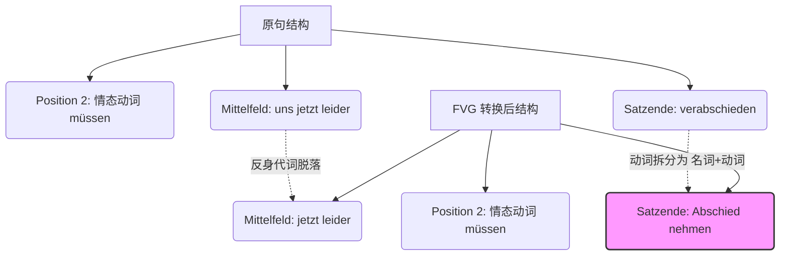

# 未命名 1

![[image-360.png|1024x665]]

你好！我是你的德语语法教师。很高兴能协助你解析这份关于功能动词结构（Funktionsverbgefüge, 简称 FVG）的练习。

这是一种在德语 B 1-B 2 及更高阶考试（如歌德学院考试、德福 TestDaF、DSH）中极为常见且重要的表达方式。它不仅能让你的德语听起来更正式、更地道，也是书面表达的得分利器。

由于你提供了完整的练习图片 `image_2c0efe.jpg` 且未指定具体错题，我将秉持“纠一错，通一类”的原则，为你全面解析这两部分的每一道题，帮你彻底打通这个语法难关！

### 1、逐题精析与纠正

**【题目类型】**：句型转换 —— 将普通动词转化为“功能动词结构（Funktionsverbgefüge）”。

**【核心要求】**：使用括号中的功能动词结构改写句子，并严格注意各部分在句中的位置（尤其是框形结构 Satzklammer）。

#### 第一部分：IM ALLTAG (日常生活中)

**[题号 1]**（例题）

- **原句**：Mein Zug geht in einer Stunde. Wir müssen **uns** jetzt leider **verabschieden**. (Abschied nehmen)
- **翻译**：我的火车一小时后开。很遗憾我们现在必须告别了。
- **正确转换**：Wir müssen jetzt leider **Abschied nehmen**.
- **解析**：
    - **语法点 (B 1)**：代词式动词 `sich verabschieden` 转化为 FVG `Abschied nehmen`。
    - **关键变化**：原动词是反身动词，带有反身代词 `uns`。转换为 FVG 后，`Abschied` 作为名词承担了宾语的成分，因此**反身代词 `uns` 必须去掉**。情态动词 `müssen` 占据第二位，`Abschied nehmen` 作为整体放在句末构成框形结构。

**[题号 2]**

- **原句**：Bitte **setzen Sie sich**. (Platz nehmen)
- **翻译**：请坐。
- **正确转换**：Bitte **nehmen Sie Platz**.
- **解析**：
    - **语法点 (A 1/B 1)**：祈使句式 (Imperativ) 与 FVG 的结合。
    - **关键变化**：同样地，反身动词 `sich setzen` 转换为 `Platz nehmen`，反身代词 `sich` 消失。由于是尊称的祈使句，动词 `nehmen` 位于句首（或 `Bitte` 之后），名词 `Platz` 放在句末。

**[题号 3]**

- **原句**：Die Lehrer **unterrichten** jede Woche mehr als 20 Stunden. (Unterricht geben)
- **翻译**：老师们每周授课超过 20 小时。
- **正确转换**：Die Lehrer **geben** jede Woche mehr als 20 Stunden **Unterricht**.
- **解析**：
    - **语法点 (A 2/B 1)**：时间状语的位置 (TeKaMoLo 原则)。
    - **关键变化**：普通动词 `unterrichten` 拆分为 `Unterricht geben`。`geben` 变位占据第二位，名词 `Unterricht` 作为功能结构的固定搭配，必须被推到句子的**绝对末尾**。

**[题号 4]**

- **原句**：Sollen wir **uns** für nächste Woche **verabreden**? (eine Verabredung treffen)
- **翻译**：我们要不要约为下周（见面）？
- **正确转换**：Sollen wir für nächste Woche **eine Verabredung treffen**?
- **解析**：
    - **语法点 (A 2/B 1)**：疑问句的框形结构及反身代词的脱落。
    - **关键变化**：`sich verabreden` 中的 `uns` 必须删掉。`eine Verabredung treffen` 作为一个整体动词词组，位于句末。

**[题号 5]**

- **原句**：Ich habe bei der Behörde gefragt. Aber sie haben noch **nicht geantwortet**. (Antwort geben)
- **翻译**：我在政府部门问过了。但他们还没有回答。
- **正确转换**：Aber sie haben noch **keine Antwort gegeben**.
- **解析**：
    - **语法点 (A 1/B 1)**：**极易错点！** 否定词 `nicht` 向 `kein` 的转化。
    - **关键变化**：原句否定的是动词 `antworten`，用 `nicht`。转化为 FVG 后，核心变成了名词 `Antwort`（零冠词名词）。在德语中，否定不带冠词的名词必须使用 `kein-`。因此 `nicht geantwortet` 必须变成 `keine Antwort gegeben`。

**[题号 6]**

- **原句**：Ich möchte für das nächste Wochenende **etwas vorschlagen**. (einen Vorschlag machen)
- **翻译**：我想为下个周末提些建议。
- **正确转换**：Ich möchte für das nächste Wochenende **einen Vorschlag machen**.
- **解析**：
    - **语法点 (A 2/B 1)**：不定代词 `etwas` 的替换。
    - **关键变化**：`etwas vorschlagen` (提议某事) 中的 `etwas` 被具体的名词宾语 `einen Vorschlag` 取代。

**[题号 7]**

- **原句**：Das Wetter ist bei unseren Plänen natürlich auch **wichtig**. (eine Rolle spielen)
- **翻译**：天气对我们的计划当然也很重要。
- **正确转换**：Das Wetter **spielt** bei unseren Plänen natürlich auch **eine Rolle**.
- **解析**：
    - **语法点 (B 1)**：形容词表语 `wichtig sein` 转换为 FVG。
    - **关键变化**：这是一个语义转换。`wichtig sein` = `eine (wichtige) Rolle spielen`（扮演重要角色/起作用）。动词 `spielt` 在第二位，`eine Rolle` 在句末。

#### 第二部分：练习 (拓展练习)

**[题号 1]**

- **原句**：Wir müssen in dieser Angelegenheit bald **entscheiden**. (eine Entscheidung treffen)
- **正确转换**：Wir müssen in dieser Angelegenheit bald **eine Entscheidung treffen**.
- **解析**：情态动词 `müssen` 占第二位，FVG 原形 `eine Entscheidung treffen` 置于句末。

**[题号 2]**

- **原句**：Wir müssen unbedingt das Thema Arbeitszeit **ansprechen**. (zur Sprache bringen)
- **正确转换**：Wir müssen unbedingt das Thema Arbeitszeit **zur Sprache bringen**.
- **解析**：介词短语类的 FVG。`etwas(Akk.) zur Sprache bringen` (将某事纳入讨论/提及某事)。`das Thema Arbeitszeit` 是宾语，`zur Sprache bringen` 整体置于句末。

**[题号 3]**

- **原句**：Die Arbeitnehmer wollen **streiken**. (in Streik treten)
- **正确转换**：Die Arbeitnehmer wollen **in Streik treten**.
- **解析**：`streiken` (罢工) 转化为 `in Streik treten` (进入罢工状态)。

**[题号 4]**

- **原句**：Arbeitnehmer und Arbeitgeber wollen am nächsten Wochenende **weiterverhandeln**. (weitere Verhandlungen führen)
- **正确转换**：Arbeitnehmer und Arbeitgeber wollen am nächsten Wochenende **weitere Verhandlungen führen**.
- **解析**：前缀 `weiter-` (继续) 变为了形容词 `weit-` 的比较级 `weitere` 作为名词 `Verhandlungen` 的定语。

**[题号 5]**

- **原句**：Die Arbeitgeber müssen **ihre Meinung** dazu **sagen**. (Stellung nehmen)
- **正确转换**：Die Arbeitgeber müssen dazu **Stellung nehmen**.
- **解析**：**易错点！** `ihre Meinung sagen` (表达观点) 在语义上完全等同于 `Stellung nehmen` (表态)。因此 `ihre Meinung` 这个词组需要完全被替换掉，不能保留。

**[题号 6]**

- **原句**：Beide Seiten müssen zu einem Ergebnis **beitragen**. (einen Beitrag leisten)
- **正确转换**：Beide Seiten müssen zu einem Ergebnis **einen Beitrag leisten**.
- **解析**：`zu etwas(Dat.) beitragen` = `zu etwas(Dat.) einen Beitrag leisten`。介词宾语 `zu einem Ergebnis` 保留。

### 2、深度教学解析（聚焦：功能动词结构 FVG）

功能动词结构（Funktionsverbgefüge）是德语中一种特殊的“动名词搭配”。在这个结构中，**动词失去了原本的实质意义（降级为提供时态和人称的工具人），而名词接管了整个词组的核心意义。**

为了让你直观理解句子成分的位置变化，我们用可视化的框形结构来看看：

代码段

**核心规则：**

1. **位置（Satzklammer 框形结构）**：在陈述句中，功能动词发生变位并在第 2 位，而对应的名词（如 _Abschied, Platz, Antwort_）就像可分动词的前缀一样，必须**牢牢钉在句子的最后**。如果有情态动词，则“名词+动词原形”一起在最后。
2. **反身代词的脱落**：当原动词是反身动词（如 _sich verabschieden, sich verabreden_），转为 FVG 后，由于 FVG 中的名词充当了宾语的角色，原来的反身代词（_mich, dich, sich..._）通常要删除。
3. **否定的转化（A 1 级别的幽灵）**：否定单个动词用 `nicht`；但如果转为 FVG 后，名词没有冠词（或用不定冠词），否定必须变成 `kein-`。

**正反对比例证：**

- **本例（正确）**：Sie haben noch **keine Antwort gegeben**. (用 kein 否定名词 Antwort)
- **反例（错误）**：Sie haben noch **nicht** Antwort gegeben. (母语负迁移：中文里“没有回答”，学生容易直接用 nicht 去否定，忽视了 Antwort 是个名词)。
- **拓展例（介词类 FVG）**：Das Thema _wird_ morgen **zur Sprache gebracht**. (被动语态中，FVG 也是完美的搭配组合，显得非常专业)。

**💡 防错要点（请默念三遍）：**

> **“换 FVG 找名词，有反身要扔掉；否定动词用 nicht，否定名词用 kein；名词动词一家亲，死死锁在句子底！”**

**小试牛刀（即时巩固）：**

请用 FVG `die Flucht ergreifen` (逃跑) 改写下面这句话：

- _Der Dieb floh sofort._ (小偷立刻逃跑了。 - 提示：注意时态保持过去时 Präteritum)
$1

    _(答案在脑海中想一下：Der Dieb ergriff sofort die Flucht.)_

### 3、总结与回顾

从这套练习可以看出，考察的核心不仅是“背诵搭配”，更是考察你对**德语句法结构（语序、否定词的灵活切换、代词的增删）的综合掌控力**。

**您的终极学习建议：**

> **在后续的学习中，请不要孤立地背诵 FVG 词汇（不要只背 Antwort geben），而是要背诵带有介词和格的“全家福”句子（如：_jemandem(Dat.) auf eine Frage(Akk.) keine Antwort geben_），并在每次写作时，刻意用一到两个 FVG 替换掉普通的动词，你的德语水平将产生质的飞跃！**
