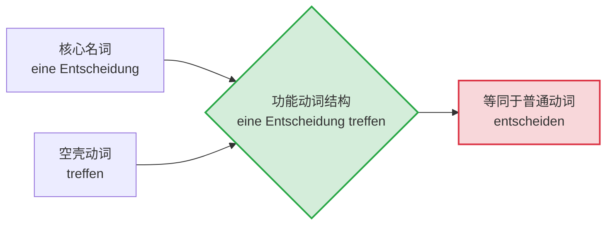
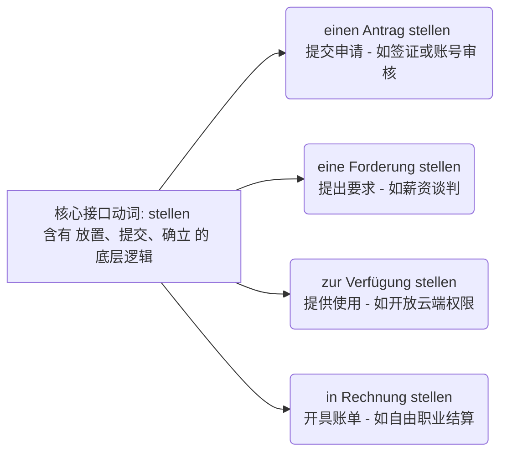
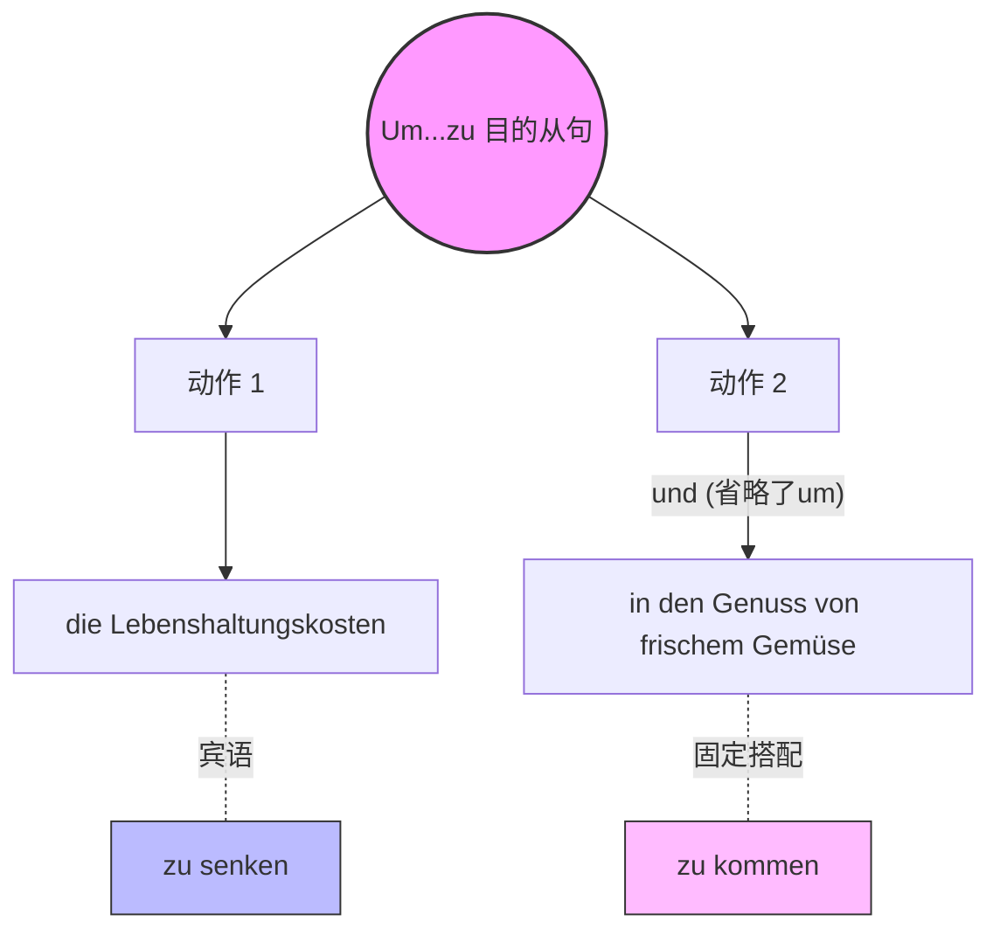

# 功能动词结构 或 动名词搭配

### 今日核心语法点：功能动词结构 (Funktionsverbgefüge)

#### 1. 什么是功能动词结构？

这里我们打个比方：功能动词结构就像是“穿上正装的动词”。

在日常口语中，我们穿 T 恤（普通动词），比如用 _beantragen_（申请）。但在面对德国政府机关或正式职场时，我们需要穿上西装打好领带，这时就会把一个词拆解成“一个名词 + 一个空壳动词”，变成 _einen Antrag stellen_（提出申请）。

在这个结构里，**名词是真正的“老板”（携带核心意义），而动词变成了失去灵魂的“司机”（只提供时态和人称变化，失去原意）**。

为了更直观地理解它的构成，请看下方的图解：

代码段

#### 2. 常见的功能动词搭配形式

在德国的移民生活中，您会经常在公函或合同中看到它们。它们主要有以下两种构成方式：

- **第四格名词 + 动词 (Akkusativ + Verb):**
    - _einen Antrag stellen_ (提出申请 = beantragen)
    - _eine Entscheidung treffen_ (做出决定 = entscheiden)
    - _Hilfe leisten_ (提供帮助 = helfen)
- **介词 + 名词 + 动词 (Präposition + Nomen + Verb):**
    - _in Kauf nehmen_ (接受/容忍不利条件 = akzeptieren)
    - _zur Verfügung stehen_ (可供使用 = verfügbar sein)

#### 3. 动态与静态的视角转换

同一个名词搭配不同的“空壳动词”，可以精准表达事件是**主动造成**、**正在发生**还是**处于某种状态**。这在描述医疗紧急情况或职场冲突时非常有用。

|**意义视角**|**常用功能动词**|**移民生活例句与场景**|
|---|---|---|
|**表达主动** (使...发生)|versetzen, bringen, stellen|**职场:** Der Chef **versetzt** mich **in Aufregung**. (老板让我很紧张/激动。)|
|**表达被动过程** (变得...)|geraten, kommen|**医疗:** Bitte **geraten** Sie nicht **in Panik**. (请您不要陷入恐慌。)|
|**表达被动状态** (处于...)|sein, sich befinden|**行政:** Mein Visum **befindet sich in Bearbeitung**. (我的签证正在处理状态中。)|

#### 4. 否定的黄金法则

在使用 FVG 时，很多同学会用错否定词。记住以下规则：

- **带介词的结构：** 必须用 **nicht**，且放在介词前面。
    - ✅ _etwas **nicht** in Auftrag geben_ (不委托某事)
    - ❌ _etwas in keinen Auftrag geben_ (错误用法)
- **不带介词的结构：** 如果名词前没有冠词，推荐用 **nicht**；如果有不定冠词，按常规用 **kein**。
    - ✅ _Wir leisten **keinen** Beitrag._ (我们不作贡献。)
    - ✅ _Er übt **nicht** Kritik._ 或 _Er übt **keine** Kritik._ (他不提出批评。)

# 这么多单词我们怎么来记忆啊，不可能难道又要被那么多组合吗那这样背下去无穷无尽呢？

### 🧠 核心思维转换：把 FVG 当作“API 标准库”

不要把 FVG 当成无数个零散单词的随机拼接。想象一下您在构建一个软件架构或者调用系统接口：您不需要每次都从零开始写底层的二进制代码（单独背单词），而是直接调用**标准库（Standard Libraries）**或**预封装的模块（Pre-packaged Modules）**。

在德语中，高频出现的“功能动词”其实非常少，核心的满打满算也就十几个（比如 _stellen, bringen, treffen, ziehen, kommen_）。您可以把这十几个动词看作是 HTTP 请求里的 `GET`, `POST`, `PUT`, `DELETE` 等标准方法。虽然您要处理的名词（Payload 数据）成百上千，但能用来搭载它们的“接口动词”是高度固定的。

我们可以用 The Mermaid Guide to Text-Based Diagramming and Visualization 中的语法，为您画一张图表，看看以 **stellen** 这个“接口”为例，它是如何高效挂载不同名词的：

代码段

您看，您不需要背四个完全独立的新短语，您只需要记住：**当涉及到“把某样东西正式摆在台面上（提交/提供）”时，德语系统调用的接口就是 `stellen`。** 掌握了这个规律，记忆量瞬间减少了 80%！

### 🛠️ 破解组合记忆的两大心法

为了在六个月内高效通关 B 2，我们绝对不能用穷举法去背，我们要用“打包法”。

#### 心法一：按“接口动词”打包（同构不同义）

我们拿 **bringen (带来 / 使...进入某种状态)** 这个动词接口来举例。只要是想表达“推动某事发生”，就挂载到 `bringen` 上：

- **in Erfahrung bringen** (获取经验 -> 查明 / 了解)
    - _职场场景：_ Ich muss **in Erfahrung bringen**, warum die API-Schnittstelle blockiert ist. (我必须查明为什么 API 接口被拉黑了。)
- **zum Ausdruck bringen** (带向表达 -> 表达 / 说明)
    - _行政场景：_ In meinem Motivationsschreiben möchte ich mein großes Interesse **zum Ausdruck bringen**. (在我的动机信中，我想表达我极大的兴趣。)
- **in Ordnung bringen** (带向秩序 -> 整理好 / 修复)
    - _生活场景：_ Der Hausmeister muss die Heizung wieder **in Ordnung bringen**. (房屋管理员必须把暖气修好。)

#### 心法二：按名词的“生命周期”打包（同义不同构）

有的名词像是一个项目，它有不同的生命周期（开启、运行、结束）。我们要看同一个名词，搭配不同的功能动词时，如何表达状态的切换：

以 **Verfügung (支配 / 使用)** 为例，这是一项资源（比如服务器算力或您的个人时间）：

1. **zur Verfügung stehen** (站在可供使用的状态 = **可供使用 / 待命**)
    
    - _例句：_ Die neuen Server **stehen** uns ab sofort **zur Verfügung**. (新服务器即日起可供我们使用。—— 状态：资源已就绪)
        
2. **zur Verfügung stellen** (放置入可供使用的状态 = **提供 / 赋予**)
    
    - _例句：_ Der IT-Support **stellt** mir einen neuen Zugang **zur Verfügung**. (IT 支持为我提供了一个新账号。—— 动作：给予资源)

您看，`stehen` 表示一种静止的“状态”，而 `stellen` 表示一种施加的“动作”。理解了这层底层逻辑，您就不再是死记硬背，而是像工程师一样在**拼装语言模块**。

### 🎯 您的实战演练任务

记住这些高频“模块”的最佳方式，就是在您熟悉的场景中立刻调用它们。

现在，假设您正在给一位客户或者项目经理写邮件。您想表达“如果您还有疑问，我随时可以解答/帮忙（我随时可供您差遣）”。

请您尝试调用我们刚才讲过的 **zur Verfügung stehen** 这个模块，用德语把这句话“拼装”出来好吗？（提示：如果有疑问 = _Wenn Sie noch Fragen haben,..._）大胆写，写错了我来帮您 Debug！

# 解答分析 1

> [!faq]
> Um die Lebenshaltungskosten zu senken und in den Genuss von frischem Gemüse zu kommen...
> 
> （为了降低生活成本并享受新鲜的蔬菜……）

# 功能动词结构 或 动名词搭配（Funktionsverbgefüge，简称 FVG）

_(注：原句末尾的 essen 是多余的，正确的固定搭配中只用 kommen。)_

现在，我们将这个现象掰开揉碎，分三步为你彻底讲透。

### 一、 消失的 "um"：并列结构的共享机制

首先，这整个句子是一个表示目的的 `um... zu...`（为了……）结构。

当 `und`（和、并）连接两个目的时，德国人为了追求语言的高效，会把第二个 `um` 省略掉。

- **完整版：** **Um** die Lebenshaltungskosten zu senken **und** _(um)_ in den Genuss von frischem Gemüse zu kommen.
- 前一半是标准的“宾语 + zu + 动词”：_die Lebenshaltungskosten (Akk.宾语) zu senken (动词)_。
- 后一半由于没有直接的宾语，直接接了介词短语 `in den Genuss...`。

### 二、 为什么没有宾语，而且以 "in" 开头？

这就引出了我们今天的主角：**功能动词结构 (FVG)**。

**💡 大师类比时间：**

> 我们可以把德语的常规动词（比如 _genießen_ 享受）看作是“单点菜”。
> 
> 而功能动词结构（比如 _in den Genuss kommen_）则是高级餐厅里的**“固定套餐”**。
> 
> 在“固定套餐”里，动词（_kommen_）已经被抽空了原本“走过来”的意思，沦为了一个端盘子的服务员；真正的主菜是前面的名词短语（_in den Genuss_）。

我们对比一下两种表达方式：

1. **普通版（B 1 级别）：** ... um frisches Gemüse zu **genießen**. (为了享受新鲜蔬菜。)
    
    - _frisches Gemüse_ 是直接的第四格（Akk.）宾语，_genießen_ 是及物动词。
        
2. **装 X/正式版（B 2 级别）：** ... um **in den Genuss** von frischem Gemüse zu **kommen**. (为了==进入==一种享受新鲜蔬菜的状态。)
    
    - 这里使用了固定套餐：**in den Genuss kommen**。

**深度解析这套“组合拳”的内部构造：**

- **kommen** 是一个不及物动词，它本身不能加第四格宾语（你不能说 kommen etwas）。
- 它必须带上方向性的介词：**in + Akkusativ（第四格）**，所以是 _in den Genuss_（进入享受的状态）。这就是为什么后半句直接以 `in` 开头。
- 那么“享受”的对象是谁呢？既然不能做动词的宾语，就只能作为名词的“定语”挂在后面。德语用介词短语 **von + Dativ（第三格）** 来引出对象，即 _von frischem Gemüse_（新鲜蔬菜的享受）。

### 三、 移民生活中的高频“固定套餐” (FVG)

想要在六个月内达到 B 2 并在德国顺畅生活，你必须掌握这些能让你听起来像个“文化人”的 FVG。在租房、找工作和行政事务中，这些表达无处不在：

| **普通动词 (B 1)**            | **功能动词结构 FVG (B 2-C 1)**        | **移民生活实战场景**                                                                              |
| ------------------------- | ------------------------------- | ----------------------------------------------------------------------------------------- |
| **beantragen** (申请)       | **einen Antrag stellen** (提出申请) | **行政：** Ich möchte **einen Antrag** auf Niederlassungserlaubnis **stellen**. (我想申请永久居留卡。) |
| **verfügbar sein** (可提供的) | **zur Verfügung stehen** (供使用)  | **职场：** Ich **stehe** Ihnen ab dem 1. Juni **zur Verfügung**. (我从 6 月 1 日起可入职工作。)         |
| **fragen** (问)            | **eine Frage stellen** (提个问题)   | **医疗：** Darf ich dem Arzt noch **eine Frage stellen**? (我可以再问医生一个问题吗？)                    |
| **geeignet sein** (合适的)   | **in Frage kommen** (被纳入考虑范围)   | **租房：** Diese teure Wohnung **kommt** für mich nicht **in Frage**. (这套昂贵的公寓不在我的考虑范围内。)    |
|                           |                                 |                                                                                           |

### 🎓 大师的课后实战挑战

掌握语法的最佳途径就是亲自驾驭它。现在，轮到你来造句了。

**情景：** 假设你在写一封求职信（B 2 考试经典题目）。

**任务：** 请使用今天提到的目的从句结构（**um ... zu**）以及词组 **einen Antrag stellen**（提出申请），把下面这句话翻译成德语：

_“我写这封邮件，**是为了**对这个职位**提出申请**。”_

_(提示：写邮件 = Ich schreibe diese E-Mail, 职位 = die Stelle, 介词用 auf + Akk)_

请将你造的句子写出来，大师会为你进行一对一的批改和润色！
