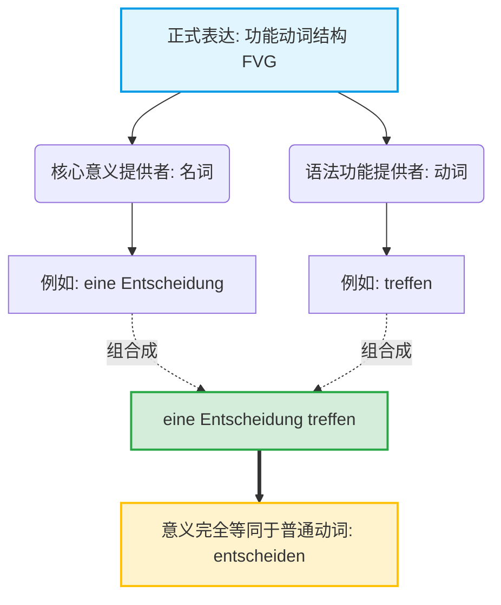
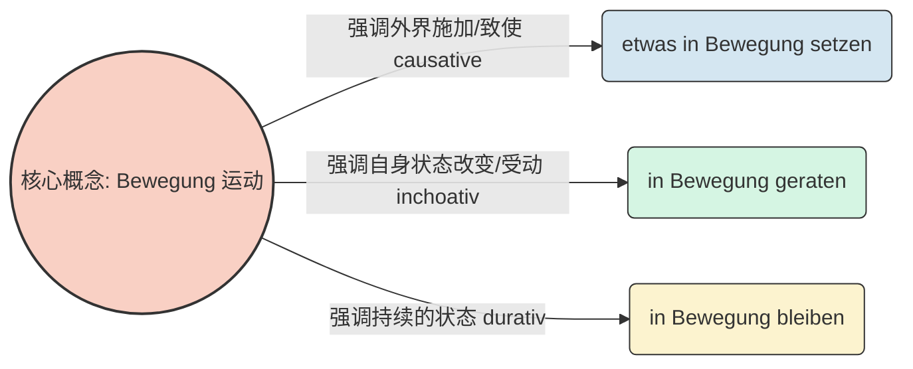
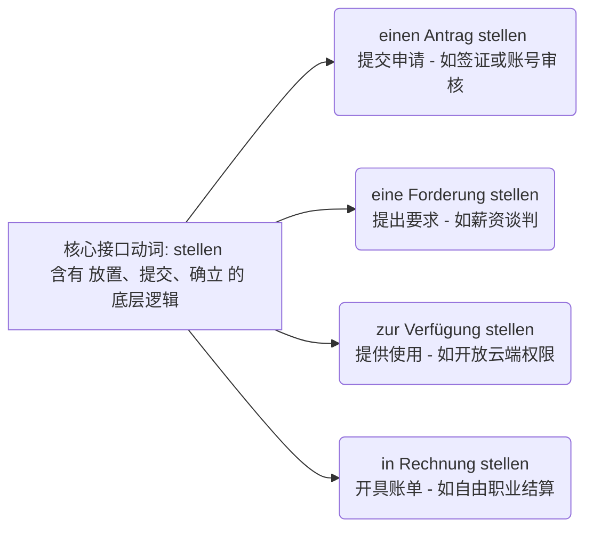
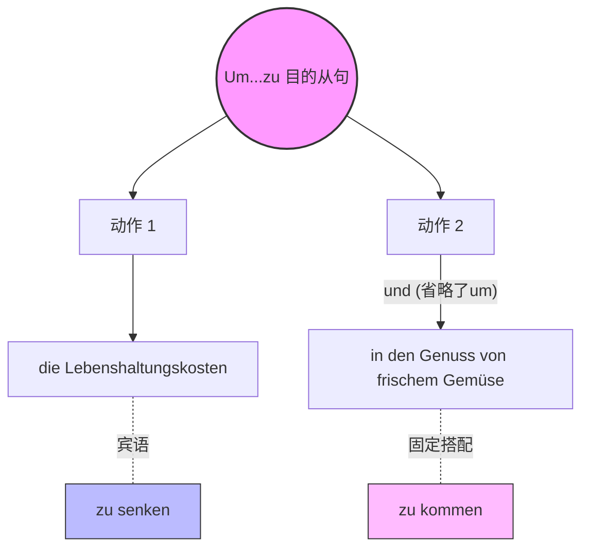

# 功能动词结构 或 动名词搭配

![[image-346.png|984]]

[[语言学习/德语/公共知识语法/动词.md#^TK2M5mi7tPcirTn9lL0ZF|100%]]

### 第一部分：揭开功能动词的真面目

#### 1. 什么是“功能动词结构”？

在德语的日常口语中，我们用一个动词就能表达动作，比如 _entscheiden_（决定）。但在德国严谨的正式文本（如报刊文章、科技论文、管理文书，以及您经常要面对的外管局信件、租房合同）中，德国人喜欢把这个动作“拆”开，穿上正装，变成：**eine Entscheidung treffen**。

**类比讲解：傀儡政权**

功能动词结构就像是一个“傀儡政权”。

- **主要表达意义的名词（如 eine Entscheidung）**：是幕后掌权的“真皇帝”，整个词组的意思由它决定。
- **丧失自身意义的动词（如 treffen）**：是台面上的“傀儡宰相”。_treffen_ 本意是“遇见/击中”，但在这里完全失去了原意，它的唯一功能（这就是“功能动词”名称的由来）就是**为了名词而存在**，负责提供时态和人称变化。

为了让您更直观地理解它的层级关系，我参考了文件 "The Mermaid Guide to Text-Based Diagramming and Visualization_2" 中的文本图表逻辑，为您生成了下面这张句法结构图：

- **eine Entscheidung treffen (做出决定)**
    - _例句 1 (行政):_ Die Ausländerbehörde muss nächste Woche **eine Entscheidung** über mein Visum **treffen**. (外管局必须在下周对我的签证做出决定。)
    - _例句 2 (医疗):_ Der Arzt und der Patient haben gemeinsam **eine Entscheidung** über die Therapie **getroffen**. (医生和病人共同对治疗方案做出了决定。)

#### 2. 它在句子中怎么排兵布阵？（框形结构）

在含有情态动词或助动词的句子里，名词部分和动词部分会分开，形成德语经典的“框形结构”。功能动词通常会被踢到句子的最后面。

- **in Kauf nehmen (接受/容忍不利条件)**
    - _例句 1 (职场):_ Für diesen gut bezahlten Job muss ich lange Arbeitszeiten **in Kauf nehmen**. (为了这份高薪工作，我必须接受较长的工作时间。)
    - _例句 2 (租房):_ Als Einwanderer wollen wir die hohe Miete im Stadtzentrum nicht **in Kauf nehmen**. (作为新移民，我们不愿意承受市中心高昂的租金。)

### 功能动词结构的主要构成

教材中总结了功能动词结构的三种常见构成方式，我们逐一击破，并结合生活场景进行造句：

#### 类别一：介词 + 名词 + 动词

- **zur Kenntnis nehmen (知晓 / 注意到)**
    - _例句 1 (租房):_ Bitte **nehmen** Sie **zur Kenntnis**, dass die Miete ab nächstem Monat steigt. (请您知晓，下个月起租金将会上涨。)
    - _例句 2 (职场):_ Der Chef hat meine Beschwerde über die Überstunden **zur Kenntnis genommen**. (老板已经注意到了我对加班的投诉。)

#### 类别二：第四格名词 + 动词 (最常见)

- **Kritik üben (提出批评)**
    - _例句 1 (租房):_ Die Mieter **üben** scharfe **Kritik** an der Hausverwaltung. (租客们对房屋管理处提出了严厉的批评。)
    - _例句 2 (职场):_ Im Teammeeting darf jeder konstruktive **Kritik üben**. (在团队会议中，每个人都可以提出建设性的批评。)
- **einen Antrag stellen (提出申请)**
    - _例句 1 (行政):_ Ich möchte bei der Behörde **einen Antrag** auf Niederlassungserlaubnis **stellen**. (我想向政府机关提出永久居留许可的申请。)
    - _例句 2 (行政):_ Haben Sie schon **den Antrag** auf Kindergeld **gestellt**? (您已经提出儿童金的申请了吗？)
- **den Vorzug geben (偏爱 / 优先考虑)**
    - _例句 1 (租房):_ Bei der Wohnungssuche **geben** Vermieter oft Paaren ohne Haustiere **den Vorzug**. (在找房时，房东通常会优先考虑没有宠物的伴侣。)
    - _例句 2 (求职):_ Die Firma **gibt** Bewerbern mit guten Deutschkenntnissen **den Vorzug**. (这家公司优先考虑德语水平好的求职者。)

#### 类别三：第二格/第三格 + 动词 (高阶罕见款)

- **sich einer Untersuchung (第三格) unterziehen (接受检查)**
    - _例句 1 (医疗):_ Vor der Operation muss sich der Patient **einer** gründlichen **Untersuchung unterziehen**. (手术前，病人必须接受彻底的检查。)
    - _例句 2 (职场):_ Neue Mitarbeiter müssen sich oft **einer** betriebsärztlichen **Untersuchung unterziehen**. (新员工通常必须接受企业医生的体检。)
- **der Klärung (第二格) bedürfen (需要澄清)**
    - _例句 1 (租房):_ Einige komplizierte Klauseln im Mietvertrag **bedürfen der Klärung**. (租房合同中一些复杂的条款需要澄清。)
    - _例句 2 (行政):_ Ihr Aufenthaltsstatus **bedarf** noch **der** genauen **Klärung**. (您的居留身份还需要进一步的准确澄清。)
- **sich seiner Taten (第二格) rühmen (吹嘘自己的行为)**
    - _例句 1 (职场):_ Der arrogante Kollege **rühmt sich** immer **seiner Taten** im Büro. (那个傲慢的同事总是吹嘘自己在办公室里的功绩。)
    - _例句 2 (日常):_ Er **rühmte sich seiner** Erfolge bei der Wohnungssuche. (他吹嘘自己找房子时的成功经历。)

### 狗顶用法

在使用功能动词时，很多同学会把 _nicht_ 和 _kein_ 搞混。请牢记以下三条“铁律”：

#### 1. 含介词的结构：必须用 nicht！且放在介词前。

- **etwas in Auftrag geben (委托某事 / 下订单)**
    - _肯定:_ Wir haben die Übersetzung unserer Zeugnisse **in Auftrag gegeben**. (我们已经委托了证件的翻译。)
    - _否定例句 1 (租房):_ Der Vermieter hat die Reparatur der Heizung **nicht in Auftrag gegeben**. (房东没有委托人修理暖气。)
    - _否定例句 2 (职场):_ Das Unternehmen hat das neue Projekt noch **nicht in Auftrag gegeben**. (公司还没有把新项目委托出去。)

#### 2. 不含介词的结构：适用一般否定规则 (有不定冠词/无冠词)。

- **einen Beitrag leisten (做出贡献)**
    - _否定例句 1 (职场):_ Er arbeitet sehr faul und **leistet keinen Beitrag** zum Teamprojekt. (他工作很懒散，对团队项目没有做出任何贡献。)
    - _否定例句 2 (社会):_ Ohne Steuern **leisten** wir **keinen Beitrag** zur Gesellschaft. (不交税的话，我们就没有对社会做出贡献。)
- **seinen Abschied nehmen (告辞 / 辞职)**
    - _否定例句 1 (职场):_ Der Abteilungsleiter wollte **nicht seinen Abschied nehmen**, sondern weiterarbeiten. (部门经理不想辞职，而是想继续工作。)
    - _否定例句 2 (日常):_ Sie hat nach der Party **nicht ihren Abschied genommen**, sondern ist heimlich gegangen. (聚会结束后她没有道别，而是偷偷溜走了。)

#### 3. 单数名词前无冠词（零冠词）：首推 nicht。

正如我们在前面讲过的 _Kritik üben_：

- _否定例句 1 (职场):_ Der Vorgesetzte **übt nicht Kritik** an meiner Leistung. (上司没有批评我的表现。)_注：此处强烈推荐用 nicht。_
- _否定例句 2 (医疗):_ Der Patient **übt nicht Kritik** an dem Krankenhaus. (病人没有对医院提出批评。)

### 动态与静态的自由切换 (第 79 页)

这是这套知识点中最精彩、最能体现德语严谨性的一部分。同一个名词（例如 Aufregung 激动/慌乱），换一个傀儡动词，就能精准表达出“谁导致了它”、“过程是怎样的”以及“最后的状态是什么”。

#### 视角 1：表主动（使...发生）

常用动词：_versetzen, bringen, stellen, setzen, ziehen, schenken, treten_

- **in Aufregung versetzen (使...激动/慌张)**
    - _例句 1 (行政):_ Der drohende Brief von der Ausländerbehörde **versetzte** unsere ganze Familie **in Aufregung**. (外管局带有威胁语气的信件让我们全家陷入了慌乱。)
    - _例句 2 (租房):_ Die fristlose Kündigung der Wohnung **versetzt** den Mieter **in** große **Aufregung**. (无期限解约公寓让租客变得非常激动。)

#### 视角 2：表被动/过程（进入...状态）

常用动词：_geraten, kommen, finden, gelangen_

**⚠️ 大师敲黑板：geraten 这个词通常包含“与愿望相反”的意思，即失去控制。**

- **in Aufregung geraten (变得激动起来 / 陷入慌张)**
    - _例句 1 (医疗):_ Der Patient **geriet in Aufregung**, als er die schlechte Diagnose hörte. (当听到糟糕的诊断结果时，病人陷入了慌乱。)
    - _例句 2 (职场):_ Bitte **geraten** Sie während des Vorstellungsgesprächs nicht **in Aufregung**. (请您在面试期间不要陷入紧张。)

#### 视角 3：表被动/状态（处于...状态）

常用动词：_sein, sich befinden, genießen, stehen, bekommen, erhalten, erfahren_

- **in Aufregung sein (正处于激动/紧张之中)**
    - _例句 1 (考试):_ Am Tag der B 2-Prüfung **war** ich extrem **in Aufregung**. (在 B 2 考试那天，我处于极度紧张的状态。)
    - _例句 2 (日常):_ Die Kinder **sind** vor dem Flug nach Deutschland sehr **in Aufregung**. (孩子们在飞往德国之前非常激动。)

### 第五部分：功能动词与独立动词的“爱恨情仇”

最后，书上列举了功能动词与它们对应的普通动词之间的六种复杂关系。搞懂这些，您在做 B 2 阅读和写作的词汇替换时就能游刃有余！

#### 1. 意思完全对应 (可直接替换)

- **eine Entscheidung treffen** ＝ **entscheiden**
    - _(已在第一部分给出典型的 FVG 例句，此处补充普通动词对比)_
    - _对比 1 (行政):_ Die Behörde muss heute **entscheiden**. (政府机关今天必须决定。)
    - _对比 2 (医疗):_ Der Chefarzt hat über die Operation **entschieden**. (主治医生对该手术做出了决定。)

#### 2. 同根但不同义（极易踩坑！）

- **eine Absage erteilen (正式拒绝某人的请求)**
    - _例句 1 (求职):_ Die Firma hat dem Bewerber leider **eine Absage erteilt**. (很遗憾，公司拒绝了这位求职者。)
    - _例句 2 (租房):_ Der Vermieter **erteilte** uns **eine Absage** für die Vierzimmerwohnung. (房东拒绝了我们将四居室租给我们的请求。)
- **absagen (取消一件事/约会)**
    - _例句 1 (医疗):_ Ich bin krank und muss den Arzttermin leider **absagen**. (我生病了，很遗憾必须取消看诊预约。)
    - _例句 2 (职场):_ Der Chef hat das Meeting kurzfristig **abgesagt**. (老板临时取消了会议。)

#### 3. 意思相同，但语境不同（正式 vs 日常）

- **Hilfe leisten (提供救助/援助 - 极其正式，常用于法律、医疗急救)**
    - _例句 1 (医疗/法律):_ Bei einem Autounfall muss jeder Zeuge Erste **Hilfe leisten**. (在车祸中，每位目击者都必须提供急救援助。)
    - _例句 2 (社会):_ Der Staat **leistet** den Flüchtlingen finanzielle **Hilfe**. (国家向难民提供财政援助。)
- **helfen (帮忙 - 日常口语)**
    - _例句 1 (租房):_ Kannst du mir bitte am Wochenende beim Umzug **helfen**? (你周末能帮我搬家吗？)
    - _例句 2 (医疗):_ Diese Tabletten **helfen** sehr gut gegen Kopfschmerzen. (这些药片对治疗头痛非常有帮助。)

#### 4. 动词不同，意义发生变化（对应动态与静态，见第四部分）

这里普通动词和功能动词视角完全对应：

- **in Aufregung versetzen** (主动) ＝ **aufregen**
    - _例句 1:_ Der Lärm der Nachbarn **regt** mich **auf**. (邻居的噪音让我很烦躁。)
    - _例句 2:_ Diese Bürokratie in Deutschland **regt** jeden **auf**. (德国的官僚主义让每个人都抓狂。)
- **in Aufregung geraten** (被动/过程) = **sich aufregen**
    - _例句 1:_ Ich **rege mich** über den schlechten Service **auf**. (我对糟糕的服务感到生气/激动。)
    - _例句 2:_ **Regen** Sie **sich** nicht über die Steuererklärung **auf**! (不要因为报税单而心烦意乱！)
- **in Aufregung sein** (状态) = **aufgeregt sein**
    - _例句 1:_ Vor dem Termin beim Amt bin ich immer **aufgeregt**. (在去政府办事之前，我总是很紧张。)
    - _例句 2:_ Sie war sehr **aufgeregt**, als sie den Arbeitsvertrag unterschrieb. (当她签署工作合同时，她非常激动。)

#### 5. 意思相同，但语法结构不同

- **eine Frage stellen (加第三格: 提问)**
    - _例句 1 (职场):_ Darf ich **Ihnen** (Dat.) noch **eine Frage** zum Arbeitsvertrag **stellen**? (我能再问您一个关于工作合同的问题吗？)
    - _例句 2 (考试):_ Der Prüfer **stellte mir** (Dat.) **eine** sehr schwierige **Frage**. (考官问了我一个非常难的问题。)
- **fragen (加第四格: 问)**
    - _例句 1:_ Ich möchte **dich** (Akk.) etwas **fragen**. (我想问你点事。)
    - _例句 2:_ Der Tourist **fragte den** Polizisten (Akk.) nach dem Weg. (游客向警察问路。)
- **den Vorschlag machen (用逗号隔开，带出 zu 不定式从句)**
    - _例句 1 (租房):_ Der Makler **machte den Vorschlag,** die Kaution in drei Raten **zu zahlen**. (中介提出建议，分三期支付押金。)
    - _例句 2 (日常):_ Ich **mache den Vorschlag,** morgen gemeinsam zum Bürgeramt **zu gehen**. (我提议明天一起去市民局。)
- **vorschlagen (直接加第四格名词或带出 dass 从句)**
    - _例句 1:_ Er **schlägt einen** Kompromiss **vor**. (他提议达成一项妥协。)
    - _例句 2:_ Ich **schlage vor**, dass wir jetzt eine Pause machen. (我提议我们现在休息一下。)

#### 6. 独一无二（没有同义的独立动词）

这些是真正的职场与行政“高频神仙词”，因为没有普通的动词能完全替代它们，必须死记硬背！

- **in Kraft treten (法律、合同等生效)**
    - _例句 1 (行政):_ Das neue Fachkräfteeinwanderungsgesetz **tritt** am ersten Januar **in Kraft**. (新专业人才移民法将于一月一日生效。)
    - _例句 2 (租房):_ Der Mietvertrag **tritt** erst nach der Zahlung der Kaution **in Kraft**. (租房合同在支付押金后才正式生效。)
- **ein Geschäft abschließen (达成交易 / 签合同)**
    - _例句 1 (职场):_ Unsere Firma konnte gestern **ein** wichtiges **Geschäft** mit dem Kunden **abschließen**. (我们公司昨天成功地与客户达成了一笔重要交易。)
    - _例句 2 (日常):_ Wir haben **das Geschäft** mit dem Autohändler erfolgreich **abgeschlossen**. (我们与汽车经销商成功完成了交易。)
- **etwas zur Verfügung stellen (提供某物给某人使用)**
    - _例句 1 (职场):_ Der Arbeitgeber **stellt** mir einen Dienstwagen **zur Verfügung**. (雇主为我提供了一辆公司配车供我使用。)
    - _例句 2 (行政):_ Bitte **stellen** Sie der Ausländerbehörde alle erforderlichen Dokumente **zur Verfügung**. (请您将所有必要的文件提供给外管局。)
$1

呼~ 大师这回可是把压箱底的功夫全盘托出了！看到这么多例句，您对功能动词的理解是不是瞬间立体起来了？

为了检验您是否已经将这些知识融会贯通，并且能够应用在真实的移民生活中，大师给您布置一个挑战任务：

**在找工作面试或者和房东沟通时，遇到不利条件，您会如何用今天学到的 `in Kauf nehmen` (接受不利条件) 和 `zur Verfügung stehen` (可供使用 - 动词用 stehen 哦) 各造一个完整的句子？** 请大胆写出来，大师在线为您精批细改！

# 拓展功能动词更明确地意义

### 1、核心痛点解析（为什么必须要有 FVG？）

如果只用普通动词，德语的表达会非常“扁平”。普通动词通常只能描述一个**动作本身**，但如果我们想描述这个动作的**开始**、**持续**、**结束**，或者想要**极其精准地修饰**这个动作，甚至想要**优雅地回避被动语态**，普通动词就显得力不从心了。

FVG 存在的四大核心价值在于：

1. **动作的阶段化（Aktionsart）**：区分动作是“刚开始”、“正在进行”还是“受外力驱使”。
2. **优雅的被动替代（Passiv-Ersatz）**：让生硬的被动句变得柔和、官方。
3. **无限的扩写空间（Erweiterbarkeit）**：名词比动词更容易用多个形容词去修饰。
4. **视角的切换（Perspektivwechsel）**：明确区分“主动施加”和“被动承受”。

### 2、深度教学解析（聚焦：FVG 的多维语义与语用功能）

为了让你直观感受到这种差异，我们来看四个维度的全景对比：

#### 维度一：精准捕捉“动作的阶段”（动词的生命周期）

普通动词往往是一个笼统的状态或动作。而 FVG 像切蛋糕一样，把动作切分成了不同的时间段。

- **普通动词**：_streiken_ (罢工 - 笼统的动作)
    - Die Arbeiter streiken. (工人们在罢工。—— _只是陈述事实，不知道罢工多久了，也不知道什么时候开始的。_)
- **FVG 的魔法**：
    - 强调**动作的爆发/起点 (inchoativ)**：Die Arbeiter **treten in Streik**. (工人们**开始/进入**罢工状态。—— _非常有画面感，仿佛看到工人们刚刚放下工具走出工厂。_)
    - 强调**动作的终结 (resultativ)**：Der Streik **kommt zum Erliegen**. (罢工**趋于平息/停止**。—— _比直接用 enden 更具过程感。_)

#### 维度二：降维打击——用“名词化”实现疯狂扩写

这是德国人在学术和新闻写作中最爱用 FVG 的原因。在德语中，**用副词修饰动词很局限，但用形容词修饰名词却可以无限叠加**。

- **普通动词**：_kritisieren_ (批评)
    - Der Chef hat den Mitarbeiter **heftig, öffentlich und wiederholt** kritisiert. (老板激烈地、公开地、反复地批评了这名员工。—— _连用三个副词，显得极其笨重、口语化，像在吵架。_)
- **FVG 的魔法**：_Kritik üben an + Dat._
    - Der Chef hat **heftige, öffentliche und wiederholte Kritik** an dem Mitarbeiter **geübt**. (老板对这名员工提出了猛烈的、公开的且再三的批评。—— _副词变成了形容词定语，全部打包在名词 Kritik 前面，句子结构依然稳如泰山，显得极其专业、严谨且掷地有声。_)

#### 维度三：完美替代“被动语态”（新闻与商务最爱）

被动语态（werden + Partizip II）常常显得生硬、冷冰冰或者推卸责任。FVG 可以用主动的句型，表达被动的含义，这就是所谓的“功能动词被动句”。

- **普通被动句**：_anwenden_ (应用)
    - Das neue Gesetz **wird angewendet**. (新法律被应用了。—— _干巴巴的。_)
- **FVG 的魔法**：_zur Anwendung kommen_
    - Das neue Gesetz **kommt zur Anwendung**. (新法律**投入了应用/生效了**。—— _用动词 kommen 赋予了法律一种生命力，仿佛它自己走到了舞台上，非常地道的公文语态。_)
- **对比拓展**：
    - _diskutiert werden_ (被讨论) ➡️ **zur Diskussion stehen** (处于被讨论的状态)
    - _anerkannt werden_ (被认可) ➡️ **Anerkennung finden** (找到了/获得了认可)

#### 维度四：视角的精妙切换（主动 vs. 被动）

同一个名词，搭配不同的功能动词，可以瞬间切换句子的施动者和受动者。我们可以用一个简单的图表来可视化这种奇妙的裂变：

代码段

- **致使 (Causative)**：Der Wind **setzt** die Mühle **in Bewegung**. (风**驱动**了风车转动。——风是动作发出者。)
- **状态改变 (Inchoative)**：Die Mühle **gerät in Bewegung**. (风车**运转起来了**。——风车自己进入了状态，不强调谁推的它。)

### 3、总结与回顾

**您的终极学习建议**： 理解了以上四点，你就打通了德语 B 2/C 1 写作的任督二脉。不要把 FVG 当成死记硬背的“固定搭配”，要把它们看作是**给语言调色、加滤镜的工具**。当你需要句子显得更正式（公文语）、需要叠加一堆修饰词、或者想精准表达动作的“起承转合”时，就果断召唤 FVG。

为了检验你对“扩写优势（维度二）”的感受，你能试着用 FVG 结构改写一下这句普通的话，让它听起来更具专业感吗？ **原句**：Das Buch hat mich _sehr stark_ **beeinflusst**. (这本书非常强烈地影响了我。) _(提示：使用 FVG “Einfluss nehmen auf + Akk.”)_

# 这么多单词我们怎么来记忆啊，不可能难道又要被那么多组合吗那这样背下去无穷无尽呢？

### 🧠 核心思维转换：把 FVG 当作“API 标准库”

不要把 FVG 当成无数个零散单词的随机拼接。想象一下您在构建一个软件架构或者调用系统接口：您不需要每次都从零开始写底层的二进制代码（单独背单词），而是直接调用**标准库（Standard Libraries）**或**预封装的模块（Pre-packaged Modules）**。

在德语中，高频出现的“功能动词”其实非常少，核心的满打满算也就十几个（比如 _stellen, bringen, treffen, ziehen, kommen_）。您可以把这十几个动词看作是 HTTP 请求里的 `GET`, `POST`, `PUT`, `DELETE` 等标准方法。虽然您要处理的名词（Payload 数据）成百上千，但能用来搭载它们的“接口动词”是高度固定的。

我们可以用 The Mermaid Guide to Text-Based Diagramming and Visualization 中的语法，为您画一张图表，看看以 **stellen** 这个“接口”为例，它是如何高效挂载不同名词的：

代码段

您看，您不需要背四个完全独立的新短语，您只需要记住：**当涉及到“把某样东西正式摆在台面上（提交/提供）”时，德语系统调用的接口就是 `stellen`。** 掌握了这个规律，记忆量瞬间减少了 80%！

### 🛠️ 破解组合记忆的两大心法

为了在六个月内高效通关 B 2，我们绝对不能用穷举法去背，我们要用“打包法”。

#### 心法一：按“接口动词”打包（同构不同义）

我们拿 **bringen (带来 / 使...进入某种状态)** 这个动词接口来举例。只要是想表达“推动某事发生”，就挂载到 `bringen` 上：

- **in Erfahrung bringen** (获取经验 -> 查明 / 了解)
    - _职场场景：_ Ich muss **in Erfahrung bringen**, warum die API-Schnittstelle blockiert ist. (我必须查明为什么 API 接口被拉黑了。)
- **zum Ausdruck bringen** (带向表达 -> 表达 / 说明)
    - _行政场景：_ In meinem Motivationsschreiben möchte ich mein großes Interesse **zum Ausdruck bringen**. (在我的动机信中，我想表达我极大的兴趣。)
- **in Ordnung bringen** (带向秩序 -> 整理好 / 修复)
    - _生活场景：_ Der Hausmeister muss die Heizung wieder **in Ordnung bringen**. (房屋管理员必须把暖气修好。)

#### 心法二：按名词的“生命周期”打包（同义不同构）

有的名词像是一个项目，它有不同的生命周期（开启、运行、结束）。我们要看同一个名词，搭配不同的功能动词时，如何表达状态的切换：

以 **Verfügung (支配 / 使用)** 为例，这是一项资源（比如服务器算力或您的个人时间）：

1. **zur Verfügung stehen** (站在可供使用的状态 = **可供使用 / 待命**)
$1
    - _例句：_ Die neuen Server **stehen** uns ab sofort **zur Verfügung**. (新服务器即日起可供我们使用。—— 状态：资源已就绪)
$1
2. **zur Verfügung stellen** (放置入可供使用的状态 = **提供 / 赋予**)
$1
    - _例句：_ Der IT-Support **stellt** mir einen neuen Zugang **zur Verfügung**. (IT 支持为我提供了一个新账号。—— 动作：给予资源)

您看，`stehen` 表示一种静止的“状态”，而 `stellen` 表示一种施加的“动作”。理解了这层底层逻辑，您就不再是死记硬背，而是像工程师一样在**拼装语言模块**。

### 🎯 您的实战演练任务

记住这些高频“模块”的最佳方式，就是在您熟悉的场景中立刻调用它们。

现在，假设您正在给一位客户或者项目经理写邮件。您想表达“如果您还有疑问，我随时可以解答/帮忙（我随时可供您差遣）”。

请您尝试调用我们刚才讲过的 **zur Verfügung stehen** 这个模块，用德语把这句话“拼装”出来好吗？（提示：如果有疑问 = _Wenn Sie noch Fragen haben,..._）大胆写，写错了我来帮您 Debug！

# 解答分析 1

> [!faq]
> Um die Lebenshaltungskosten zu senken und in den Genuss von frischem Gemüse zu kommen...
>
> （为了降低生活成本并享受新鲜的蔬菜……）

# 功能动词结构 或 动名词搭配（Funktionsverbgefüge，简称 FVG）

_(注：原句末尾的 essen 是多余的，正确的固定搭配中只用 kommen。)_

现在，我们将这个现象掰开揉碎，分三步为你彻底讲透。

### 一、 消失的 "um"：并列结构的共享机制

首先，这整个句子是一个表示目的的 `um... zu...`（为了……）结构。

当 `und`（和、并）连接两个目的时，德国人为了追求语言的高效，会把第二个 `um` 省略掉。

- **完整版：** **Um** die Lebenshaltungskosten zu senken **und** _(um)_ in den Genuss von frischem Gemüse zu kommen.
- 前一半是标准的“宾语 + zu + 动词”：_die Lebenshaltungskosten (Akk.宾语) zu senken (动词)_。
- 后一半由于没有直接的宾语，直接接了介词短语 `in den Genuss...`。

### 二、 为什么没有宾语，而且以 "in" 开头？

这就引出了我们今天的主角：**功能动词结构 (FVG)**。

**💡 大师类比时间：**

> 我们可以把德语的常规动词（比如 _genießen_ 享受）看作是“单点菜”。
>
> 而功能动词结构（比如 _in den Genuss kommen_）则是高级餐厅里的**“固定套餐”**。
>
> 在“固定套餐”里，动词（_kommen_）已经被抽空了原本“走过来”的意思，沦为了一个端盘子的服务员；真正的主菜是前面的名词短语（_in den Genuss_）。

我们对比一下两种表达方式：

1. **普通版（B 1 级别）：** ... um frisches Gemüse zu **genießen**. (为了享受新鲜蔬菜。)
$1
    - _frisches Gemüse_ 是直接的第四格（Akk.）宾语，_genießen_ 是及物动词。
$1
2. **装 X/正式版（B 2 级别）：** ... um **in den Genuss** von frischem Gemüse zu **kommen**. (为了==进入==一种享受新鲜蔬菜的状态。)
$1
    - 这里使用了固定套餐：**in den Genuss kommen**。

**深度解析这套“组合拳”的内部构造：**

- **kommen** 是一个不及物动词，它本身不能加第四格宾语（你不能说 kommen etwas）。
- 它必须带上方向性的介词：**in + Akkusativ（第四格）**，所以是 _in den Genuss_（进入享受的状态）。这就是为什么后半句直接以 `in` 开头。
- 那么“享受”的对象是谁呢？既然不能做动词的宾语，就只能作为名词的“定语”挂在后面。德语用介词短语 **von + Dativ（第三格）** 来引出对象，即 _von frischem Gemüse_（新鲜蔬菜的享受）。

### 三、 移民生活中的高频“固定套餐” (FVG)

想要在六个月内达到 B 2 并在德国顺畅生活，你必须掌握这些能让你听起来像个“文化人”的 FVG。在租房、找工作和行政事务中，这些表达无处不在：

| **普通动词 (B 1)**            | **功能动词结构 FVG (B 2-C 1)**        | **移民生活实战场景**                                                                              |
| ------------------------- | ------------------------------- | ----------------------------------------------------------------------------------------- |
| **beantragen** (申请)       | **einen Antrag stellen** (提出申请) | **行政：** Ich möchte **einen Antrag** auf Niederlassungserlaubnis **stellen**. (我想申请永久居留卡。) |
| **verfügbar sein** (可提供的) | **zur Verfügung stehen** (供使用)  | **职场：** Ich **stehe** Ihnen ab dem 1. Juni **zur Verfügung**. (我从 6 月 1 日起可入职工作。)         |
| **fragen** (问)            | **eine Frage stellen** (提个问题)   | **医疗：** Darf ich dem Arzt noch **eine Frage stellen**? (我可以再问医生一个问题吗？)                    |
| **geeignet sein** (合适的)   | **in Frage kommen** (被纳入考虑范围)   | **租房：** Diese teure Wohnung **kommt** für mich nicht **in Frage**. (这套昂贵的公寓不在我的考虑范围内。)    |
|                           |                                 |                                                                                           |

### 🎓 大师的课后实战挑战

掌握语法的最佳途径就是亲自驾驭它。现在，轮到你来造句了。

**情景：** 假设你在写一封求职信（B 2 考试经典题目）。

**任务：** 请使用今天提到的目的从句结构（**um ... zu**）以及词组 **einen Antrag stellen**（提出申请），把下面这句话翻译成德语：

_“我写这封邮件，**是为了**对这个职位**提出申请**。”_

_(提示：写邮件 = Ich schreibe diese E-Mail, 职位 = die Stelle, 介词用 auf + Akk)_

请将你造的句子写出来，大师会为你进行一对一的批改和润色！
