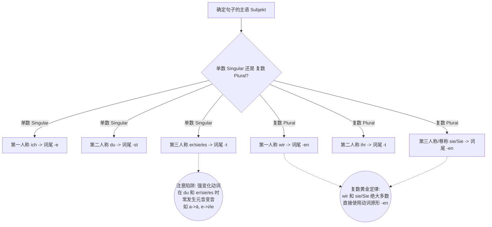

# 动词与单复数关系

Hallo！德语大师再次上线！很高兴能和你继续这趟通往 B 2 的德语进阶之旅。你对底层逻辑的好奇心，正是学好德语最宝贵的特质！

今天，我们将系统、全面地拆解德语中最核心的机制：**主语（单复数）与动词的绑定关系**（Subjekt-Prädikat-Kongruenz）。这不仅是德语造句的基石，更是你日后在 B 1/B 2 阶段攻克从句（Nebensätze）、被动语态（Passiv）和虚拟式（Konjunktiv II）的底层密码。

准备好了吗？我们要开始“硬核”输出了！

### 语法精讲：动词是句子的“智能适配器”

在德语中，动词（Verb）永远是句子的核心（在陈述句中雷打不动地占据第二位）。我们可以把德语的动词想象成一个带有芯片的“智能适配器”。

当主语（插头）接入时，这个智能适配器必须瞬间扫描主语的两个核心数据：

1. **人称（Person）：** 是第一人称（我/我们）、第二人称（你/你们）还是第三人称（他/她/它/他们）？
2. **数（Numerus）：** 是单数（Singular）还是复数（Plural）？

扫描完毕后，动词会立刻改变自己的**词尾（Endung）**来匹配主语。这个过程在德语语法中被称为**动词变位（Konjugation）**。

#### 核心规律：复数的“极度稳定”与单数的“暗藏玄机”

为了让你一眼看穿变位规律，我们不枯燥地背表格，而是寻找规律。请记住这句大师口诀：**“单数多变异，复数躺平加 -en。”**

为了更直观地展示这个逻辑，我们用图表来解析这个“智能适配”过程：

代码段

#### 系统性拆解四大动词类型

在彻底搞懂了基础词尾后，我们必须面对德语动词的四大分类。不管你怎么变，只要认准单复数，就不会乱：

**1. 规则动词（弱变化动词 Schwache Verben）**

这是最乖巧的一类，词干绝对不变，只变词尾。

- **动作：** _kaufen_ (买)
- **单数：** Der Kunde **kauft** das Produkt. (客户买这个产品。 -> 第三人称单数，加 -t)
- **复数：** Die Kunden **kaufen** die Produkte. (客户们买这些产品。 -> 第三人称复数，恢复原形加 -en)

**2. 不规则动词（强变化动词 Starke Verben）**

这就是 B 1 级别经常扣分的重灾区！这类动词在**单数（且仅限第二、第三人称单数）**时，不仅词尾变，**词干里的元音也会变**！但是在**复数**时，它们又变得像绵羊一样规则。

- **动作：** _laufen_ (运行/跑)
- **单数（变音）：** Das Programm **läuft** reibungslos. (程序运行顺畅。 -> a 变成了 ä)
- **复数（打回原形）：** Die Programme **laufen** reibungslos. (程序们运行顺畅。 -> 完全规则，加 -en)

**3. 核心助动词（Hilfsverben: sein, haben, werden）**

它们是德语的灵魂，也是各种高级语态（完成时、被动语态、将来时）的砖瓦。它们的单复数变化必须刻在 DNA 里。

- **sein (是):** 单数(ich _bin_, du _bist_, er _ist_) / 复数(wir _sind_, ihr _seid_, sie _sind_)
- **haben (有):** 单数(ich _habe_, du _hast_, er _hat_) / 复数(wir _haben_, ihr _habt_, sie _haben_)
- **werden (变成/将被):** 单数(ich _werde_, du _wirst_, er _wird_) / 复数(wir _werden_, ihr _werdet_, sie _werden_)

**4. 情态动词（Modalverben: müssen, können, wollen, etc.）**

情态动词是 B 2 级别表达复杂观点（如义务、可能性、意愿）的利器。

- **终极规律：** 第一人称单数（ich）和第三人称单数（er/sie/es）不仅会元音变音，而且**完全没有词尾**！但只要到了复数（wir/sie），立马又变得完全规则（-en）！
- **例子 (können 能)：**
    - 单数：Die Software **kann** das. (软件能做到这个。 -> 没词尾，ö变 o)
    - 复数：Die Systeme **können** das. (系统们能做到这个。 -> 规则 -en)

### 移民生活与科技场景实战

让我们把这些硬核规则代入到你的实际生活和专业领域中去。

**场景一：云端架构部署（专业职场）**

在管理或汇报技术项目时，你需要极其精准地匹配单复数：

- **单数（强变化）：** Die künstliche Intelligenz **liest** den Datensatz und **gibt** das Ergebnis aus. (人工智能读取数据集并输出结果。 -> _lesen_ 变 _liest_, _geben_ 变 _gibt_)
- **复数（规则化）：** Die Google Cloud-Dienste **lesen** die Datensätze und **geben** die Ergebnisse aus. (谷歌云服务读取数据集并输出结果。 -> 直接用原形 _lesen_ 和 _geben_)

**场景二：外管局申请签证（行政事务）**

- **单数（助动词）：** Mein Reisepass **ist** noch drei Jahre gültig. (我的护照还有三年有效。)
- **复数（情态动词）：** Diese Dokumente **müssen** von einem Notar beglaubigt **werden**. (这些文件必须由公证人进行公证。 -> _müssen_ 复数规则化，句末配合被动语态 _werden_)

**场景三：租赁房屋（生活安居）**

- **单数：** Der Vermieter **hat** die Kaution erhalten. (房东已经收到了押金。)
- **复数：** Die Nebenkosten (复数) **werden** am Ende des Jahres abgerechnet. (附加费用将在年底进行结算。)

### 六个月 B 2 语法攻坚蓝图 (进阶版)

为了确保你在 6 个月内能将这些基础夯实并冲刺 B 2，我们需要一个精确打击的计划：

|**阶段**|**学习焦点（围绕动词）**|**B 2 进阶目标**|
|---|---|---|
|**第 1 个月**|**动词变位与时态闭环**      彻底消灭强变化动词单数变音的错误。熟练掌握现在时（Präsens）与现在完成时（Perfekt）。|能够流利、无语法错误地讲述自己过去的经历和目前的工作日常。|
|**第 2 个月**|**情态动词与从句框架**      将情态动词放入从句中（动词必须踢到句末），形成强大的肌肉记忆。|能够用 `weil`, `obwohl`, `dass` 等连词解释复杂的因果关系，如：_Ich nutze die API, weil sie stabil läuft._|
|**第 3 个月**|**被动语态 (Passiv) 狂飙**      掌握 _werden + Partizip II_。科技和行政德语极其依赖被动语态来强调客观事实。|能够阅读和撰写技术文档、外管局信函。如：_Der API-Schlüssel wird generiert._|
|**第 4 个月**|**第二虚拟式 (Konjunktiv II)**      熟练使用 _hätte_, _wäre_, _würde_。|学会最高级别的礼貌表达和假设性推演（这在德国职场沟通中是必杀技）。|
|**第 5 个月**|**长难句拆解与扩展定语**      学习将从句压缩成形容词短语（Partizipialattribut），这是 B 2 阅读理解的最大难点。|能够看懂《明镜周刊》或德国 IT 专业博客上的深度文章。|
|**第 6 个月**|**全真模拟与高频输出**      针对 B 2 口语和写作题型，将前五个月积累的复杂句型变成条件反射。|顺利通过 Goethe/Telc B 2 考试。|

### 你的实战时间

纸上得来终觉浅。现在，请你用刚才学到的规则（注意强变化动词的单复数差异，以及情态动词的特殊性），尝试把下面这两句话翻译成德语。

_(提示：建议使用你熟悉的词汇，比如 AI 模型、云服务器、API 或者 租房、看病 等场景)_

1. **“这个人工智能助理帮助（helfen）我写代码。”** (注意：helfen 在第三人称单数时会变音！)
2. **“这些新的云服务器必须（müssen）运行（laufen）得非常快。”**

你打算怎么翻译这两句话？大胆试错，我会为你做最详细的解析！
