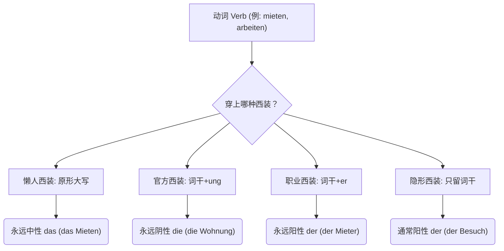

# 动词名词化

今天我们要攻克的 B 1-B 2 核心堡垒叫做——**动词名词化 (Nominalisierung von Verben)**。

这不仅是 B 2 考试（尤其是阅读和写作）的必考重点，更是你在德国生存的“护身符”。无论是去外管局（Ausländerbehörde）办签证、签租房合同，还是看医生，德国人极其偏爱使用名词。

### 👨‍💼 什么是“动词变名词”？一个生动的类比

想象一下，**动词**就像是穿着工作服在工地上跑来跑去的**“工人”**，他们负责执行具体的动作（比如：跑、建、修）。 而**名词**，就像是穿上了高级西装、坐在办公室里的**“经理”**。

德国的官方语言（Behördendeutsch）非常高冷且严谨，他们觉得让“工人”在正式文件里跑来跑去太不体面了，所以他们喜欢给这些“工人”套上西装，把动作变成一个静止的、抽象的概念（名词）。把动词变名词，就是一场**“职场换装游戏”**。

我们先通过下面这张图表，直观地看看动词都有哪几种“西装”可以穿：

代码段

---

## 👔 详细拆解：给动词穿上四件不同的“西装”

^02mzay

### 原形直接大写 das 动作正在进行的那个纯粹的状态

这是最简单的变法，直接把动词的第一个字母大写，前面加上中性冠词 **das**。它强调的是**动作正在进行的那个纯粹的状态**。

- **规则**：das + 动词原形（首字母大写）
- **移民生活场景（医疗与规则）**：
    - _rauchen_ (抽烟) ➔ **das Rauchen** (抽烟这件事)
    - _lesen_ (阅读) ➔ **das Lesen** (阅读这件事)
- **大师例句**：
    - **Das Rauchen** ist im Krankenhaus streng verboten. (医院内严格禁止吸烟。)
    - _大师点评：与其说 "Sie dürfen hier nicht rauchen" (你不能在这抽烟 - B 1 水平)，护士更喜欢用名词化的表达，显得冷酷且不可抗拒。_

#### 1. 一律为中性

所有的动词不定式变成名词后，它的冠词永远是 **das**。比如，跳舞是 _tanzen_，变成名词就是 _das Tanzen_。

- **职场场景：** ==_Das Programmieren_== von Cloud-Diensten erfordert viel Konzentration. (云端服务的编程需要高度集中注意力。)

#### 2. 没有复数

动作一旦变成概念，它就是一个不可数的整体，你不可能说“两个工作”或“三个等待”。

- **行政场景（外管局）：** _Das Warten_ auf die Niederlassungserlaubnis dauert manchmal Monate. (等待永久居留许可有时需要好几个月。)

#### 3. 常常以零冠词的形式出现，或与介词连用

这是 B 1 跨越到 B 2 最核心的得分点！在实际使用中，我们很少干巴巴地说 "das xxx"，而是把它融入到高级句型中。

#### B. 与介词连用：B 2 考试与职场的“杀手锏”

**“动作想变物，首字母大写穿 das 服；同步用 beim，目的用 zum，复数永远不出现！”**

这是你必须掌握的结构，尤其是 `beim` (bei + dem) 和 `zum` (zu + dem)。

##### **1. Beim + 大写动词 = 正在做某事时（表达同时发生）**

当你想要表达“在做...的过程中”发生了一件事，用 `beim` 是最简洁、最高级的。

- _图片例句：_ _Beim Tanzen_ bin ich glücklich. (在跳舞时我很快乐。)
- **工作/安全场景：** Bitte seien Sie **beim Verwalten** des Accounts sehr vorsichtig, um Leaks zu vermeiden. (在管理账户时请务必非常小心，以避免泄露。)
- **租房场景：** **Beim Unterschreiben** des Mietvertrags müssen Sie auf die Kündigungsfrist achten. (在签署租房合同时，您必须注意解约期限。)

##### **2. Zum + 大写动词 = 为了做某事（表达目的）**

当你想要表达某件物品或某个动作的“用途”时，用 `zum`。

- _图片例句：_ _Zum Tanzen_ brauche ich gute Musik. (为了跳舞我需要好音乐。)
- **云架构场景：** Wir nutzen Google Cloud **zum Hosten** unserer neuen Applikation. (我们使用谷歌云来托管我们的新应用。)
- **医疗场景：** Diese Tabletten sind **zum Schlafen**. Bitte nehmen Sie eine vor dem Zubettgehen. (这些药片是用来助眠的。请在就寝前服用一片。)

**3. 大师拓展：Vor dem / Nach dem**

除了 `bei` 和 `zu`，在德国的日常和行政信件中，你还会频繁遇到用 `vor` (在...之前) 和 `nach` (在...之后) 加上动词名词化的结构。

- **面试场景：** **Vor dem Vorstellen** des Projekts sollten wir die Technik testen. (在展示项目之前，我们应该测试一下设备。)
- **行政事务：** **Nach dem Bestätigen** der Zahlungsdaten wird Ihr AdMob-Konto freigeschaltet. (在确认支付数据之后，您的 AdMob 账户将被激活。)

### 词干 + ung (Die-Nominalisierung) 过程或产生的结果

这是 B 2 级别**最最最重要**的一个后缀！它是德国公务员的最爱。只要看到 **-ung**，你就能闻到一股浓浓的“官方文件”味道。它通常表示动作的**过程或产生的结果**。

- **规则**：去掉词尾 -en，加上 -ung。冠词永远是 **die**，复数永远加 -en。
- **移民生活场景（行政事务与租房）**：
    - _anmelden_ (登记/注册) ➔ **die Anmeldung** (落户登记，你在德国最重要的一张纸！)
    - _kündigen_ (解约/辞职) ➔ **die Kündigung** (解约信/辞退)
    - _überweisen_ (转账) ➔ **die Überweisung** (转账单/医生的转诊单)
- **大师例句**：
    - Für **die Anmeldung** bei der Stadt brauchen Sie Ihren Pass. (在市政厅进行落户登记时，您需要您的护照。)
    - Ihre **Kündigung** für die Wohnung muss schriftlich erfolgen. (您的房屋解约必须以书面形式进行。)

### 外来词的专属定制 (-tion, -sion, -ment) 🌟【本次重点补全】

**这是 `image_27d3c4.png` 中缺失的拼图！** 德语中有大量借用自拉丁语或法语的外来词汇，它们的显著特征是动词以 **-ieren** 结尾。这些“高傲”的外来词拒绝穿土生土长的 -ung 西装，它们必须穿“高级定制礼服”！

**规则 1：变成 -tion (阴性 die)** 大部分 -ieren 结尾的词，去掉 -ieren，换成 -tion。

- operieren (动手术) -> **die Operation** (手术)
- informieren (通知/告知) -> **die Information** (信息)
- **医疗场景：** _Der Arzt plant **die Operation** für nächste Woche._ (医生安排下周手术。)

**规则 2：变成 -sion (阴性 die)** 当词干以 -d, -t, -s 等特定辅音结尾时，为了发音好听，会变成 -sion。

- explodieren (爆炸) -> **die Explosion** (爆炸)
- diskutieren (讨论) -> **die Diskussion** (讨论)
- **职场场景：** _Wir hatten gestern eine lange **Diskussion** über Ihr Gehalt._ (昨天我们关于您的薪水进行了一次长谈。)

### 词干 + er/erin der/die  执行动作的那个人

这个后缀用来赋予动词“人格”，专门用来揪出**执行动作的那个人**（或者机器）。

- **规则**：去掉词尾 -en，加上 -er。表示男性或统称时冠词是 **der**（变女性加 -in 变成 die）。
- **移民生活场景（找工作与租房）**：
    - _mieten_ (租) ➔ **der Mieter** (租客) / **die Mieterin** (女租客)
    - _arbeiten_ (工作) + _geben_ (给) ➔ **der Arbeitgeber** (给你工作的人 = 雇主)
    - _arbeiten_ (工作) + _nehmen_ (拿) ➔ **der Arbeitnehmer** (拿工作的人 = 雇员)
- **大师例句**：
    - **Der Arbeitgeber** muss den Arbeitsvertrag unterschreiben. (雇主必须签署劳动合同。)

### 只留词干 der，抽象概念或事件

这是一种非常古老且地道的变法。动词粗暴地砍掉词尾 -en，有时候甚至内部的元音都会发生变化。这种词通常表示一个**抽象概念或事件**。

- **规则**：动词词干（有时需变音）。冠词绝大多数是 **der**。
- **移民生活场景（日常交际与事务）**：
    - _besuchen_ (拜访) ➔ **der Besuch** (探访/客人)
    - _umziehen_ (搬家) ➔ **der Umzug** (搬家)
    - _kaufen_ (买) ➔ **der Kauf** (购买)
- **大师例句**：
    - Nach dem **Umzug** müssen Sie Ihre neue Adresse mitteilen. (搬家后您必须通知您的新地址。)

### 小众且高级的 -tur / -ur (拉丁语血统) 具体的“动作”或“动作的结果”

这就是您今天抓到的“嫌疑犯”！带有这个后缀的词通常表示一个具体的“动作”或“动作的结果”。**这类词永远是阴性（die）。**

- **korrigieren** (纠正) $\rightarrow$ **die Korrektur** (修改/校对)
    - _造句：_ Ich brauche noch Zeit für die Korrektur. (我还需要时间来做修改。)
- **reparieren** (修理) $\rightarrow$ **die Reparatur** (维修)
    - _造句：_ Die Reparatur ist sehr teuer. (这笔维修费非常昂贵。)
- **rasieren** (刮胡子) $\rightarrow$ **die Rasur** (剃须 - 注意这里只剩 -ur)

#### 第二套：绝对的主力军 -ion / -ation (国际通用款)

对于 80% 以上以 -ieren 结尾的动词，如果要把它们变成名词，直接把 -ieren 砍掉，换成 **-ion** 或 **-ation** 即可。**这类词也永远是阴性（die）。**

- **informieren** (通知) $\rightarrow$ **die Information** (信息)
- **organisieren** (组织) $\rightarrow$ **die Organisation** (组织/机构)
- **reagieren** (反应) $\rightarrow$ **die Reaktion** (反应)
- **diskutieren** (讨论) $\rightarrow$ **die Diskussion** (讨论)

#### 第三套：法式优雅的 -ment (法语血统)

少数来自法语的词保留了 -ment 后缀。**请注意，带 -ment 后缀的名词永远是中性（das）。**

- **engagieren** (投入/致力于) $\rightarrow$ **das Engagement** (投入/奉献，发音依然是法语发音)
- **abonnieren** (订阅) $\rightarrow$ **das Abonnement** (订阅/订购)

# 第一第二分词名词化, 和名词组合, 形成一个前置定语

^k2dqsd

第一第二分词是将动词变成了形容词，这时候将首字母大写它就变成了一个名词，完成了动词变形容词，形容词再变名词的转换。

### 第一条路线：分词的名词化 (Nominalisierung von Partizipien)

**类比：穿上隐形斗篷的形容词**

当我们把分词当成名词用时，通常是用来指代“做这个动作的人”**（第一分词）或者**“承受这个动作的人”（第二分词）。

⚠️ **大师防坑警告：** 虽然它们首字母大写变成了名词，但它们的**词尾变化依然必须遵循“形容词词尾变化”规则！**（这是 B 1/B 2 考试必考的陷阱！）

#### 1. 第一分词的名词化（主动、正在进行的人）

- **动作：** einreisen (入境) $\rightarrow$ **一觉：** einreisend (正在入境的)
- **二觉（名词化）：** **der Einreisende** (男性入境者) / **die Einreisende** (女性入境者)
- **移民生活实战（海关/外管局）：**
    - _带定冠词：_ **Der Einreisende** muss seinen Pass vorzeigen. (这位入境者必须出示护照。)
    - _带不定冠词：_ Ich bin **ein Einreisender** aus China. (我是一名来自中国的入境者。 -> 注意词尾变成了 -er)
    - _复数无冠词：_ **Einreisende** aus Nicht-EU-Ländern brauchen ein Visum. (非欧盟国家的入境者需要签证。)

#### 2. 第二分词的名词化（被动、动作已完成的人）

- **动作：** anstellen (雇佣) $\rightarrow$ **一觉：** angestellt (被雇佣的)
- **二觉（名词化）：** **der Angestellte** (男职员) / **die Angestellte** (女职员)
- **移民生活实战（职场/医疗）：**
    - _职场：_ Ich bin **ein Angestellter** in dieser IT-Firma. (我是这家 IT 公司的一名（被雇佣的）职员。)
    - _医疗保险：_ **Der Versicherte** hat Anspruch auf kostenlose Behandlungen. (（被）保险人有权享受免费治疗。)

### 第二条路线：扩展前置定语 (Erweitertes Partizipialattribut)

**类比：语法界的“贪吃蛇”与“超级汉堡包”**

这正是您问题中提到的“和名词组合，形成一个前置定语”。这是德语向高级跨越的标志！

在普通的句子里，修饰语通常是放在名词后面的从句（关系从句）。但是德国官方觉得那样太啰嗦，于是他们用**冠词（Artikel）**和**分词（Partizip）**组成了一个**“巨大的汉堡包外壳”**，把原本属于从句里的所有时间、地点、介词短语等配料，一口气全吞进去，塞在名词的前面！

**万能公式框架：**

> **[冠词/代词]** + _(各种时间/地点/介词等补充信息)_ + **[带词尾的分词]** + **[被修饰的名词]**

让我们通过移民实际场景，看看这条贪吃蛇是怎么吞噬信息的。

#### 1. 第一分词的扩展定语（主动、同时发生）

- **基础版：** Der suchende Mann. (寻找中的男人。)
- **贪吃蛇吞噬（找房场景）：**
    - 男人在找什么？ -> nach einer Wohnung (找公寓)
    - 怎么找？ -> verzweifelt (绝望地)
- **二觉合体：**
$1

    Der _verzweifelt nach einer Wohnung_ **suchende** Mann hat endlich einen Mietvertrag unterschrieben.

$1

    (那个【绝望地在寻找公寓的】男人终于签了租房合同。)

$1

- **大师解析：** 冠词 `Der` 和第一分词 `suchende` 形成了一个框，中间夹着 `verzweifelt nach einer Wohnung`。整个这长长的一串，其实仅仅是 `Mann` 的修饰语！

#### 2. 第二分词的扩展定语（被动、已完成）

- **基础版：** Die eingereichten Unterlagen. (被提交的材料。)
- **贪吃蛇吞噬（外管局延签场景）：**
    - 什么时候提交的？ -> gestern (昨天)
    - 被谁提交的？ -> von mir (被我)
    - 提交给谁？ -> bei der Ausländerbehörde (在外管局)
- **二觉合体：**
$1

    Die _gestern von mir bei der Ausländerbehörde_ **eingereichten** Unterlagen sind leider unvollständig.

$1

    (那些【昨天由我向外管局提交的】材料很遗憾是不完整的。)

$1

- **大师解析：** 在阅读德国公文时，只要看到冠词 `Die` 后面没有紧跟名词，反而跟着一堆介词短语，您的眼睛一定要立刻向后扫射，去寻找那个以 `-en` 或 `-t` 结尾的分词 `eingereichten`，最后再看被修饰的名词 `Unterlagen`。
