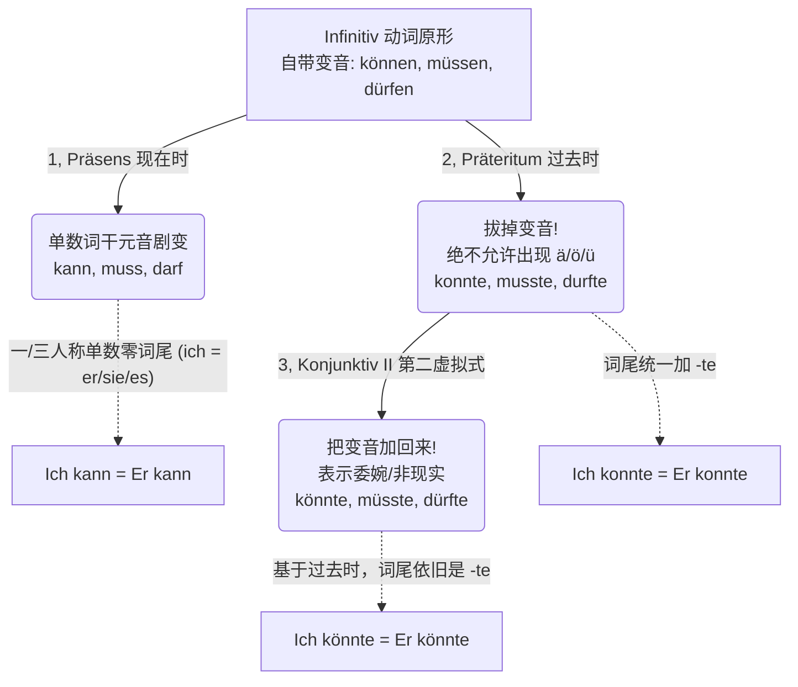
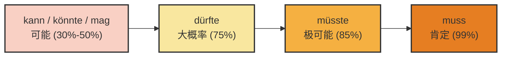

---
aliases:
---

### 什么是情态动词？（“态度滤镜”类比）

如果把德语的一个句子比作一张照片，**实义动词（如 arbeiten, gehen）**就是照片的主体（比如一个人在工作）。而**情态动词**则是加在这张照片上的“态度滤镜（Filter）”。

照片的主体没有变，但加了不同的滤镜，整张照片传达的“态度”和“情绪”就完全不同了：

- Ich arbeite. (我在工作。—— 原图：陈述事实)
- Ich **muss** arbeiten. (我**必须**工作。—— 苦逼滤镜：生活所迫)
- Ich **will** arbeiten. (我**想要**工作。—— 奋斗滤镜：主观意愿)
- Ich **kann** arbeiten. (我**能**工作。—— 能力滤镜：病好了，有能力了)

德语中严格意义上有 6 个纯正的情态动词：**können, müssen, dürfen, sollen, wollen, mögen**。（_möchten_ 实际上是 _mögen_ 的虚拟式，但因为它在生活中太常用了，我们将它单独作为第 7 个列出，方便你记忆）。

### 核心密码：情态动词变位的“生死轮回”（Umlaut 变音的掉落与重生）

在死记硬背表格之前，你必须先看懂情态动词在各个时态中长得不一样的**底层逻辑**。其中最核心的密码就是“变音（Umlaut: ä, ö, ü）”。

请看这幅为你定制的“情态动词变位底层逻辑图”：

代码段

> **大师防坑警告**：
>
> 1. **sollen 和 wollen** 这两位是个例外，它们一辈子都很“刚”，**原形就没有变音，过去时没有，虚拟式也没有！** (sollte 永远是 sollte，wollte 永远是 wollte)。
>     
> 2. **现在时中**，第一人称（ich）和第三人称单数（er/sie/es）**绝不能加 -t 或 -e，长得一模一样！**（千万别说出 ~~ich kanne~~ 或者 ~~er musst~~ 这种话）。

### 全景扫描：情态动词全时态/语式变位大总结

为了让你“没有遗漏”地掌握，我将为你铺开三张大表。这三张表涵盖了现在时、过去时以及极其重要的第二虚拟式（Konjunktiv II）。

#### 1. 现在时（Präsens）：陈述当下的态度与能力

_重点关注：单数（ich/du/er/sie/es）的词干元音大换血，且 ich 与 er 长得一样。_

|**人称**|**können (能/会)**|**müssen (必须)**|**dürfen (允许)**|**wollen (想要)**|**sollen (应该)**|**mögen (喜欢)**|**möchten (想要)**|
|---|---|---|---|---|---|---|---|
|**ich**|k**a**nn|m**u**ss|d**a**rf|w**i**ll|soll|m**a**g|möchte|
|**du**|k**a**nn**st**|m**u**ss**t**|d**a**rf**st**|w**i**ll**st**|soll**st**|m**a**g**st**|möchte**st**|
|**er/sie/es**|k**a**nn|m**u**ss|d**a**rf|w**i**ll|soll|m**a**g|möchte|
|**wir**|können|müssen|dürfen|wollen|sollen|mögen|möchten|
|**ihr**|könn**t**|müss**t**|dürf**t**|woll**t**|soll**t**|mög**t**|möchte**t**|
|**sie/Sie**|können|müssen|dürfen|wollen|sollen|mögen|möchten|

#### 2. 过去时（Präteritum）：书面描述过去发生的事

_重点关注：所有带两点的变音（ä, ö, ü）统统消失！词尾加上表示过去的 `-te` 系列。特别注意 `mögen` 变成了 `mochte`（发音从 g 变成了 ch 的清音）。_

| **人称**        | **können -> konnte** | **müssen -> musste** | **dürfen -> durfte** | **wollen -> wollte** | **sollen -> sollte** | **mögen -> mochte** |
| ------------- | -------------------- | -------------------- | -------------------- | -------------------- | -------------------- | ------------------- |
| **ich**       | konn**te**           | muss**te**           | durf**te**           | woll**te**           | soll**te**           | moch**te**          |
| **du**        | konn**test**         | muss**test**         | durf**test**         | woll**test**         | soll**test**         | moch**test**        |
| **er/sie/es** | konn**te**           | muss**te**           | durf**te**           | woll**te**           | soll**te**           | moch**te**          |
| **wir**       | konn**ten**          | muss**ten**          | durf**ten**          | woll**ten**          | soll**ten**          | moch**ten**         |
| **ihr**       | konn**tet**          | muss**tet**          | durf**tet**          | woll**tet**          | soll**tet**          | moch**tet**         |
| **sie/Sie**   | konn**ten**          | muss**ten**          | durf**ten**          | woll**ten**          | soll**ten**          | moch**ten**         |

#### 3. 第二虚拟式（Konjunktiv II）：礼貌、非现实、主观推测（B 2 通关核心！）

_重点关注：在过去时的基础上，把两点（Umlaut）加回来！sollen 和 wollen 不加。_

|**人称**|**konnte -> könnte**|**musste -> müsste**|**durfte -> dürfte**|**wollte -> wollte**|**sollte -> sollte**|**mochte -> möchte**|
|---|---|---|---|---|---|---|
|**ich**|k**ö**nnte|m**ü**sste|d**ü**rfte|wollte|sollte|m**ö**chte|
|**du**|k**ö**nntest|m**ü**sstest|d**ü**rftest|wolltest|solltest|m**ö**chtest|
|**er/sie/es**|k**ö**nnte|m**ü**sste|d**ü**rfte|wollte|sollte|m**ö**chte|
|**wir**|k**ö**nnten|m**ü**ssten|d**ü**rften|wollten|sollten|m**ö**chten|
|**ihr**|k**ö**nntet|m**ü**sstet|d**ü**rftet|wolltet|solltet|m**ö**chtet|
|**sie/Sie**|k**ö**nnten|m**ü**ssten|d**ü**rften|wollten|sollten|m**ö**chten|

> **大师点拨：关于 Perfekt (现在完成时) 的 B 2 大坑**
>
> 如果情态动词单独使用，完成时是：`hat + ge-xxx-t`（例：Ich habe es gekonnt. 我曾会过这个）。
>
> **但是！** 99%的情况下情态动词是搭配另一个动词使用的。此时绝不能用 `ge-` 开头的分词，而是触发**“替代不定式（Ersatzinfinitiv）”**，即：**双动词原形放在句末！**
>
> ✅ Ich habe gestern arbeiten **müssen**. (我昨天必须工作。 —— 不要说 ~~gearbeitet gemusst~~，这是极大的语法错误！)

### 移民生活场景实战演练

现在，让我们把这些干巴巴的变位表格，放到你在德国实打实的移民生活场景中去。

#### 场景 1：找工作面试 (Jobsuche) - _能力展示与委婉请求_

- **Präsens (客观能力):** Ich **kann** fließend Englisch und Deutsch sprechen. (我能流利地说英语和德语。)
- **Konjunktiv II (极其礼貌的请求):** **Dürfte** ich Ihnen eine Frage zur Unternehmenskultur stellen? (我可以向您提一个关于企业文化的问题吗？ —— 比 darf 委婉十倍，HR 听了觉得你非常有教养。)
- **Präteritum (描述过去经历):** In meinem letzten Job **musste** ich oft Projekte leiten. (在我上一份工作中，我过去常常必须领导项目。)

#### 场景 2：外管局延签 (Ausländerbehörde) - _规定与命令_

- **Präsens (硬性规定):** Sie **müssen** dieses Formular bis morgen einreichen. (您必须在明天之前提交这份表格。)
- **Präsens (不被允许/禁令):** Ohne Termin **dürfen** Sie leider nicht reinkommen. (很遗憾，没有预约您不允许进来。)
- **Konjunktiv II (委婉的抱怨/请求):** **Könnten** Sie mir vielleicht eine Fiktionsbescheinigung ausstellen? Ich **müsste** dringend verreisen. (您或许能给我开个白条吗？我急需出趟远门。—— 用 müsste 显得你的急迫中带着尊重。)

#### 场景 3：看医生 (Arztbesuch) - _建议与过去症状_

- **Präsens (医生给的强建议):** Sie **sollen** drei Tage lang im Bett bleiben. (您应该在床卧床休息三天。)
- **Konjunktiv II (医生给的礼貌建议):** Sie **sollten** weniger Stress haben. (您应该少点压力。—— sollte(n) 是提建议的黄金标准词。)
- **Perfekt + 替代不定式 (描述昨天的糟糕情况):** Gestern habe ich wegen der starken Schmerzen Schmerzmittel nehmen **müssen**. (昨天因为剧痛，我必须得吃止痛药。)

你看，情态动词就像是德语沟通中的“润滑剂”和“指挥棒”。掌握了它们在过去时的果断，以及虚拟式中的温柔，你就能在面对刻板的房东、严肃的签证官时，做到不卑不亢，精准表达。把你想要练习的句子套进这些公式里，反复朗读直到形成肌肉记忆！

# 情态动词表可能性

^ntwb75

[[动词#^lsE1c4QI|100%]]

### 第一部分：情态动词的主观意义（对现在的推测）

当我们对目前正在发生、或者目前的状态进行推测时，我们使用**情态动词的现在时（Präsens）**或**第二虚拟式（Konjunktiv II）**，加上**动词原形（Infinitiv）**。

不同的情态动词代表了你作为“侦探”内心不同的确信程度。我们先用一张图表来直观感受一下这个“确信度阶梯”：

代码段

现在，我们把这些推测词放入你在德国的实际生活中：

**1. muss (99% - 肯定 / fast sicher)**

你手里掌握了铁证，几乎 100%确信。

- **生活场景（租房）：** 你看到房东的车已经停在楼下了，你和室友说：
    - _Der Vermieter **muss** gleich da **sein**._ (房东肯定马上就到了。)

**2. müsste (85% - 极可能 / höchstwahrscheinlich)**

根据常理或经验，这件事理应如此，但你不排除极其微小的意外。

- **生活场景（行政事务）：** 你上周就交了延签材料，通常一周内会有回复。
    - _Die Ausländerbehörde **müsste** meine Unterlagen schon **haben**._ (外管局极可能已经收到我的材料了。)

**3. dürfte (75% - 大概率 / wahrscheinlich)**

你有充分的理由相信某事会发生，语气比较客气且有把握。

- **生活场景（找工作）：** 你的面试非常顺利，HR 也暗示了会录用你。
    - _Ich **dürfte** den Job **bekommen**._ (我大概率能拿到这份工作。)

**4. kann / könnte / mag (30%-50% - 可能 / vielleicht)**

你只是提出一种可能性，完全靠猜，手里没什么证据。_(注意：könnte 比 kann 语气更委婉，可能性更低一点)_

- **生活场景（交通/约会）：** 你在咖啡馆等面试官，但他迟到了。
    - _Er **könnte** im Stau **stecken**._ (他可能堵车了。—— 就像 image_54 ca 1 c.jpg 中的例句一样)
    - *Er **kann** den Termin vergessen **haben**. *(他也许忘记了预约。)

### 第二部分：情态动词的主观意义（对过去的推测）

**核心法则（请务必死记硬背）：**

当你推测过去时，**情态动词本身绝对不变成过去时！**情态动词依然保持现在时或第二虚拟式，我们要把句末的**实义动词变成“过去时的不定式”**（也就是：过去分词 Partizip II + haben/sein）。

> [!danger] 框架
> **主语 + 情态动词(Präsens/KII) + ... + 过去分词(Partizip II) + haben/sein.**

我们依然沿着确信度的阶梯，来看看过去的推测怎么用：

**1. 极度确信过去的某事 (muss ... haben/sein)**

- **生活场景（医疗）：** 你的朋友今天一直气喘吁吁（außer Atem），而且电梯坏了。你推测她刚刚肯定是走楼梯上来的。
    - _Sie **muss** wohl zu Fuß die Treppe hochgekommen **sein**._ (她刚才肯定是走楼梯上来的。—— 对应资料 image_54 c 9 fd.jpg 的经典例句)
- **生活场景（找工作）：** 你的邮箱里收到了一封拒信，你推测 HR 昨天肯定看过你的简历了。
    - _Der Personaler **muss** meinen Lebenslauf gestern gelesen **haben**._ (HR 昨天肯定读过我的简历了。)

**2. 大概率发生过的某事 (dürfte ... haben/sein)**

- **生活场景（租房）：** 邻居的包裹昨天就不在了，你推测他大概率已经拿走了。
    - _Der Nachbar **dürfte** das Paket schon abgeholt **haben**._ (邻居大概率已经把包裹取走了。)

**3. 可能发生过的某事 (könnte ... haben/sein)**

- **生活场景（生活交际）：** 你的室友昨天去跑步了，你推测她可能是突然有兴致运动了。
    - _Sie **könnte** Lust gehabt **haben**, Sport zu treiben._ (她可能（当时）突然有兴致做运动了。)

### 第三部分：高阶运用与核心避坑指南

为了让你的德语达到大师级别，我们必须攻克这两个中国学生最容易踩坑的难点。

#### 难点一：对过去推测的“被动语态”

如果你要推测过去发生的一件“被动”的事情，结构会变得稍微有些长，但逻辑依然严密：

> **公式：主语 + 情态动词 + 过去分词 + worden + sein.**

- **生活场景（日常物业）：** 你们公寓的电梯坏了三天了，你今天看还是没修好，你推测：“电梯大概率还没有被修好。”
    - _Der Aufzug **dürfte** noch nicht wieder repariert **worden sein**._ (如 image_54 c 9 fd.jpg 所示，这是一个极其地道、能让德国考官眼前一亮的高分句型！)
- _补充提醒_：如果要推测**现在**的被动状态（他现在可能正在被手术），只能搭配明确的时间副词（如 gerade），以避免混淆：
    - _Er **dürfte** gerade operiert **werden**._ (他现在大概率正在接受手术。)

#### 难点二：客观描述 vs. 主观推测 的致命混淆

这是六个月冲刺 B 2 必须跨过的陷阱！请看以下两句话的巨大区别：

- **第一句（客观的必要性 - 事实）：**
    - _Sie **musste** zu Fuß gehen._
    - _(或者)_ _Sie hat zu Fuß gehen **müssen**._
    - **翻译：** 她（当时）**不得不**步行去。（描述一个过去的事实：因为没车，她没得选。）
- **第二句（主观的推测 - 破案）：**
    - _Sie **muss** zu Fuß gegangen **sein**._
    - **翻译：** 她（刚才）**肯定是**步行去的。（这是你作为侦探，看到她满头大汗后得出的推理结论。）

**大师总结：** 表达过去的客观事实，变情态动词（musste）；表达对过去的推测，变句末的实义动词（gegangen sein），情态动词岿然不动！

### 你的课后实战练习

为了在 6 个月内达到 B 2，理论必须立刻转化为肌肉记忆。请尝试把下面这几个生活场景，用我们今天学到的**推测结构**用德语翻译出来（可以在心里默念或写在笔记上）：

1. **找房场景 (99%确信，现在)：** 这套公寓在市中心，租金**肯定**很贵。 (teuer sein)
2. **行政场景 (85%确信，过去)：** 我上周寄了信，外管局**极可能**已经收到这封信了。 (den Brief erhalten haben)
3. **看病场景 (50%可能，过去的被动)：** 这个药**可能**吃错（被错误服用）了。 (falsch eingenommen worden sein)

只要你能搞懂“确信度阶梯”和“过去时态的推断结构”，这部分的语法分你已经稳稳拿下了。保持这个学习势头，我们向下一个 B 2 核心语法点进军！Viel Erfolg!
