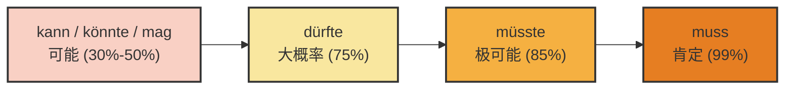

# 情态动词表可能性

^ntwb75
[[语言学习/德语/公共知识语法/动词.md#^lsE1c4QI|100%]]
### 第一部分：情态动词的主观意义（对现在的推测）

当我们对目前正在发生、或者目前的状态进行推测时，我们使用**情态动词的现在时（Präsens）**或**第二虚拟式（Konjunktiv II）**，加上**动词原形（Infinitiv）**。

不同的情态动词代表了你作为“侦探”内心不同的确信程度。我们先用一张图表来直观感受一下这个“确信度阶梯”：

代码段

现在，我们把这些推测词放入你在德国的实际生活中：

**1. muss (99% - 肯定 / fast sicher)**

你手里掌握了铁证，几乎 100%确信。

- **生活场景（租房）：** 你看到房东的车已经停在楼下了，你和室友说：
    - _Der Vermieter **muss** gleich da **sein**._ (房东肯定马上就到了。)

**2. müsste (85% - 极可能 / höchstwahrscheinlich)**

根据常理或经验，这件事理应如此，但你不排除极其微小的意外。

- **生活场景（行政事务）：** 你上周就交了延签材料，通常一周内会有回复。
    - _Die Ausländerbehörde **müsste** meine Unterlagen schon **haben**._ (外管局极可能已经收到我的材料了。)

**3. dürfte (75% - 大概率 / wahrscheinlich)**

你有充分的理由相信某事会发生，语气比较客气且有把握。

- **生活场景（找工作）：** 你的面试非常顺利，HR 也暗示了会录用你。
    - _Ich **dürfte** den Job **bekommen**._ (我大概率能拿到这份工作。)

**4. kann / könnte / mag (30%-50% - 可能 / vielleicht)**

你只是提出一种可能性，完全靠猜，手里没什么证据。_(注意：könnte 比 kann 语气更委婉，可能性更低一点)_

- **生活场景（交通/约会）：** 你在咖啡馆等面试官，但他迟到了。
    - _Er **könnte** im Stau **stecken**._ (他可能堵车了。—— 就像 image_54 ca 1 c.jpg 中的例句一样)
    - *Er **kann** den Termin vergessen **haben**. *(他也许忘记了预约。)

### 第二部分：情态动词的主观意义（对过去的推测）

**核心法则（请务必死记硬背）：**

当你推测过去时，**情态动词本身绝对不变成过去时！**情态动词依然保持现在时或第二虚拟式，我们要把句末的**实义动词变成“过去时的不定式”**（也就是：过去分词 Partizip II + haben/sein）。

> [!danger] 框架
> **主语 + 情态动词(Präsens/KII) + ... + 过去分词(Partizip II) + haben/sein.**

我们依然沿着确信度的阶梯，来看看过去的推测怎么用：

**1. 极度确信过去的某事 (muss ... haben/sein)**

- **生活场景（医疗）：** 你的朋友今天一直气喘吁吁（außer Atem），而且电梯坏了。你推测她刚刚肯定是走楼梯上来的。
    - _Sie **muss** wohl zu Fuß die Treppe hochgekommen **sein**._ (她刚才肯定是走楼梯上来的。—— 对应资料 image_54 c 9 fd.jpg 的经典例句)
- **生活场景（找工作）：** 你的邮箱里收到了一封拒信，你推测 HR 昨天肯定看过你的简历了。
    - _Der Personaler **muss** meinen Lebenslauf gestern gelesen **haben**._ (HR 昨天肯定读过我的简历了。)

**2. 大概率发生过的某事 (dürfte ... haben/sein)**

- **生活场景（租房）：** 邻居的包裹昨天就不在了，你推测他大概率已经拿走了。
    - _Der Nachbar **dürfte** das Paket schon abgeholt **haben**._ (邻居大概率已经把包裹取走了。)

**3. 可能发生过的某事 (könnte ... haben/sein)**

- **生活场景（生活交际）：** 你的室友昨天去跑步了，你推测她可能是突然有兴致运动了。
    - _Sie **könnte** Lust gehabt **haben**, Sport zu treiben._ (她可能（当时）突然有兴致做运动了。)

### 第三部分：高阶运用与核心避坑指南

为了让你的德语达到大师级别，我们必须攻克这两个中国学生最容易踩坑的难点。

#### 难点一：对过去推测的“被动语态”

如果你要推测过去发生的一件“被动”的事情，结构会变得稍微有些长，但逻辑依然严密：

> **公式：主语 + 情态动词 + 过去分词 + worden + sein.**

- **生活场景（日常物业）：** 你们公寓的电梯坏了三天了，你今天看还是没修好，你推测：“电梯大概率还没有被修好。”
    - _Der Aufzug **dürfte** noch nicht wieder repariert **worden sein**._ (如 image_54 c 9 fd.jpg 所示，这是一个极其地道、能让德国考官眼前一亮的高分句型！)
- _补充提醒_：如果要推测**现在**的被动状态（他现在可能正在被手术），只能搭配明确的时间副词（如 gerade），以避免混淆：
    - _Er **dürfte** gerade operiert **werden**._ (他现在大概率正在接受手术。)

#### 难点二：客观描述 vs. 主观推测 的致命混淆

这是六个月冲刺 B 2 必须跨过的陷阱！请看以下两句话的巨大区别：

- **第一句（客观的必要性 - 事实）：**
    - _Sie **musste** zu Fuß gehen._
    - _(或者)_ _Sie hat zu Fuß gehen **müssen**._
    - **翻译：** 她（当时）**不得不**步行去。（描述一个过去的事实：因为没车，她没得选。）
- **第二句（主观的推测 - 破案）：**
    - _Sie **muss** zu Fuß gegangen **sein**._
    - **翻译：** 她（刚才）**肯定是**步行去的。（这是你作为侦探，看到她满头大汗后得出的推理结论。）

**大师总结：** 表达过去的客观事实，变情态动词（musste）；表达对过去的推测，变句末的实义动词（gegangen sein），情态动词岿然不动！

### 你的课后实战练习

为了在 6 个月内达到 B 2，理论必须立刻转化为肌肉记忆。请尝试把下面这几个生活场景，用我们今天学到的**推测结构**用德语翻译出来（可以在心里默念或写在笔记上）：

1. **找房场景 (99%确信，现在)：** 这套公寓在市中心，租金**肯定**很贵。 (teuer sein)
2. **行政场景 (85%确信，过去)：** 我上周寄了信，外管局**极可能**已经收到这封信了。 (den Brief erhalten haben)
3. **看病场景 (50%可能，过去的被动)：** 这个药**可能**吃错（被错误服用）了。 (falsch eingenommen worden sein)

只要你能搞懂“确信度阶梯”和“过去时态的推断结构”，这部分的语法分你已经稳稳拿下了。保持这个学习势头，我们向下一个 B 2 核心语法点进军！Viel Erfolg!
