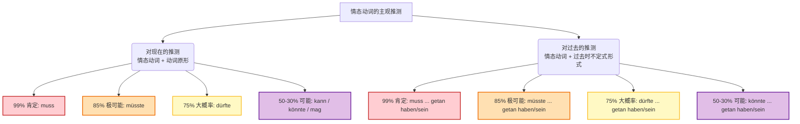
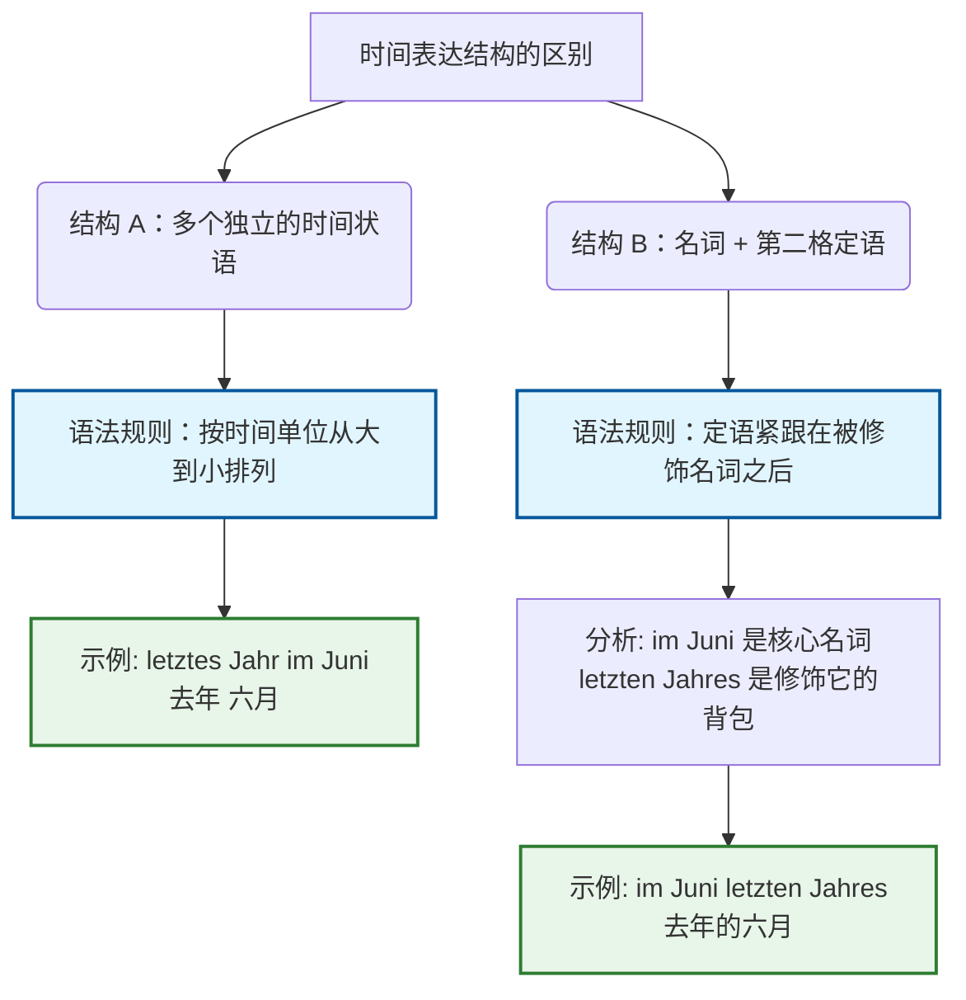

# 情态动词表可能性及其不同时态

### 一、 核心概念：情态动词的主观用法
情态动词 `können, müssen, dürfen` 可以用来表达说话人对某件事的**主观推测**，在使用时通常采用现在时或第二虚拟式（Konjunktiv II）的现在时形式。

为了让您一目了然，我们用图表来展示这套“推测概率表”以及不同时间维度的句型结构：

### 结构
当我们要对**正在发生或眼下的状态**进行推测时，我们直接使用：**情态动词（按主语变位）+ 句末的动词原形**。

### 二、 对现在的推测（Vermutungen in der Gegenwart）

这就像是我们在给推测下注，不同的词代表了您对自己推测的肯定程度：

- **muss (99% 肯定)**：说话人对自己的推测非常肯定。
- **müsste (85% 极可能)**。
- **dürfte (75% 大概率)**。
- **kann / könnte / mag (50-30% 可能)**：说话人对自己的推测不太肯定。

**💡 移民生活场景实战：等待外管局的信件**

假设您在等外管局（Ausländerbehörde）的签证延期信，您的伴侣问您信件的情况，您可以这样回答：

- _Der Brief **muss** heute ankommen._ (信今天**肯定**会到。 -> 99%，因为邮局说今天投递)
- _Der Brief **dürfte** im Briefkasten sein._ (信**大概率**在信箱里了。 -> 75%，因为平时邮递员这个时候已经来过了)
- _Der Sachbearbeiter **könnte** im Urlaub sein._ (办事员**可能**在休假。 -> 50%，只是您的一个猜测，不太肯定)

_(注：书上给出的经典例子是猜测某人是否快到了：“Er muss gleich kommen.” 表示肯定快到了；“Er könnte im Stau stecken.” 表示可能堵车了。)_

### 三、 对过去的推测（Vermutungen in der Vergangenheit）

这里是 B 2 考试最容易拉开分数差距的地方！

如果我们要推测**过去发生的事情**，我们**绝对不能**把情态动词变成过去时（比如绝对不能用 _musste_）。为什么？这就像我们要把一件过去的物品装进现在的背包里，背包（情态动词）必须留在现在，而物品（实义动词）必须带上“时间机器”的标签。

- **客观描述过去发生的事的必要性（基本意义）：** _Sie musste zu Fuß gehen._ (她当时必须步行。)
- **主观推测过去的事（推测意义）：** _Sie muss wohl zu Fuß gegangen sein._ (她肯定/大概是步行去的。)

#### 对过去的推测 公式：

情态动词（现在时或第二虚拟式） + **过去时的不定式形式 (= 过去分词 + sein/haben 的不定式形式)**。

我们来看书上的拆解示例：

- _Sie **muss** wohl zu Fuß die Treppe **hochgekommen sein**._ (= Sie ist bestimmt zu Fuß die Treppe hochgekommen.) 表示：她**肯定**是步行爬楼梯上来的（占 99%的肯定）。
- _Sie **könnte** Lust **gehabt haben**, Sport zu treiben._ 表示：她**可能**（当时）有运动的兴致（占 50-30%的可能）。

**💡 移民生活场景实战：找工作面试迟到**

假设您的朋友去面试迟到了，您在事后帮他复盘原因：

- _Du **dürftest** den falschen Zug **genommen haben**._ (你**大概率**是坐错火车了。 -> 用 haben 构成完成时)
- _Der Wecker **muss** kaputt **gegangen sein**._ (闹钟**肯定**是坏了。 -> 用 sein 构成完成时)

### 四、 推测的被动语态形式 (Passiv in der Vermutung)

当推测遇到被动语态，往往是在讨论“某件事/物被处理的状态”，这在行政事务和日常生活中非常常见。

- **对过去的推测（被动）：** 结构非常长，情态动词 + 过去分词 + worden + sein。
    - 例如租房场景中，您抱怨楼里的电梯还没修好：_Der Aufzug **dürfte** noch nicht wieder repariert **worden sein**._ (这部电梯**大概率**还没有被重新修好。)
- **对现在的推测（被动）：** 有一个极容易踩坑的特殊规则！对现在推测的被动形式，**只能搭配时间说明语（如 gerade）使用**。
    - 医疗场景：_Er **dürfte gerade** operiert **werden**._ (他**大概率正在**接受手术。)

### 练习
1. **场景：租房**

    “邻居大概率（75%）正在举办派对，因为音乐太吵了。” (提示：推测现在，使用 dürften)

2. **场景：行政事务**

    “我的签证申请肯定（99%）已经被批准了。” (提示：推测过去的被动语态，使用 muss ... worden sein)

3. **场景：找工作**

    “HR（Die Personalabteilung）可能（50%）还没有读过我的简历。” (提示：推测过去，使用 könnte/kann)

# 问
### 核心语法点破解：为什么是 "im Juni letzten Jahres"？

> [!question]
> Der ursprüngliche Beginn müsste **im Juni letzten Jahres** gewesen sein, da ich meine damaligen Bestellunterlagen für die Himbeersorte „Yongxin Nummer 1“ auf Taobao ausfindig gemacht habe.
> 
> 这是语法书写的, 时间从大到小排列, 为什么句子先写句

#### 类比讲解：排队买票的独立乘客 vs. 背着书包的单人乘客

- **独立的时间状语（适用从大到小）：** 就像几位互相独立的乘客在排队买火车票。德语语法的规矩是“年纪大（时间大）的排前面，年纪小（时间小）的排后面”。
    - 例如：**letztes Jahr** (去年 - 独立状语 1) 和 **im Juni** (六月 - 独立状语 2)。
    - 如果要用这两个独立的词组，句子得这么写：_Der Beginn war letztes Jahr im Juni._ (符合从大到小)。
- **第二格定语（不适用大到小）：** 就像一位乘客（im Juni）背着他自己的专属书包（letzten Jahres）。在德语中，第二格定语的作用是**修饰**前面的名词，表达“所属”关系（...的）。**书包（定语）必须紧紧挂在乘客（被修饰名词）的背后**。
    - **im Juni** = 在六月
    - **letzten Jahres** = 去年的（第二格，表示“属于去年的”）
    - 组合起来：**im Juni letzten Jahres** = 在（去年的）六月。这在语法上是**一个不可分割的整体**，而不是两个排队的时间状语！

为了让您一目了然，我们用图表来拆解这两种结构的区别：

代码段

#### 移民生活场景实战造句

掌握了这个原理，我们来看看它在您未来德国生活中的实际应用。

**场景：租房（Mietwohnung）**

假设您要向房东解释，您去年十月签了工作合同，所以需要租房。

- **错误写法（混淆结构）：** Ich habe den Arbeitsvertrag letzten Jahres im Oktober unterschrieben. (语法混乱)
- **正确写法 1（用独立状语，大到小）：** Ich habe den Arbeitsvertrag **letztes Jahr im Oktober** unterschrieben.
- **正确写法 2（用第二格定语，挂背包）：** Ich habe den Arbeitsvertrag **im Oktober letzten Jahres** unterschrieben.

## 情态动词推测**过去**的事

**3. 为什么有三个动词，以及为什么必须加 `sein`？（极其重要）**

- **知识点 (Infinitiv Perfekt - 完成时不定式):** 当我们要用情态动词推测**过去**的事情时，德语有一个绝对的数学公式： ** `情态动词的变位` + `动词的过去分词 (Partizip II)` + `haben/sein` **
- **逻辑推导拆解：**
    
    1. **还原基础句:** 我们想表达“最开始的时间**是**在六月”。 德语基础句为：Der Beginn **war** im Juni. （这里的核心动词是表示“是”的 **sein**）。
    2. **找过去分词:** 核心动词 `sein` 的过去分词（Partizip II）是什么？是 **gewesen**。
    3. **找助动词:** 动词 `sein` 构成完成时（Perfekt）时，需要用 `haben` 还是 `sein` 作为助动词？答案是 **sein**（例如：ich _bin_ gewesen）。
    4. **套入公式:**
        
        - 情态动词: `müsste`
        - 过去分词: `gewesen`
        - 助动词原形: `sein`
    - **最终组合:** Der Beginn **müsste** im Juni **gewesen sein**.（这三个动词缺一不可，分别承载了推测语气、动作核心以及时态标记）。
