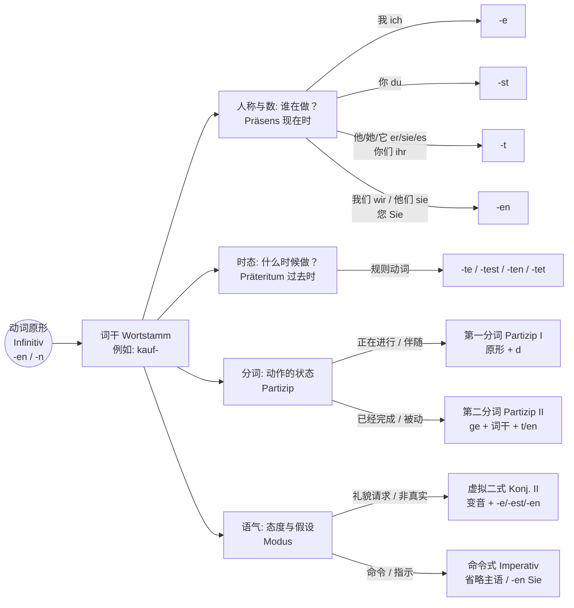
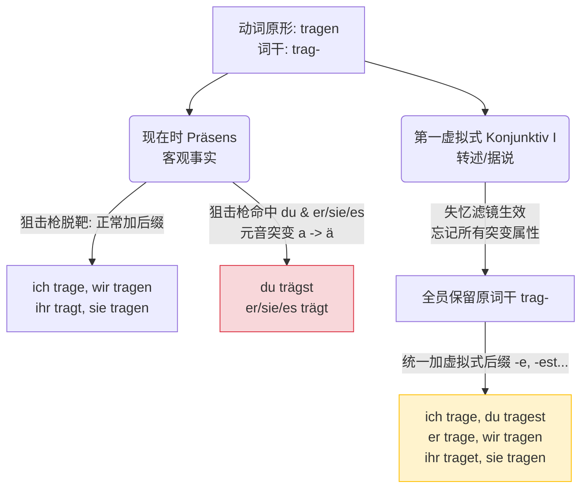

# 汇总所有动词变化

^oz3v62

### 德语动词的“瑞士军刀”类比

不要把动词变形当成死记硬背的表格。你可以把德语动词想象成一把**瑞士军刀**：

- **词干（Wortstamm）**：这是刀柄，包含了动作最核心的意义（比如：_kauf-_ 代表“买”，_mach-_ 代表“做”）。
- **词尾（Endung）**：这是你根据不同场景推出去的各种工具（刀片、开瓶器、剪刀）。你需要表达“谁在做”、“什么时候做”、“是一种什么状态或语气”，就给刀柄装上对应的“词尾”。

下面，我们通过一个直观的思维导图，先来看看这把“瑞士军刀”到底有多少种功能模块：

### 德语动词词尾形态全景大汇总

为了让你更直观地理解，我将所有动词的附加成分（词尾或前后缀）及其所代表的**语法含义**和**移民生活应用场景**总结成了下表。这正是你梳理 B 1-B 2 核心语法的绝佳工具。

| **变形形式 / 词尾**                                                  | **核心语法含义**                                      | **记忆口诀 / 本质逻辑**   | **移民生活实战场景与例句**                                                                                                                                    |
| -------------------------------------------------------------- | ----------------------------------------------- | ----------------- | -------------------------------------------------------------------------------------------------------------------------------------------------- |
| **-en** / **-n**      _(动词原形 Infinitiv)_           | 动作的“出厂设置”，查字典用的基础形态。                            | **“最纯粹的动作”**      | **求职简历：** 表示掌握的技能。      _Fließend Deutsch **sprechen**._ (流利地说德语。)                                                                     |
| **-e**                                                         | 第一人称单数 (ich)。强调“我”作为主体的动作。                      | **“我的专属尾巴”**      | **租房寻租：**      _Ich **suche** eine Wohnung._ (我正在找房子。)                                                                                 |
| **-st**                                                        | 第二人称单数 (du)。非正式的“你”。                            | **“熟人之间的对话”**     | **结交邻居/同事：**      _Wann **kommst** du zur Party?_ (你什么时候来派对？)                                                                          |
| **-t**                                                         | 第三人称单数 (er/sie/es) 或 第二人称复数 (ihr)。              | **“他者或群体”**       | **描述病情 (看医生)：**      _Mein Kopf **tut** weh. Der Hals **kratzt**._ (我头疼，嗓子发痒。)                                                         |
| **-en**      _(现在时复数)_                             | 第一/三人称复数 (wir/sie) 或 正式尊称 (Sie)。表示“多人”或“尊敬的对方”。 | **“复数与距离感”**      | **行政办事 (外管局/市政厅)：**      _Wir **möchten** uns anmelden._ (我们想办理登记。) / _Bitte **unterschreiben** Sie hier._ (请您在此签字。)                   |
| **-te / -test / -ten**      _(过去时 Präteritum)_     | 动作发生在过去，主要用于**书面语**、新闻或官方报告中。                   | **“t 代表历史的尘埃”**   | **阅读雇佣合同或官方信件：**      _Der Arbeitgeber **kündigte** den Vertrag._ (雇主解除了合同。)                                                           |
| **+ d**      _(第一分词 Partizip I)_                   | **动作正在发生**、且同时伴随其他动作。通常作形容词或副词使用。 形容词词尾变化也要有 | **“进行时的挂件”**      | **职场沟通 / 医院就诊：**      _Der Arzt kam **lächelnd** ins Zimmer._ (医生微笑着走进了房间。)                                                            |
| **ge- ... -t / -en**      _(第二分词 Partizip II)_     | 动作**已经完成**，或者用于构成**被动语态**。这是 B 1-B 2 极其关键的核心。   | **“ge- 代表被打包结案”** | **日常汇报 / 解决纠纷：**      _Ich habe die Miete bereits **bezahlt**._ (我已经付过房租了。) / _Das Paket wird morgen **geliefert**._ (包裹明天将被送达——被动语态)。 |
| **变音 (ä/ö/ü) + -e/en**      _(虚拟二式 Konjunktiv II)_ | 表示非真实情况、假设、或者**极度委婉礼貌的请求**。                     | **“加上两点，语气变软”**   | **预约服务 / 提出诉求 (B 2 必备)：**      _Ich **hätte** gern einen Termin._ (我希望能预约一个时间。) / _**Könnten** Sie mir bitte helfen?_ (您能帮帮我吗？)        |

### 重点突破：分词与被动语态（B 1-B 2 核心）

正如你提到的，“加上一个后缀代表正在发生的事”，这在德语中有着极其优雅的表达方式。在 B 2 级别，你不仅要会用简单的时态，还要学会用分词（Partizipien）来简化从句。

#### 1. 第一分词 (Partizip I) = 正在进行 / 主动

- **构造：** 动词原形 + **d**
- **移民场景：** 当你在外管局排队时，你是一个“正在等待的人”。
    - _warten_ (等待) -> _wartend_
    - _Die **wartenden** Menschen stehen vor der Ausländerbehörde._ (那些正在等待的人们站在外管局门前。)

#### 2. 第二分词 (Partizip II) = 已经完成 / 被动

- **构造：** **ge-** + 词干 + **-t** 或 **-en**
- **移民场景：** 当你签完租房合同，这个合同就是一个“被签署好的合同”。
    - _unterschreiben_ (签署) -> _unterschrieben_ (不可分动词不加 ge-)
    - _Ich bringe den **unterschriebenen** Mietvertrag mit._ (我带来了（已经）签署好的租房合同。)

### 德语大师的进阶提示

在接下来的六个月里，千万不要试图每天背诵几百个动词的所有变形。你的策略应该是“场景驱动”：

1. **去医院：** 重点掌握“第三人称单数（-t）”来描述身体部位（_Der Magen tut weh_），以及“现在完成时（ge-...-t）”描述过去的病史。
2. **写求职邮件：** 重点掌握“虚拟二式（-e/en + 变音）”来显得职业且礼貌（_Ich würde mich über ein Interview freuen_）。
3. **看租房/工作合同：** 重点识别“被动语态（werden + 第二分词）”，因为合同里全是规定（_Die Miete muss bis zum 3. Werktag bezahlt werden_ - 租金必须在第三个工作日前支付）。

你已经掌握了通过“词尾”来解码德语的思维方式，这非常棒！

为了确保我们稳扎稳打，我想先了解一下你目前的薄弱环节：**在上述这些变形中，你觉得哪一种（比如：虚拟二式的礼貌表达，还是第二分词在被动语态中的运用）在你的实际生活中最常遇到，却又最让你感到困惑？** 我们可以下节课专门针对它进行场景演练！

# 现在时 / 过去式 / 虚拟变化

### 规则动词专属对比表：现在时 vs 过去式 vs 第一虚拟式

|**人称代词**|**1. 现在时 (Präsens)客观描述当前的动作**|**2. 过去式 (Präteritum)客观描述过去的动作**|**3. 第一虚拟式 (Konjunktiv I)间接转述他人的话**|**🔑 模具规律总结 (接在不变的词干后)**|
|---|---|---|---|---|
|**ich** (我)|kauf**e**|kauf**te**|kauf**e**|现: **-e** \| 过: **-te** \| 虚: **-e**|
|**du** (你)|kauf**st**|kauf**test**|kauf**est**|现: **-st** \| 过: **-test** \| 虚: **-est**|
|**er/sie/es** (他/她/它)|kauf**t**|kauf**te**|kauf**e**|现: **-t** \| 过: **-te** \| 虚: **-e** (🚨核心区分点)|
|**wir** (我们)|kauf**en**|kauf**ten**|kauf**en**|现: **-en** \| 过: **-ten** \| 虚: **-en**|
|**ihr** (你们)|kauf**t**|kauf**tet**|kauf**et**|现: **-t** \| 过: **-tet** \| 虚: **-et**|
|**sie/Sie** (他们/您)|kauf**en**|kauf**ten**|kauf**en**|现: **-en** \| 过: **-ten** \| 虚: **-en**|

### 差一两个字母，意思真的会天差地别吗？

**绝对会！** 德语的动词就像精密钟表里的齿轮，稍微拨动一个字母，整个句子的“时空”和“真实度”就完全变了。

我们以第三人称单数 **er (他)** 和动词 **kommen (来)** 为例。请看这“一字之差”带来的戏剧性变化：

1. **er komm `t` (现在时):** “他来。” —— 这是**绝对的事实**，你亲眼所见。
2. **er k `a` m (过去式):** “他来过了。” —— 这是**过去的事实**，动作已经完成。
3. **er komm `e` (第一虚拟式):** “（据别人说）他要来。” —— 这是**间接引语 (Indirekte Rede)**。你在撇清责任：“这不是我说的，我只是个传话筒。”

你看，仅仅是把词尾的 **-t** 换成 **-e**，或者把核心元音 **-o-** 换成 **-a-**，句子就从“客观事实”变成了“道听途说”。在德国的职场、租房纠纷或跟政府部门打交道时，用错一个字母，往往意味着你承担了本不该承担的法律或承诺责任！

# 现在时和第一虚拟式不规则动词变化里面的规律

### 第一部分：第一虚拟式 (Konjunktiv I) —— “一视同仁的和平大使”

对于不规则动词（强变化动词），**第一虚拟式简直是学习者的福音**。

你可以把第一虚拟式想象成一个“一视同仁的和平大使”或者“失忆滤镜”。为什么这么说？因为在这个时态下，所有的不规则动词都会“忘记”自己的特殊身份，乖乖地回归动词原形的词干，**绝不发生任何元音变音（无 Umlaut）**，然后统一加上标准的虚拟式后缀！

- **唯一规律：** 动词原形词干 + 第一虚拟式标准后缀 (-e, -est, -e, -en, -et, -en)。
- **唯一特例：** 整个德语界，第一虚拟式只有一个词是真正不规则的，那就是 **sein (是)** —— _ich sei, du seiest, er sei, wir seien, ihr seiet, sie seien_。

我们以极度不规则的动词 **fahren (乘车/驾驶)** 和 **helfen (帮助)** 为例：

|**人称代词**|**动词原形词干**|**第一虚拟式 (转述)**|**大师解析 🔑**|
|---|---|---|---|
|**er / sie / es**|**fahr-**|er fahr**e**|绝不能写成 fähre！保留原形 a。|
|**er / sie / es**|**helf-**|er helf**e**|绝不能写成 hilfe！保留原形 e。|

> **大师总结：** 在第一虚拟式里，不管这个动词平时脾气多大、多不规则，只要它不是 sein，它的词干元音就**绝对不原形毕露，绝对不突变**。

### 第二部分：现在时 (Präsens) —— “精准打击的狙击枪”

现在，我们来看看不规则动词在**现在时**里的真面目。

很多同学害怕不规则动词的现在时，觉得它们变来变去。其实，你可以把不规则动词的现在时变化想象成一把“狙击枪”。

这把狙击枪的子弹，**永远只会精准打中两个人称**：

1. **du (你)**
2. **er / sie / es (他/她/它)**

对于其他人称（ich, wir, ihr, sie/Sie），狙击枪全部脱靶！这些“安全”的人称，变化规律和最普通的规则动词一模一样。

而被狙击枪打中的 **du** 和 **er/sie/es**，它们的**词干元音**会发生“基因突变”。这种突变逃不出以下三大门派：

#### 门派一：a 变 ä (a -> ä)

- **代表动词：** fahren (乘车), schlafen (睡觉), tragen (穿戴/承担), waschen (洗)
- **狙击演示 (fahren)：** ich fahre, **du fährst, er fährt**, wir fahren, ihr fahrt, sie fahren.

#### 门派二：e 变 i 或 ie (e -> i / ie)

- **代表动词：** helfen (帮助), sprechen (说), essen (吃), sehen (看见), lesen (阅读)
- **狙击演示 (helfen)：** ich helfe, **du hilfst, er hilft**, wir helfen, ihr helft, sie helfen.
- **狙击演示 (sehen)：** ich sehe, **du siehst, er sieht**, wir sehen, ihr seht, sie sehen.

#### 门派三：au 变 äu (au -> äu) 极少数

- **代表动词：** laufen (跑/运转)
- **狙击演示 (laufen)：** ich laufe, **du läufst, er läuft**, wir laufen, ihr lauft, sie laufen.

_(注：无论元音怎么突变，词尾依然要乖乖加上 -st 和 -t！)_

### 全景逻辑图：现在时 vs 第一虚拟式的分道扬镳

为了让你彻底看清一个“强变化动词”是如何在现在时里“基因突变”，又如何在第一虚拟式里“洗心革面”的，我为你生成了这张逻辑全景图。我们以 **tragen (承担/携带)** 为例：

代码段

