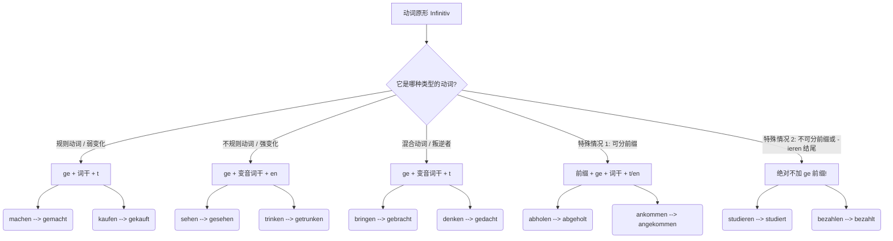
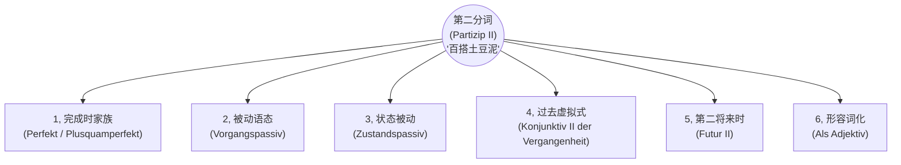

# 第二分词

---

## 一、 什么是“第二分词”？

如果用一个生动的比喻来说：动词原形（Infinitiv）就像是一块**“生的、未经雕琢的黏土”**，它仅仅代表一个动作的概念。而“第二分词”（Partizip II）则是经过高温窑烤后**“定型的陶瓷”**。

它最核心的灵魂就两个字：**“完成”**与**“被动”**。它不再是一个正在进行的动作，而是一个已经发生的事实，或者是一个承受动作的状态。

---

## 二、 第二分词的“锻造配方”（形态构成）

动词千千万，变成第二分词的规则也是有迹可循的。为了让你一目了然，我使用 Mermaid 构建了一个自上而下（top-down）的流程图 ，将动词的变形规则进行了分类：

代码段

**大师的点拨：** 很多同学在这个阶段会死记硬背。我的建议是：**不要孤立地背单词！** 遇到新动词，直接连着它的第二分词一起记（比如背 _bringen - brachte - hat gebracht_），形成肌肉记忆。

---

## 三、 第二分词的四大核心应用场景（B 1-B 2 必考）

掌握了怎么变形，我们来看看它在实际移民生活中是如何大显身手的。

### 1. 组装“完成时”（Perfekt）—— 职场与行政场景

这是 A 2-B 1 的基础。德语的完成时就像一个**汉堡包**：助动词（haben/sein）是顶层的面包，第二分词是底层的面包，它们牢牢地把句子里的其他成分（肉饼、生菜）夹在中间。这个结构我们称为“框形结构”。

- **找工作场景：** > "Ich **habe** meinen Lebenslauf gestern an die HR-Abteilung **geschickt**."

    > （我昨天把我的简历发给人力资源部了。）
    > 
    > _分析：_ _geschickt_ 作为句子的“底座”，被死死地钉在了句末。

### 2. 构成“过程被动语态”（Vorgangspassiv）—— 租房与契约场景

到了 B 1 和 B 2，你不能只会用主动语态。在德国，很多时候“谁做的”不重要，“事情被做”才重要。公式是：**werden + Partizip II**。

- **租房场景：**

    > "Der Mietvertrag **wird** morgen vom Vermieter **unterschrieben**."
    > 
    > （租房合同明天将由房东签署。）
    > 
    > _分析：_ 重点在于“合同被签署”这个过程，_unterschrieben_ 是不可分动词的第二分词。

### 3. 构成“状态被动语态”（Zustandspassiv）—— 医疗与突发场景

这是 B 2 考试的常见考点！它表示一个动作早已经结束了，我们现在只看**动作留下的“状态”**。公式是：**sein + Partizip II**。

- **医疗场景：**

    > "Mein rechter Arm **ist gebrochen**."
    > 
    > （我的右臂断了。）
    > 
    > _分析：_ 骨折的过程（Vorgang）已经结束了，现在医生看到的是“处于断裂状态”（Zustand）的手臂。

### 4. 华丽转身为“形容词”（Als Adjektiv）—— 办事与公文场景

到了 B 2 级别，第二分词不再仅仅是个动词形式，它会穿上形容词的外衣，直接放在名词前面作定语，并且**需要跟着名词进行词尾变化**。

- **行政局延签场景：**

    > "Bitte bringen Sie das **ausgefüllte** Formular und die **kopierten** Dokumente mit."
    > 
    > （请带上填好的表格和复印好的文件。）
    > 
    > _分析：_ _ausfüllen_ 变成 _ausgefüllt_，再加词尾 _-e_ 修饰 _Formular_。它把“表格已经被填好”这个动作，浓缩成了一个形容词属性。

---

## 四、 你的“六个月通关 B 2”独家学习规划

为了让你在半年内稳扎稳打，我为你制定了以下冲刺策略：

- **第 1-2 个月（夯实地基 A 2-B 1 入门）：** 彻底掌握强变化/弱变化动词的变形规律。每天练习造 5 个“汉堡包”完成时句子，习惯把第二分词扔到句末。
- **第 3-4 个月（攻克难关 B 1-B 2 过渡）：** 将重点转移到**过程被动语态（werden + Partizip II）**。在模拟找房、开户、看病的场景中，强迫自己多用被动语态表达。比如练习说“信被寄出了”、“工资被支付了”。
- **第 5-6 个月（B 2 终极升华）：** 熟练区分过程被动和状态被动。开始大量练习**扩展的分词定语**（Erweitertes Partizipialattribut），这也是 B 2 写作拿高分的杀手锏。例如，把长句浓缩为：_Das von mir gestern unterschriebene Dokument_（那份由我昨天签署的文件）。

---

只要方法对，每天积累，六个月拿下 B 2 绝对不是梦。我随时在这里为你纠错和答疑。

那么，为了检验你今天对**第二分词作形容词**以及**完成时**的掌握程度，你能试着用德语把下面这句话翻译出来，或者自己造一个类似的句子吗？

**“那个被填好的表格（das Formular），已经被我发送给外管局（die Ausländerbehörde）了。”**

# 所有的使用场景

^vjsf2z

> **💡 德语大师的类比时间：**
>
> 想象一下，动词原形（如 _machen_）就像是农场里刚拔出来的**生土豆**，不能直接当菜吃。
>
> 而“第二分词”（如 _gemacht_）就是经过加工的**“土豆泥”**。
>
> 你之前学过的“现在完成时”和“过去完成时”，只是拿土豆泥做了两道最基础的“土豆泥沙拉”。但这盆土豆泥还可以用来做“土豆饼”（被动语态）、“烤土豆派”（虚拟式）、甚至直接当配菜点缀（作形容词）！

它是一个“多面手”。今天，我们就把第二分词所有能参与的“菜谱”一次性给你列全！

为了更直观地理解，请先看这张“第二分词核心用法全景图”：

代码段

下面我们结合你在德国/德语区生活（租房、找工作、医疗、延签）的实际场景，挨个把它们吃透！

### 1. 完成时家族：你的老朋友

_(Perfekt & Plusquamperfekt)_

正如你所知，这是最基础的用法，表示动作已经完成。

- **结构：** _haben/sein_ + **Partizip II**
- **找工作场景：**
    - _Ich **habe** den Arbeitsvertrag **unterschrieben**._ (我已经签了工作合同。——现在完成时)
    - _Als ich beim Arzt ankam, **hatte** die Praxis schon **geschlossen**._ (当我到达诊所时，诊所已经关门了。——过去完成时)

### 2. 过程被动语态：强调“正在挨揍”

_(Vorgangspassiv)_

在行政事务和工作中，德国人极其喜欢用被动语态，因为这显得客观、官方。第二分词是被动语态的灵魂。

- **结构：** _werden_ + **Partizip II**
- **行政延签场景：**
    - _Ihr Visumantrag **wird** zurzeit **geprüft**._ (您的签证申请目前正在被审核。——你不需要知道是谁在审核，重点是“被审核”这个动作。)
- **医疗场景：**
    - _Der Patient **muss** sofort **operiert werden**._ (这位病人必须立刻被手术。——带有情态动词的被动语态，B 1/B 2 必考！)

### 3. 状态被动：强调“木已成舟”

_(Zustandspassiv)_

这是过程被动语态的“结果”。动作已经结束了，留下了一个状态。这在租房时极其常见。

- **结构：** _sein_ + **Partizip II**
- **租房场景：**
    - _Die Wohnung **ist** komplett **möbliert**._ (这套公寓是完全带家具的。——强调“已经配好家具”的现存状态。)
    - _Die Kaution **ist** bereits **bezahlt**._ (押金已经支付完毕了。——房东最爱听的一句话。)

### 4. 第二虚拟式过去时：后悔药与马后炮

_(Konjunktiv II der Vergangenheit)_

回答你的问题：**虚拟式能用第二分词吗？绝对能！而且是表达“过去未发生的假设（遗憾/后悔/非现实）”的唯一方式。** 这是 B 2 级别最核心的语法点之一。

- **结构：** _hätte / wäre_ + **Partizip II**
- **医疗场景（假设与后悔）：**
    - _Wenn ich die Tabletten regelmäßig **genommen hätte**, **wäre** ich schneller wieder gesund **geworden**._ (如果我当时按时吃了药，我本可以好得更快的。——实际上：没吃药，病没好。)
- **找工作场景（错失良机）：**
    - _Hättest du dich auf die Stelle **beworben**, **hätten** sie dich bestimmt **eingestellt**!_ (要是你当时申请了那个职位，他们肯定早就录用你了！——实际上：你没申请。)

### 5. 第二将来时：未来的“过去时”

_(Futur II)_

再次回答你的问题：**将来时能用到吗？能！这叫第二将来时（Futur II）。** 它用来表示**在未来某个时间点，动作已经完成**。在向外管局或老板立下“军令状”时非常好用。

- **结构：** _werden_ (第一位/第二位) + **Partizip II** + _haben/sein_ (句末)
- **行政/学习场景（立下 Flag）：**
    - _Bis Ende Dezember **werde** ich das B 2-Zertifikat **bestanden haben**._ (到十二月底，我将已经通过 B 2 考试了。——向签证官展示你的决心。)
    - _Morgen um 18 Uhr **werde** ich das Formular **ausgefüllt haben**._ (明天下午 6 点之前，我将已经把表格填好了。)

### 6. 作为形容词：高阶德语的入场券

_(Partizip II als Adjektiv/Attribut)_

这是 B 2 级别开始大量出现，C 1 级别满天飞的用法。把第二分词直接放在名词前面当形容词用，表示被动或已完成的状态。需要加上形容词词尾变化。

- **行政/找工作场景：**
    - _Bitte bringen Sie das **ausgefüllte** Formular mit._ (请您带上**被填好的**表格。 -> _ausfüllen_ 的第二分词 _ausgefüllt_ 作形容词。)
    - _Ich suche eine **gut bezahlte** Arbeit._ (我正在寻找一份**报酬优厚的**工作。)
    - _Der **unterschriebene** Mietvertrag ist bindend._ (**签署好的**租房合同是具有法律约束力的。)

### 总结与致胜秘籍

你看，从普通的时态，到高冷的被动语态，再到充满幻想的虚拟式和立下誓言的将来时，**第二分词无处不在**。这就是为什么我要求你一定要把不规则动词的第二分词表（比如 _gehen -> gegangen_, _bringen -> gebracht_）背得滚瓜烂熟。因为只要你掌握了“土豆泥”的做法，这六大硬菜你都能信手拈来！
