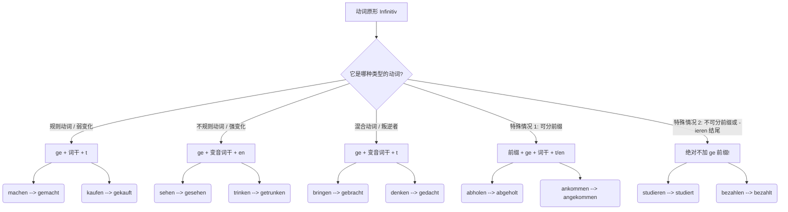
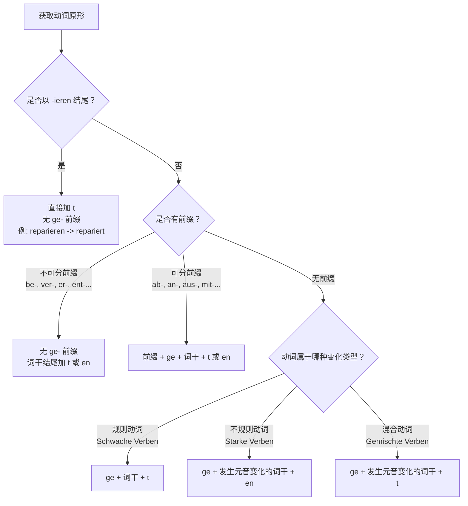
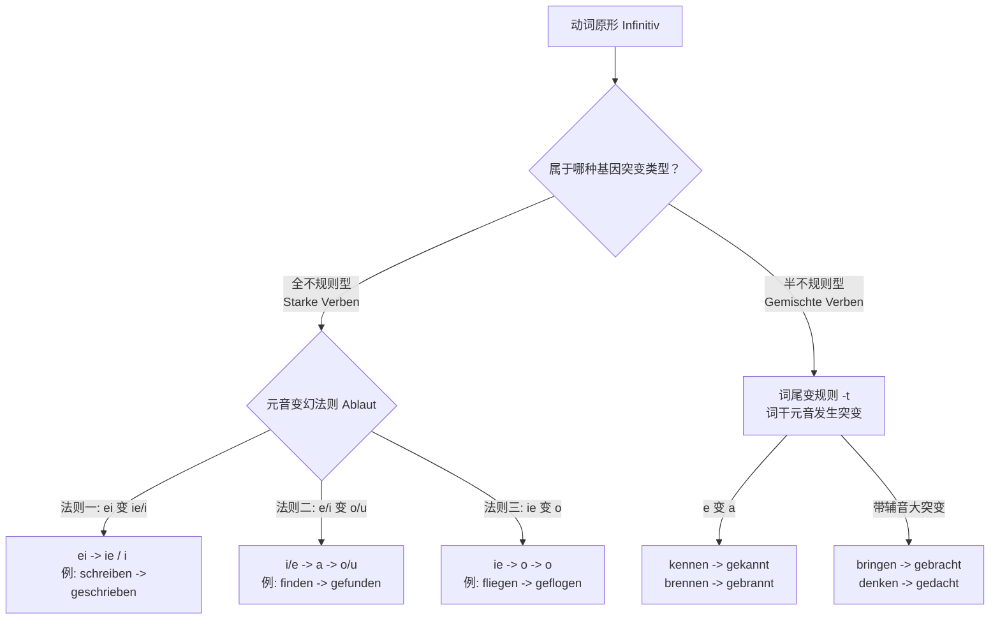
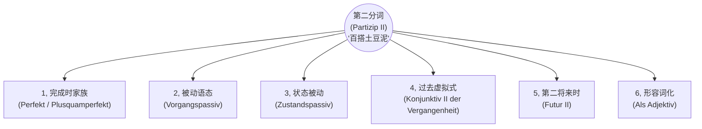
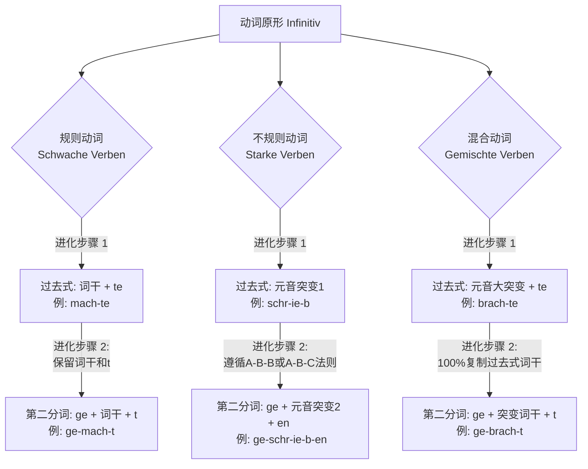

---
aliases:
  - 过去分词
  - 第二分词
---

# 第二分词

过去分词和第二分词属于同一个东西。

[[语言学习/德语/公共知识语法/时态#^WLiIc43r|100%]]

## 一、 什么是“第二分词”？

如果用一个生动的比喻来说：动词原形（Infinitiv）就像是一块**“生的、未经雕琢的黏土”**，它仅仅代表一个动作的概念。而“第二分词”（Partizip II）则是经过高温窑烤后**“定型的陶瓷”**。

它最核心的灵魂就两个字：**“完成”**与**“被动”**。它不再是一个正在进行的动作，而是一个已经发生的事实，或者是一个承受动作的状态。

---

## 二、 第二分词的“锻造配方”（形态构成）

动词千千万，变成第二分词的规则也是有迹可循的。为了让你一目了然，我使用 Mermaid 构建了一个自上而下（top-down）的流程图 ，将动词的变形规则进行了分类：

代码段

**大师的点拨：** 很多同学在这个阶段会死记硬背。我的建议是：**不要孤立地背单词！** 遇到新动词，直接连着它的第二分词一起记（比如背 _bringen - brachte - hat gebracht_），形成肌肉记忆。

掌握了第二分词，你就掌握了德语的“时光机”和“被动技能”，因为它是构成完成时（Perfekt）**和**被动语态（Passiv）的核心基石。

为了让你更容易理解，我们可以把组装第二分词想象成“制作三明治”：

大部分情况下，你需要两片面包（前缀和后缀）把中间的肉饼（动词词干）夹起来。但根据肉饼的种类不同（动词的词性），你需要的面包和酱料也会发生变化；有时候，甚至不需要顶层的面包！

下面我为你制作了一张动词变化逻辑的流程图，你可以把它当作组装第二分词的“说明书”。

代码段

接下来，我们逐步拆解这六大核心变化规则，并结合你在德国实际生活中会遇到的场景进行实战演练。

### 1. 规则动词（Schwache Verben）：最标准的“三明治”

这是最基础的规则。对于规则动词，我们只需要遵循标准公式。

- **变化公式：** `ge` + 词干 + `t`
- **特殊注意：** 如果动词词干以 `-d`, `-t`, `-m`, `-n` 结尾，为了发音方便，需要在加 `t` 之前垫一个元音 `e`（即加 `et`）。

|**动词原形**|**词干**|**第二分词**|**移民生活场景例句**|
|---|---|---|---|
|**machen** (做)|mach|**gemacht**|**行政事务：** Ich habe einen Termin bei der Ausländerbehörde **gemacht**. (我在外管局预约了时间。)|
|**arbeiten** (工作)|arbeit|**gearbeitet**|**求职：** Ich habe drei Jahre als Ingenieur **gearbeitet**. (我作为工程师工作了三年。)|

### 2. 不规则动词（Starke Verben）：换了肉饼的“三明治”

不规则动词的特点是它的后缀是 `-en`，而且中间的“肉饼”（词干的元音）通常会发生改变，需要大家在学习时多加记忆。

- **变化公式：** `ge` + (常发生元音变化的)词干 + `en`

|**动词原形**|**词干变化**|**第二分词**|**移民生活场景例句**|
|---|---|---|---|
|**finden** (找到)|find -> fund|**gefunden**|**租房：** Wir haben endlich eine passende Wohnung **gefunden**. (我们终于找到了一套合适的公寓。)|
|**schreiben** (写)|schreib -> schrieb|**geschrieben**|**求职：** Ich habe gestern meinen Lebenslauf **geschrieben**. (我昨天写好了我的简历。)|

### 3. 混合动词（Gemischte Verben）：两者的结合体

混合动词结合了规则和不规则动词的特点：它的词干元音会像不规则动词一样发生改变，但它的词尾却像规则动词一样加 `-t`。

- **变化公式：** `ge` + 发生元音变化的词干 + `t`

|**动词原形**|**词干变化**|**第二分词**|**移民生活场景例句**|
|---|---|---|---|
|**bringen** (带来)|bring -> brach|**gebracht**|**医疗：** Der Krankenwagen hat ihn ins Krankenhaus **gebracht**. (救护车把他送到了医院。)|
|**wissen** (知道)|wiss -> wuss|**gewusst**|**行政事务：** Das habe ich nicht **gewusst**, dass ich dieses Formular brauche. (我之前不知道我需要填这张表。)|

### 4. 可分动词（Trennbare Verben）：“ge” 被夹在中间

在处理带有可分前缀（如 `ab-`, `an-`, `auf-`, `aus-`, `mit-`, `zu-` 等）的动词时，`ge-` 这个前缀会像一片火腿一样，被硬生生地塞进前缀和动词核心之间。核心动词的变化依然遵循上述规则（规则、不规则或混合）。

- **变化公式：** 可分前缀 + `ge` + 核心动词变化

|**动词原形**|**变化过程**|**第二分词**|**移民生活场景例句**|
|---|---|---|---|
|**ausfüllen** (填写)|aus + ge + füll + t|**ausgefüllt**|**行政事务：** Ich habe den Antrag auf Aufenthaltstitel **ausgefüllt**. (我填好了居留许可申请表。)|
|**mitbringen** (带来)|mit + ge + brach + t|**mitgebracht**|**求职：** Ich habe alle meine Zeugnisse zum Interview **mitgebracht**. (我把所有的证书都带到面试现场了。)|

### 5. 不可分动词（Untrennbare Verben）：没有顶层面包的“开放式三明治”

带有不可分前缀的动词（口诀：`be-`, `emp-`, `ent-`, `er-`, `ge-`, `miss-`, `ver-`, `zer-`），它们非常“高冷”，**绝对不加** `ge-`。我们只在词尾加上 `-t` 或 `-en`（取决于核心动词原本的规则）。

- **变化公式：** 无 `ge` + 词干 + `t`/`en`

|**动词原形**|**变化过程**|**第二分词**|**移民生活场景例句**|
|---|---|---|---|
|**unterschreiben** (签名)|unter + schrieb + en|**unterschrieben**|**租房：** Ich habe den Mietvertrag gestern **unterschrieben**. (我昨天在租房合同上签字了。)|
|**verstehen** (理解)|ver + stand + en|**verstanden**|**医疗：** Ich habe die Diagnose des Arztes gut **verstanden**. (我很好地理解了医生的诊断。)|

### 6. 以 -ieren 结尾的动词：永远不加 ge-

这类动词绝大多数是外来词（来自法语或拉丁语，比如 studieren, informieren）。它们的变化规则极其简单粗暴：**去掉词尾的 -en，直接加 -t，并且前面绝对不加 ge-**。

- **变化公式：** 词干 + `t`

|**动词原形**|**第二分词**|**移民生活场景例句**|
|---|---|---|
|**informieren** (通知/了解信息)|**informiert**|**行政事务：** Ich habe mich über die Visumvorgaben **informiert**. (我了解了关于签证的规定。)|
|**reparieren** (修理)|**repariert**|**租房：** Der Hausmeister hat die Heizung **repariert**. (房屋管理员把暖气修好了。)|

# 元音变化[[过去分词变化#过去分词不规则变化|过去分词不规则变化]]

首先，作为一个严谨的“德语大师”，我必须为你澄清一个德语语法界的“铁律”：**规则动词（Schwache Verben）是绝对忠诚的，它们的词干元音在任何时态和变化下都绝对不会发生改变！**

如果你看到一个动词在变化时，中间的单元音发生了改变（比如变音、换音），它**绝对不是**规则动词。你脑海中浮现的“词干需要变元音”的印象，其实来源于以下两种情况：

1. **现在时（Präsens）的换音/变音：** 比如 _fahren_ 变成 _du fährst_，_sprechen_ 变成 _du sprichst_。注意，发生这种变化的动词，全都是**不规则动词（Starke Verben）**。
2. **混合动词（Gemischte Verben）：** 它们有一部分规则动词的特征（词尾加 **-t**），但又像不规则动词一样改变了词干元音（如 _denken_ -> _gedacht_）。

为了让你不再被这些“变形金刚”搞晕，我们可以用一个“基因突变”的类比来彻底攻克不规则动词（Starke Verben）和混合动词（Gemischte Verben）的元音变化规律。

正如 The Mermaid Guide to Text-Based Diagramming and Visualization 这份指南中展示的那样，通过结构化的流程图能极大地提升复杂信息的可视化和逻辑梳理效率。我在这里为你绘制了一张“动词元音突变图谱”，专门破解 B 1-B 2 核心的变音规律：

代码段

B 1-B 2 级别的德语学习，死记硬背已经行不通了。我们要像破译密码一样去掌握这些“元音变幻法则”（Ablautreihen）。只要记住这几个核心阵营，就能解决 80%以上的不规则第二分词！

### 第一大阵营：不规则动词的“元音漂移法则”

不规则动词的第二分词永远以 **-en** 结尾，但中间的元音是有规律可循的。

#### 法则一：`ei` 变成 `ie` (或者短音 `i`)

如果你看到动词原形里有 `ei`，它的第二分词大概率会把字母顺序反过来，变成 `ie`。

- **schreiben** (写) -> **geschrieben**
- **bleiben** (停留/保持) -> **geblieben**
- **unterschreiben** (签名) -> **unterschrieben**

> **移民生活实战（行政与租房）：**
>
> - Ich bin drei Jahre bei diesem Arbeitgeber **geblieben**. (我在这家雇主这里**待了**三年。—— _续签签证场景_)
>     
> - Haben Sie den Mietvertrag schon **unterschrieben**? (您已经**签署**租房合同了吗？—— _租房场景_)

#### 法则二：`i` 或 `e` 变成 `o` 或 `u`

这是德语中最古老的一批词汇，元音通常会在过去时变成 `a`，在第二分词时变成 `o` 或 `u`。

- **finden** (找到) -> **gefunden**
- **sprechen** (说话) -> **gesprochen**
- **helfen** (帮助) -> **geholfen**

> **移民生活实战（求职与医疗）：**
>
> - Ich habe noch keine passende Stelle **gefunden**. (我还没有**找到**合适的职位。—— _求职场景_)
>     
> - Die Medikamente haben mir sehr gut **geholfen**. (这些药对我**帮助**很大。—— _医疗场景_)

#### 法则三：`ie` 变成 `o`

- **fliegen** (飞) -> **geflogen**
- **schließen** (关闭/缔结) -> **geschlossen**
- **ziehen** (拉/搬家) -> **gezogen**

> **移民生活实战（安居与合同）：**
>
> - Wir sind letzten Monat nach München **umgezogen**. (我们上个月**搬到**慕尼黑了。—— _搬家入户登记场景_)
>     
> - Ich habe eine Krankenversicherung **abgeschlossen**. (我**缔结/购买**了一份医疗保险。—— _保险场景_)

### 第二大阵营：混合动词的“伪装术”

这就是你可能觉得“漏掉”的那一部分。混合动词（Gemischte Verben）是语法界最狡猾的伪装者：

- **伪装成规则动词：** 第二分词以 **-t** 结尾。
- **暴露不规则本质：** 词干元音发生了剧烈的变异！

这类动词数量不多，但全都是 B 1-B 2 级别每天都要用的超高频词汇。你只需要记住以下这几个核心词：

#### 1. 纯粹的 `e` 突变成 `a`

这类词的共同点是，原形里的 `e` 在第二分词里统统变成了 `a`，结尾加 `t`。

- **kennen** (认识) -> **gekannt**
- **brennen** (燃烧) -> **gebrannt**
- **nennen** (称呼/命名) -> **genannt**

> **移民生活实战（人际与职场）：**
>
> - Ich habe die neuen Regeln nicht **gekannt**. (我之前不**知道/认识**这些新规定。—— _行政沟通_)
>     
> - Der Chef hat meinen Namen **genannt**. (老板**点了**我的名字。—— _职场场景_)

#### 2. “面目全非”的终极突变族

有几个极度常用的动词，不仅元音突变，连辅音也跟着一起变成了 `ch` 或 `ss`。这是德语语法里必须死记的“VIP 特权词”。

- **bringen** (带来) -> **gebracht** (不仅 i 变 a，ng 还变成了 ch)
- **denken** (思考) -> **gedacht** (e 变 a，nk 变 ch)
- **wissen** (知道) -> **gewusst** (i 变 u，ss 保持不变)

> **移民生活实战（日常全场景）：**
>
> - Haben Sie alle Dokumente **mitgebracht**? (您把所有文件都**带来**了吗？—— _外管局延签_)
>     
> - Das habe ich mir schon **gedacht**! (我早就**想到**了！—— _日常沟通_)
>     
> - Ich habe nicht **gewusst**, dass der Arzt heute Urlaub hat. (我不**知道**医生今天休假。—— _医疗就诊_)

总结一下：规则动词是“乖宝宝”，绝不改变元音；只要元音发生了改变，它要么是遵循“换音法则”的不规则动词（结尾是 -en），要么是披着规则外衣的混合动词（结尾是 -t）。带着这种“找规律”的思维去阅读德语文章，你的大脑会自动开始将新学的动词归类，六个月突破 B 2 绝对大有希望！

# 所有的使用场景

^vjsf2z

> **💡 德语大师的类比时间：**
>
> 想象一下，动词原形（如 _machen_）就像是农场里刚拔出来的**生土豆**，不能直接当菜吃。
>
> 而“第二分词”（如 _gemacht_）就是经过加工的**“土豆泥”**。
>
> 你之前学过的“现在完成时”和“过去完成时”，只是拿土豆泥做了两道最基础的“土豆泥沙拉”。但这盆土豆泥还可以用来做“土豆饼”（被动语态）、“烤土豆派”（虚拟式）、甚至直接当配菜点缀（作形容词）！

它是一个“多面手”。今天，我们就把第二分词所有能参与的“菜谱”一次性给你列全！

为了更直观地理解，请先看这张“第二分词核心用法全景图”：

代码段

下面我们结合你在德国/德语区生活（租房、找工作、医疗、延签）的实际场景，挨个把它们吃透！

### 1. 完成时家族：你的老朋友

_(Perfekt & Plusquamperfekt)_

正如你所知，这是最基础的用法，表示动作已经完成。

- **结构：** _haben/sein_ + **Partizip II**
- **找工作场景：**
    - _Ich **habe** den Arbeitsvertrag **unterschrieben**._ (我已经签了工作合同。——现在完成时)
    - _Als ich beim Arzt ankam, **hatte** die Praxis schon **geschlossen**._ (当我到达诊所时，诊所已经关门了。——过去完成时)

### 2. 过程被动语态：强调“正在挨揍”

_(Vorgangspassiv)_

在行政事务和工作中，德国人极其喜欢用被动语态，因为这显得客观、官方。第二分词是被动语态的灵魂。

- **结构：** _werden_ + **Partizip II**
- **行政延签场景：**
    - _Ihr Visumantrag **wird** zurzeit **geprüft**._ (您的签证申请目前正在被审核。——你不需要知道是谁在审核，重点是“被审核”这个动作。)
- **医疗场景：**
    - _Der Patient **muss** sofort **operiert werden**._ (这位病人必须立刻被手术。——带有情态动词的被动语态，B 1/B 2 必考！)

### 3. 状态被动：强调“木已成舟”

_(Zustandspassiv)_

这是过程被动语态的“结果”。动作已经结束了，留下了一个状态。这在租房时极其常见。

- **结构：** _sein_ + **Partizip II**
- **租房场景：**
    - _Die Wohnung **ist** komplett **möbliert**._ (这套公寓是完全带家具的。——强调“已经配好家具”的现存状态。)
    - _Die Kaution **ist** bereits **bezahlt**._ (押金已经支付完毕了。——房东最爱听的一句话。)

### 4. 第二虚拟式过去时：后悔药与马后炮

_(Konjunktiv II der Vergangenheit)_

回答你的问题：**虚拟式能用第二分词吗？绝对能！而且是表达“过去未发生的假设（遗憾/后悔/非现实）”的唯一方式。** 这是 B 2 级别最核心的语法点之一。

- **结构：** _hätte / wäre_ + **Partizip II**
- **医疗场景（假设与后悔）：**
    - _Wenn ich die Tabletten regelmäßig **genommen hätte**, **wäre** ich schneller wieder gesund **geworden**._ (如果我当时按时吃了药，我本可以好得更快的。——实际上：没吃药，病没好。)
- **找工作场景（错失良机）：**
    - _Hättest du dich auf die Stelle **beworben**, **hätten** sie dich bestimmt **eingestellt**!_ (要是你当时申请了那个职位，他们肯定早就录用你了！——实际上：你没申请。)

### 5. 第二将来时：未来的“过去时”

_(Futur II)_

再次回答你的问题：**将来时能用到吗？能！这叫第二将来时（Futur II）。** 它用来表示**在未来某个时间点，动作已经完成**。在向外管局或老板立下“军令状”时非常好用。

- **结构：** _werden_ (第一位/第二位) + **Partizip II** + _haben/sein_ (句末)
- **行政/学习场景（立下 Flag）：**
    - _Bis Ende Dezember **werde** ich das B 2-Zertifikat **bestanden haben**._ (到十二月底，我将已经通过 B 2 考试了。——向签证官展示你的决心。)
    - _Morgen um 18 Uhr **werde** ich das Formular **ausgefüllt haben**._ (明天下午 6 点之前，我将已经把表格填好了。)

### 6. 作为形容词：高阶德语的入场券

_(Partizip II als Adjektiv/Attribut)_

这是 B 2 级别开始大量出现，C 1 级别满天飞的用法。把第二分词直接放在名词前面当形容词用，表示被动或已完成的状态。需要加上形容词词尾变化。

- **行政/找工作场景：**
    - _Bitte bringen Sie das **ausgefüllte** Formular mit._ (请您带上**被填好的**表格。 -> _ausfüllen_ 的第二分词 _ausgefüllt_ 作形容词。)
    - _Ich suche eine **gut bezahlte** Arbeit._ (我正在寻找一份**报酬优厚的**工作。)
    - _Der **unterschriebene** Mietvertrag ist bindend._ (**签署好的**租房合同是具有法律约束力的。)

### 总结与致胜秘籍

你看，从普通的时态，到高冷的被动语态，再到充满幻想的虚拟式和立下誓言的将来时，**第二分词无处不在**。这就是为什么我要求你一定要把不规则动词的第二分词表（比如 _gehen -> gegangen_, _bringen -> gebracht_）背得滚瓜烂熟。因为只要你掌握了“土豆泥”的做法，这六大硬菜你都能信手拈来！

# 过去式变化和第二分词之间是否有联系

过去式（Präteritum）和第二分词（Partizip II）之间不仅有联系，而且它们简直是“打断骨头连着筋”的亲兄弟！

在德国传统的语言教学中，老师绝对不会孤立地教你某一个动词的过去式或第二分词，而是要求你必须把它们当作一个“三连击套餐”（Stammformen，动词基本三态）一口气背下来：

**原形 (Infinitiv) —— 过去式 (Präteritum) —— 第二分词 (Partizip II)**

比如：_machen - machte - gemacht_ 或者 _schreiben - schrieb - geschrieben_。

为什么必须连在一起学？因为它们的变化逻辑是**高度捆绑、相互映射**的。为了让你彻底看清它们之间的“血缘关系”，我们把这个过程想象成“动词的基因进化链”。

让我们先通过一张 Mermaid 图谱，直观地看看这两种形态在三大类动词中是如何“共享基因”的：

代码段

现在，我们把这三大类动词的“进化规律”层层剖析。掌握了这个底层逻辑，你以后记动词就不再是孤立地死记硬背，而是能举一反三！

### 1. 规则动词：最忠诚的基因传承

规则动词在过去式和第二分词之间，展现了绝对的“基因稳定”。它们的共同点是：**动词词干绝对不发生任何改变，并且都带有一个标志性的辅音字母 `t`。**

- **过去式：** 词干 + **te**
- **第二分词：** ge + 词干 + **t**

**内在联系：** 第二分词其实就是把过去式的词尾 `e` 砍掉，然后在前面加上 `ge`。它们共享同一个核心词干和核心辅音 `t`。

|**动词原形 (A)**|**过去式 (B)**|**第二分词 (C)**|**移民生活场景应用**|
|---|---|---|---|
|**kaufen** (买)|kauf**te**|ge-kauf-**t**|**安居：** Ich **kaufte** gestern Möbel und habe sie sofort **gekauft**. (我昨天买家具了，而且是立刻就买下来的。 _—— 这里纯为展示联系，通常口语用完成时，书面用过去时_)|
|**fragen** (问)|frag**te**|ge-frag-**t**|**行政：** Der Beamte **fragte** mich nach dem Pass. Ich habe ihn bereits **gefragt**. (官员问我要护照。我已经问过他了。)|

### 2. 混合动词：100% 共享“突变词干”的连体婴儿

如果说规则动词是基因稳定，那么**混合动词（Gemischte Verben）的过去式和第二分词，简直就是共用一个大脑的“连体婴儿”！**

它们最大的联系在于：**过去式发生元音突变后形成的那个“新词干”，会 100%原封不动地被第二分词直接拿去用！** 而且它们也都带有标志性的辅音 `t`。

- **过去式：** 突变词干 + **te**
- **第二分词：** ge + 突变词干 + **t**

这是你最容易实现“买一送一”的区域，记住了过去式，就等于记住了第二分词！

|**动词原形 (A)**|**过去式 (B)**|**第二分词 (C)**|**移民生活场景应用**|
|---|---|---|---|
|**bringen** (带来)|**brach**-te|ge-**brach**-t|**求职面试：** Ich **brachte** Zeugnisse mit. / Ich habe sie **gebracht**. (我带来了证书。—— _注意看，brach 这个变异词干被两兄弟完美共享_)|
|**denken** (思考)|**dach**-te|ge-**dach**-t|**日常沟通：** Ich **dachte** mir das schon! Das habe ich nicht **gedacht**. (我当时就这么想！我没料到是这样。)|
|**kennen** (认识)|**kann**-te|ge-**kann**-t|**人际交往：** Ich **kannte** ihn nicht. / Ich habe ihn nie **gekannt**. (我当时不认识他。/ 我从来都没认识过他。)|

### 3. 不规则动词：密码学中的“A-B-B”与“A-B-C”法则

不规则动词（Starke Verben）看起来最让人头疼，但它们在过去式和第二分词之间的元音变化，其实遵循着严格的“元音漂移序列”（Ablautreihen）。

在这类动词中，过去式的词干元音和第二分词的词干元音有着极强的**关联性**，主要分为三种“阵型”：

#### 阵型一：A-B-B 型（过去式与第二分词同心同德）

在这个阵型里，**过去式和第二分词的元音突变是完全一样的！** 这意味着，你只需要背一种元音变化，就能搞定两个时态。

_常见规律：原形如果是 `ei`，过去式和第二分词通常都是 `ie`。原形如果是 `ie`，过去式和第二分词通常都是 `o`。_

|**动词原形 (A)**|**过去式 (B)**|**第二分词 (B)**|**移民生活场景应用**|
|---|---|---|---|
|**schreiben** (写)|schr**ie**b|ge-schr**ie**b-en|**签合同：** Ich **schrieb** dem Vermieter, dass ich den Vertrag **unterschrieben** habe. (我写信给房东说我已经签好合同了。)|
|**fliegen** (飞)|fl**o**g|ge-fl**o**g-en|**入境：** Ich **flog** nach Frankfurt und bin gut **geflogen**. (我飞往法兰克福，且飞行顺利。)|
|**bleiben** (停留)|bl**ie**b|ge-bl**ie**b-en|**签证延期：** Ich **blieb** in Deutschland. (我留在了德国。- _过去式和第二分词共享 ie_)|

#### 阵型二：A-B-C 型（三代人长得都不一样）

在这个阵型中，原形、过去式、第二分词的元音各不相同。虽然看似复杂，但它的序列非常固定，最典型的是 ** `i -> a -> u` ** 序列。

你只要在脑海中刻下 `i-a-u` 这个密码，就能破解一大批高频词！

|**动词原形 (A)**|**过去式 (B)**|**第二分词 (C)**|**移民生活场景应用**|
|---|---|---|---|
|**finden** (找)|f**a**nd|ge-f**u**nd-en|**找房：** Ich **fand** eine Wohnung. Endlich habe ich eine **gefunden**. (我（之前）在找房子。终于找到一套了。)|
|**singen** (唱)|s**a**ng|ge-s**u**ng-en|**融入社区：** Wir **sangen** zusammen im Chor. (我们曾一起在合唱团唱歌。)|
|**trinken** (喝)|tr**a**nk|ge-tr**u**nk-en|**医疗问诊：** Der Arzt fragte, ob ich gestern genug **getrunken** habe. (医生问我昨天是否喝了足够的水。)|

#### 阵型三：A-B-A 型（第二分词“返祖”现象）

这类动词的过去式发生了元音变化，但**第二分词的元音又神奇地“变回”了跟原形一模一样！**

_常见规律：原形含 `a` -> 过去式变 `u` 或 `ie` -> 第二分词恢复成 `a`。_

|**动词原形 (A)**|**过去式 (B)**|**第二分词 (A)**|**移民生活场景应用**|
|---|---|---|---|
|**fahren** (乘车)|f**u**hr|ge-f**a**hr-en|**交通通勤：** Ich **fuhr** mit dem Bus, weil ich noch nie Auto **gefahren** bin. (我坐公交车，因为我以前从没开过车。)|
|**fallen** (跌倒)|f**ie**l|ge-f**a**ll-en|**医疗急救：** Er **fiel** auf die Straße und ist schwer **gefallen**. (他摔到了街上，摔得很重。)|
|**kommen** (来)|k**a**m|ge-k**o**mm-en|**行政报到：** Ich **kam** pünktlich an. (我准时到达了。 - _o 变 a 又变回 o_)|

### 大师的通关秘籍与学习建议

看懂了这些联系，你就会明白为什么德国人背单词是背“三态”了吧？

**过去式和第二分词从来都不是孤立存在的，它们是动词在这个变形矩阵中的两个坐标点。**

**对于六个月冲刺 B 2 的学习者，我给你制定以下“肌肉记忆”训练法：**

1. **彻底抛弃单独记词：** 从今天起，遇到任何一个新动词，如果它是不规则的，必须把三连击一起念出来并写在单词本上（比如念经一样读：_gehen-ging-gegangen, helfen-half-geholfen_）。
2. **场景关联法：** 不要干巴巴地背。想象你正在向德国警察或外管局官员陈述一段过去的事情。德国的书面语或新闻报道极多地使用**过去式**（叙述历史或刚发生的事），而在对话中则大量使用**完成时**（需要第二分词）。所以把它们连在一起学，你既能看懂官方信件，又能开口日常交流！

你的洞察力非常强，抓住过去式和第二分词的规律，其实就等于打通了德语时态和语态的任督二脉。怎么样，我们现在的脉络是不是彻底清晰了？接下来你是想趁热打铁挑战用它们造几个从句，还是看看它们在被动语态中是如何呼风唤雨的？

# 第二分词规则变化和不规则变化的规律

^gl9ggy

#### 破局法则 1：后缀与前缀的一秒判定

1. **后缀 `-ieren` 俱乐部（绝对规则）：** 只要看到以 `-ieren` 结尾的动词，100%是外来词，100%是**规则变化（弱变化）**，而且**绝对不加 `ge-` **！只在词干后加 `-t`。
    - _医疗：_ operieren -> Der Patient wurde erfolgreich **operiert**. (病人被成功手术了。)
    - _生活：_ reservieren -> Ich habe einen Tisch **reserviert**. (我预订了一张桌子。)
2. **不可分前缀护体（绝对无 `ge-`）：** 动词前带着不可分前缀（如 be-, emp-, ent-, er-, ver-, zer- 等），二分词**绝对不加 `ge-` **。至于词尾是 `-en` 还是 `-t`，取决于它的原动词。
    - _行政（强变化原词）：_ unterschreiben (签字) -> Ich habe das Dokument **unterschrieben**. (我签署了文件。)
    - _生活（弱变化原词）：_ bezahlen (支付) -> Die Rechnung ist schon **bezahlt**. (账单已经付过了。)

#### 破局法则 2：元音交替音步法 (Ablautreihen)

对于那些强变化动词，德国人也不是瞎变的，它们遵循着古老的“押韵”规律。您可以把它们按元音变化分组记忆，大脑对韵律的记忆力远强于死记：

- **“ei - ie - ie” 组：**
    - bleiben (停留) -> geblieben
    - schreiben (写) -> geschrieben
    - steigen (上升) -> gestiegen
- **“i - a - u” 组：**
    - singen (唱歌) -> gesungen
    - trinken (喝) -> getrunken
    - finden (找到) -> gefunden
