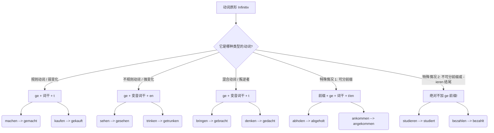
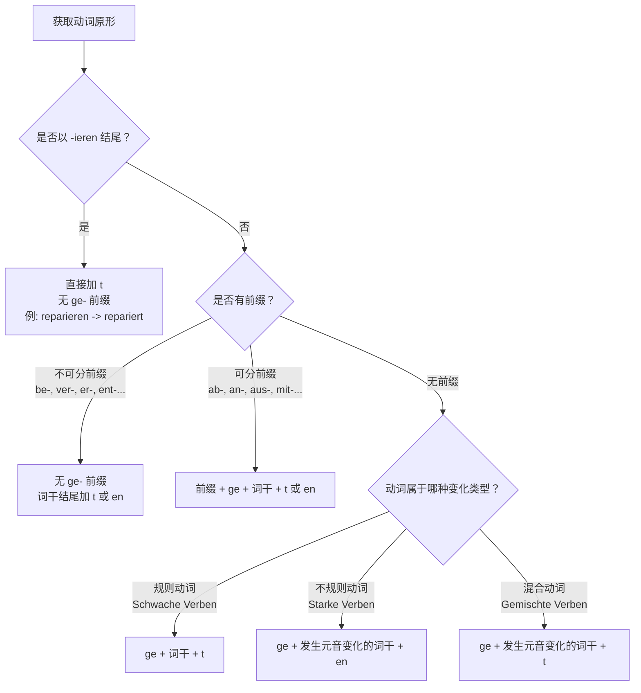
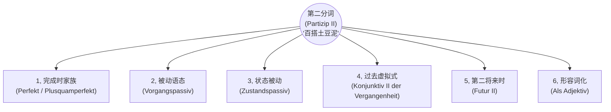

---
aliases:
  - 过去分词
  - 第二分词
---

# 第二分词

过去分词和第二分词属于同一个东西。

[[语言学习/德语/公共知识语法/时态#^WLiIc43r|100%]]

## 一、 什么是“第二分词”？

如果用一个生动的比喻来说：动词原形（Infinitiv）就像是一块**“生的、未经雕琢的黏土”**，它仅仅代表一个动作的概念。而“第二分词”（Partizip II）则是经过高温窑烤后**“定型的陶瓷”**。

它最核心的灵魂就两个字：**“完成”**与**“被动”**。它不再是一个正在进行的动作，而是一个已经发生的事实，或者是一个承受动作的状态。

---

## 二、 第二分词的“锻造配方”（形态构成）

^wr88dn

动词千千万，变成第二分词的规则也是有迹可循的。为了让你一目了然，我使用 Mermaid 构建了一个自上而下（top-down）的流程图 ，将动词的变形规则进行了分类：

代码段

**大师的点拨：** 很多同学在这个阶段会死记硬背。我的建议是：**不要孤立地背单词！** 遇到新动词，直接连着它的第二分词一起记（比如背 _bringen - brachte - hat gebracht_），形成肌肉记忆。

掌握了第二分词，你就掌握了德语的“时光机”和“被动技能”，因为它是构成完成时（Perfekt）**和**被动语态（Passiv）的核心基石。

为了让你更容易理解，我们可以把组装第二分词想象成“制作三明治”：

大部分情况下，你需要两片面包（前缀和后缀）把中间的肉饼（动词词干）夹起来。但根据肉饼的种类不同（动词的词性），你需要的面包和酱料也会发生变化；有时候，甚至不需要顶层的面包！

下面我为你制作了一张动词变化逻辑的流程图，你可以把它当作组装第二分词的“说明书”。

代码段

接下来，我们逐步拆解这六大核心变化规则，并结合你在德国实际生活中会遇到的场景进行实战演练。

### 1. 规则动词（Schwache Verben）：最标准的“三明治”

这是最基础的规则。对于规则动词，我们只需要遵循标准公式。

- **变化公式：** `ge` + 词干 + `t`
- **特殊注意：** 如果动词词干以 `-d`, `-t`, `-m`, `-n` 结尾，为了发音方便，需要在加 `t` 之前垫一个元音 `e`（即加 `et`）。

|**动词原形**|**词干**|**第二分词**|**移民生活场景例句**|
|---|---|---|---|
|**machen** (做)|mach|**gemacht**|**行政事务：** Ich habe einen Termin bei der Ausländerbehörde **gemacht**. (我在外管局预约了时间。)|
|**arbeiten** (工作)|arbeit|**gearbeitet**|**求职：** Ich habe drei Jahre als Ingenieur **gearbeitet**. (我作为工程师工作了三年。)|

### 2. 不规则动词（Starke Verben）：换了肉饼的“三明治”

不规则动词的特点是它的后缀是 `-en`，而且中间的“肉饼”（词干的元音）通常会发生改变，需要大家在学习时多加记忆。

- **变化公式：** `ge` + (常发生元音变化的)词干 + `en`

|**动词原形**|**词干变化**|**第二分词**|**移民生活场景例句**|
|---|---|---|---|
|**finden** (找到)|find -> fund|**gefunden**|**租房：** Wir haben endlich eine passende Wohnung **gefunden**. (我们终于找到了一套合适的公寓。)|
|**schreiben** (写)|schreib -> schrieb|**geschrieben**|**求职：** Ich habe gestern meinen Lebenslauf **geschrieben**. (我昨天写好了我的简历。)|

#### 不规则的动词元音变化详情
第二分词不规则变化，使用大多数，变化后 ge- +词干 + en(不是 t)
- e - o 可能是 a 或不变
- ie - o
- ei - ie  /i
	- lei/nei - li/ni
- ö - o
- ä - o /a
- ü - o
- ß - ss
- che - 不变
- in - un
- rei - ri ?
- feif - fiff?
- it-e
- en - a
- ng/nk - ch
	- **bringen** (带来) -> **gebracht** (不仅 i 变 a，ng 还变成了 ch)
	- **denken** (思考) -> **gedacht** (e 变 a，nk 变 ch)
	- **wissen** (知道) -> **gewusst** (i 变 u，ss 保持不变)
### 3. 混合动词（Gemischte Verben）：两者的结合体

混合动词结合了规则和不规则动词的特点：它的词干元音会像不规则动词一样发生改变，但它的词尾却像规则动词一样加 `-t`。

- **变化公式：** `ge` + 发生元音变化的词干 + `t`

|**动词原形**|**词干变化**|**第二分词**|**移民生活场景例句**|
|---|---|---|---|
|**bringen** (带来)|bring -> brach|**gebracht**|**医疗：** Der Krankenwagen hat ihn ins Krankenhaus **gebracht**. (救护车把他送到了医院。)|
|**wissen** (知道)|wiss -> wuss|**gewusst**|**行政事务：** Das habe ich nicht **gewusst**, dass ich dieses Formular brauche. (我之前不知道我需要填这张表。)|

### 4. 可分动词（Trennbare Verben）：“ge” 被夹在中间

在处理带有可分前缀（如 `ab-`, `an-`, `auf-`, `aus-`, `mit-`, `zu-` 等）的动词时，`ge-` 这个前缀会像一片火腿一样，被硬生生地塞进前缀和动词核心之间。核心动词的变化依然遵循上述规则（规则、不规则或混合）。

- **变化公式：** 可分前缀 + `ge` + 核心动词变化

|**动词原形**|**变化过程**|**第二分词**|**移民生活场景例句**|
|---|---|---|---|
|**ausfüllen** (填写)|aus + ge + füll + t|**ausgefüllt**|**行政事务：** Ich habe den Antrag auf Aufenthaltstitel **ausgefüllt**. (我填好了居留许可申请表。)|
|**mitbringen** (带来)|mit + ge + brach + t|**mitgebracht**|**求职：** Ich habe alle meine Zeugnisse zum Interview **mitgebracht**. (我把所有的证书都带到面试现场了。)|

### 5. 不可分动词（Untrennbare Verben）：没有顶层面包的“开放式三明治”

带有不可分前缀的动词（口诀：`be-`, `emp-`, `ent-`, `er-`, `ge-`, `miss-`, `ver-`, `zer-`），它们非常“高冷”，**绝对不加** `ge-`。我们只在词尾加上 `-t` 或 `-en`（取决于核心动词原本的规则）。

- **变化公式：** 无 `ge` + 词干 + `t`/`en`

|**动词原形**|**变化过程**|**第二分词**|**移民生活场景例句**|
|---|---|---|---|
|**unterschreiben** (签名)|unter + schrieb + en|**unterschrieben**|**租房：** Ich habe den Mietvertrag gestern **unterschrieben**. (我昨天在租房合同上签字了。)|
|**verstehen** (理解)|ver + stand + en|**verstanden**|**医疗：** Ich habe die Diagnose des Arztes gut **verstanden**. (我很好地理解了医生的诊断。)|

### 6. 以 -ieren 结尾的动词：永远不加 ge-

这类动词绝大多数是外来词（来自法语或拉丁语，比如 studieren, informieren）。它们的变化规则极其简单粗暴：**去掉词尾的 -en，直接加 -t，并且前面绝对不加 ge-**。

- **变化公式：** 词干 + `t`

|**动词原形**|**第二分词**|**移民生活场景例句**|
|---|---|---|
|**informieren** (通知/了解信息)|**informiert**|**行政事务：** Ich habe mich über die Visumvorgaben **informiert**. (我了解了关于签证的规定。)|
|**reparieren** (修理)|**repariert**|**租房：** Der Hausmeister hat die Heizung **repariert**. (房屋管理员把暖气修好了。)|

# 所有的使用场景

^vjsf2z

> **💡 德语大师的类比时间：**
>
> 想象一下，动词原形（如 _machen_）就像是农场里刚拔出来的**生土豆**，不能直接当菜吃。
>
> 而“第二分词”（如 _gemacht_）就是经过加工的**“土豆泥”**。
>
> 你之前学过的“现在完成时”和“过去完成时”，只是拿土豆泥做了两道最基础的“土豆泥沙拉”。但这盆土豆泥还可以用来做“土豆饼”（被动语态）、“烤土豆派”（虚拟式）、甚至直接当配菜点缀（作形容词）！

它是一个“多面手”。今天，我们就把第二分词所有能参与的“菜谱”一次性给你列全！

为了更直观地理解，请先看这张“第二分词核心用法全景图”：

代码段

下面我们结合你在德国/德语区生活（租房、找工作、医疗、延签）的实际场景，挨个把它们吃透！

### 1. 完成时家族：你的老朋友

_(Perfekt & Plusquamperfekt)_

正如你所知，这是最基础的用法，表示动作已经完成。

- **结构：** _haben/sein_ + **Partizip II**
- **找工作场景：**
    - _Ich **habe** den Arbeitsvertrag **unterschrieben**._ (我已经签了工作合同。——现在完成时)
    - _Als ich beim Arzt ankam, **hatte** die Praxis schon **geschlossen**._ (当我到达诊所时，诊所已经关门了。——过去完成时)

### 2. 过程被动语态：强调“正在挨揍”

_(Vorgangspassiv)_

在行政事务和工作中，德国人极其喜欢用被动语态，因为这显得客观、官方。第二分词是被动语态的灵魂。

- **结构：** _werden_ + **Partizip II**
- **行政延签场景：**
    - _Ihr Visumantrag **wird** zurzeit **geprüft**._ (您的签证申请目前正在被审核。——你不需要知道是谁在审核，重点是“被审核”这个动作。)
- **医疗场景：**
    - _Der Patient **muss** sofort **operiert werden**._ (这位病人必须立刻被手术。——带有情态动词的被动语态，B 1/B 2 必考！)

### 3. 状态被动：强调“木已成舟”

_(Zustandspassiv)_

这是过程被动语态的“结果”。动作已经结束了，留下了一个状态。这在租房时极其常见。

- **结构：** _sein_ + **Partizip II**
- **租房场景：**
    - _Die Wohnung **ist** komplett **möbliert**._ (这套公寓是完全带家具的。——强调“已经配好家具”的现存状态。)
    - _Die Kaution **ist** bereits **bezahlt**._ (押金已经支付完毕了。——房东最爱听的一句话。)

### 4. 第二虚拟式过去时：后悔药与马后炮

_(Konjunktiv II der Vergangenheit)_

回答你的问题：**虚拟式能用第二分词吗？绝对能！而且是表达“过去未发生的假设（遗憾/后悔/非现实）”的唯一方式。** 这是 B 2 级别最核心的语法点之一。

- **结构：** _hätte / wäre_ + **Partizip II**
- **医疗场景（假设与后悔）：**
    - _Wenn ich die Tabletten regelmäßig **genommen hätte**, **wäre** ich schneller wieder gesund **geworden**._ (如果我当时按时吃了药，我本可以好得更快的。——实际上：没吃药，病没好。)
- **找工作场景（错失良机）：**
    - _Hättest du dich auf die Stelle **beworben**, **hätten** sie dich bestimmt **eingestellt**!_ (要是你当时申请了那个职位，他们肯定早就录用你了！——实际上：你没申请。)

### 5. 第二将来时：未来的“过去时”

_(Futur II)_

再次回答你的问题：**将来时能用到吗？能！这叫第二将来时（Futur II）。** 它用来表示**在未来某个时间点，动作已经完成**。在向外管局或老板立下“军令状”时非常好用。

- **结构：** _werden_ (第一位/第二位) + **Partizip II** + _haben/sein_ (句末)
- **行政/学习场景（立下 Flag）：**
    - _Bis Ende Dezember **werde** ich das B 2-Zertifikat **bestanden haben**._ (到十二月底，我将已经通过 B 2 考试了。——向签证官展示你的决心。)
    - _Morgen um 18 Uhr **werde** ich das Formular **ausgefüllt haben**._ (明天下午 6 点之前，我将已经把表格填好了。)

### 6. 作为形容词：高阶德语的入场券

_(Partizip II als Adjektiv/Attribut)_

这是 B 2 级别开始大量出现，C 1 级别满天飞的用法。把第二分词直接放在名词前面当形容词用，表示被动或已完成的状态。需要加上形容词词尾变化。

- **行政/找工作场景：**
    - _Bitte bringen Sie das **ausgefüllte** Formular mit._ (请您带上**被填好的**表格。 -> _ausfüllen_ 的第二分词 _ausgefüllt_ 作形容词。)
    - _Ich suche eine **gut bezahlte** Arbeit._ (我正在寻找一份**报酬优厚的**工作。)
    - _Der **unterschriebene** Mietvertrag ist bindend._ (**签署好的**租房合同是具有法律约束力的。)

