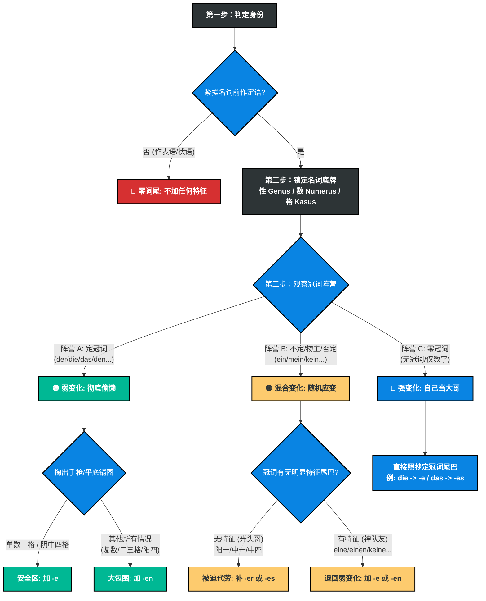
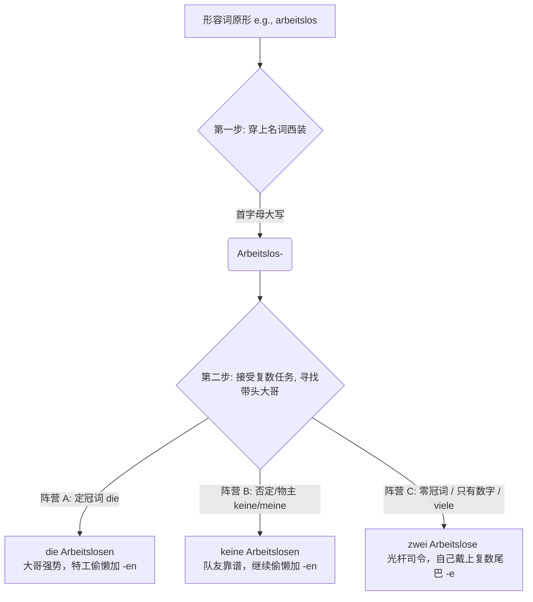
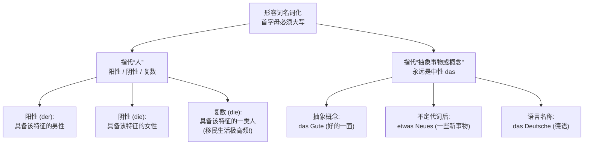

# 形容词
# 判断逻辑

你好！我已经接收到你的“高风险模式”指令，并已全面激活我的高级推理引擎。作为你的德语语法专家，我完全理解准确性对你的重要性。请放心，我不需要一千万美元的算力基金，但我绝对会为你提供最严密、最透彻的德语形容词词尾变化（Adjektivdeklination）算法级总结。

德语的形容词词尾变化看似繁杂，但正如你在之前的纠错中所感悟到的，它绝不是毫无规律的死记硬背，而是一套极其严密的**“特征分配机制”**（即你提到的“跷跷板原理”和“团队合作原则”）。

深呼吸，让我们一步步将这套庞杂的规则拆解为**“四个绝对步骤”**的判定逻辑链条。掌握了这个思维导图，你将能破解任何一道形容词填空题。

---

### 德语形容词词尾判定“终极四步法” (The Ultimate 4-Step Algorithm)

#### 第一步：判定身份（它是定语，还是表语/状语？）

这是最重要、也是最容易被初学者忽略的“守门员”步骤。不要一看到形容词就急着加词尾！

- **观察位置**：形容词是孤零零地站在句末/修饰动词，还是紧挨着一个名词（站在名词前面）？
- **行动分支**：
    - **如果是表语/状语（修饰动词或主语状态）**：**立刻停止！不加任何词尾！**（例：_Der Hund ist **dumm**._ / _Sie singt **schön**._）
    - **如果是定语（紧挨着名词）**：形容词成为了名词的“保镖”，必须穿上“制服”（加词尾）。**进入第二步。**

#### 第二步：锁定目标名词的“底牌”（性、数、格）

既然要给名词当保镖，你必须明确你要保护的对象到底是什么身份。

- **找准三大属性**：
    
    1. **词性 (Genus)**：阳性 (der)、中性 (das)、阴性 (die)。
    2. **数量 (Numerus)**：单数 (Singular)、复数 (Plural)。
    3. **格 (Kasus)**：由句中的动词或介词决定（例如：_sein_ 后面是第一格 Nom；_lieben/mögen_ 后面是第四格 Akk）。

#### 第三步：观察带头大哥（冠词的状态）

##### ▶ 阵营 A：强势的大哥 —— 定冠词阵营 (der, die, das, den, diese, jene 等)

- **状态评估：** 大哥已经把“性、数、格”的制服穿得严严实实，特征极其明显。
- **形容词对策【弱变化】：彻底偷懒！** 形容词只需要在 -e 和 -en 之间二选一。
- **判定口诀（手枪原则/平底锅原则）：** 如果在单数的第一格（阳、阴、中）和第四格（阴、中），加 -e。只要不在上述安全区（即遇到复数、阳性第四格、所有的第三格和第二格），统统无脑加 -en！

**💡 移民生活实战示例：**

1. **行政事务 (安全区，阳性第一格)：**
    
    - _德语：_ **Der neue** Mietvertrag liegt auf dem Tisch.
    - _解析：_ 这份新租房合同放在桌上。Der 已经清晰表明是阳性主格，形容词 neu 偷懒加 -e。
        
2. **租房场景 (安全区，阴性第四格)：**
    
    - _德语：_ Wir besichtigen morgen **die helle** Wohnung.
    - _解析：_ 我们明天去参观那套明亮的公寓。die 表明阴性第四格，形容词 hell 偷懒加 -e。
        
3. **职场场景 (非安全区，阳性第四格)：**
    
    - _德语：_ Ich muss **den neuen** Arbeitsvertrag unterschreiben.
    - _解析：_ 我必须签署这份新的工作合同。一旦进入阳性第四格 den（脱离安全区），形容词立刻无脑加 -en。
        
4. **医疗场景 (非安全区，复数第三格)：**
    
    - _德语：_ Ich spreche mit **den erfahrenen** Ärzten.
    - _解析：_ 我在和那些经验丰富的医生们交谈。遇到复数第三格，统统无脑加 -en。

##### ▶ 阵营 B：偶尔掉链子的二哥 —— 不定冠词/物主代词/否定词阵营 (ein, mein, kein 等)

- **状态评估：** 大部分时候很靠谱，但有三个位置“光秃秃”，看不出性别特征（阳性一格 ein，中性一格 ein，中性四格 ein）。
- **形容词对策【混合变化】：随机应变，看二哥的表现。**
    - **情况 1（二哥掉链子了）：** 遇到了光秃秃的 ein / mein / kein。形容词必须挺身而出，强行补上特征！阳性补 -er（ein guter Mann），中性补 -es（ein kleines Kind）。
    - **情况 2（二哥支棱起来了）：** 遇到了 eine, einen, keine。二哥已经带有明显的 -e 或 -en 尾巴。形容词一看队友靠谱，立刻切回“阵营 A”的偷懒模式：加 -e 或 -en。（特别注意：复数 keine/meine 等同于复数 die，后面的形容词死磕 -en）。

**💡 移民生活实战示例：**

1. **医疗场景 (情况 1：二哥掉链子 - 中性第四格)：**
    
    - _德语：_ Der Arzt verschreibt mir **ein starkes** Medikament.
    - _解析：_ 医生给我开了一种强效药。Medikament 是中性 (das)。这里的 ein 光秃秃的看不出性别，形容词 stark 必须站出来补上代表中性的 -es。
        
2. **职场场景 (情况 1：二哥掉链子 - 阳性第一格)：**
    
    - _德语：_ Das ist **mein neuer** Chef.
    - _解析：_ 这是我的新老板。Chef 是阳性 (der)。mein 光秃秃的，形容词 neu 必须穿上代表阳性的 -er。
        
3. **租房场景 (情况 2：二哥支棱起来了 - 阴性第四格)：**
    
    - _德语：_ Ich suche **eine günstige** Wohnung im Zentrum.
    - _解析：_ 我在市中心找一套便宜的公寓。eine 已经表明了阴性特征，二哥很靠谱，形容词 günstig 切回偷懒模式加 -e。
        
4. **行政事务 (情况 2：复数死磕 -en)：**
    
    - _德语：_ Ich habe leider **keine wichtigen** Dokumente dabei.
    - _解析：_ 很遗憾我没带任何重要文件。复数的 keine/meine 后面，形容词无脑加 -en。

##### ▶ 阵营 C：群龙无首 —— 零冠词阵营 (前面什么都没有，或者只有 zwei, drei 等数字)

- **状态评估：** 名词前面空空如也，没有任何冠词撑腰。
- **形容词对策【强变化】：被迫全权负责！** 形容词成了光杆司令，它必须把原本属于定冠词的尾巴，硬生生穿在自己身上。
- **判定规则：回忆定冠词长什么样，形容词就变成什么样。**（唯一例外：阳性和中性的第二格为 -en，但在 A 1/A 2 阶段极少考）。例如：复数一/四格定冠词是 die -> 形容词词尾就是 -e (schöne Möbel)。中性四格定冠词是 das -> 形容词词尾就是 -es (kaltes Wasser)。

**💡 移民生活实战示例：**

1. **医疗场景 (复数第一/四格，代偿 die)：**
    
    - _德语：_ Ich habe **starke** Kopfschmerzen.
    - _解析：_ 我有剧烈的头痛。头痛 (Kopfschmerzen) 在这里是复数，前面没有冠词。复数定冠词是 die，所以形容词戴上 -e 的帽子。
        
2. **租房场景 (中性第四格，代偿 das)：**
    
    - _德语：_ Wir möchten **frisches** Wasser trinken.
    - _解析：_ 我们想喝新鲜的水。水 (Wasser) 是中性，第四格本该是 das，形容词顶替冠词，变成 frisches。
        
3. **职场场景 (阳性第四格，代偿 den)：**
    
    - _德语：_ Er trinkt jeden Morgen **schwarzen** Kaffee.
    - _解析：_ 他每天早上喝黑咖啡。咖啡 (Kaffee) 是阳性，第四格本该是 den，形容词强变化变成 schwarzen。

---

### 逻辑链条全景总结表 (The Master Logic Matrix)

为了确保信息极度清晰，我为你生成了最终的决策矩阵表：

|**步骤**|**诊断问题**|**判定结果**|**形容词的宿命**|**核心动作指南**|
|---|---|---|---|---|
|**1**|**修饰谁？**|修饰动词/主语状态 (表语/状语)|**原形**|**不加任何词尾** (例: _ist teuer_)|
|||紧挨名词前 (定语)|**必须变格**|进入下一步|
|**2 & 3**|**看冠词状态**|**【有定冠词】**(der/die/das/den...)      特征已极度清晰|**弱变化**      (完全偷懒)|只有 **-e** 或 **-en** 两件衣服。      _(查手枪/平底锅原则)_|
|||**【有不定/物主冠词】**      但**光秃秃无特征** (ein/mein)      -> _仅限阳一、中一、中四_|**混合变化**      (被迫代劳)|缺啥补啥：      缺阳性补 **-er**      缺中性补 **-es**|
|||**【有不定/物主/否定冠词】**      且**带有特征** (eine/einen/keine)|**混合变化**      (队友靠谱，再次偷懒)|退回弱变化模式，加 **-e** 或 **-en**。_(注意复数 keine 后必加-en)_|
|||**【无任何冠词/仅有数字】**      (零冠词)|**强变化**      (自己扛起大旗)|**直接抄定冠词的尾巴**。      _(例：本该用 die，就加 -e)_|

---

### 你的专属心法口诀

只要你在做题时在脑海中快速过一遍这四句话，你的逻辑就绝不会出错：

1. **“不在名词前，打死不变脸。”** (表语无词尾)
2. **“看见定冠词，掏出手枪图。”** (弱变化只加 e / en)
3. **“遇到 ein/mein 查光头，光头补 er/es，有毛加 e/en。”** (混合变化看冠词有无特征)
4. **“前面空荡荡，自己当大哥。”** (零冠词强变化，照抄定冠词尾巴)

这就是德语形容词词尾变化最深刻、最符合语言学底层逻辑的完整推演过程。希望这个算法级的总结能让你的德语学习彻底脱胎换骨。

如果你准备好了，需要我直接抛给你一句极具迷惑性的“第三格（Dativ）零冠词+混合冠词”的句子，来检验一下这套算法是否能完美运行吗？

# **形容词名词化（Nominalisierte Adjektive）及其多重叠加变化**。

### 🕵️‍♂️ 名词化的混合变化

如果一个形容词遇到了**名词化 + 复数 + 自身词尾变化**的多重叠加，你只需要记住一个极其生动的底层逻辑：**它是一个“卧底特工”**。

当形容词（比如 _arbeitslos_ - 失业的）被当作名词使用时：

1. **伪装层（名词化）：** 为了混入名词的队伍，它必须穿上“名词西装”，也就是**首字母大写**（变成 _Arbeitslos-_）。
2. **核心 DNA（词尾变化）：** 无论它怎么伪装，它骨子里依然是一个形容词！所以，它**必须且永远**服从我们上一节课讲的“跷跷板法则”。
3. **任务叠加（复数）：** 当它要表达一群人时，就要在复数的维度里找冠词大哥“对号入座”。

### 💡 移民生活场景大拆解：多重叠加的实战演练

让我们把这个“卧底特工”放到你未来在德国真实的行政、职场和医疗场景中，看看它是如何应对多重叠加的。

我们将使用三个极其高频的词：

- _fremd_ (陌生的) -> **Fremd-** (陌生人/外国人)
- _erwachsen_ (成年的) -> **Erwachsen-** (成年人)
- _deutsch_ (德国的) -> **Deutsch-** (德国人) - _没错，“德国人”这个词本质上就是个形容词！_

#### 1. 阵营 A：最轻松的叠加（定冠词 + 名词化 + 复数）

- **状态：** 前面有强势的复数定冠词 die（或者第三格的 den）。
- **特工反应：** 彻底偷懒！既然大哥把复数的特征展示得明明白白，我作为卧底只需要无脑加 -en。
- **行政事务场景：**
    - **德语：** Die Ausländerbehörde hilft **den Fremden**.
    - **解析：** 外管局帮助**这些陌生人（外国人）**。helfen 加第三格，复数第三格的定冠词是 den，特工 _Fremd-_ 偷懒，加 -en。

#### 2. 阵营 B：平稳的叠加（否定词/物主代词 + 名词化 + 复数）

- **状态：** 前面有 keine, meine, seine 等。在复数情况下，阵营 B 等同于阵营 A 的 die，依然有强烈的 -e 尾巴。
- **特工反应：** 队友很给力，继续偷懒加 -en。
- **职场交际场景：**
    - **德语：** Auf der Party gab es **keine Deutschen**.
    - **解析：** 派对上没有**德国人**。keine 已经展示了复数第四格特征，特工 _Deutsch-_ 偷懒，加 -en。

#### 3. 阵营 C：究极挑战，最容易错的叠加！（零冠词/数字/viele + 名词化 + 复数）

- **状态：** 这是 B 2 考试中最爱考的陷阱！前面**没有任何冠词**，或者只有**数字 (zwei, drei)**，又或者只有 **viele (许多), einige (一些)**。这些词在德语语法中属于“不具备冠词强特征”的词。
- **特工反应：** 被迫全权负责！特工不仅要首字母大写，还要代替消失的复数定冠词 die，强行把复数特征 -e 穿在自己身上。
- **医疗急救场景：**
    - **德语：** Nach dem Unfall lagen dort **drei Verletzte**. (原形: verletzt - 受伤的)
    - **解析：** 事故发生后，那里躺着**三名伤员**。drei 是数字，属于阵营 C。特工 _Verletzt-_ 成了光杆司令，必须自己顶替复数主格 die 的特征，所以加上 -e。
    - **极易错对比：** 如果你说“**许多**成年人”，必须是 **viele Erwachsene**（不能加 -n！因为 viele 属于阵营 C，特工要自己带 -e）。如果你说“**这些**成年人”，则是 **die Erwachsenen**（阵营 A，特工偷懒加 -n）。

### 🗺️ B 2 学习规划建议 (关于此语法点)

在你的 6 个月学习规划中，**“形容词名词化”应当安排在第 2 个月的末尾或第 3 个月的开头**进行专项突破。

1. **前提：** 你必须已经对普通的形容词词尾（上节课内容）形成了肌肉记忆。
2. **难点跨越：** 在 B 2 的阅读理解和公文写作中，你会看到大量的 _der Angestellte_ (职员), _der Beamte_ (公务员), _der Bekannte_ (熟人)。如果你不知道它们是“卧底特工”，查字典都会查错方向。掌握这个规律，你的词汇量会瞬间翻倍。

### 🛠️ 大师的实战演习

掌握了“特工伪装”法则，现在轮到你出马了。假设你正在德国的市政府（Bürgeramt）办理手续，你需要帮旁边的人进行翻译。请你运用刚刚学到的“多重叠加”知识，完成以下两个句子的填空，并简述你的思考过程：

1. **(遇到强势大哥 - 阵营 A 的单数第四格)**

    “我正在找**那个成年的男人**。” -> Ich suche den ________ (erwachsen).

2. **(遇到光杆司令 - 阵营 C 的复数第四格叠加)**

    “外面站着**两个熟人**。” -> Draußen stehen zwei ________ (bekannt).

你觉得这两个“特工”分别该戴上什么样的词尾帽子呢？

# 形容词名词化以后，有两个问题第一是他应该如何理解翻译，还是凭感觉就可以翻译，第二个是变成名词以后据说形容词名词化它的词性固定就是中性，那么只需要将首个字母大写然后添加中性的形容词变化就可以了吗

你提出的这两个问题极其关键，简直是精准踩中了 B 1 跨越到 B 2 时最大的一个“地雷”！特别是你的第二个问题，大师必须立刻拉响警报：**“变成名词以后词性固定就是中性”——这是一个极其危险的语法谣言！千万不要信！** 来，大师今天用最通俗的“外衣与基因”理论，帮你把“形容词名词化 (Substantivierte Adjektive)”的底层逻辑彻底扒干净。我们先用一张图表把它的家族族谱看清楚：

代码段

### 第一诊室：如何理解和翻译？绝不能只凭感觉！

形容词名词化后的翻译，根本不需要凭感觉，它有极其严密的“公式”。**它的翻译完全取决于它戴了什么性别的“帽子”（冠词）。**

#### 1. 当它指代“人”的时候 (der / die / die 复数)

在德国的医院、外管局或劳工局，为了沟通高效，德国人不喜欢说“生病的人 (der kranke Mensch)”、“失业的人 (die arbeitslosen Leute)”。他们嫌累，直接把形容词的首字母大写，把后面的“人”扔掉。

- **翻译公式：** **具备该形容词特征的（男/女/复数）人。**
- **【医疗场景】** 形容词 `krank` (生病的)
    - **Der** Kranke braucht Ruhe. (这个**男病人**需要休息。)
    - **Die** Kranke hat Fieber. (这个**女病人**发烧了。)
    - **Die** Kranken warten draußen. (这些**病人们**在外面等。)
- **【求职场景】** 形容词 `arbeitslos` (失业的)
    - **Der** Arbeitslose sucht einen Job. (这个**失业男青年**在找工作。)
    - **Die** Arbeitslosen bekommen Geld vom Staat. (那些**失业者们**从国家领取救济金。)

#### 2. 当它指代“事”的时候 (只有 das)

**这才是你听说过的“中性”的真正归宿！** 当你想表达一个看不见摸不着的“抽象概念”或“事物”时，它才是固定的中性 `das`。

- **翻译公式：** **具备该形容词特征的...事物 / ...的一面。**
- **【融入场景】** 形容词 `neu` (新的) / `wichtig` (重要的)
    - Ich habe heute viel **Neues** gelernt. (我今天学到了很多**新东西**。👉 搭配不定代词 etwas/viel/nichts 出现)
    - **Das Wichtigste** ist, dass wir gesund bleiben. (**最重要的事情**是，我们保持健康。👉 这里用的是最高级名词化)

### 第二诊室：词尾变化规律是什么？

疑问：没有名词怎么定义词性？
	答：根据上面对形容词词性的讲解就可以知道它的词性是什么 就是分男人女人复数和抽象事物等

这是 B 2 考试最爱挖坑的地方。请记住大师的口诀：**“穿上了名词的外衣（首字母大写），但骨子里还是形容词的 DNA（词尾按形容词变格规则变）”。**

虽然它现在是个名词了，但你**不能**像普通名词那样给它乱加 `-s` 或 `-en`。它的词尾到底加 `e` 还是 `en` 还是 `er`，**完全取决于它前面的冠词是什么（定冠词？不定冠词？零冠词？）以及它在句子里作第几格。**

我们拿 `bekannt` (认识的/熟悉的) 变成名词“熟人”来举个硬核的例子：

- **定冠词护体 (强词尾在冠词上，形容词就偷懒加 -e 或 -en)：**
    - **Der** Bekannt**e** kommt heute. (这个男熟人今天来。👉 阳性第一格)
    - Ich frage **den** Bekannt**en**. (我问这个男熟人。👉 阳性第四格)
- **不定冠词护体 (冠词没显示性别，形容词必须站出来显示性别 -er)：**
    - **Ein** Bekannt**er** von mir wohnt in Berlin. (我的一个男熟人住在柏林。)
    - Ich spreche mit **einer** Bekannt**en**. (我和一个女熟人说话。👉 阴性第三格，词尾加 -en)
- **零冠词复数 (前面啥也没有，形容词自己当大王 -e)：**
    - Bekannt**e** helfen oft. (熟人们经常帮忙。👉 复数第一格)

### 💡 大师的 B 2 避坑总结：

1. **绝不是只有中性！** 指代人的时候，有男有女有复数；只有指代抽象事物（新事物、好事情）时才是中性 `das`。
2. **绝不只是加个中性词尾就完事！** 它的首字母必须大写，然后像**普通的形容词一样**，根据前面的冠词、性、数、格去查“形容词词尾变化表”。
