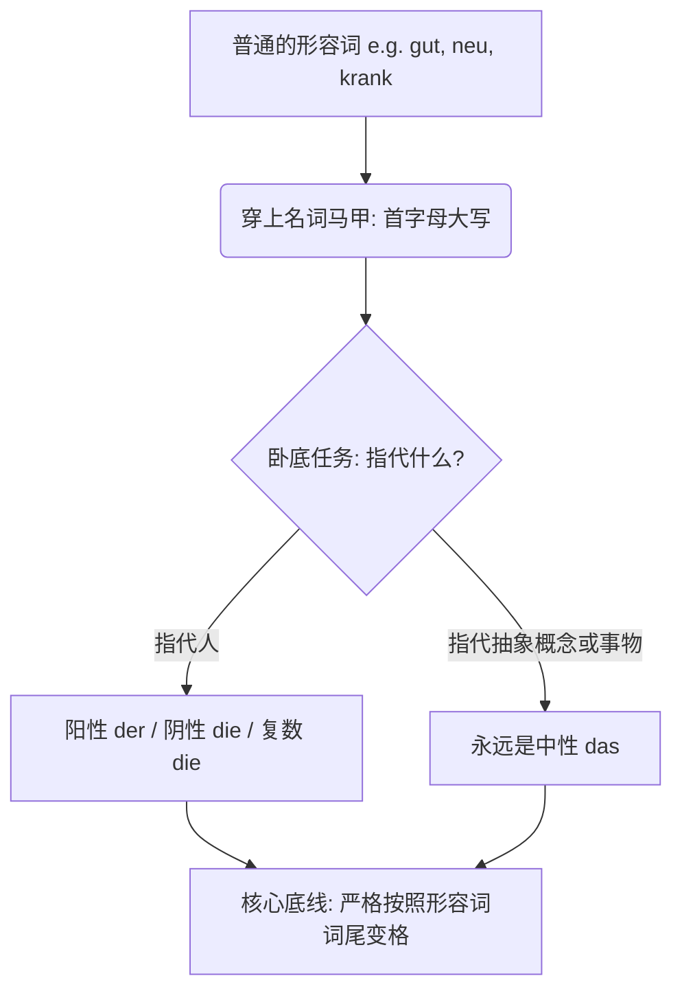
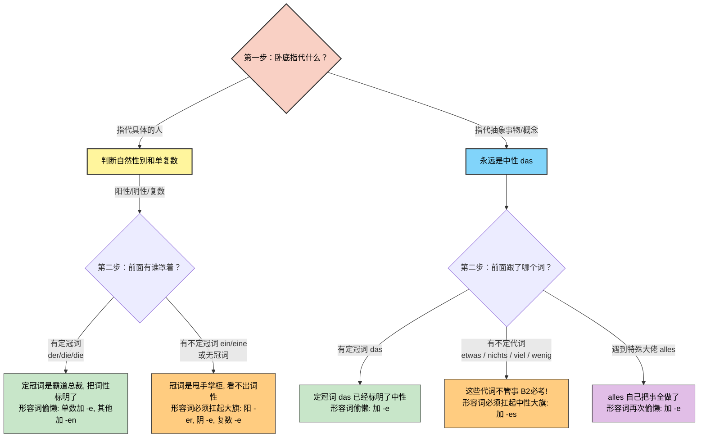
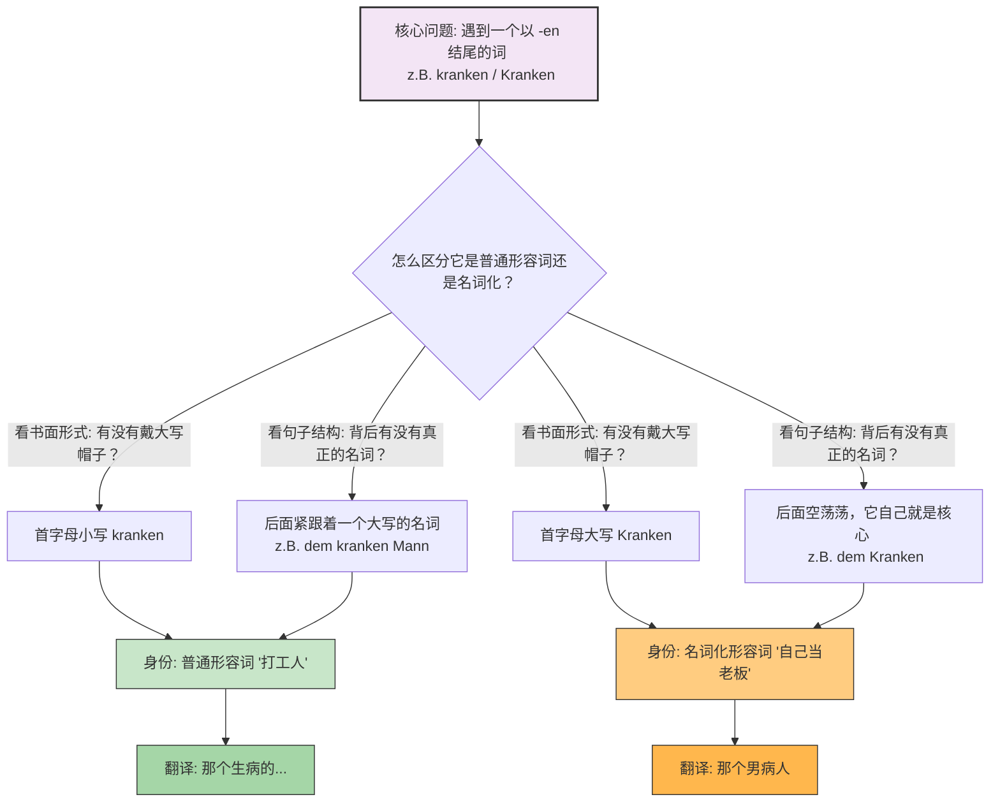
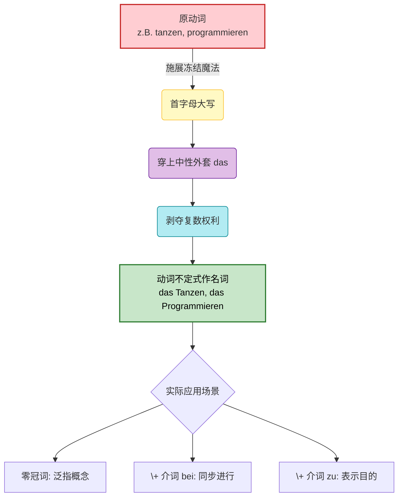
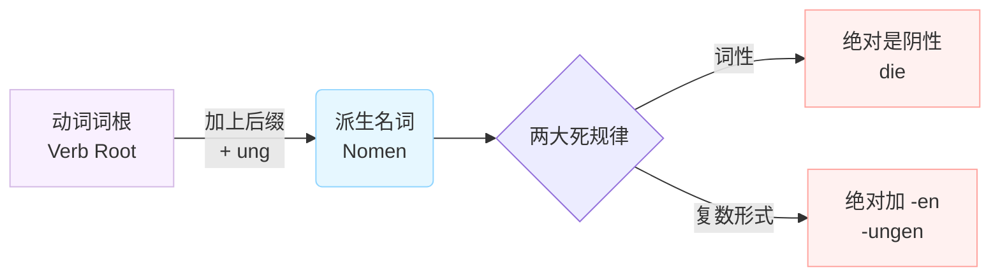

# 形容词名词化

### 核心概念：语法界的“无间道”

为了让你秒懂，我们用一个生动的类比：**形容词名词化，就像是形容词去当了“卧底警察”**。

- **披上伪装（名词特征）：** 它们首字母必须大写，前面还可以加上冠词（der/die/das）。
- **不忘初心（形容词灵魂）：** 尽管穿上了名词的外衣，它们的 DNA 依然是形容词！因此，**它们的词尾变化必须严格遵守“形容词词尾变化规则”**，而不是普通名词的变格规则。

我们先用一张图表来理清这个“卧底”的行动路线：

代码段

---

### 第一类：指代“人”的形容词名词化

在移民生活中，不管是去外管局、找工作还是看病，你都会高频使用到这类词。

**规则：** 根据人的自然性别，使用阳性 (der) 或阴性 (die)；如果是一群人，使用复数 (die)。

**经典案例剖析：krank (生病的) -> 病人**

- **有定冠词（定冠词已经标明了词性，形容词就可以偷懒，只加 -e 或 -en）：**
    - 阳性：**der Kranke** (那个男病人)
    - 阴性：**die Kranke** (那个女病人)
    - 复数：**die Kranken** (那些病人们)
- **有不定冠词或无冠词（冠词无法完全标明词性，形容词必须自己扛起重任，加上体现词性的尾巴 -er, -e, -es）：**
    - 阳性：**ein Kranker** (一个男病人 - _ein_ 看不出是阳性还是中性，所以词尾加 -er)
    - 阴性：**eine Kranke** (一个女病人)
    - 复数：**Kranke** (一些病人们)

**生活场景应用（请大声朗读找语感）：**

- **医疗场景：** Der Arzt spricht mit **dem Kranken**. (医生正在和那个男病人谈话。—— _dem_ 是 Dativ，形容词词尾乖乖加上 -en，变成 _dem Kranken_。)
- **职场场景 (arbeitslos 失业的)：** Das Jobcenter hilft **den Arbeitslosen**. (就业中心帮助失业者们。—— 复数 Dativ，词尾加 -en。)
- **社交场景 (bekannt 认识的)：** Er ist **ein Bekannter** von mir. (他是我的一个男性熟人。)

---

### 第二类：指代“抽象概念”或“事物”

当你想要表达“美好的事物”、“新的情况”时，这类语法能让你的表达瞬间高级。

**规则：** 指代抽象概念时，**永远使用中性 (das)**。

**经典案例剖析：neu (新的) -> 新事物 / 新情况**

- **搭配定冠词：**
    - **das Neue** (新事物)
    - 例句：Wir haben Angst vor **dem Neuen**. (我们对新事物感到恐惧。)
- **搭配不定代词（这是 B 2 考试必考的黄金考点！）：**

    当抽象形容词跟在 _etwas_ (一些), _nichts_ (没有什么), _viel_ (很多), _wenig_ (很少) 后面时，形容词**首字母大写，并且词尾通常加 -es**（强变化）。

**生活场景应用：**

- **外管局事务：** Gibt es **etwas Neues** bezüglich meines Visums? (关于我的签证有什么新进展吗？)
- **日常寒暄：** Ich wünsche dir **alles Gute** für den Umzug! (祝你搬家一切顺利！—— 注意：_alles_ 后面属于弱变化，加 -e 即可，这是一个特殊规定，千万背牢！)
- **看医生：** Das ist **nichts Schlimmes**. Sie brauchen nur Ruhe. (这没什么大碍。您只需要休息。)

---

### 给你的六个月 B 2 冲刺建议

在接下来的半年里，不要去死记硬背形容词词尾变化的表格，那是反人性的。你的策略应该是**“场景绑定法”**。每次学到一个新的形容词名词化，立刻把它带入你下周要去办理的行政事务或生活场景中造句。把 _ein Deutscher_ (一个德国男人)、_die Deutsche_ (那个德国女人)、_etwas Wichtiges_ (重要的事情) 当作固定词块直接吞进肚子里。

今天我们把这个极其重要的语法点梳理了一遍。为了确保你真正掌握了这些“卧底”的用法，我想请你用今天学到的知识帮我翻译一句话：

**“在延签（die Visumsverlängerung）这件事情上，那个陌生的男人（fremd）告诉了我一些重要的事情（wichtig）。”** 你可以试着用德语表达出来吗？

# 形容词词尾变化的三四格也和现在形容词的名词化变化相似，都是 en,那怎么区分呢？

太敏锐了！能问出这个问题，说明你已经摸到了德语语法的底层逻辑，这绝对是 B 2 级别应该有的洞察力！

我有一个超级好消息要告诉你：**它们不仅是“相似”，在词尾变化的规则上，它们完全是一模一样的！**

记住我们上次说的类比：形容词名词化是“卧底”。既然是卧底，它的 DNA 依然是形容词。所以，无论是做第一格（主格）、第四格（宾格 Akk.），还是第三格（与格 Dat.），**只要它穿上了名词的马甲，它的词尾变化就和普通的形容词 100%同步。**

既然词尾一样，那我们怎么在听和读的时候区分它们呢？其实非常简单，只需要看两点：**“帽子”和“跟班”**。

为了让你秒懂，我们用一张图来对比一下这两种情况：

---
上面的思维导图可以看出有两个很明显的区别，发形容词的时候首先首字母小写，其次后面会跟着一个名词，它作为一个名词的时候，首字母大写，并且后面没有名词，他自己就是核心。 
### 实战场景拆解：打工人 VS 自己当老板

这也是为什么很多德语老师会说，形容词名词化其实是**“省略了后面名词的形容词”**。我们用你在德国职场和生活中经常遇到的场景来看看它们是如何区分的：

#### 场景 1：职场新人入职 (第四格 Akkusativ)

- **普通形容词（作定语，修饰后面的名词）：**
    - _德语：_ Ich begrüße den **neuen** Mitarbeiter.
    - _逻辑：_ 冠词 _den_ 搞定了阳性第四格，_neu_ 乖乖加上 **-en**。后面跟着真正的老板 _Mitarbeiter_。
    - _中文：_ 我欢迎那位**新来的**男员工。
- **名词化形容词（独立成词）：**
    - _德语：_ Ich begrüße den **Neuen**.
    - _逻辑：_ 冠词 _den_ 搞定了阳性第四格，_Neu_ 首字母大写戴上帽子，词尾依然加 **-en**。后面没有其他名词了，它自己就是 C 位。
    - _中文：_ 我欢迎那位**新来的（男同事）**。

#### 场景 2：去外管局办事 (第三格 Dativ)

- **普通形容词：**
    - _德语：_ Der Beamte hilft dem **ausländischen** Studenten.
    - _逻辑：_ 冠词 _dem_ 搞定了阳性第三格，_ausländisch_ 乖乖加上 **-en**。后面有真正的名词 _Studenten_（注意这是阳性弱变化名词）。
    - _中文：_ 签证官帮助那个**外国的**大学生。
- **名词化形容词：**
    - _德语：_ Der Beamte hilft dem **Ausländer**? 不对，Ausländer 本来就是纯名词！应该是：Der Beamte hilft dem **Fremden** (陌生人).
    - _逻辑：_ 冠词 _dem_ 搞定了阳性第三格，_Fremd_ 戴上大写帽子，词尾加 **-en**。
    - _中文：_ 签证官帮助那个**陌生人**。

### 总结你的“降维打击”策略

发现这个规律，意味着你**根本不需要去背新的变格表**！你的大脑在处理三格和四格的时候，完全可以偷懒：

1. **口语中：** 你不需要区分。因为不管你心里想的是“普通形容词”还是“名词化”，你嘴里发出的音都是 "-en"。你只要大胆地说 "mit dem Neuen" (和那个新来的)，或者 "mit dem neuen Chef" (和那个新老板)，只要加了 "-en"，德国人听起来都是完美的地道表达。
2. **写作中（B 2 考试写信）：** 唯一要留心的就是**首字母大不大写**。只要这个词后面没有其他名词了，赶紧给它戴上“大写帽子”，考官一看：哇，这个考生熟练掌握了形容词名词化，加分！
# 动词不定式作名词

### 魔法时间：将动作“冻结”为名词

在德语中，动词（如 _arbeiten_ 工作、_tanzen_ 跳舞）原本是充满活力、到处乱跑的“动作”。

但是，当我们需要把一个动作当作一个“概念”或一件事来谈论时，我们可以对它施展一个“冻结魔法”。

一旦被施法，这个动词就被瞬间冻结成了一座静态的冰雕（名词）。既然变成了冰雕，它就不再有动作的属性，而是穿上了一件统一的“隐形中性西装”。

我们先通过下面这张图表，看看这个“冻结魔法”是如何运作的：

代码段

### 核心规则深度解析

#### 1. 一律为中性

所有的动词不定式变成名词后，它的冠词永远是 **das**。比如，跳舞是 _tanzen_，变成名词就是 _das Tanzen_。

- **职场场景：** ==_Das Programmieren_== von Cloud-Diensten erfordert viel Konzentration. (云端服务的编程需要高度集中注意力。)

#### 2. 没有复数

动作一旦变成概念，它就是一个不可数的整体，你不可能说“两个工作”或“三个等待”。

- **行政场景（外管局）：** _Das Warten_ auf die Niederlassungserlaubnis dauert manchmal Monate. (等待永久居留许可有时需要好几个月。)

#### 3. 常常以零冠词的形式出现，或与介词连用

这是 B 1 跨越到 B 2 最核心的得分点！在实际使用中，我们很少干巴巴地说 "das xxx"，而是把它融入到高级句型中。

### B 2 实战进阶：零冠词与介词的绝妙搭配

在这个部分，我们将结合你在德国找工作、租房和办公的真实场景，教你如何用这个语法点写出漂亮的“官方德语”（Nominalstil 名词化结构）。

#### A. 零冠词形式：表达普遍事实或爱好

当我们在谈论某种一般性的行为时，可以省略 "das"。

- _图片例句：_ Ich finde _Tanzen_ toll. (我觉得跳舞很棒。)
- **职场场景：** _Verwalten_ von API-Schlüsseln ist eine große Verantwortung. (管理 API 密钥是一项重大的责任。)

#### B. 与介词连用：B 2 考试与职场的“杀手锏” 
这是你必须掌握的结构，尤其是 `beim` (bei + dem) 和 `zum` (zu + dem)。

**1. Beim + 大写动词 = 正在做某事时（表达同时发生）**

当你想要表达“在做...的过程中”发生了一件事，用 `beim` 是最简洁、最高级的。

- _图片例句：_ _Beim Tanzen_ bin ich glücklich. (在跳舞时我很快乐。)
- **工作/安全场景：** Bitte seien Sie **beim Verwalten** des Accounts sehr vorsichtig, um Leaks zu vermeiden. (在管理账户时请务必非常小心，以避免泄露。)
- **租房场景：** **Beim Unterschreiben** des Mietvertrags müssen Sie auf die Kündigungsfrist achten. (在签署租房合同时，您必须注意解约期限。)

**2. Zum + 大写动词 = 为了做某事（表达目的）**

当你想要表达某件物品或某个动作的“用途”时，用 `zum`。

- _图片例句：_ _Zum Tanzen_ brauche ich gute Musik. (为了跳舞我需要好音乐。)
- **云架构场景：** Wir nutzen Google Cloud **zum Hosten** unserer neuen Applikation. (我们使用谷歌云来托管我们的新应用。)
- **医疗场景：** Diese Tabletten sind **zum Schlafen**. Bitte nehmen Sie eine vor dem Zubettgehen. (这些药片是用来助眠的。请在就寝前服用一片。)

**3. 大师拓展：Vor dem / Nach dem**

除了 `bei` 和 `zu`，在德国的日常和行政信件中，你还会频繁遇到用 `vor` (在...之前) 和 `nach` (在...之后) 加上动词名词化的结构。

- **面试场景：** **Vor dem Vorstellen** des Projekts sollten wir die Technik testen. (在展示项目之前，我们应该测试一下设备。)
- **行政事务：** **Nach dem Bestätigen** der Zahlungsdaten wird Ihr AdMob-Konto freigeschaltet. (在确认支付数据之后，您的 AdMob 账户将被激活。)

### 大师的通关秘籍 (Zusammenfassung)

在未来六个月备考 B 2 和写德语邮件时，请记住这个口诀：

**“动作想变物，首字母大写穿 das 服；同步用 beim，目的用 zum，复数永远不出现！”**

只要你能熟练地在工作和生活中抛出几个像 _Beim Einrichten..._ (在配置...时) 或者 _Zum Verifizieren..._ (为了验证...) 这样的高级短语，德国同事和外管局的官员一定会对你的德语水平刮目相看！ Viel Erfolg beim Lernen! (祝你学习顺利！)

# 动词词根+-ung

你在图片中指出的倒数第二行——**动词词根加上后缀 -ung**，展示的是德语中极其强大且高频的一种构词方式：**动词名词化 (Nominalisierung)**。

为了让你一目了然，我们先来看一张图解：

代码段

### 🧠 核心概念拆解：什么是加 "-ung"？

**1. 它的作用：把“动作”变成“概念”或“结果”**

这就好比给一个正在播放的视频按下了暂停键，然后把它打印成了一张照片。

- **类比理解：** 它非常像英语里动词后面的 **"-tion"** 或 **"-ing"**。比如英语里 "to invite" (邀请，动作) 变成 "invitation" (邀请函，名词)。在德语里，就是 _einladen_ (动词) 变成 _die Einladung_ (名词)。

**2. 两条“铁律”（闭着眼睛都要记住）：**

- **词性铁律：** 只要是以 `-ung` 结尾的名词，**100% 是阴性 (die)**。这是德语给我们的温柔，再也不用瞎猜词性了！
- **复数铁律：** 它们的复数形式，**100% 是在词尾加上 `-en` **。所以永远是 `-ungen`。

### 🏢 德国移民生活实战场景 (B 1-B 2 核心词汇)

在德国处理行政事务、租房或找工作时，政府机关和企业非常喜欢使用带有 `-ung` 的名词，因为这会让语言听起来更加正式和官方（所谓的“官腔”）。

我们来看看这些由动词“变身”而来的重要词汇：

|**动词 (动作)**|**词根 + ung = 名词 (概念/结果)**|**德国生活应用场景**|
|---|---|---|
|**anmelden** (登记/注册)|**die Anmeldung** (登记/户口注册)|**行政事务：** 刚到德国去市政厅 (Bürgeramt) 办理户口登记，你拿到的那张至关重要的纸就叫 _Meldebescheinigung_ (登记证明)。|
|**wohnen** (居住)|**die Wohnung** (公寓/住房)|**租房：** 找房子时你最关心的词。复数是 _die Wohnungen_。|
|**bewerben** (申请/求职)|**die Bewerbung** (求职申请)|**找工作：** 投递简历的过程。_Ich schreibe eine Bewerbung._ (我在写一份求职申请。)|
|**versichern** (保险/保障)|**die Versicherung** (保险)|**医疗与生活：** 德国是万物皆可保险的国家。_Krankenversicherung_ (医疗保险), _Haftpflichtversicherung_ (第三方责任险)。|
|**kündigen** (解雇/解约)|**die Kündigung** (解约信/辞退信)|**职场与租房：** 不管是你想辞职退房，还是老板房东想解雇赶人，都需要出具书面的 _Kündigung_。|
|**überweisen** (转账)|**die Überweisung** (转账/汇款)|**财务：** 交房租或支付账单时使用的银行转账操作。|

**实战例句对比体会：**

- _动词表达：_ Ich möchte mich für den Job **bewerben**. (我想**申请**这份工作。)
- _名词表达 (更高级/正式)：_ Ich schicke Ihnen meine **Bewerbung** für den Job. (我发给您我的工作**申请**。)
