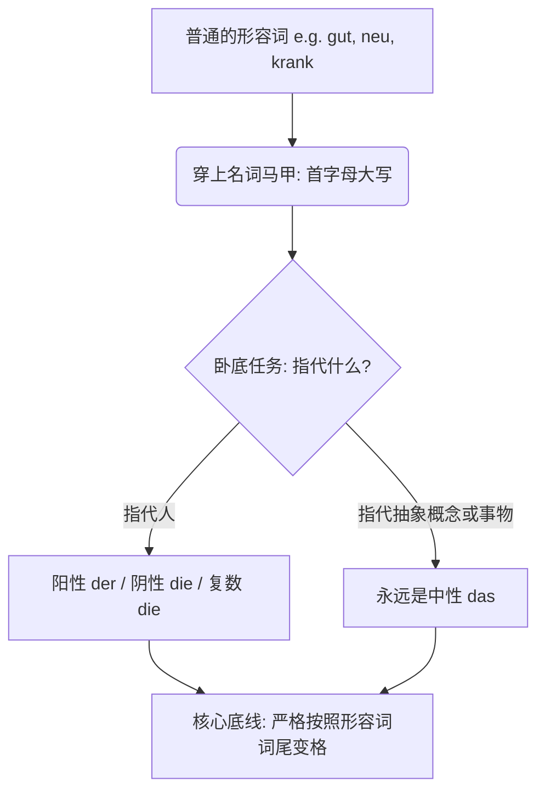
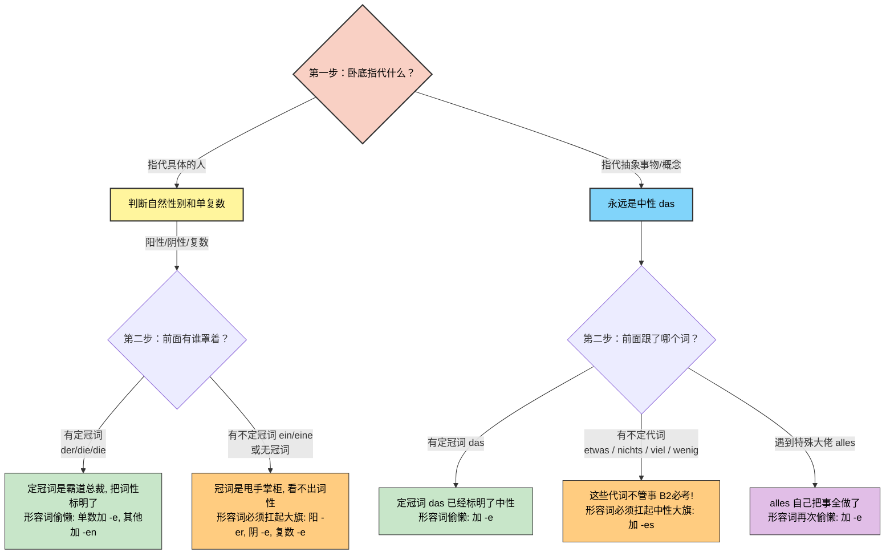

# 形容词名词化

### 核心概念：语法界的“无间道”

为了让你秒懂，我们用一个生动的类比：**形容词名词化，就像是形容词去当了“卧底警察”**。

- **披上伪装（名词特征）：** 它们首字母必须大写，前面还可以加上冠词（der/die/das）。
- **不忘初心（形容词灵魂）：** 尽管穿上了名词的外衣，它们的 DNA 依然是形容词！因此，**它们的词尾变化必须严格遵守“形容词词尾变化规则”**，而不是普通名词的变格规则。

我们先用一张图表来理清这个“卧底”的行动路线：

代码段

---

### 第一类：指代“人”的形容词名词化

^qhz1y1

在移民生活中，不管是去外管局、找工作还是看病，你都会高频使用到这类词。

**规则：** 根据人的自然性别，使用阳性 (der) 或阴性 (die)；如果是一群人，使用复数 (die)。

**经典案例剖析：krank (生病的) -> 病人**

- **有定冠词（定冠词已经标明了词性，形容词就可以偷懒，只加 -e 或 -en）：**
    - 阳性：**der Kranke** (那个男病人)
    - 阴性：**die Kranke** (那个女病人)
    - 复数：**die Kranken** (那些病人们)
- **有不定冠词或无冠词（冠词无法完全标明词性，形容词必须自己扛起重任，加上体现词性的尾巴 -er, -e, -es）：**
    - 阳性：**ein Kranker** (一个男病人 - _ein_ 看不出是阳性还是中性，所以词尾加 -er)
    - 阴性：**eine Kranke** (一个女病人)
    - 复数：**Kranke** (一些病人们)

**生活场景应用（请大声朗读找语感）：**

- **医疗场景：** Der Arzt spricht mit **dem Kranken**. (医生正在和那个男病人谈话。—— _dem_ 是 Dativ，形容词词尾乖乖加上 -en，变成 _dem Kranken_。)
- **职场场景 (arbeitslos 失业的)：** Das Jobcenter hilft **den Arbeitslosen**. (就业中心帮助失业者们。—— 复数 Dativ，词尾加 -en。)
- **社交场景 (bekannt 认识的)：** Er ist **ein Bekannter** von mir. (他是我的一个男性熟人。)

---

### 第二类：指代“抽象概念”或“事物”

当你想要表达“美好的事物”、“新的情况”时，这类语法能让你的表达瞬间高级。

**规则：** 指代抽象概念时，**永远使用中性 (das)**。

**经典案例剖析：neu (新的) -> 新事物 / 新情况**

- **搭配定冠词：**
    - **das Neue** (新事物)
    - 例句：Wir haben Angst vor **dem Neuen**. (我们对新事物感到恐惧。)
- **搭配不定代词（这是 B 2 考试必考的黄金考点！）：**

    当抽象形容词跟在 _etwas_ (一些), _nichts_ (没有什么), _viel_ (很多), _wenig_ (很少) 后面时，形容词**首字母大写，并且词尾通常加 -es**（强变化）。

**生活场景应用：**

- **外管局事务：** Gibt es **etwas Neues** bezüglich meines Visums? (关于我的签证有什么新进展吗？)
- **日常寒暄：** Ich wünsche dir **alles Gute** für den Umzug! (祝你搬家一切顺利！—— 注意：_alles_ 后面属于弱变化，加 -e 即可，这是一个特殊规定，千万背牢！)
- **看医生：** Das ist **nichts Schlimmes**. Sie brauchen nur Ruhe. (这没什么大碍。您只需要休息。)

---
