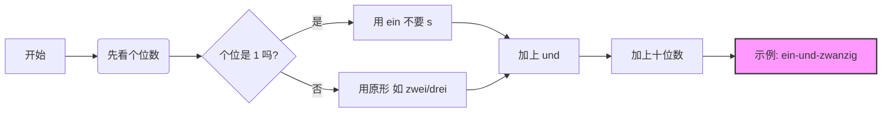

##### 2. 重点讲解01:05

###### 1）数字0-1201:09

# 🔢 德语数字终极指南 (0 - 无穷大)

## 零、 基础中的基础：0–12 (死记硬背区)

这 13 个数字是所有大数字的基石，没有任何逻辑，必须像背自家电话号码一样滚瓜烂熟。

| **数字** | **德语**     | **发音提示/记忆点**     |
| ------ | ---------- | ---------------- |
| 0      | **null**   | 像英语 null         |
| 1      | **eins**   | 爱因斯坦的“爱因”        |
| 2      | **zwei**   | 茨歪               |
| 3      | **drei**   |                  |
| 4      | **vier**   | **v** 发 [f]      |
| 5      | **fünf**   | 注意元音 ü           |
| 6      | **sechs**  | chs 发 [ks]       |
| 7      | **sieben** |                  |
| 8      | **acht**   |                  |
| 9      | **neun**   |                  |
| 10     | **zehn**   |                  |
| 11     | **elf**    | 特殊！不是 "einszehn" |
| 12     | **zwölf**  | 特殊！不是 "zweizehn" |
|        |            |                  |

![[Recording 20260131190334.m4a]]

---

## 一、 青春期的数字：13–19 (个位 + zehn)
![[image-257.png|882x460]]
逻辑就是“个位 + 10”。

- 1-19 发音要点：注意 19 的正确发音是"neunzehn"，重音在前音节
- **公式**：$个位数 + zehn$
- **⚠️ 两个“整容”特例**：
    - **16 (sechzehn)**：`sechs` 去掉 **s**，为了发音顺滑。
    - **17 (siebzehn)**：`sieben` 去掉 **en**，变得更干练。
---

## 二、 成熟的整十数：20–90 (-zig)
- ![[image-258.png|824x585]]

- **公式**：$个位数 + zig$
- **⚠️ 四个“特殊分子”**：
    - **20 (zwanzig)**：变身为 `zwan-`。
    - **30 (dreißig)**：唯一使用 **ß** (Scharfes S) 的数字！**绝对不是 dreizig**。
        - 30 是特例"dreißig"，40 开始恢复规则"vierzig"
    - **60 (sechzig)**：同 16，去掉 **s**。
    - **70 (siebzig)**：同 17，去掉 **en**。

---

## 复合数：21–99 (倒着读！)
 

- 百位数规则：
    - 100 为"hundert"
    - 200 为"zweihundert"
    - 300 为"dreihundert"（注意连写）
这是德语数字最“反人类”的地方，也是你必须攻克的难关。**德语是先说个位，再说十位。**

- 21 表示为"einundzwanzig"，注意连写无空格
- **想象场景**：你付钱时，不仅要说“20”，还要说“1 和 20”。
- **核心结构**：$个位 + und (和) + 十位$
	- 45：fünf-und-vierzig
- **书写规则**：所有单词连在一起写，**不留空格**！

#### 🧠 逻辑图解 (Mermaid)

代码段

- **特例中的特例：21, 31, 41...**
    - 单独数数说“1”是 `eins` (带s)。
    - 但在组合里（21-99），它变成了 `ein` (不带s)。
    - **例**：21 = **ein**undzwanzig (✅ 正确) / einsundzwanzig (❌ 错误)

---

## 四、 进阶：百与千 (100 - 9,999)

好消息！从 100 开始，德语逻辑回归正常，**从左往右读**。

### 1. 百位数 (hundert)

- **逻辑**：$几百 + (末尾两位数)$
- 100 可以说 `hundert` 或 `einhundert`。
- **例子**：
    - 101: hunderteins (注意：这里的1又变回 eins 了，因为它是最尾巴)
    - 106：Einhundertsechs
    - 245: zweihundert + fünfundvierzig (先百，后个位+十位)
    - **技巧**：把百位切开，后面剩下的按 1-99 的规则读。

### 2. 千位数 (tausend)

- **逻辑**：$几千 + 几百 + (末尾两位数)$
- **例子**：
    - 1000: (ein)tausend
    - 2026: zweitausendsechsundzwanzig (2000 + 6 + 20)
    - 两千一百零六：Zweitausend-ein-hundert-sechs

---

## 五、 高阶：百万与亿 (小心陷阱！)

这里有一个巨大的**“假朋友” (False Friend)** 陷阱，英语和德语在这里分家了，移民处理税务和买房时千万别搞错！

|**数字**|**德语**|**英语 (对比)**|**⚠️ 注意事项**|
|---|---|---|---|
|1,000,000|**eine Million**|Million|它是名词，**首字母大写**，复数加-en (zwei Millionen)。|
|1,000,000,000 (10亿)|**eine Milliarde**|**Billion**|**最大陷阱！** 德语的10亿不是 Billion！|
|1,000,000,000,000 (1兆/万亿)|**eine Billion**|Trillion|德语的 Billion 是英语的 Trillion。|

- **记忆口诀**：德语是“百万(Million) -> 亿(Milliarde) -> 兆(Billion)”，像阶梯一样上升。

---

## 六、 移民生活实战场景

作为以移民为目标的学习者，你不需要像数学家一样数数，但你需要搞定以下两个场景：

### 1. 年份 (Das Jahr)

- **2000年以前**：切成两半读。
    - 1990 = 19 | 90 = neunzehn**hundert**neunzig (19个百+90)
- **2000年以后**：按正常数字读。
    - 2026 = zweitausendsechsundzwanzig

### 2. 价格 (Der Preis)

在超市或租房时，人们经常偷懒。

- € 14,99 (vierzehn Euro neunundneunzig)
- **口语速读**：vierzehn neunundneunzig (省略 Euro)

---

## 🎯 你的“德语大师”挑战任务

为了巩固记忆，请你尝试用德语写出（或读出）以下这几个对你未来生活至关重要的数字。

1. **你的出生年份**（例如：1985 或 1992）
2. **德国基本免税额**：11,604 (elf-tausend...)
3. **一个假想的暖租房租**：845 (acht-hundert...)

**试着回复我，我来帮你纠音和检查拼写！**

# 一、数字"百"和加减乘除00:06

##### 1. 课前热身00:23

###### 1）复习数字00:33

- ![[image-221.png|469x408]]
- 数字读法规则：德语数字读法需注意个位与十位之间先说个位，再用十位连读。例如60的正确读法不是"一和几十结合"，而是遵循特定连读规则。
- 常见数字示例：
    - 13: dreizehn
    - 21: einundzwanzig
    - 60: sechzig

##### 2. 重点讲解01:51

###### 1）数字"百"01:54

- ![[image-222.png|390x424]]
- 基本构成：数字+hundert，如200=zweihundert，300=dreihundert
- 特殊读法：
    - 100可读为(ein)hundert
    - 900=neunhundert
    - 1000=tausend或eintausend
- 连接规则：百位与个位直接连接，不加und，如201=zweihunderteins；只有当出现十位时才用und连接，如231=zweihunderteinunddreißig
- 例题:数字与百组合的练习02:59
    - 练习重点：掌握13-200的数字读法
    - 关键数字示例：
        - 13: dreizehn
        - 27: siebenundzwanzig
        - 101: (ein)hunderteins
        - 200: zweihundert

###### 2）加减乘除04:39

- 运算符表达：
    - 加：plus
    - 减：minus
    - 乘：mal或multipliziert mit
    - 除：geteilt durch/durch/dividiert durch
- 例题:数字加减乘除的练习05:16
    - 加法示例：
        - 5+5=10：fünf plus fünf ist zehn
        - 3+7=10：drei plus sieben ist zehn
    - 减法示例：
        - 5-4=1：fünf minus vier ist eins
        - 9-5=4：neun minus fünf ist vier
    - 乘法示例：
        - 5×2=10：fünf mal zwei ist zehn 或 fünf multipliziert mit zwei ist zehn
        - 3×2=6：drei mal zwei ist sechs
    - 除法示例：
        - 8÷2=4：acht durch zwei ist vier 或 acht geteilt durch zwei ist vier
        - 6÷2=3：sechs durch zwei ist drei
        - ![[image-223.png|701x406]]
![[Recording 20260202214538.m4a]]

- 例题:德语对话理解11:34
# 听力练习

 - [[k1-6-1#4 Was kostet wie viel]]
 - 
# 21 数字复习语百万十万数字表达

#### 一、课程回顾00:06

##### 2. 结合数字并说出数字后面的图片名称03:10

- ![[41da3d62900676d3fe94fcf0c156adbd_MD5.jpg]]

###### 1）题目分析03:44

- 句型结构："Nummer...ist..."（第...号是...）
- 示例：
    - "Nummer 16 ist der Computer"
    - "Nummer 12 ist die Schere"
    - "Nummer 20 ist der Fernseher"
- 练习要点：需掌握28页单词与29页图片的对应关系

##### 3. 五个公式06:05

![[image-259.png|811x352]]

- ![[image-260.png|915x453]]
- 公式1（千+百+十+个）：注意个位与十位间加"und"
    - 例：1005 → "eintausendfünf"
- 公式2（千+百+十）：直接连读
    - 例：1200 → "eintausendzweihundert"
- 公式3（千+个）：完整读出"eins"
    - 例：1001 → "eintausendeins"
- 书写规范：
    - 千位分隔用点（如1.000）
    - 小数点用逗号表示（如3,14）

###### 1）例题:千位数字组合10:00

- ![[image-261.png|813x455]]
- 2030 → "zweitausenddreißig"
- 4100 → "viertausendeinhundert"
- 5017 → "fünftausendsiebzehn"

###### 2）例题:万位数字组合11:01

- ![[image-262.png|819x293]]
- 34.592 → "vierunddreißigtausendfünfhundertzweiundneunzig"
- 67.483 → "siebenundsechzigtausendvierhundertdreiundachtzig"

###### 3）例题:十万数字组合13:04

- ![[image-263.png|812x445]]
- 367.250 → "dreihundertsiebenundsechzigtausendzweihundertfünfzig"
- 450.319 → "vierhundertfünfzigtausenddreihundertneunzehn"

###### 4）百万14:36

- ![[image-264.png|740x458]]
- 基本规则：
    - 百万为名词"die Million"（复数：Millionen）
    - 100万："eine Million"
    - 200万："zwei Millionen"（需变复数）
- 复合数字：
    - 2.730.100 → "zwei Millionen siebenhundertdreißigtausendeinhundert"
    - 4.321.767 → "vier Millionen dreihunderteinunddreißigtausendsiebenhundertsiebenundsechzig"

#### 二、内容总结17:42

- ![[4af360063fa7ed459068fecc92de639f_MD5.jpg]]
- 核心要点：
    - 数字组合的五个公式体系
    - 百万作为名词的特殊用法
    - 书面数字的分隔规范（千位点，小数逗号）
- 下节预告：不定冠词"ein"的阴阳中性变化规则

###### 2）练习电话号码04:56

- ![[d0bc3a6f862e387c9fc4121195ecf167_MD5.jpg]]
- 练习方法：
    - 先逐个数字朗读
    - 然后尝试两位或三位一组朗读
- 示例：
    - 13764098302：eins drei sieben sechs vier null neun acht drei null zwei
    - 84356453：acht vier drei fünf sechs vier fünf drei
    - 19247051920：eins neun zwei vier sieben null fünf eins neun zwei null
    - 78236474：sieben acht zwei drei sechs vier sieben vier
    - 67543921：sechs sieben fünf vier drei neun zwei eins
    - 739217490：sieben drei neun zwei eins sieben vier neun null

###### 4）奇数、偶数11:27

- ![[980d09d2e33193126fa5344b405e0ab5_MD5.jpg]]
- 表达方式：
    - 偶数：gerade Zahl
    - 奇数：ungerade Zahl

##### 3. 国情文化11:53

###### 1）重要的数字

- ![[image-213.png|773x436]]
- 银行相关：
    - 账户号码：Kontonummer
    - 银行代码：Bankleitzahl (缩写：BLZ)
    - 账户名：Inhaber
- 其他重要号码：![[image-214.png|722x482]]
    - 会员号码：Mitgliedsnummer
    - 合同编号：Vertragsnummer
    - 邮政编码：Postleitzahl (缩写：PLZ)
- 注意事项：在德国生活时，这些号码信息非常重要，需要准确记忆和使用