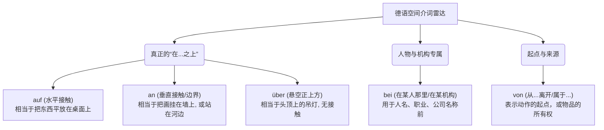

# **“auf, von, bei 都表示在某个事物之上，怎么区分它们？”**

### 德语空间介词坐标系解析

我们可以把德语的空间介词想象成一部**电影的取景镜头**。你的镜头是放在物体的水平面上、垂直面上、还是悬在空中？或者是聚焦在某个人物的身边？

请看下方我为你绘制的德语空间定位雷达图：

代码段

让我们结合你在德国生活的真实场景，逐一破解它们的用法：

#### 第一组：真正的“在...上”家族 (auf, an, über)

这三个词才是德语中真正表示“在上方/在边缘”的介词。它们有一个共同的语法灵魂：**静三动四 (Wechselpräpositionen)**。也就是说，如果表示静态的“在”（Wo?），后面加第三格（Dativ）；如果表示动态的“放到...上去”（Wohin?），后面加第四格（Akkusativ）。

**1. auf：水平面上的“接触”**

- **动作画面**：平平稳稳地放在一个表面上。
- **行政场景**：
    - Der Pass liegt **auf dem** Tisch. (护照放在桌子上。—— 静态第三格)
    - Ich lege den Pass **auf den** Tisch. (我把护照放到桌子上。—— 动态第四格)
- **种植场景**：Ich pflanze Himbeeren **auf dem** Balkon. (我在阳台上种树莓。—— 阳台是一个水平的平台。)

**2. an：垂直面上的“接触”，或紧贴着“边界”**

- **动作画面**：像贴春联一样贴在墙上，或者你站在江江河湖海的边缘。
- **医疗场景**：
    - Das Schild hängt **an der** Tür der Praxis. (牌子挂在诊所的门上。—— 垂直的门面)
- **生活场景**：
    - Wir machen ein Picknick **am (an dem)** Rhein. (我们在莱茵河畔野餐。—— 紧贴着河流的边界，还记得我们上次聊过的 _der Rhein_ 吗？😉)

**3. über：没有接触的“悬空正上方”**

- **动作画面**：像无人机一样悬在头顶。
- **租房场景**：
    - Die Familie **über mir** ist sehr laut. (我楼上【正上方】的那家人很吵。)
    - Die Lampe hängt **über dem** Esstisch. (吊灯悬挂在餐桌正上方。)

#### 第二组：“被误解”的家族 (bei, von)

这两个词经常被中文翻译成“在...”，但它们跟物理上的“上下”毫无关系。并且，它们是**死硬派的第三格介词**（后面永远只加 Dativ！）。

**1. bei：在某人那里 / 在某家公司 / 在某个状态中**:去
[[Vorwort#^dnofqj]]
- **动作画面**：你和某个人、某家机构“在一起”，或者在某人家里做客。
- **医疗场景**：
    - Ich bin **beim (bei dem)** Arzt. (我在医生那里【看病】。—— 绝不能用 auf dem Arzt，那是骑在医生头上！😅)
- **找工作场景**：
    - Ich arbeite **bei** Siemens. (我在西门子工作。—— 公司名称前永远用 bei)
    - Ich wohne noch **bei** meinen Eltern. (我还住在父母家。)

**2. von：从...离开 / 从...那里来 / 属于...的**: 从

- **动作画面**：表示一个起点，或者一种所属关系。
- **行政/租房场景**：
    - Ich komme gerade **von der** Ausländerbehörde. (我刚从外管局回来。—— 外管局是你的起点)
    - Das ist ein Brief **von meinem** Vermieter. (这是我房东寄来的信。—— 属于房东的、从房东那里来的)
    - _(结合你的日记)_：Der Impuls ging **von dem** Moment aus. (契机“从”那一刻产生。)
[[Vorwort#^aa38om]]
### 总结辨析法则

下一次，当你想用德语表达“在...上”的时候，请在脑海中快速做个三连问：

1. **是和人/公司有关吗？** -> 毫不犹豫用 **bei** (beim Arzt, bei BMW)。
2. **是表示从哪儿来吗？** -> 毫不犹豫用 **von** (von der Arbeit, von dir)。
3. **是真的在物理空间上吗？** -> 水平面用 **auf**，垂直/边缘用 **an**，悬空用 **über**。

_注：在 B 2 级别，介词还会引申出很多抽象的固定搭配（比如 sich freuen auf, träumen von），我们会在接下来的规划中专门用一节课来攻克它们！_

### 大师的课后挑战 (Dein Einsatz!)

语言学习就像种树莓，听懂了理论（买到了种子），还需要通过造句去浇水施肥！

请你结合你的**种植爱好**和**德国日常生活**，使用今天学到的介词，帮我把下面这段生动的小日记翻译成德语：

> **挑战文本：**
> 
> 1. 我的树莓在阳台**上** (auf) 生长得很好。
>     
> 2. 昨天，我**从**邻居**那里** (von) 得到了一些好泥土。
>     
> 3. 今天下午，我**在**邻居家里 (bei) 喝了茶，并且我们把一张植物的照片挂**在**了墙**上** (an)。

（提示：留意**静三动四**的规则，墙面是垂直接触，挂到墙上是动态动作哦！）
