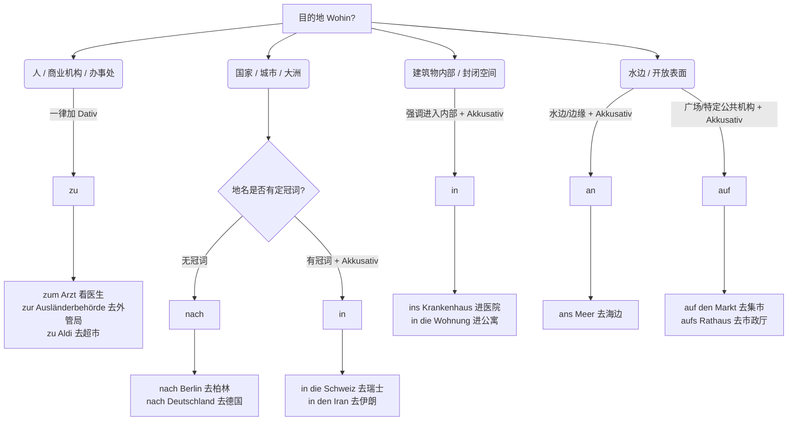

# in zu nach an auf区别 去往某地

^2z0bup

很多初到德国的同学在办理市政厅登记（Anmeldung）、找房子或看医生时，最怕的就是表达“去哪里”（Wohin）。英语里一个 "to" 就能解决的问题，德语却要从 `in`, `zu`, `nach`, `an`, `auf` 里面挑，还要考虑变格（Akkusativ 还是 Dativ）。

今天我们就来彻底攻克这个核心语法点：**表示方向的介词（Direktionalpräpositionen）**。

为了确保你能在实际生活中精准使用，我们先看一张我根据 "The Mermaid Guide to Text-Based Diagramming and Visualization" 为你制作的“目的地决策图”。你可以把这张图当成你大脑中的“语法导航仪”：

代码段

接下来，我们逐一拆解这些介词的严谨定义和生活场景例句。

### 一、 核心基础：介词与格的关系

在学习各个介词之前，你必须记住一条铁律，这是不犯低级错误的基础：

- **zu** 和 **nach**：永远支配 **第三格（Dativ）**。
- **in**, **an**, **auf**：属于静动两用介词（Wechselpräpositionen）。当回答“去哪里（Wohin? 表示移动方向）”时，必须支配 **第四格（Akkusativ）**。

#### 常见介词与冠词的缩写表

在口语和书面语中，介词经常与冠词缩写，务必直接背诵它们的结合体：

|**介词 + 冠词**|**缩写形式**|**适用的语法格**|
|---|---|---|
|zu + dem (阳性/中性 Dativ)|**zum**|Dativ|
|zu + der (阴性 Dativ)|**zur**|Dativ|
|in + das (中性 Akkusativ)|**ins**|Akkusativ|
|an + das (中性 Akkusativ)|**ans**|Akkusativ|
|auf + das (中性 Akkusativ)|**aufs**|Akkusativ|

_(注：in den, in die 等没有合法缩写，必须分开写。)_

### 二、 逐个击破：五大方向介词详解

#### 1. nach (前往地理大区或回家)

`nach` 是最简单的方向介词。它只用于两个场景，永远加 Dativ（虽然地名前通常不加冠词，所以看不出格的变化）。

- **规则 A：** 用于**没有定冠词**的大洲、国家、城市或区域名称。
- **规则 B：** 用于固定搭配“回家”（nach Hause）。

**移民生活场景例句：**

- _找工作：_ Ich ziehe nächsten Monat **nach Berlin**, weil ich dort ein Jobangebot habe. (我下个月搬去柏林，因为我在那里有个工作机会。)
- _日常生活：_ Nach dem Termin bei der Behörde fahre ich direkt **nach Hause**. (在政府办事处面谈结束后，我直接回家。)

#### 2. in (进入封闭空间或有冠词的国家)

`in` 强调的是物理上的“进入”。当它表示方向（Wohin）时，必须加 Akkusativ。

- **规则 A：** 目的地是一个建筑物、房间或封闭区域，且你的动作是“穿过门/边界走进去”。
- **规则 B：** 目的地是**带有定冠词**的国家（如 die Schweiz, die USA, der Iran）。

**移民生活场景例句：**

- _租房：_ Ich gehe jetzt **in die Wohnung**, um den Mietvertrag zu unterschreiben. (我现在走进这间公寓去签租房合同。)
- _就医：_ Er ist schwer verletzt und muss sofort **ins Krankenhaus** (in + das). (他伤得很重，必须立刻进医院。)
- _出行：_ Wir reisen nächsten Sommer **in die Schweiz**. (我们明年夏天去瑞士旅行。——因为瑞士是阴性名词 die Schweiz，动作方向加 Akkusativ，所以还是 die Schweiz)。

#### 3. zu (前往某人、某机构或某地点的方向)

`zu` 可能是最常用的介词。它不强调“进入内部”，而是强调“到达那个目标的坐标/附近”。永远加 Dativ。

- **规则 A：** 目的地是**人**（如医生、老板、朋友）。**注意：去见任何人，只能用 zu，绝对不能用 in。**
- **规则 B：** 目的地是**公司、商店名称、行政机构**，或者你只是想表达去那个地方，但不在乎是否进去。

**移民生活场景例句：**

- _行政办事：_ Ich muss morgen früh **zur Ausländerbehörde** (zu + der), um mein Visum zu verlängern. (我明早必须去外管局延期我的签证。)
- _就医（极其重要）：_ Ich bin krank und gehe **zum Arzt** (zu + dem). (我生病了，我去看医生。——医生是人，用 zum)
- _日常购物：_ Ich fahre **zu Aldi**. (我去奥乐齐超市。)

#### 4. auf 和 an (前往表面、广场或水边)

这两个介词在使用上更加细分，表示方向时加 Akkusativ。

- **an 的规则：** 目的地在水边（湖、海、河）或边界。
- **auf 的规则：** 目的地是一个开放的表面（广场、集市、岛屿），或者在德语习惯中指代某些特定的“公共职能部门”（如市政厅 Rathaus、警察局 Polizei、银行 Bank）。

**移民生活场景例句：**

- _生活办事：_ Ich muss morgen **aufs Rathaus** (auf + das) gehen, um mich anzumelden. (我明天得去市政厅注册户口。——注意：这里也可以用 zum Rathaus，但在德国南部和日常习惯中，去政府机关办事常用 auf)。
- _买菜：_ Am Samstag gehe ich **auf den Markt**, um frisches Gemüse zu kaufen. (周六我去集市买新鲜蔬菜。)
- _休闲：_ Am Wochenende fahren wir **ans Meer** (an + das). (周末我们去海边。)

### 三、 深度辨析：in 还是 zu？(最易混淆考点)

很多学员分不清什么时候用 `in`，什么时候用 `zu`。

> **辅助类比：**
>
> 如果你觉得难以区分，可以把 **in** 想象成“钻进一个有盖子的盒子里”，你的身体必须跨过门槛、进入这个建筑的内部；而把 **zu** 想象成 GPS 导航系统里的“终点大头针”，它只代表你到达了这个坐标点，你可能走进去了，也可能只是在门口等朋友。

让我们在严谨的语法框架下对比这几组极易用错的表达：

**对比 1：去超市 (Supermarkt 是阳性 der)**

- Ich gehe **in den Supermarkt**. (Akkusativ)
$1

    _语境：_ 你强调你要**走进去**买东西。如果下雨了，你会说“我们快进超市里去吧”。

- Ich gehe **zum Supermarkt**. (Dativ)
$1

    _语境：_ 你把超市当成一个坐标。比如朋友问你在哪见面，你说“我去超市（那儿）找你”，你可能只是在超市外面的停车场。

**对比 2：看病就医 (Arzt vs. Krankenhaus)**

- ❌ 错误示范：Ich gehe in den Arzt. (大错特错！Arzt 是人，你不能“走进”医生体内。)
- ✅ 正确表达：Ich gehe **zum Arzt**. (去找医生/看医生)
- ✅ 正确表达：Ich gehe **ins Krankenhaus**. (去医院。医院是物理建筑物，你走进去治病。)

**对比 3：去火车站 (Bahnhof 是阳性 der)**

- Ich fahre **zum Bahnhof**. (最常用。我去火车站，为了赶火车、接人，强调坐标。)
- Ich gehe **in den Bahnhof**. (强调物理进入。比如外面太冷了，你要走进火车站大楼里去避寒。)

### 四、 本节复习与自我测试

为了在六个月内达到 B 2，我们要确保你不仅听懂了，而且能肌肉记忆般地脱口而出。请看下面三个日常场景，结合今天的语法点，在脑海里翻译一下：

1. （因为你感冒了）你想说：**“我明天必须去看医生。”**
2. （你要去市政厅办居住登记）你想说：**“我现在去市政厅。”**
3. （你拿到了工作签证）你想说：**“我们下个月搬去慕尼黑。”**

_(思考两秒钟... 答案是：1. Ich muss morgen zum Arzt gehen. 2. Ich gehe jetzt aufs / zum Rathaus. 3. Wir ziehen nächsten Monat nach München.)_

这几个方向介词是你在德国开启生活的第一把钥匙，无论是看病、租房还是去外管局，每天都会用到。把 `zum Arzt`, `ins Krankenhaus`, `zur Behörde`, `nach Deutschland` 这些高频词块直接当作固定搭配背下来，你的语感会提升得非常快。

对于今天的讲解，你有没有哪个场景或概念觉得还需要进一步澄清的？如果没有问题，下一次我们可以进入下一个 B 1/B 2 核心语法模块。你准备好了吗？
