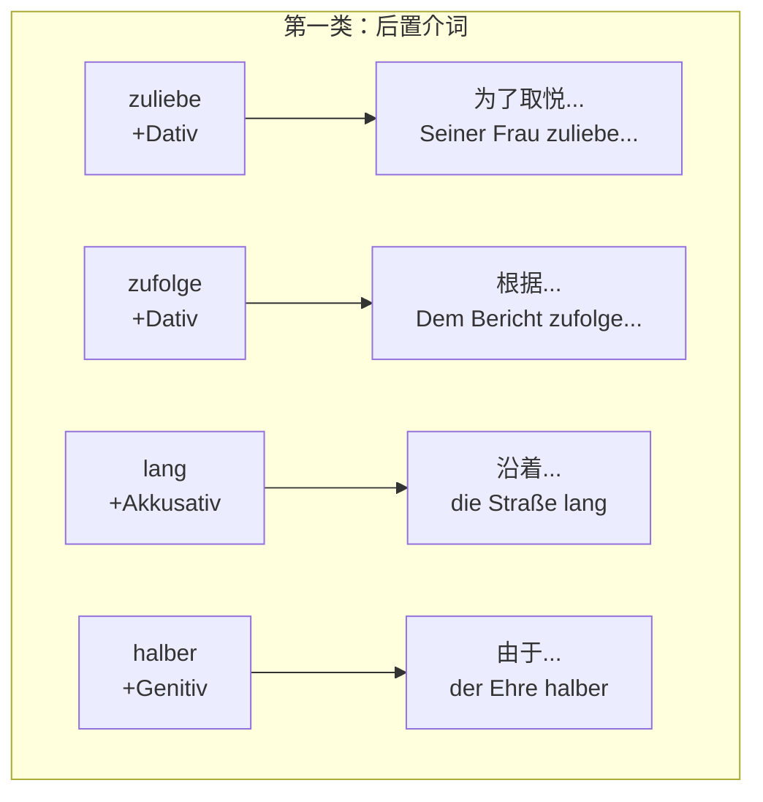
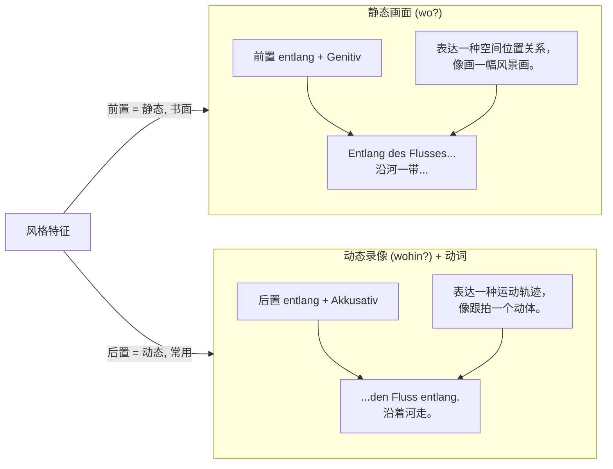
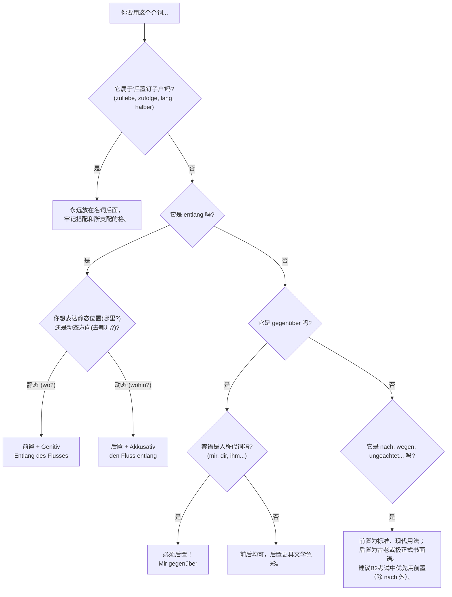

### 第一章：打破常规——为什么介词要在名词右边？

首先，你要形成一种“语感认知”：德语的基本骨架之一是“框型结构”。介词本就应该名词左边，构成一个“介宾短语”。当它跑到右边时，往往是为了：

1.  **强调或修辞**：把介词放在最后，让它像鼓点一样敲一下。这在高级书面语或古老表达中常见。
2.  **语法遗留**：一些介词本身就是从名词或副词演化来的，历史上它们就习惯待在后面。
3.  **与动词搭配**：有些后置用法是为了配合前面的动词，形成一种“方向感”或“动态感”。

当你看到后置介词，大脑里就应该亮起一个信号灯：“滴！这里不是日常口语，是文学、是正式文件、还是固定表达？”

---

### 第二章：分类突击——你的三块行军地图

我们把你的笔记整合成三类，这对应着学习难度的增加。

#### 第一类：永远向后看的“钉子户”（后置介词）

这类介词，你什么时候看它，它都待在名词 **后面**。把它们当成固定词组整体记忆最有效率。

**逐个击破：**
**1. `zuliebe` (为了取悦)**
*   **身法**：永远后置。`seinem Vater zuliebe` (为了让他爸高兴)
*   **深层逻辑**：它来自 `zu Liebe`，你把它想成是 `...zu Liebe`，那自然“爱”的对象要放在前面。

**2. `zufolge` (根据，按照)**
*   **身法**：永远后置。
*   **底层逻辑**：它来自 `zu Folge`，本意是“作为……的结果/随之而来”。所以“消息的来源”在前，然后才说“随之而来的下文是……”。
*   **场景**：新闻、报道，引述一个信息来源。
    *   例句：`Dem Wetterbericht zufolge wird es morgen schneien.` (据天气预报说，明天要下雪。)
    *   移民场景：`Dem Schreiben des Amtes zufolge fehlen noch Unterlagen.` (根据移民局的信函，还缺文件。)

**3. `lang` (沿着)**
*   **身法**：永远后置。注意：它是 `entlang` 的后置简化版。
*   **场景**：口语化或简洁表达，比 `entlang` 更随便。
    *   例句：`Geh einfach die Straße lang.` (就沿着这条街走。)

**4. `halber` (由于，为了……缘故)**
*   **身法**：永远后置，支配第二格。
*   **底层逻辑**：这是一个非常古老、优雅的词，表示“出于……原因/半个面子的考量”。
*   **场景**：**固定搭配**！你不需要造新句子，只需要能看懂。如 `der Einfachheit halber` (为了简单起见), `der Gerechtigkeit halber` (出于公正), `der Liebe halber` (为了爱)。
    *   重点记住：`der Vollständigkeit halber` (为了完整起见) —— 写邮件时提到可能不重要的附件，用这个短语，瞬间逼格拉满。

---

#### 第二类：能前能后的“游击队”（前置/后置均可，意义或格会变）

这就是你问题的核心了！为什么它们能移动？移动带来了什么变化？这里有个很妙的视角：**介词的位置，像摄影机的机位，能改变画面的“景深”和“动态感”。**

我们重点看你最可能困惑的三对： `entlang`, `gegenüber` 和 `nach`。

##### 核心案例分析一：`entlang` (沿着) —— 静与动的对决

这是 **“位置决定格与意”** 的最经典案例。

*   **当它前置 (左边) 时：**
    *   **格**：支配**第二格 (Genitiv)**。
    *   **意义**：描述一个**静态的位置**，回答 `Wo?`。 “在沿河的某个地带”。
    *   **画面感**：你拿着相机，站在高处，拍了一张“河岸风光”的静景。
    *   **你的笔记例句**：`Entlang des Flusses gibt es einen Weg.` (沿着河，有一条小路。) —— 这里的“小路”是静止地存在于河边的。

*   **当它后置 (右边) 时：**
    *   **格**：支配**第四格 (Akkusativ)**。
    *   **意义**：描述一个**移动的方向**，回答 `Wohin?`，且常与表示运动的动词连用。
    *   **画面感**：你开启了录像功能，镜头跟着一个人，他“**顺着**河边走”，路线与河流并行延伸。
    *   **你的笔记例句**：`Sie gehen den Fluss entlang.` (他们沿着河走。) —— 这里的“走”是动态的，方向是顺着河。

**结论：** `entlang` 一站到名词左边，就变得文绉绉的，刻画静态地点。一跑到名词右面，就立刻动感起来，刻画移动方向。

##### 核心案例分析二：`gegenüber` (对面，相对于) —— 风与格的游戏

这个词代表的是“对立/相对”的空间或人际关系。它的位置变化，更多的是**风格和强调**上的游戏，格永远是第三格！

*   **当它前置 (左边) 时：**
    *   **风格**：标准、客观。最正常的用法。
    *   **你的笔记例句**：`Gegenüber dem Bahnhof gibt es ein nettes Eiscafé.` (火车站对面有家不错的冰淇淋店。) —— 标准的方位描述。

*   **当它后置 (右边) 时：**
    *   **风格**：更古老、更文学化，或者在与人称代词搭配时**几乎是强制后置**。
    *   **你的笔记例句**：
        1.  `Dem Bahnhof gegenüber liegt ein nettes Eiscafé.` —— 意思和上面完全一样，但语序更讲究，像在写小说。
        2.  `Mir gegenüber verhält sie sich immer korrekt.` (她对我总是很得体。) —— **此处不能前置！** `Gegenüber mir` 虽然在语法书里不算错，但听说都非常别扭。**人称代词跟 `gegenüber` 必须后置！** 这是一个黄金定律。

**结论：** `gegenüber` 后置是一种“雅词”的标记；遇到人称代词（mir, dir, ihm...），乖乖把它放后面。

##### 核心案例分析三：`nach` (根据) vs. `wegen` (由于) —— 前与后的语气差

*   ** `nach` (按照，据某人说)**
    *   前置：`Nach seiner Meinung ist das falsch.` (据他的看法，这不对。) —— 客观陈述。
    *   后置：`Seiner Meinung nach ist das falsch.` (照他看来，这不对。) —— 也是标准说法。意思没区别，只是后置给了说话者一个更灵活的句子开端。
    *   使用场景：`Meiner Erfahrung nach...` (据我的经验...) 是 B 2 口语的一个高分模板！

*   ** `wegen` (由于)**
    *   前置：`Wegen des Streiks...` (因为罢工...) —— 标准用法，90% 的情况都用它。
    *   后置：`Des Streiks wegen...` —— 极少使用，极其书面，属于一种古文或极其严肃的法律文书修辞。你只需要知道它的存在，理解意思即可，不要主动用。

---

#### 第三类：戴面具的“变节者”

这一组词（`ungeachtet`, `gemäß`）默认站左边，有时被挪到右边，纯粹是为了制造一种严肃、官方的书面效果，**意义和格完全不变**。

*   ** `ungeachtet` **：`ungeachtet seiner Erfolge` = `seiner Erfolge ungeachtet` (尽管取得了成就)。
*   ** `gemäß` **：`gemäß Artikel 1` = `Artikel 1 gemäß` (根据第一条)。 —— 后者在法律的判决书里非常常见。

这更像是句法上的倒装，是高级文体的一种装饰音。当你有 B 2/C 1 的写作需求时，可以在文末为追求庄重效果偶尔一用。

---

### 第三章：你的个人“战术图谱”

我们把所有混乱的规则，压缩成一张你可以随时查阅的决策树：

---

### 第四章：你的“随堂测验”（B 2 场景模拟）

现在是你的时间了，试试把这些知识用到你的移民和工作场景中。

**(场景 1: 你和新邻居在楼下聊天)**
把下面这句话用 ** `entlang` 的正确位置** 完成，并说出为什么：
*   “如果你沿着这条新路一直走，就能直接到地铁站。”
    `Wenn du die neue Straße _______ gehst, kommst du direkt zur U-Bahn.`

**(场景 2: 你在给老板写一封正式邮件，汇报一个和预期相反的数据)**
请改写句子，把括号里的介词放在你想强调的位置（前置或后置都可以，说说你选这个位置的理由）：
*   “和所有预测数据相反，我们的销售额在去年有所增加。”
    `______ (entgegen) ______ (alle Prognosen) ______ hat unser Umsatz im letzten Jahr zugenommen.`

**(场景 3: 移民局来了一封重要的信)**
用最适合高级文体的后置介词，填空完成句子：
*   “根据随函附上的信，您需要提交一份新的保险证明。”
    `______ (das beigefügte Schreiben) ______ benötigen wir eine neue Versicherungsbescheinigung von Ihnen.` (提示：用 zufolge)

请把你的答案和想法发给我。记住，用位置的移动来表达微妙的语境变化，这是成为德语大师的不传之秘！