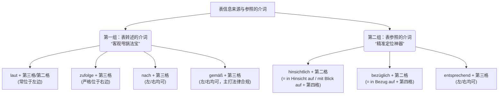

# 表信息来源与参照的介词

Guten Tag！未来的德国新移民！欢迎来到“德语大师”的语法集训营！

如果您要在六个月内拿下 B 2 证书，并顺利适应德国的移民生活（租房、找工作、跟严谨的德国官僚打交道），那么今天我们讲解的这个语法点绝对是您必须拿下的“护身符”。

在德国生活，最重要的一项生存技能就是“做到有理有据”。无论是跟外管局（Ausländerbehörde）办事，还是跟房东（Vermieter）理论，您都需要精准地引用法律、合同或者专家的原话。今天，我们就来集中攻克这个核心知识点——**表信息来源与参照的介词**。

为了让您一目了然，我先用一张图表把今天这 **10 个**不可或缺的介词/介词词组给您盘点清楚：

代码段

### 第一组：表转述的介词 (The "Pass-the-Buck" Prepositions)

**类比理解：**

在德语中，转述别人的话或者某项统计数据时，我们经常需要保持一种“客观、中立”的态度。用大白话说就是：“这话不是我说的，是文件/专家/数据说的，跟我无关哦！”

在 B 1/B 2 阶段，您肯定学过用第一虚拟式（Konjunktiv I）来表达这种中立感。但是，第一虚拟式变位太麻烦了！好消息是：**使用以下这些表转述的介词，就能达到与第一虚拟式完全相同的意义与距离感**！并且，**这些介词后直接使用简单的直陈式（Indikativ）即可，千万不要再加虚拟式了**！

我们来看看这四位“甩锅”大使，它们在位置和接格上各有脾气：

- **1. laut + 第三格（或第二格）**
    - **脾气：** 最常见，经常搭配零冠词或者不定冠词使用。
    - **官方例句：** Laut Statistik sind 80 % der Deutschen übergewichtig. (据统计，80%的德国人超重。) / Laut einer neuen Statistik sind 80 % der Deutschen übergewichtig.
    - **移民实战（租房）：** **Laut** dem Mietvertrag darf ich hier Haustiere halten. (根据租房合同，我可以在这里养宠物。)
- **2. zufolge + 第三格**
    - **脾气：** 极其固执，**必须放在名词的右边**！
    - **官方例句：** Der Statistik **zufolge** sind 80 % der Deutschen übergewichtig.
    - **移民实战（新闻资讯）：** Einem Bericht **zufolge** werden IT-Fachkräfte in Deutschland dringend gesucht. (据一篇报道称，德国目前急需 IT 专业人才。)
- **3. nach + 第三格**
    - **脾气：** 随和，可放在名词的**左边或右边**。
    - **官方例句：** **Nach** der Statistik sind 80 % der Deutschen übergewichtig. / Der Statistik **nach** sind 80 % der Deutschen übergewichtig.
    - **移民实战（医疗）：** **Nach** meinem Arzt muss ich mich drei Tage ausruhen. (根据我的医生的说法，我必须休息三天。)
- **4. gemäß + 第三格**
    - **脾气：** 非常严肃，主要用于**法律概念**，也可放在左边或右边。
    - **官方例句：** **Gemäß** der Statistik sind 80 % der Deutschen übergewichtig. / Der Statistik **gemäß** sind 80 % der Deutschen übergewichtig.
    - **移民实战（行政事务）：** **Gemäß** § 18 b Aufenthaltsgesetz können Sie eine Blaue Karte EU beantragen. (根据《居留法》第 18 b 条，您可以申请欧盟蓝卡。)

### 第二组：表参照的介词 (The "Pinpoint" Prepositions)

**类比理解：**

这类介词就像是狙击步枪上的“瞄准镜”。当您想在庞杂的信息中，把话题精准锁定在某一个具体切入点（比如：专门谈论您的薪水、您的工作表现、或者报税事宜）时，就要用到它们。

- **1. hinsichtlich + 第二格**
    - **意义：** 鉴于……，从……方面看。
    - **等价词组（必须掌握）：** **in Hinsicht auf + 第四格** / **mit Blick auf + 第四格**。
    - **官方例句：** Er ist **hinsichtlich** seines Verhaltens zu kritisieren. (从他的行为表现来看，他理应受到批评。)
    - **移民实战（职场表现）：** **Hinsichtlich** Ihrer Deutschkenntnisse haben Sie große Fortschritte gemacht. (在您的德语语言能力方面，您取得了巨大的进步。)
- **2. bezüglich + 第二格**
    - **意义：** 关于，有关。在商务邮件中极度高频！
    - **等价词组（必须掌握）：** **in Bezug auf + 第四格**。
    - **官方例句：** Ich möchte etwas **bezüglich** der Steuer anmerken. (关于税务方面，我想作些补充说明。)
    - **移民实战（办事邮件）：** Ich schreibe Ihnen **bezüglich** meines Visumantrags. (我写信给您是关于我的签证申请事宜。)
- **3. entsprechend + 第三格**
    - **脾气：** 比较灵活，可位于名词的**左边或右边**。
    - **意义：** 按照，依据（表示动作与某事相符/相对应）。
    - **官方例句：** Wir haben alles **entsprechend** Ihrem Wunsch arrangiert. / Wir haben alles Ihrem Wunsch **entsprechend** arrangiert. (我们已经按照您的意愿安排好了一切。)
    - **移民实战（生活办事）：** Ich habe die Dokumente Ihren Vorgaben **entsprechend** eingereicht. (我已经按照您的规定要求递交了文件。)

### 大师的复习小结 (Zusammenfassung)

为了在六个月内达到 B 2 水平，您不需要死记硬背，而是要**把它们与位置和格死死绑定**：

1. **只能放右边**的奇葩：`zufolge` (+Dativ)。
2. **左右逢源**的随和派：`nach`, `gemäß`, `entsprechend` (+Dativ)。
3. **法律/行政**首选：`gemäß` (+Dativ)。
4. **高端替代**：想说 über，以后在正式场合请换成 `bezüglich` 或 `hinsichtlich` (+Genitiv)。

如果您能把上面的例句在模拟租房、写邮件或者看病时脱口而出，德国考官或者办事员绝对会对您的德语水平刮目相看！

掌握了这套“有理有据”的甩锅与瞄准神技后，您在准备移民德国的各种材料与文书沟通过程中，**目前最头疼的是哪一类场景（比如：给外管局写邮件催进度、阅读繁杂的租房合同，还是看懂工作 Offer 里的条款）？** 我们可以针对您最薄弱的场景，马上用今天学的介词来进行一场实战写作演练！
