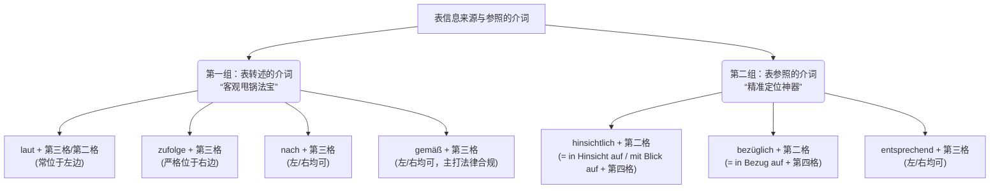

# 表信息来源与参照的介词

Guten Tag！未来的德国新移民！欢迎来到“德语大师”的语法集训营！

如果您要在六个月内拿下 B 2 证书，并顺利适应德国的移民生活（租房、找工作、跟严谨的德国官僚打交道），那么今天我们讲解的这个语法点绝对是您必须拿下的“护身符”。

在德国生活，最重要的一项生存技能就是“做到有理有据”。无论是跟外管局（Ausländerbehörde）办事，还是跟房东（Vermieter）理论，您都需要精准地引用法律、合同或者专家的原话。今天，我们就来集中攻克这个核心知识点——**表信息来源与参照的介词**。

为了让您一目了然，我先用一张图表把今天这 **10 个**不可或缺的介词/介词词组给您盘点清楚：

代码段

### 第一组：表转述的介词 (The "Pass-the-Buck" Prepositions)

虽然在中文里，它们往往都可以统一翻译成“根据……”或“按照……”，但在德语中，它们在**语法结构（接第几格、放在名词前还是后）**、**使用场景（新闻、法律、日常观点）**以及**情感色彩**上都有着严格的区分。

如果用错了，虽然德国人大概率能听懂，但会觉得非常不地道（比如把法律词汇用在了主观感受上）。

### 1. laut (侧重：客观出处、文字载体、数据)

这是日常和新闻中最常见的一个词，强调信息有一个**具体的、客观的来源**，特别是文本、文件或统计数据。

- **语法特征：** 放在名词**前面**。加**第二格（Genitiv）**或**第三格（Dativ）**。如果名词前没有冠词或形容词，往往词尾不变化（即零形式）。
- **应用场景：** 引用报纸、天气预报、统计局、报告、调查结果等。
- **翻译偏好：** 根据（……的记载 / 报道 / 数据）。
- **例句：**
    - **Laut** _dem Wetterbericht_ (Dativ) wird es morgen regnen. (根据天气预报，明天会下雨。)
    - **Laut** _einer aktuellen Studie_ (Dativ) schlafen wir zu wenig. (根据一项最新研究，我们睡眠不足。)

### 2. zufolge (侧重：新闻报道、他人陈述、传言)

这个词在新闻德语（Nachrichtensprache）中出现频率极高，往往带有“据某人或某机构称（但我不对此绝对负责）”的意味。

- **语法特征：** **绝大多数情况下放在名词后面（后置介词）！** 放在名词后面时，必须接**第三格（Dativ）**。_(极少见的情况下放在前面，此时接第二格，但日常不用管这个例外)_。
- **应用场景：** 引用专家的话、目击者证词、新闻媒体的爆料。
- **翻译偏好：** 据……称，据……报道，依……所言。
- **例句：**
    - _Dem Zeitungsbericht_ **zufolge** gab es keine Verletzten. (据报纸报道称，没有人员伤亡。)
    - _Experten_ **zufolge** wird die Wirtschaft wachsen. (据专家称，经济将会增长。)

### 3. nach (侧重：主观观点、常规依据、感官判断)

这是最基础、最灵活的一个词。它除了可以表示客观依据，最大的特色是**唯一一个常用于表达“主观观点”的介词**。

- **语法特征：** 接**第三格（Dativ）**。可以放在名词前，也可以放在名词后（后置时往往为了强调）。
- **应用场景：** “依我看”、“听起来”、“闻起来”、“凭经验”。**绝不可用 laut 或 zufolge 来表达主观意见！**
- **翻译偏好：** 依……看，按……来判断。
- **例句：**
    - _Meiner Meinung_ **nach** ist das eine schlechte Idee. (**依我之见**，这是个糟糕的主意。—— **绝对不能说** laut meiner Meinung!)
    - **Nach** _dem Gesetz_ bist du im Recht. (按法律来看，你是对的。)
    - Das riecht **nach** Gas. (这闻起来像是煤气味。—— 感官判断)

### 4. gemäß (侧重：法律、规章、合同等正式条文)

这是一个非常**正式（formell）且生硬**的词，属于公文和法律词汇。

- **语法特征：** 接**第三格（Dativ）**。前后置皆可，但在现代德语中多放在名词**前面**。
- **应用场景：** 严格遵循法律条款、合同规定、官方指示或非常正式的约定。
- **翻译偏好：** 依照，遵照，符合（……的规定）。
- **例句：**
    - **Gemäß** _Paragraph 3_ des Vertrags... (依照合同第 3 条的规定……)
    - Alles verlief **gemäß** _unseren Vorstellungen_. (一切都完全符合/遵照我们的设想进行。)

### 5. entsprechend (侧重：使之相符、应对)

这个词与 `gemäß` 类似，但它更强调“与……相适应 / 相对应”的动态契合感。

- **语法特征：** 接**第三格（Dativ）**。通常放在名词**后面**。
- **应用场景：** 按照某种情况做出相应的反应，或者事情的发展与预期相符。
- **翻译偏好：** 与……相符，顺应。
- **例句：**
    - _Den Umständen_ **entsprechend** geht es ihr gut. (相对目前的情况而言，她过得还不错。)
    - Er hat _meinen Anweisungen_ **entsprechend** gehandelt. (他是按照/顺应我的指示行事的。)

### 📊 核心区分一览表 (强烈建议截图保存)

为了在说话和写作中能一秒做出选择，请记住这个表格：

|**介词**|**你的信息来源是什么？**|**位置要求**|**接第几格？**|**典型搭配/例句核心**|
|---|---|---|---|---|
|**laut**|客观载体（文件/数据/报道）|必须在**前**|Dativ / Genitiv|laut der Studie (根据研究)|
|**zufolge**|别人的话/新闻（据说/据称）|必须在**后**|Dativ|Experten zufolge (据专家称)|
|**nach**|**主观观点** / 经验判断|前后皆可|Dativ|meiner Meinung nach (依我看)|
|**gemäß**|法律 / 合同 / 官方条文|通常在**前**|Dativ|gemäß dem Vertrag (依照合同)|

**🚫 避坑总结：**

### 第二组：表参照的介词 (The "Pinpoint" Prepositions)

**类比理解：**

这类介词就像是狙击步枪上的“瞄准镜”。当您想在庞杂的信息中，把话题精准锁定在某一个具体切入点（比如：专门谈论您的薪水、您的工作表现、或者报税事宜）时，就要用到它们。

- **1. hinsichtlich + 第二格**
    - **意义：** 鉴于……，从……方面看。
    - **等价词组（必须掌握）：** **in Hinsicht auf + 第四格** / **mit Blick auf + 第四格**。
    - **官方例句：** Er ist **hinsichtlich** seines Verhaltens zu kritisieren. (从他的行为表现来看，他理应受到批评。)
    - **移民实战（职场表现）：** **Hinsichtlich** Ihrer Deutschkenntnisse haben Sie große Fortschritte gemacht. (在您的德语语言能力方面，您取得了巨大的进步。)
- **2. bezüglich + 第二格**
    - **意义：** 关于，有关。在商务邮件中极度高频！
    - **等价词组（必须掌握）：** **in Bezug auf + 第四格**。
    - **官方例句：** Ich möchte etwas **bezüglich** der Steuer anmerken. (关于税务方面，我想作些补充说明。)
    - **移民实战（办事邮件）：** Ich schreibe Ihnen **bezüglich** meines Visumantrags. (我写信给您是关于我的签证申请事宜。)
- **3. entsprechend + 第三格**
    - **脾气：** 比较灵活，可位于名词的**左边或右边**。
    - **意义：** 按照，依据（表示动作与某事相符/相对应）。
    - **官方例句：** Wir haben alles **entsprechend** Ihrem Wunsch arrangiert. / Wir haben alles Ihrem Wunsch **entsprechend** arrangiert. (我们已经按照您的意愿安排好了一切。)
    - **移民实战（生活办事）：** Ich habe die Dokumente Ihren Vorgaben **entsprechend** eingereicht. (我已经按照您的规定要求递交了文件。)

### 大师的复习小结 (Zusammenfassung)

为了在六个月内达到 B 2 水平，您不需要死记硬背，而是要**把它们与位置和格死死绑定**：

1. **只能放右边**的奇葩：`zufolge` (+Dativ)。
2. **左右逢源**的随和派：`nach`, `gemäß`, `entsprechend` (+Dativ)。
3. **法律/行政**首选：`gemäß` (+Dativ)。
4. **高端替代**：想说 über，以后在正式场合请换成 `bezüglich` 或 `hinsichtlich` (+Genitiv)。

如果您能把上面的例句在模拟租房、写邮件或者看病时脱口而出，德国考官或者办事员绝对会对您的德语水平刮目相看！

掌握了这套“有理有据”的甩锅与瞄准神技后，您在准备移民德国的各种材料与文书沟通过程中，**目前最头疼的是哪一类场景（比如：给外管局写邮件催进度、阅读繁杂的租房合同，还是看懂工作 Offer 里的条款）？** 我们可以针对您最薄弱的场景，马上用今天学的介词来进行一场实战写作演练！
