# 表因果的介词

如果您要在六个月内拿下 B 2 证书，并且在德国的生活中做到游刃有余（比如向外管局解释补交材料的原因、向房东说明迟交房租的理由，或者在职场上得体地做工作汇报），您就必须**戒掉永远只用“weil”和“denn”的习惯**。

在 B 2 级别，德国人更喜欢用“介词 + 名词短语”**来表达复杂的因果关系，这不仅能让句子更简练，还能彰显您的语言水平。今天，我们将根据您提供的重要学习资料 **PixPin _2026-06-15_22-33-05.jpg**，为您系统、完整地拆解**“表因果的介词 (Kausale Präpositionen)”这一核心章节。

为了让您对这 10 个介词的大局观一目了然，我为您绘制了下面的知识框架图：

代码段

```mermaid
mindmap
  root((表因果的介词<br/>B2核心语法))
    情绪类
      aus + Dativ (可控行为)
      vor + Dativ (不可控生理反应)
    客观事实与动机类
      wegen + Genitiv (通用客观原因)
      aufgrund + Genitiv (行为的动机)
      infolge + Genitiv (过去事件引发的结果)
    特定场景类
      angesichts + Genitiv (面对当前状况/亲眼所见)
      anlässlich + Genitiv (特定事件触发)
    结果导向类
      dank + Genitiv/Dativ (积极的好结果)
    行政与法律类
      kraft + Genitiv (权力的赋予)
      mangels + Genitiv/Dativ (客观缺失)
```

### 第一组：表达由情绪引起的因果 (aus 与 vor)

这一组是 B 2 考试和日常生活中极其容易混淆的考点。虽然它们都接**第三格 (Dativ)** 且通常使用**零冠词**，但在“控制力”上有着本质的区别。

**类比讲解：**

您可以把 `aus` 想象成一位“内心导演”**，它基于某种情绪，指挥您**主动**去做某件事；而 `vor` 就像是一个**“提线木偶大师”**，这种情绪太强烈了，导致您的身体产生了**无法控制的生理反应（发抖、哭泣、僵硬）。

- **1. aus + 第三格 (Dativ)**
    - **官方定义：** 用于引发**可控行为**的情绪。
    - **搭配重点：** 几乎全为零冠词。注意，它总与 `Grund` (原因) 搭配，例如 _aus finanziellen Gründen_ (出于财务原因)。
    - **教材例句：** Er ist _aus Leichtsinn_ zu schnell gefahren. (他出于轻率/大意开得太快了。) -> _开快车是一个他自己可以控制的动作。_
    - **移民实战（职场求职）：** Ich habe den Job _aus Interesse_ an der IT-Branche angenommen. (我出于对 IT 行业的兴趣接受了这份工作。)
- **2. vor + 第三格 (Dativ)**
    - **官方定义：** 用于导致**不可控的反应**的情绪。
    - **搭配重点：** 零冠词形式。常搭配动词如 zzittern (发抖), weinen (哭泣), erstarren (僵硬), sterben (夸张表达的死亡)。
    - **教材例句（PixPin _2026-06-15_22-33-05.jpg 漫画场景）：** Der Fahrer hat _vor Angst_ gezittert. (司机害怕得直发抖。) -> _发抖是身体的本能反应，无法控制。_
    - **移民实战（办事焦虑）：** Als ich bei der Ausländerbehörde wartete, habe ich _vor Nervosität_ geschwitzt. (当我在外管局等待时，我紧张得直冒汗。)

### 第二组：表达客观事实与动机的因果 (wegen, aufgrund, infolge)

在与德国官方机构打交道时，这三个介词是您必须熟练掌握的“公文利器”。它们通常都需要接**第二格 (Genitiv)**。

- **3. wegen + 第二格 (Genitiv)**
    - **官方定义：** 表原因（与情绪无关）。
    - **语法补充：** 在日常口语中，它也可以接第三格 (Dativ)，但在 B 2 的书面考试或正式邮件中，请务必使用第二格！
    - **教材例句：** Er hat _wegen der nassen Straße_ die Kontrolle verloren. (他因为路面湿滑失去了控制。)
    - **移民实战（看病请假）：** Ich kann heute _wegen einer starken Erkältung_ nicht zur Arbeit kommen. (因为重感冒，我今天不能来上班了。)
- **4. aufgrund + 第二格 (Genitiv)**
    - **官方定义：** 表行为的动机（不可用于描述突发事件或情绪）。它比 `wegen` 听起来更正式、更具书面语色彩，是德国官僚系统的最爱。
    - **教材例句：** Der Mann ist _aufgrund einer Wette_ so schnell gefahren. (这个男人是由于一个赌注才开这么快的。)
    - **移民实战（行政申请）：** _Aufgrund meines neuen Arbeitsvertrags_ beantrage ich die Blaue Karte EU. (基于我的新工作合同，我申请欧盟蓝卡。)
- **5. infolge + 第二格 (Genitiv)**
    - **官方定义：** 指出某**过去的事件**导致了该结果。重点在于“多米诺骨牌效应”的连锁反应。
    - **教材例句：** Das Auto muss _infolge des Unfalls_ in die Werkstatt. (由于那场事故，这辆车必须进修理厂。)
    - **移民实战（租房纠纷）：** _Infolge des Wasserschadens_ ist die Wohnung derzeit unbewohnbar. (由于之前的水灾，该公寓目前无法居住。)

### 第三组：特定场景下的因果介词 (angesichts, dank, anlässlich)

- **6. angesichts + 第二格 (Genitiv)**
    - **官方定义：** 亲眼所见，“当面”或“面对某种状况”。
    - **类比讲解：** 就像您站在一面巨大的镜子前，看到了一个宏大的现实情况，从而做出了某个决定。
    - **教材例句：** _Angesichts so eines Unfalls_ fahren die Leute erst mal vorsichtiger. (面对这样一场事故/看到这样的事故后，人们首先会开得更小心些。)
    - **移民实战（大环境讨论）：** _Angesichts des Fachkräftemangels_ in Deutschland haben IT-Experten sehr gute Chancen. (面对德国专业人才短缺的现状，IT 专家有非常好的机会。)
- **7. dank + 第二格 (Genitiv) / 第三格 (Dativ)**
    - **官方定义：** 多亏了。极其重要：它仅适用于好的、积极的结果！等同于 "danke"。
    - **语法补充：** 当名词前**无冠词和形容词**时，可以使用第三格。
    - **教材例句：** _Dank seines Airbags_ ist ihm nichts passiert. (多亏了他的安全气囊，他才安然无恙。) / _Dank Gebrauch_ (第三格) des Airbags ist nichts passiert.
    - **移民实战（职场感谢）：** _Dank Ihrer Hilfe_ konnte ich mich schnell im neuen Team einleben. (多亏了您的帮助，我才能这么快融入新团队。)
- **8. anlässlich + 第二格 (Genitiv)**
    - **官方定义：** 用于一个特定的事件，由该事件所触发（值此……之际）。
    - **教材例句：** _Anlässlich ihres zehnten Hochzeitstages_ haben sie eine Reise gemacht. (值此结婚十周年之际，他们去旅行了。)
    - **移民实战（社交/公司活动）：** _Anlässlich des Firmenjubiläums_ gibt es am Freitag eine große Feier. (借着公司周年庆的契机，周五有一场盛大的派对。)

### 第四组：法律与行政的硬核介词 (kraft, mangels)

在阅读德国的法律文书、拒签信或合同条款时，这两个介词会频繁出现。掌握它们，您的德语将展现出极高的专业素养。

- **9. kraft + 第二格 (Genitiv)**
    - **官方定义：** 因为该人有权力（凭藉……的权力）。
    - **教材例句：** Der Polizist wird _kraft seines Amtes_ die Schuldfrage klären. (警察将凭藉其职务之权来查明责任归属。)
    - **移民实战（合同条款）：** Der Vermieter kann _kraft des Mietgesetzes_ die Miete erhöhen. (房东有权依据租房法提高租金。)
- **10. mangels + 第二格 (Genitiv) / 第三格 (Dativ)**
    - **官方定义：** 因为缺少某物（因缺乏……）。这是官方**拒信**中最常见的词！
    - **语法补充：** 与 `dank` 类似，当名词前无冠词和形容词时，可使用第三格。
    - **教材例句：** _Mangels eines Zeugen_ konnte die Schuldfrage nicht geklärt werden. (因缺乏证人，责任问题无法厘清。) / _Mangels Beweisen_ (第三格) konnte die Schuldfrage nicht geklärt werden.
    - **移民实战（签证/求职悲剧）：** Ihr Antrag wurde _mangels ausreichender Dokumente_ abgelehnt. (由于缺乏充足的文件，您的申请被拒绝了。)

### ⚠️ 大师的特别提醒：固定搭配中的介词 (Feste Verbindungen)

在文件 PixPin _2026-06-15_22-33-05.jpg 的最下方，有一个非常关键的红色警告标志。德国人有一些约定俗成的固定搭配，并不遵循上述规则，您必须像记单词一样将它们打包背诵，这在 B 2 口语考试中是极大的加分项：

- **durch Zufall**：偶然地，由于巧合。 _(Wir haben uns durch Zufall getroffen. 我们偶然相遇。)_
- **mit Absicht**：故意地。 _(Entschuldigung, das habe ich nicht mit Absicht gemacht! 抱歉，我不是故意的！)_
- **aus Versehen**：不小心地，出于疏忽。 _(Ich habe aus Versehen Ihre E-Mail gelöscht. 我不小心删了您的邮件。)_
- **der Liebe halber**：为了爱。（注意：`halber` 是一个非常特殊的介词，它**必须放在名词的后面**，接第二格，表示“为了……的缘故”）。 _(Er ist der Liebe halber nach München gezogen. 他为了爱情搬到了慕尼黑。)_

只要您把这些介词按照“情绪”、“客观/行政”、“特定场景”分类消化，并在脑海中预演这些移民实战场景，您的德语表达不仅能顺利达到 B 2 标准，更能让每一个与您交流的德国人都赞叹您的严谨与地道！ Viel Erfolg! (祝您成功！)
