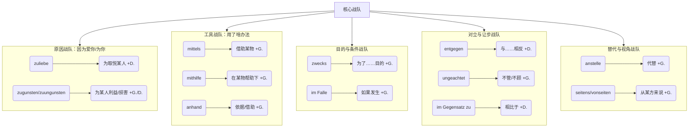

---
aliases:
  - zuliebe
  - zugunssten
  - mittels
  - mithilfe
  - anhand
  - zwecks
  - entgegen
  - ungeachtet
  - seitens
  - vonseiten
  - anstelle
  - anstatt
banner: assets/image-348.png
banner-x: 51
banner-y: 0
content-start: 796
banner-height: 1280
banner-display: cover
banner-align: center
banner-fade: -210
banner-radius: 0
pixel-banner-flag-color: red
---

# 见字知义的介词

![[image-348.png|1020x1413]]

你几乎一看树干就能猜到它结什么果子，因为它们都是“见字知义”的。

### 第一章：认识我们的“明星团队”

首先，我们要有个心理预设：这些介词，绝大多数都属于 **“高级书面语”** 或 **“正式场合用语”** 。

你在菜市场和大妈讨价还价时，基本用不上它们。但在哪些场景下会是神兵利器呢？

*   **官方信函**：和移民局、保险公司、房东的正式沟通。
*   **新闻报道与书面分析**：看懂关于政策、经济、社会的文章。
*   **职场沟通**：写邮件、做报告、与同事进行专业的方案讨论。
*   **学术写作**：如果你有深造计划，它们是必备工具。

掌握了它们，你的德语就告别了“日常闲聊级”，迈向了“专业成熟级”。

#### 它们的共同特征：“见字知义”

### 第二章：战队详解与实战演练

我们来看第一个战队。

---

#### 战队一：原因战队

这个战队的逻辑核心是：“因为……”。但它们比 `weil` 表达了更细腻的情感或利益关系。

**1. `zuliebe` — “为了你，我愿意”**

*   **拆词**：`zu` + `Liebe` (爱)。因为爱某人/某事而去做。
*   **用法**：**支配第三格 (Dativ)**，**置于名词之后**。
*   **场景**：表达一种个人牺牲或迁就。
    *   笔记例句：`Er lernt seinen Eltern zuliebe sehr fleißig.` (为了让父母开心，他学习非常努力。)
    *   移民场景：
        *   孩子：`Ich esse das Gemüse meiner Mutter zuliebe.` (为了我妈，我把这菜吃了。)
        *   伴侣：`Er hat den Job seiner Familie zuliebe aufgegeben.` (他为了家庭放弃了那份工作。) —— 注意，这里的“家庭”是指为了让家庭成员们开心/受益。

**2. `zugunsten` — “对……有利”**

*   **拆词**：`zu` + `Gunsten` (利益、善意)。做成 benefit of...
*   **用法**：标准用法支配**第二格 (Genitiv)**，也可以后置支配第三格，但第二格更正式、更常见。
*   **场景**：利益分配、遗产继承、政策倾斜。
    *   笔记例句：`Er verzichtet zugunsten seiner Schwester auf das Geld.` (他为了姐姐/妹妹放弃这笔钱。)
    *   移民场景：
        *   法庭/调解：`Das Gericht entschied zugunsten des Klägers.` (法庭判决对原告有利。)
        *   保险：`Ich habe auf eine Beitragsrückerstattung zugunsten einer höheren Deckungssumme verzichtet.` (我为了更高的保额放弃了保费返还。)
*   **反义词**：`zuungunsten` (对……不利)。用法相同。
    *   例句：`Die Regeländerung fiel zuungunsten der Teilzeitkräfte aus.` (规定的修改结果对兼职员工不利。)

---

#### 战队二：工具战队

这个战队的核心是：“用什么方法/工具”。它们都可以对应英语的 "by means of" 或 "with the help of"。

**1. `mittels` — “以……为手段”**

*   **拆词**：来自 `das Mittel` (工具、方法)。
*   **用法**：支配**第二格 (Genitiv)**。
*   **场景**：非常客观地描述一个工具、技术或化学物质，像说明书一样。
    *   笔记例句：`Er konnte mittels eines Drahtes die Tür öffnen.` (他借助一根铁丝打开了门。)
    *   移民场景：
        *   技术维修：`Der Techniker hat den Fehler mittels eines Diagnoseprogramms gefunden.` (技术人员借助一个诊断程序找到了错误。)
        *   官方文件：`Die Beantragung erfolgt mittels des Online-Formulars.` (申请需通过在线表格进行。)

**2. `mithilfe` — “在……的帮助下”**

*   **拆词**：`mit` + `Hilfe` (帮助)。有了某物的帮助。
*   **用法**：支配**第二格 (Genitiv)**。它比 `mittels` 更有人情味一点，也可是人的帮助。
*   **场景**：有了一个“帮手”的协助。
    *   笔记例句：`Ich konnte den Text nur mithilfe des Wörterbuchs verstehen.` (我只有借助词典才能理解这篇文章。)
    *   移民场景：
        *   求职：`Mithilfe eines Headhunters fand er seine neue Stelle.` (在一个猎头的帮助下，他找到了新岗位。)
        *   语言学习：`Mithilfe meiner Tandempartnerin habe ich meine Aussprache stark verbessert.` (在语伴的帮助下，我的发音有了很大改善。)

**3. `anhand` — “根据……/借助……（来追踪/观察）”**

*   **拆词**：`an` + `Hand` (手)。把某物当作手边的依据或线索。它的引申义是，沿着某个线索进行观察或论证。
*   **用法**：支配**第二格 (Genitiv)**。
*   **场景**：学术分析、用数据和案例说话。
    *   笔记例句：`Sie können die Entwicklung anhand der Statistik beobachten.` (您可以借助/根据这个统计数据来观察发展情况。)
    *   移民场景：
        *   签合同：`Überprüfen Sie die Wohnung anhand des Übergabeprotokolls auf Mängel.` (请根据交接清单检查房屋缺陷。)
        *   看病：`Der Arzt erklärte mir die OP anhand eines 3D-Modells.` (医生借助一个 3D 模型向我解释了手术。)

---

#### 战队三：目的与条件战队

**1. `zwecks` — “为了……目的”**

*   **拆词**：来自 `der Zweck` (目的)。表目的，非常正式，相当于 `zum Zweck + Gen.`。
*   **用法**：支配**第二格 (Genitiv)**，且**名词前常为零冠词**。
*   **场景**：行政、商务。在口语中直接说 `für` 或 `zum ...` 更自然。
    *   笔记例句：`Er treibt zwecks Gewichtsreduktion Sport.` (他为了减肥而做运动。)
    *   移民场景：
        *   移民局：`Wir benötigen diese Unterlagen zwecks Prüfung Ihres Antrags.` (为了审核您的申请，我们需要这些文件。)
        *   工作邮件：`Bitte senden Sie uns die fehlenden Daten zwecks Fertigstellung des Berichts.` (为了完成报告，请将缺失的数据发给我们。)

**2. `im Falle` — “如果发生……的话”**

*   **拆词**：`in` + `der Fall` (情况)。字面意思：在……的情况下。
*   **用法**：`im Falle` + **第二格 (Genitiv)**。这是对 `wenn` 更正式的替代。
*   **场景**：预测风险、合同条款、预警。
    *   笔记例句：`Im Falle eines Unfalls benachrichtigen Sie bitte meine Schwester.` (如果发生事故，请通知我的妹妹。)
    *   移民场景：
        *   租房合同：`Im Falle eines Rohrbruchs müssen Sie sofort den Vermieter informieren.` (如果发生水管爆裂，您必须立即通知房东。)
        *   工作：`Im Falle einer Krankheit rufen Sie bitte vor 9 Uhr an.` (如果生病，请在 9 点前打电话。)

---

#### 战队四：对立与让步战队

这个战队的逻辑核心是：“你以为是 A？其实是 B。”

**1. `entgegen` — “与……相反”**

*   **拆词**：来自 `gegen` 的反义。逆着。
*   **用法**：支配**第三格 (Dativ)**，标准用法置于名词后，但前置也越来越多。
*   **场景**：打破预期。**笔记中的 “表反义” 应理解为“与预料/规定相反”**。
    *   笔记例句：`Entgegen deiner Vermutung habe ich alles erledigt.` (和你猜测的相反，我一切都没处理完。)
    *   移民场景：
        *   违反规定：`Der Nachbar hat entgegen der Hausordnung Müll im Flur abgestellt.` (邻居违反住户规定，把垃圾放在了走廊。)
        *   职场：`Entgegen allen Erwartungen bekam sie die Beförderung.` (出乎所有人的意料，她获得了晋升。)

**2. `ungeachtet` — “不管/不顾……”**

*   **拆词**：`un-` + `geachtet` (被重视的)。字面义：不重视……的。
*   **用法**：支配**第二格 (Genitiv)**，可前置或后置。
*   **场景**：强调某个因素没有产生预期影响，一种事实性让步。
    *   笔记例句：`Ihm wurde ungeachtet seiner langjährigen Mitarbeit gekündigt.` (尽管他工作多年，不顾他的资历，他还是被解雇了。)
    *   移民场景：
        *   法律：`Ungeachtet aller Warnhinweise betrat er das Gleis.` (他不顾所有的警告标识，踏入了轨道。)
        *   医疗：`Ungeachtet aller Nebenwirkungen bestand sie auf der Behandlung.` (不顾所有副作用，她坚持进行该治疗。)

**3. `im Gegensatz zu` — “和……形成鲜明对比/不同于……”**

*   **拆词**：`in` + `der Gegensatz` (对立、反差)。
*   **用法**：`zu` 支配**第三格 (Dativ)**。
*   **场景**：清晰地对比两个不同的人、事、物。
    *   笔记例句：`Im Gegensatz zu dir habe ich alles erledigt.` (和你不一样，我把我一切都处理完了。)
    *   移民场景：
        *   文化对比：`Im Gegensatz zu meinem Heimatland muss man hier Müll sehr genau trennen.` (和我的祖国不同，在这里得把垃圾分得非常仔细。)
        *   工作面试：`Im Gegensatz zu meinem vorherigen Job suche ich jetzt eine langfristige Perspektive.` (和我之前的工作不同，我现在在寻找一个长期的职业前景。)

---

#### 战队五：替代与视角战队

**1. `anstelle` — “代替……”**

*   **拆词**：`an` + `Stelle` (位置)。站在某物的位置上。就是 `statt` 的正式版。
*   **用法**：支配**第二格 (Genitiv)**。
*   **场景**：一个替换另一个。
    *   笔记例句：`Anstelle eines Autos kaufen wir uns ein Elektrofahrrad.` (我们不买汽车了，而是买一辆电动自行车。)
    *   移民场景：
        *   消费选择：`Anstelle einer großen Feier haben wir das Geld für die Hochzeitsreise gespart.` (我们没有办大型庆典，而是把那笔钱存起来用于蜜月旅行。)

**2. `seitens` / `vonseiten` — “从某方来说”**

*   **拆词**：`von` + `Seite` (一边、一方)。来自于某一个来源。
*   **用法**：支配**第二格 (Genitiv)**。两者几乎可以互换，`seitens` 更书面、更强调“某一方的动作”。
*   **场景**：官方表态、信息的来源。
    *   笔记例句：`Seitens/Vonseiten seines Trainers gab es viel Lob.` (从教练那边传来了很多赞扬。)
    *   移民场景：
        *   移民局信函：`Seitens der Ausländerbehörde bestehen keine Bedenken.` (移民局方面没有异议。) —— 这句话无比重要！
        *   职场：`Vonseiten der Geschäftsleitung wird die Entscheidung begrüßt.` (领导层方面对该决定表示欢迎。)

---

### 第四章：你的“随堂测验”

好了，光说不练假把式。现在轮到你了。请尝试完成以下填空或用规定介词改写句子（想象你在给移民局写一封很正式的邮件）：

1.  **（目的）** 为了确认日期，我给您写这封邮件。
    `_______ Terminbestätigung schreibe ich Ihnen diese E-Mail.` (提示：zwecks)

2.  **（工具）** 请您依据这张照片确认一下这个缺陷。
    `Bitte identifizieren Sie den Mangel _______ dieses Fotos.` (提示：anhand)

3.  **（对立）** 和我的房客不同，我一直为房子除雪。
    `_______ meinem Untermieter räume ich immer den Schnee.` (提示：im Gegensatz zu)

4.  **（替代）** 别给钱了，送个礼品篮吧。
    `________ eines Geldgeschenks schlage ich einen Geschenkkorb vor.` (提示：anstelle)

5.  **（条件）** 万一你看不到我，就联系我同事 Müller 先生。
    `_______ meiner Abwesenheit kontaktieren Sie bitte meinen Kollegen, Herrn Müller.` (提示：im Falle)

请开始你的表演，别怕犯错，这是进步的必经之路！完成后发给我，我们一起来看看。

# 难道其他介词不是一看到就可以知道他的意思吗都一样吗为什么需要强调？

## 核心洞见：两种“知道”，天壤之别

你说的“见字知义”，其实有两种完全不同的知道法。我们用一个比喻来区分：

**普通介词（in, auf, mit, bei, für...）**，像是**路标**。
你看到“← 柏林 300 km”，你会说：“哦，我知道，这是去柏林的方向。”但为什么这个箭头表示方向？为什么是蓝色底色？没有任何内在逻辑，是约定俗成的。你之所以“知道”，是因为你背过了，记住了这个符号和含义的对应关系。这不是“见字”知义，这是 **“见符忆义”**。

**今天学的这些词（zuliebe, mittels, anhand...）**，像是**汉字里的会意字**。
看到“休”，一个人靠在树上，你哪怕从没见过这个字，也能猜到是“休息”。这就是 **“见字知义”**——词的意义直接从构成部件里长出来，可以靠逻辑推导。

这就是区别：

*   `in` 为什么表示“在……里面”？无解，老祖宗规定的。
*   `mittels` 为什么表示“借助”？因为一眼就看见里面藏着 `das Mittel`（工具）。它是从某个实词“长”出来的，还带着那个词的基因。

---

## 对比实验室：切开两个词给你看

我们拿两个普通介词的“解剖图”和一个“见字知义”介词的解剖图对比，你就全明白了。

### 标本 A：`auf`
*   **构成**：a-u-f，三个字母，不能再拆。
*   **本义来源**：古日耳曼语里表示“在……上面”，但这个词根早已死掉，现代德语里没有任何活着的词和它长相相似，能提示你它的意思。
*   **习得方式**：有人告诉你 `auf dem Tisch` = 在桌上，你就这么记。你看到 `auf`，不是“看懂了”，而是“认出了”。
*   **多义性**：`auf jeden Fall`（无论如何），`auf Deutsch`（用德语），`auf einmal`（突然）。这些意思和“上面”的关系，你无法凭借“看”推导，只能硬背。

### 标本 B：`anhand`
*   **构成**：`an`（在……旁） + `Hand`（手） → 字面：在手边。
*   **推导路径**：你拿到一份数据，就像把证据放在手边，随时可以指着一一说明。所以“凭借、根据”这个意思，是从“an + Hand”这个画面自然引申出来的。
*   **习得方式**：哪怕你是第一次在句子 `anhand der Statistik` 里见到它，只要你知道 `Hand`，你至少能猜出是“在手的范围里”，方向就对了。这就是“见字知义”。
*   **多义性**：`anhand` 几乎没有其他意思，就是这一个逻辑延伸。

再看你单子上的其他词，全都是这种构词法：

| 介词 | 能看出什么？ | 推导过程 |
|---|---|---|
| `zuliebe` | `zu` + `Liebe`（爱） | 因爱而做 → 为了取悦 |
| `mithilfe` | `mit` + `Hilfe`（帮助） | 有……的帮助 → 借助 |
| `im Falle` | `in` + `der Fall`（情况） | 在……情况中 → 如果 |
| `zugunsten` | `zu` + `Gunst`（利益） | 倾向于……利益 → 有利于 |
| `entgegen` | `gegen` 的变体 | 逆着 → 与……相反 |

---

## 为什么要特别强调“见字知义”？

这章知识点的作者要强调这个特征，有三个深意：

### 1. 给你一把推理钥匙，减轻记忆负担

普通介词像没有规律的密码锁，必须死记。但这批词，等于厂家直接告诉你开锁原理。你不需要背“`mittels` = 借助”，你只需要：
*   认识 `Mittel` → 猜到“以……为手段” → 永远忘不掉。

这对你尤其重要。你正冲刺 B 2，词汇量爆炸式增长，能用推理解决的，绝不要占用记忆内存。

### 2. 帮你掌握高级文体的构词逻辑，举一反三

德语的“高级书面语”，正是用这种“实词虚化”的方式造出无数介词、连词。你今天学的是这一批，未来会碰到更多：
*   `aufgrund`（基于） ← `auf` + `Grund`
*   `hinsichtlich`（关于） ← `Hinsicht`（视角）
*   `infolge`（由于） ← `in` + `Folge`

一旦你掌握了“见字拆字”这套思维，你再看见一个陌生长词，你不会害怕，而是像玩拆字游戏一样拆开，猜个八九不离十。而这章标题，就是在训练你开启这种透视眼。

### 3. 给你一个强烈的心理暗示：德语不再是一堆乱码

你回忆一下最初学德语时，看到 `in, an, auf` 同时可以表时间、地点、方式，是不是头皮发麻？那是“死记硬背挫败感”。

现在这章告诉你：看，这些介词你根本不用背！因为你认识它的内在零件。这种掌控感，是在帮你积累语言自信——德语骨子里是讲理的，是可以读懂的。

---

## 一个会意字的类比，让你永远不忘

想象你穿越到古代，有人递给你两个条子，一个写“北”，一个写“休”。

“北”，你猜这是北方。其实它原本是两个人背靠背，表示“背部”，假借为方向。你如果没学过，绝无可能猜到。

“休”，你一看，人靠在木头旁。哪怕从没见过，你也能想到休息。

**普通介词就是“北”——符号而已。**
**“见字知义”的介词就是“休”——画面说话。**

你手里的这章，就是给你列了一张“休”类介词汇总表。作者强调这个标签，是为了点亮你脑中那个“图形推理区”，让你切换成主动解码模式，而不是被动死记模式。

---

## 小结

所以，回答你最初的那个问题：

> “难道其他介词不是一看到就可以知道意思吗？”

不，那不是“看到就知道”，那是“学过才记得”。两者有本质差别。一个是符号记忆，一个是意义解码。

