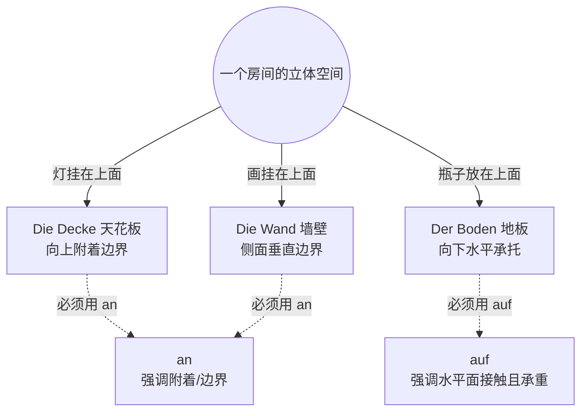

# 介词

# 1

![[image-44.png|1024x738]]
ID: 1774612227870

这是一份非常典型的德语 A 2-B 1 级别介词综合练习题。题目要求填写正确的介词，主要考察了**支配第三格（Dativ）的介词**在表达时间、地点、方式及人物关系时的用法。

以下是完整的题干及原文：

> Liebe Ela,
> 
> viele Grüße **aus** dem Schwarzwald! Wir sind schon **seit** zwei Wochen hier. Das Wetter ist toll und wir haben jeden Tag **mit** unseren Freunden lange Wanderungen gemacht. Morgen wollen wir **von** (错，应为**nach**) Freiburg **bei** (错，应为**zu**) meiner Tante fahren. Freiburg ist nicht weit **bei** (错，应为**von**) hier, es liegt ungefähr 70 Kilometer südwestlich **von** Königsfeld. Aber ohne Auto braucht man lange. Wir müssen erst **mit** dem Bus und dann **mit** dem Zug fahren. Die Fahrt dauert mehr als zwei Stunden. In Freiburg können wir **zu** (错，应为**bei**) meiner Tante übernachten. Wir bleiben ein paar Tage und wollen **zu** (错，应为**mit**) meiner Tante die Stadt besichtigen und gemütlich shoppen gehen. Vielleicht kannst du auch **nach** Freiburg kommen? **Nach** (错，应为**Von**) Basel ist es doch nicht so weit und wir haben uns **seit** zwei Jahren nicht mehr gesehen.
> 
> Liebe Grüße
> 
> Hannah

---

### 1、逐题精析与纠正

**[空 1] viele Grüße aus dem Schwarzwald!**
ID: 1774612227874

- **分析**：**正确**。表达“来自某地的问候”，德语固定用法为 `Grüße aus + 来源地 (Dativ)`。Schwarzwald（黑森林）是阳性名词，所以用 aus dem。

**[空 2] Wir sind schon seit zwei Wochen hier.**

- **分析**：**正确**。表达“从两周前一直持续到现在”，时间介词用 `seit + Dativ`。Wochen 是复数第三格，所以是 seit zwei Wochen。

**[空 3] ...jeden Tag mit unseren Freunden lange Wanderungen gemacht.**

- **分析**：**正确**。表达“和某人一起”，用 `mit + Dativ`。

**[空 4] Morgen wollen wir nach (学生填: von) Freiburg... fahren.**

- **分析**：**错误**。❌
    - **表层错误**：方向介词使用错误。
    - **可能原因**：学生可能没有理解句意，把“去弗赖堡”理解成了“从弗赖堡出发”，或者在口语负迁移中混淆了起点和终点。
    - **正确形式**：`nach`。表达“前往（无冠词的）城市或国家”，必须使用 nach。

**[空 5] ... zu (学生填: bei) meiner Tante fahren.**

- **分析**：**错误**。❌
    - **表层错误**：混淆了表示“动态方向”和“静态位置”的人物介词。
    - **可能原因**：母语负迁移。中文的“到我阿姨家”和“在我阿姨家”容易混淆。学生看到 Tante 就本能地填了 bei。
    - **正确形式**：`zu`。动词是 fahren（动态移动），表达“去某人那里”用 `zu + Dativ`。

**[空 6] Freiburg ist nicht weit von (学生填: bei) hier...**

- **分析**：**错误**。❌
    - **表层错误**：固定搭配记忆模糊。
    - **可能原因**：对空间起点的表达不熟悉。
    - **正确形式**：`von`。“离这里不远”固定表达为 `nicht weit von hier`（以这里为起点测算距离）。

**[空 7] ...südwestlich von Königsfeld.**

- **分析**：**正确**。表达方位“在...的西南方”，固定搭配为 `方位词 + von + Dativ`。

**[空 8 & 9] ...erst mit dem Bus und dann mit dem Zug fahren.**

- **分析**：**正确**。表达“乘坐某种交通工具”，用 `mit + Dativ`。

**[空 10] In Freiburg können wir bei (学生填: zu) meiner Tante übernachten.** ^bg3oo0

- **分析**：**错误**。❌
    - **表层错误**：同样混淆了“动态”与“静态”的人物介词。
    - **可能原因**：与[空 5]的错误如出一辙，但方向相反。这里是静态动作 übernachten（过夜），学生却用了动态的 zu。
    - **正确形式**：`bei`。在某人处（静态，无位移），用 `bei + Dativ`。

**[空 11] ...wollen mit (学生填: zu) meiner Tante die Stadt besichtigen...**

- **分析**：**错误**。
    - **表层错误**：介词词义与上下文语境脱节。
    - **可能原因**：学生陷入了“看到 Tante 就填地点介词”的惯性思维，没有通读全句。句子谓语是 besichtigen（参观），逻辑上应该是“和阿姨一起参观城市”。
    - **正确形式**：`mit`。表示伴随，“和...一起”。

**[空 12] Vielleicht kannst du auch nach Freiburg kommen?**

- **分析**：**正确**。前往城市用 nach。

**[空 13] Von (学生填: Nach) Basel ist es doch nicht so weit...**

- **分析**：**错误**。❌
    - **表层错误**：逻辑关系错误（起点 vs 终点）。
    - **可能原因**：没有理清写信人（Hannah 在弗赖堡附近）和收信人（Ela 在巴塞尔）的位置关系。意思是“从巴塞尔（过来）其实没那么远”。
    - **正确形式**：`Von`。表示物理空间的起点。

**[空 14] ...und wir haben uns seit zwei Jahren nicht mehr gesehen.**

- **分析**：**正确**。时间介词 `seit + Dativ` 表示从过去持续至今的状态（已经两年没见了）。

---

### 2、深度教学解析（聚焦：表示地点与方向的介词 nach, zu, bei, von）

在此次练习中，学生在表示**交通方式**（mit dem Bus）和**时间**（seit zwei Wochen）的介词上掌握得非常扎实，全对！但失分重灾区集中在**表示空间关系（尤其是与人物相关）的介词**上。
ID: 1774612227877

**句子翻译与语法复习：**

> _Morgen wollen wir **nach** Freiburg **zu** meiner Tante fahren._
> 
> （明天我们想去弗赖堡，到我阿姨那里去。）
> 
> _In Freiburg können wir **bei** meiner Tante übernachten._
> 
> （在弗赖堡，我们可以在我阿姨家过夜。）

- **语法精讲 (A 1-A 2 级别核心)**：这几个介词全都**严格支配第三格（Dativ）**。它们的难点不在于变格，而在于**空间逻辑**（Wohin 去哪里 vs. Wo 在哪里）以及**目标对象**（是城市还是人）。

**核心规则：地点介词的“十字坐标系”**

1. **目标是“无冠词的城市/国家/大洲”**
    
    - 动态（Wohin 去）：**nach** (例如：nach Freiburg, nach Deutschland)
        
2. **目标是“人/具体的建筑物/机构”**
    
    - 动态（Wohin 去）：**zu** (例如：zu meiner Tante, zum Arzt, zur Post)
    - 静态（Wo 在）：**bei** (例如：bei meiner Tante, beim Arzt)
        
3. **表示“来源 / 起点”**
    
    - 从人/建筑来（Woher）：**von** (例如：von meiner Tante, vom Arzt)
    - 从城市/国家来（Woher）：**aus** (例如：aus Freiburg, aus China)

**正反对比例证：**

- **本例剖析**：
    - 学生写：`von` Freiburg `bei` meiner Tante fahren. (错)
    - 动词是 fahren（位移）。目标是城市 Freiburg，所以用 **nach**；目标是人 Tante，所以用 **zu**。
- **经典反例**：
    - _Ich gehe nach meinem Freund._ (绝对错误！不能用 nach 加人。) -> 应为：Ich gehe **zu** meinem Freund.
    - _Ich bin zu Hause bei Berlin._ (错误！在城市不能用 bei。) -> 应为：Ich bin **in** Berlin.
- **拓展正例**：
    - Ich komme gerade **vom** Zahnarzt und fahre jetzt **nach** Hause. (我刚从牙医那里**出来**，现在回**家**。) -> _注：nach Hause 和 zu Hause 是特殊固定用法。_

**防错要点：口诀记忆法**

> **“去城 nach，去人 zu；在城 in，在人 bei；出城 aus，离人 von。”**
> 
> 做题前先问自己两个问题：1. 动词是静态 (Wo) 还是动态 (Wohin)？ 2. 后面接的是地方还是人？

**小试牛刀：**

请尝试用 `nach, zu, bei, in, von, aus` 填空：

1. Mein Auto ist kaputt. Ich bin gerade _____ (在...处) dem Mechaniker (机械师).
2. Nächste Woche fliege ich _____ (去) Paris.
3. Kommst du heute Abend _____ (去...处) mir?

_(答案：1. bei 2. nach 3. zu)_

---

### 3、总结与回顾

**您的学习建议：**
ID: 1774612227881

你在 `mit` 和 `seit` 的使用上表现得非常出色，时态和变格的基本功也很扎实！但在接下来的复习中，你需要**重点突破“空间方位介词”的逻辑梳理**。建议你画一张以自己为中心的“方位思维导图”，将“去朋友家 (zu)”、“在朋友家 (bei)”、“从朋友家离开 (von)”、“去柏林 (nach)”等日常场景用图形化的方式固定下来，摆脱中文母语中万物皆可“在”或“到”的习惯，培养德语纯正的立体空间思维！

# in an auf

![[image-112.png|1120x341]] 
ID: 1774612227884

## 德语大师说

ID: 1774612227888

现在，我们像外科医生一样，把你的三道错题逐一剖析：

---

### ❌ 错题 1：第 4 题 Wo ist die Flasche?

**你的答案：** ~~an dem Boden~~ **正确答案：** **auf** dem Boden (在地板上)
ID: 1774612227891

- **大师解析：** 你之前记住了 `an` 表示“接触”，但我们要复习一下上节课的“汉堡肉饼法则”。`der Boden`（地板/地面）是一个绝对的**水平面**。瓶子放在地上，是稳稳地站在上面，重力向下，地板承托着它。只要是这种“水平面上的承载关系”，我们必须毫不犹豫地使用 **auf**。
- **生活场景（租房交房时）：** 想象你刚租下德国的公寓，正在做房屋检查（Wohnungsübergabe）。
    - _Schauen Sie mal, hier ist ein Kratzer **auf** dem Boden._ (您看，地板上这里有一道划痕。)
    - _Wir müssen einen Teppich **auf** den Boden legen._ (我们得在地板上铺个地毯。)

### ❌ 错题 2：第 6 题 Wo ist die Lampe?

**你的答案：** ~~auf der Decke~~ **正确答案：** **an** der Decke (在天花板上)
ID: 1774612227895

- **大师解析：** 这是极其经典的错误！在中文里我们说“在天花板**上**”，所以你很自然地填了 `auf`。但是请记住：德语的 `auf` 必须是从上往下的“重力压制”。如果你用 `auf der Decke`，德国人脑海里出现的画面是：**你跑到了楼上邻居家的地板上（也就是你家天花板的背面），把灯放在了那儿！** 在德国人的逻辑里，天花板和墙壁一样，是房间的“边界”。灯是“悬挂/附着”在这个边界表面的，对抗着重力。只要是“挂在/附着在”非承重的边界上（墙面、天花板、窗户玻璃），统统用 **an**。
- **生活场景（居家安全）：** 德国法律规定每个房间都必须安装烟雾报警器。
    - _Der Vermieter muss einen Rauchmelder **an** der Decke installieren._ (房东必须在天花板上安装烟雾报警器。)

### ❌ 错题 3：第 8 题 Wo ist das Auto?

**你的答案：** ~~in dem Bild~~ **正确答案：** **auf** dem Bild (在照片/画上)
ID: 1774612227898

- **大师解析：** 又是一个母语负迁移的陷阱！英语我们习惯说 "in the picture"，中文说 "在照片里"。所以你很自然地写了 `in`。 **敲黑板划重点：** 德国人把照片（das Bild）、照片纸（das Foto）、甚至电脑屏幕（der Bildschirm/Monitor），都看作是一个**二维的平面（2 D）**。事物是“印在”或者“显示在”这个平面的**表面**上的，所以绝对不能用内部空间介词 `in`，必须用表示表面的 **auf**！
- **生活场景（外管局办签证）：** 去外管局延签，工作人员对你的护照照片有严格要求。
    - _**Auf** dem Passfoto dürfen Sie nicht lächeln!_ (在护照照片上您不允许微笑！——德国官僚做派，严肃点！)
    - _Ich habe den Termin **auf** dem Bildschirm gesehen._ (我在屏幕上看到了预约时间。)

---

### 💡 德语大师的半年 B 2 核心建议

看到你的答题卡，我发现你的基础其实很扎实（形容词词尾、冠词的 Dativ 变化都写对了，比如 `dem Tisch` , `der Vase`，非常棒！）。在接下来的学习中，对于介词的掌握，**请彻底抛弃中文翻译**，开始在大脑里建立“3 D 几何模型”：
ID: 1774612227902

1. **auf** = 稳稳踩在水平面上，或者印在 2 D 平面上。
2. **an** = 像壁虎一样贴在侧面、挂在上面，或者站在边缘。
3. **in** = 进到了一个有长宽高/有深度的 3D 容器里（比如你的第一题 `in der Vase`）。
