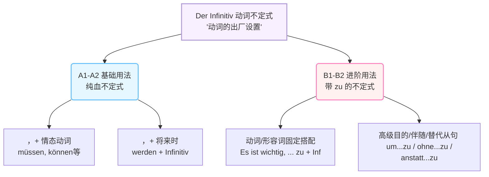

# 不定式

### 1. 概念解析：什么是不定式？

如果你去问字典，它会告诉你：“不定式是动词的原形”。但这太枯燥了！

**大师的类比时间：**

想象你去宜家（IKEA）买了一件家具。你从货架上搬下来的那个**扁平包装纸盒**，就是“不定式”。它里面包含了所有的零件，具备了成为家具的所有潜能，但**它还没有被组装**。

- 当你想把它变成一把椅子给“我”坐，你要根据说明书把它拼成“我的专属椅子”（_ich gehe_）。
- 当你想给“他”用，你要拼成“他的专属椅子”（_er geht_）。

这个“拼装”的过程在德语里叫**动词变位（Konjugation）**。

所以，**不定式就是没有经过任何人称（我、你、他）和时态（过去、现在、将来）加工的“动词出厂设置”**。

在德语里，这个“出厂设置”非常好认，99%的动词不定式都以 **-en** 结尾（比如：_machen_ 做, _arbeiten_ 工作），极少数以 **-n** 结尾（比如：_sammeln_ 收集）。

---

### 2. 不定式在德语中的“进阶图谱”

为了让你对接下来六个月要掌握的不定式用法有个全局观，我为你画了一张路线图。你可以直观地看到它在不同级别中的作用：

代码段

---

### 3. 不定式的核心应用场景（直击 B1-B2 考点）

我们直接结合你在德国的实际移民生活，看看这个“出厂设置”怎么用。

#### Level 1: 情态动词的“保镖法则”（A1-A2回顾，B1基础）

当句子中出现情态动词（müssen 必须, können 能够, möchten 想要等）时，情态动词就像保镖，霸占了句子的第二位并发生变位，而**不定式则被一脚踢到了句子的绝对末尾**，保持原形（出厂设置）不变。

- **场景（行政事务 - 延签）：**

    > Ich **muss** morgen alle Dokumente zur Ausländerbehörde **mitbringen**.
    > 
    > （我明天**必须**把所有文件**带去**外管局。）
    > 
    > _解析：muss 是变位的情态动词，mitbringen（带来）是被踢到句末的不定式。_

#### Level 2: 带 `zu` 的不定式（B1核心难点：给动词戴帽子）

如果在同一个句子里有两个动词，但**没有情态动词**帮忙撑场面怎么办？

在德语中，一个从句通常只能有一个“变位动词”。第二个动词不能光秃秃地站着，它必须戴上一顶叫做 **`zu`** 的帽子，并且乖乖待在句末。

- **场景（职场 - 签合同）：**

    > Es ist wichtig, den Arbeitsvertrag vor der Unterschrift genau **zu lesen**.
    > 
    > （在签字前仔细**阅读**工作合同是很重要的。）
    > 
    > _解析：ist 是句子的主谓语动词，lesen 是第二个动词，所以前面加了 zu。_

**⚠️ 大师的防坑提示（可分动词的陷阱）：**

如果遇到**可分动词**（比如 _ausfüllen_ 填写），这顶 `zu` 的帽子不能戴在最前面，必须**硬生生塞进前缀和词根的中间**！

- **场景（医疗 - 看医生）：**

    > Vergessen Sie bitte nicht, das Patientenformular **auszufüllen**.
    > 
    > （请您别忘了**填写**病患登记表。）
    > 
    > _解析：aus-zu-füllen，浑然一体，写在一起！_

#### Level 3: B2高分句型（um...zu / ohne...zu / anstatt...zu）

在B2的口语和写作考试中，如果你只会用 _weil_（因为）或者 _damit_（以便），考官会觉得你的语言太单调。使用带 `zu` 的不定式扩展结构，能瞬间提升你的德语句子逼格！

1. **um ... zu + Infinitiv （为了... —— 表达强烈的目的）**
    
    - **场景（租房）：**

        > Ich brauche eine Schufa-Auskunft, **um** diese Wohnung **zu mieten**.
        > 
        > （我需要一份信用报告，**为了租下**这套公寓。）

2. **ohne ... zu + Infinitiv （没有做某事就... —— 表达伴随的缺失）**
    
    - **场景（职场）：**

        > Er ist nach Hause gegangen, **ohne** sich beim Chef **zu verabschieden**.
        > 
        > （他回家了，**连招呼都没**跟老板**打**。）

3. **anstatt ... zu + Infinitiv （与其...不如... / 替代做某事）**
    
    - **场景（生活）：**

        > **Anstatt** teure Medikamente **zu kaufen**, trinke ich lieber Kamillentee.
        > 
        > （**与其买**昂贵的药，我宁愿喝洋甘菊茶。）

---

### 4. 你的专属练习时间 (Hausaufgabe)

听懂一千遍，不如自己造句一遍！为了检验你今天是否掌握了“不定式出厂设置”和“带zu的帽子”法则，请尝试把下面两个发生在德国的生活场景翻译成德语。

不用怕犯错，请直接在对话里发给我，我会像导师一样为你逐字纠正！

**翻译挑战：**

1. **(找工作场景 - 考察带zu不定式与可分动词)：**

    我今天没有时间**准备**面试。（提示：面试 = _das Vorstellungsgespräch_ ; 准备 = _vorbereiten_，注意它是可分动词哦！）

2. **(医疗事务场景 - 考察 um...zu 的目的从句)：**

    我去药房，**为了买**止痛药。（提示：去药房 = _in die Apotheke gehen_ ; 止痛药 = _Schmerzmittel_ ; 买 = _kaufen_）

你会如何翻译这两句话？或者在刚才的讲解中，有没有哪个逻辑链条让你觉得还有点模糊？我们随时沟通！
