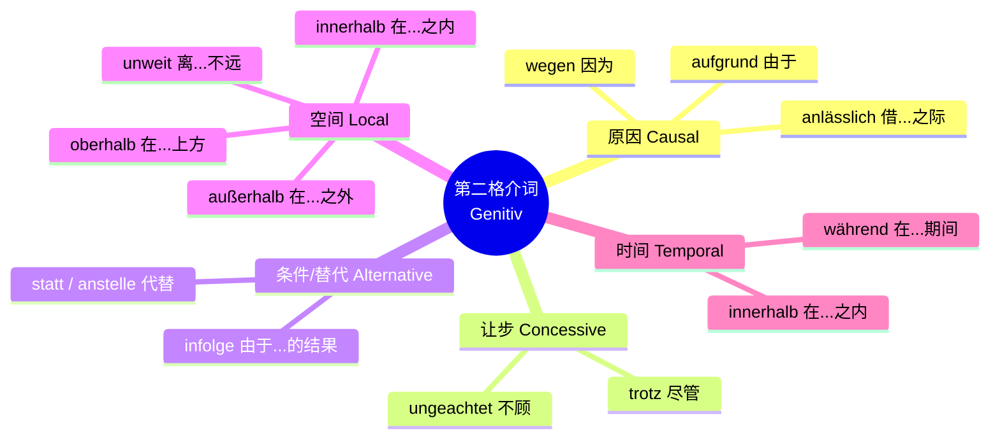

# 支配第二格介词

### 🧠 德语大师的生动类比：什么是“第二格介词”？

在德语里，格（Kasus）就像是名词的“着装要求”（Dresscode）。

- **第二格（Genitiv）**：**西装革履、晚礼服！** 这是极其正式、严谨的打扮。

**支配第二格的介词**，就像是那些挂着“衣冠不整恕不接待”牌子的高档写字楼、政府机关或大企业。只要这些介词一出场，后面的名词就必须乖乖换上“第二格”的西装。

在日常口语中，德国人常常偷懒，用第三格代替第二格（所谓“第三格是第二格的坟墓”）。但在**B 1-B 2 的考试阅读、官方信件、租房合同、工作合同**中，第二格介词无处不在！掌握它们，你的德语瞬间就会散发出一种“受过高等教育、懂规矩”的高级感。

为了让你一目了然，我们先用一张图表来拆解这个家族：

代码段

---

### 🏛️ 核心知识点全面解析（结合德国移民生存场景）

我们把这些“西装革履”的介词分为五大门派，每一个门派我都为你准备了在德国生存必不可少的实战例句。

#### 1. 原因门派 (Kausal) —— 解释为什么

当你需要向老板请假、向外管局解释为什么缺材料时，这组词是你的救星。

- **wegen（因为）**：最常用的第二格介词。
    - _场景：公共交通又双叒叕罢工了。_
    - **Wegen des** Bahnstreiks komme ich heute später ins Büro. (因为火车罢工，我今天晚点到办公室。)
- **aufgrund（由于）**：比 wegen 更正式，满脸写着“公事公办”。你在官方信件里会经常看到它。
    - _场景：外管局给你发来的补交材料信。_
    - **Aufgrund fehlender** Dokumente kann Ihr Visum nicht verlängert werden. (由于缺少文件，您的签证无法延期。)
- **anlässlich（借...之际 / 因为...的缘故）**：通常用于好的事情、庆祝活动。
    - _场景：你刚租了新房，邀请邻居来温居。_
    - **Anlässlich meines** Umzugs lade ich Sie herzlich auf ein Glas Wein ein. (借我搬家之际，诚挚邀请您来喝杯酒。)

#### 2. 时间门派 (Temporal) —— 划定时间范围

德国人极度看重时间观念（Termin）。这组介词决定了你是否会错过截止日期。

- **während（在...期间）**：
    - _场景：你在新公司的工作试用期（Probezeit）。_
    - **Während der** Probezeit beträgt die Kündigungsfrist zwei Wochen. (在试用期内，解约期为两周。)
- **innerhalb / außerhalb（在...时间之内 / 之外）**：
    - _场景：医生诊所的语音留言。_
    - Sie rufen **außerhalb der** Sprechstunden an. Bitte rufen Sie **innerhalb unserer** Öffnungszeiten noch einmal an. (您在问诊时间外来电。请在我们的营业时间之内再次致电。)

#### 3. 空间门派 (Lokal) —— 明确地理位置

找房子、看地图、划定停车位必备。

- **außerhalb / innerhalb（在...区域之外 / 之内）**：
    - _场景：你在看租房广告（Warmmiete/Kaltmiete）。_
    - Die Wohnung liegt **außerhalb des** Stadtzentrums, aber **innerhalb der** Tarifzone A. (这套公寓位于市中心之外，但在公交计费区 A 区之内。)
- **oberhalb / unterhalb（在...上方 / 下方）**：
    - _场景：签租房合同时，房东的指示。_
    - Bitte unterschreiben Sie direkt **unterhalb des** Textes. (请直接在正文下方签字。)
- **unweit（离...不远）**：非常优雅的表达，房产中介最爱用。
    - _场景：描述房屋周边便利的医疗条件。_
    - Die Wohnung befindet sich **unweit des** Krankenhauses. (公寓离医院不远。)

#### 4. 让步门派 (Konzessiv) —— 表达“尽管如此”

当生活给你暴击，但你依然坚挺时使用。

- **trotz（尽管）**：
    - _场景：找工作时面对不如意的薪资。_
    - **Trotz des** niedrigen Gehalts habe ich das Jobangebot angenommen. (尽管薪水很低，我还是接受了这份工作。)
- **ungeachtet（不顾...，不管...）**：非常高级的书面语。
    - _场景：德国天气的真实写照。_
    - **Ungeachtet des** schlechten Wetters fahre ich mit dem Fahrrad zur Arbeit. (不管天气多恶劣，我都骑自行车去上班。)

#### 5. 替代门派 (Alternativ) —— 表达“A 换成 B”

- **statt / anstelle（代替）**：
    - _场景：你期望的是无限期合同，结果老板给了限制期合同。_
    - **Statt eines** unbefristeten Arbeitsvertrags habe ich nur einen befristeten Vertrag bekommen. (代替无限期工作合同，我只拿到了一份限期合同。)

---

### ⚠️ 大师的“避坑指南”（高分细节）

1. **口语里的妥协**：在日常生活中，如果名词是复数，且前面**没有**冠词或形容词来体现第二格的词尾（-er），德国人会直接用第三格！
    
    - _正确书面语_：Wegen **der** Umbauarbeiten... (因为改建工程...)
    - _特例_：Wegen Umbauarbeiten... (这里看不出格，所以默认为第三格处理)。
        
2. **Wegen 与 人称代词的魔法合体**：
    
    - 你不能说 "wegen meins" (错！)。
    - 当 wegen 遇到人称代词，它们会合体：
        - 因为我 = **meinetwegen**
        - 因为你 = **deinetwegen**
        - 因为他 = **seinetwegen**
    - _场景_：同事觉得连累你加班了，你说：“没关系，不是因为你！” (Kein Problem, das ist nicht **deinetwegen**!)

---

### 📅 你的专属“6 个月 B 2 通关”学习规划

要在这半年内拿下 B 2，我们需要极强的纪律性和科学的节奏。以下是你的作战地图：

- **第 1-2 个月：夯实 B 1，清扫语法死角（如本节课的第二格、从句、带 zu 不定式）**
    - _任务_：每天背诵 30 个职场/生活高频词汇。掌握所有基础复合句。
    - _实战_：用德语写邮件预约看房（Besichtigungstermin），去超市或外管局官网阅读德文说明。
- **第 3-4 个月：全面进军 B 2 核心语法（虚拟二式 Konjunktiv II、被动语态 Passiv、动名搭配 Nomen-Verb-Verbindungen）**
    - _任务_：语法难度升级。开始训练长难句的阅读。
    - _实战_：每天阅读一篇德国新闻（如 DW Top-Thema），练习用虚拟二式表达礼貌请求（比如向老板要求加薪）。
- **第 5 个月：B 2 题型专练 & 写作/口语模板化**
    - _任务_：每周完成两套 B 2 模拟题（歌德学院或 Telc）。收集并背诵论述题（Erörterung）的常用过渡句型。
    - _实战_：找语伴（Tandem）进行针对社会话题（如环保、居家办公）的辩论。
- **第 6 个月：全真模拟与冲刺**
    - _任务_：严格按照考试时间限制做题。重点攻克听力盲区和口语流利度。调整心态。

---

### ✍️ 德语大师的随堂测验 (Dein Turn!)

光学不练假把式！现在请你运用今天学到的**第二格介词**，结合你的移民生活，尝试翻译以下两个句子。把它写在回复里，我会亲自为你批改！

1. **由于我生病了，我必须取消明天的面试。** (提示：由于 = aufgrund；面试 = das Vorstellungsgespräch)
2. **在试用期内，我想在市中心之外找一套公寓。** (提示：在...期间 = während；试用期 = die Probezeit；在...之外 = außerhalb；市中心 = das Stadtzentrum)

来吧，大胆地造句！德语大师期待看到你的作品！

# 加这个介词句子第二格有什么变化区别

### ⚖️ 第三步：加不加这个介词，句子到底有什么区别？

这个问题太有含金量了！我们直接通过对比来看。加不加介词，决定了这个名词在句子里**扮演什么角色**。

**场景：恶劣的天气 (der Sturm - 暴风雨)** 你的航班被取消了，你要发邮件跟老板解释。

#### ❌ 情况 A：没有介词（名词是主角/主语）

> **Der Sturm** ist sehr stark.
> 
> (暴风雨非常强烈。)

- **分析：** 这里没有介词门卫，`Der Sturm` 穿着第一格的睡衣，舒舒服服地做句子的主语（动作的发出者）。

#### ✅ 情况 B：加了第二格介词（名词沦为配角/原因状语）

> **Wegen des Sturms** wurde mein Flug storniert.
> 
> (**因为这场暴风雨**，我的航班被取消了。)

- **分析：** 这里突然杀出了 `wegen` 这个门卫！`der Sturm` 瞬间失去了主语的地位，被套上了第二格的制服（der 变成 **des**，Sturm 加了 **-s**），整个词组变成了补充说明原因的**状语（配角）**。
- **区别就在于：** 加了介词，名词就不能再当主语了，它和介词打包在一起，变成了句子的“背景板”（交代时间、地点、原因、让步等）。

---

Hallo！太棒了！你能问出关于“句子结构（Satzbau）”的问题，说明你的德语学习已经进入了极其关键的“建构阶段”。很多人单词背了一大堆，但一开口就结巴，就是因为大脑里没有清晰的句子框架。

作为你的德语大师，我必须首先非常坦诚、且极其坚定地纠正你大脑中的两个“危险误区”。别担心，这是 B 1/B 2 阶段 90%的中国学生都会踩的坑。我们今天就把这个毒瘤连根拔起！

---

# 语序框架
介词短语打头阵，动词紧跟当王霸，主语委屈退第三。
### 🛑 误区扫盲一：“第二格开头为主语”？

**大师纠错：第二格（Genitiv）在德语里，永远、绝对、不可能做主语！**

还记得我们上次说的吗？主语（句子的真正主人、动作的发出者）必须是穿着睡衣的**第一格（Nominativ）**。

第二格介词短语（比如 _Wegen des Regens_ 因为雨）它只是一个“状语”，是句子的“背景板”或“配角”，用来交代时间、原因、地点等。它就算被放在了句子的开头，它依然是个配角，绝对不能篡位当主语。

### 🛑 误区扫盲二：动词放在最后面？

**大师纠错：完全相反！动词不仅不放在最后面，它还必须紧紧跟在介词短语的后面！**

你之所以会觉得“动词放最后”，是因为你把**“介词（Präposition）”**和**“连词（Konjunktion，比如 weil, obwohl）”**搞混了。连词引导从句，动词才去句尾；而我们今天学的 _wegen, trotz, während_ 是**介词**，它们引导的是一个词组，整个句子依然是一个**主句（Hauptsatz）**。

---

### 🏰 德语句子结构框架：“国王的第二把交椅”

德语主句的灵魂法则叫做：**动词占位二（Verb-Zweit-Regel）**。

你可以这样想象：

- **变位动词（Verb）**是这个国家的“国王”，他有严重的强迫症，他的王座永远固定在句子的**第二位（Position 2）**。
    
- **主语（Subjekt / 第一格）**是国王的“贴身保镖”，必须紧挨着国王，要么在第一位，要么在第三位。
    
- **第二格介词短语（状语）**是“外宾”。
    

#### 框架 A：正常语序（保镖在前面）

外宾迟到了，坐在后面。保镖（主语）坐在第一位，国王（动词）在第二位。

|**第一位 (Position 1)**|**第二位 (Position 2)**|**第三位 (Position 3)**|**句尾 (Ende)**|
|---|---|---|---|
|**主语（保镖）**|**变位动词（国王）**|**第二格介词短语（外宾）**|其他成分/第二动词|
|**Ich** (我)|**bleibe** (留)|**wegen des Regens** (因为雨)|heute zu Hause. (今天在家里)|

#### 框架 B：倒装语序（外宾被请到第一位）—— **这正是你问的情况！**

为了强调原因/让步，我们把外宾（第二格介词短语）请到了第一位（Position 1）。

**注意：整个介词短语（Wegen + 第二格名词）只占一个位置！**

这时候，国王（动词）雷打不动，依然坐在第二位。保镖（主语）就被挤到了第三位！

|**第一位 (Position 1)**|**第二位 (Position 2)**|**第三位 (Position 3)**|**句尾 (Ende)**|
|---|---|---|---|
|**第二格介词短语（外宾）**|**变位动词（国王）**|**主语（保镖）**|其他成分/第二动词|
|**Wegen des Regens** (因为雨)|**bleibe** (留)|**ich** (我)|heute zu Hause.|
|**Trotz der Krankheit** (尽管生病)|**geht** (去)|**er** (他)|zur Arbeit. (去上班)|
|**Während der Probezeit** (试用期内)|**darf** (允许)|**man** (人们)|keinen Urlaub nehmen. (休假)|

看到规律了吗？

只要你用支配第二格的介词开头，**紧接着的那个词，必须、立刻、马上是动词！然后紧跟着主语！** ---

### 🔍 为什么你会记混？（连词 vs. 介词的终极对比）

你大脑中“动词放最后”的记忆，其实是来自意思相近的**从句连词**。我们在 B 2 写作中，经常需要把它们进行替换（这也叫语法转换）。我们来看对比，彻底理清你的思路：

**1. 表达“因为”**

- **用连词 (weil) = 引导从句，动词去句尾**
    
    > **Weil** es stark _regnet_, **bleibe** ich zu Hause. (因为下大雨，我留在家里。)
    
- **用第二格介词 (wegen) = 介词短语占第一位，动词在第二位**
    
    > **Wegen** des starken Regens **bleibe** ich zu Hause. (因为这场大雨，我留在家里。)
    

**2. 表达“尽管”**

- **用连词 (obwohl) = 引导从句，动词去句尾**
    
    > **Obwohl** er krank _ist_, **geht** er zur Arbeit. (尽管他生病了，他还是去上班。)
    
- **用第二格介词 (trotz) = 介词短语占第一位，动词在第二位**
    
    > **Trotz** seiner Krankheit **geht** er zur Arbeit. (尽管他生着病，他还是去上班。)
    

---

### 💡 德语大师总结：

在德语中，**把状语（比如第二格介词短语）放在句首，是非常高级且地道的表达方式**。它能让你的句子结构显得错落有致，不再是满篇的“Ich... Ich... Ich...”。

你只需要记住一句口诀：**“介词短语打头阵，动词紧跟当王霸，主语委屈退第三。”**

为了确保你大脑里的这个“错误程序”已经被成功卸载，并装上了新的框架，我们来做一个实战演练！

假设你在看商业新闻，你想用德语表达：**“尽管存在经济危机，这家公司还是雇佣了新员工。”** _(提示：尽管 = Trotz；经济危机 = die Wirtschaftskrise (阴性)；雇佣 = einstellen；这家公司 = die Firma；新员工 = neue Mitarbeiter)_

请你严格按照刚才讲的**“外宾-国王-保镖”**的框架，用 **Trotz** 开头，把这句话翻译出来好吗？我来帮你把关！