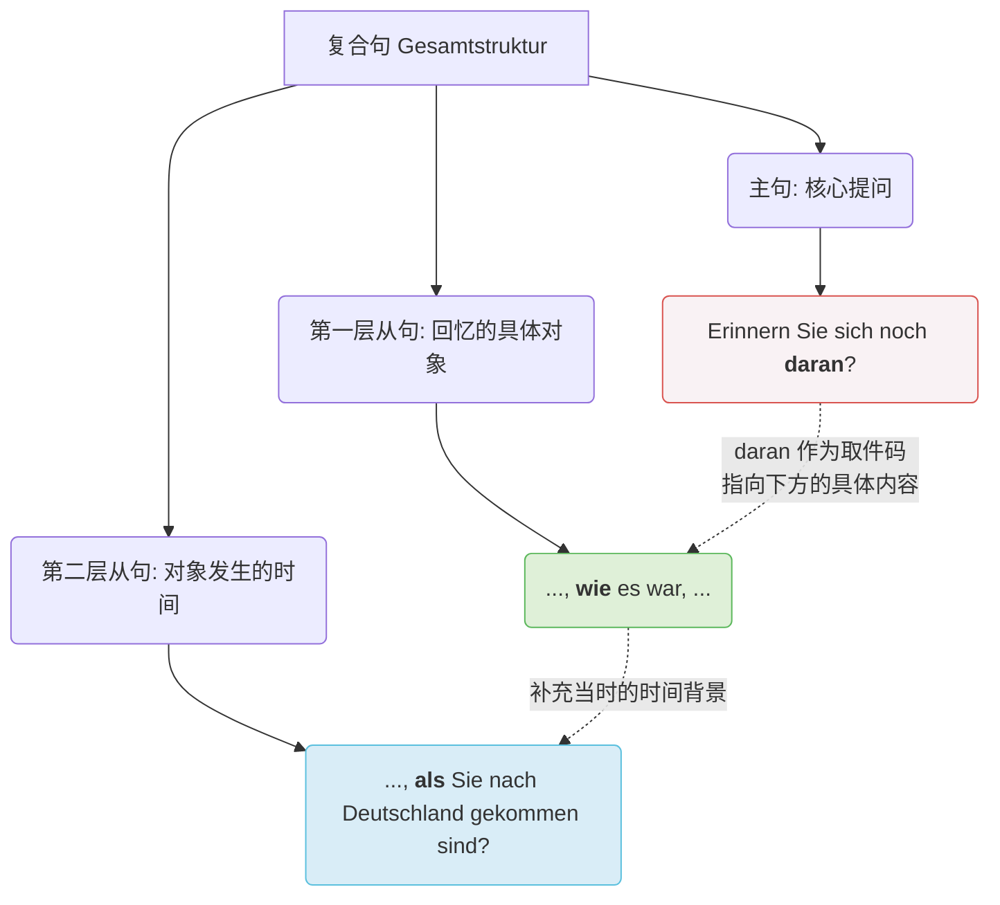

![[image-217.png|1120x297]]

# 题目解析

下面我将为您详细拆解这组题目，不仅知其然，更带您知其所以然，帮您建立更稳固的语法体系。

### 1、逐题精析与纠正

**题目类型：** 动词的固定介词搭配（Verben mit festen Präpositionen）与代副词（Pronominaladverbien / da-Wörter）作为从句占位符的用法。

**题干与待填空句子提取：**

1. Erinnern Sie sich noch _____, wie es war, als Sie nach Deutschland gekommen sind?
2. Haben Sie sich _____ geärgert, dass es so viele bürokratische Probleme gibt?
3. Erzählen Sie doch _____, wie Sie eine Wohnung gefunden haben.
4. Wenn man mit seiner Familie in ein fremdes Land zieht, ist es wichtig _____ zu achten, dass die Kinder schnell die neue Sprache lernen.
5. Ich möchte mich _____ engagieren, dass Migranten sich in der neuen Umgebung schnell zurechtfinden.

**[第 1 题]**：Erinnern Sie sich noch **daran**, wie es war, als Sie nach Deutschland gekommen sind?

- **德汉对照翻译**：您还记得您初来德国时是怎样的情形吗？
- **语法复习**：
    - `sich erinnern an + Akkusativ` (B 1)：回忆起、记得某人/某事。
    - `als` 引导的时间状语从句 (A 2)：表示过去发生的一次性事件。
- **填空分析**：
    - **当前作答**：`daran`（完全正确）。
    - **常见错误形式**：填成 `an` 或 `an das`。
    - **错误原因/母语负迁移**：中文里“记得”后面直接跟内容（记得当时的情形）。德语中，介词不能直接连接一个完整的从句（wie...）。当介词宾语是一个完整的从句时，主句中必须用一个“代副词”来占位（Platzhalter）。因为 `an` 是元音开头，所以 da 后面要加 r，变成 daran。

**[第 2 题]**：Haben Sie sich **darüber** geärgert, dass es so viele bürokratische Probleme gibt?

- **德汉对照翻译**：您有没有因为存在这么多官僚主义问题而感到生气？
- **语法复习**：
    - `sich ärgern über + Akkusativ` (B 1)：对……感到生气/恼火。
    - `dass` 引导的宾语从句 (A 2)：作主句中 darüber 指代的具体内容。
- **填空分析**：
    - **当前作答**：`darüber`（完全正确）。
    - **常见错误形式**：`daüber` 或直接用 `über`。
    - **错误原因/认知根源**：忽略了拼写规则。由于 `über` 是元音 (ü) 开头，da 和 über 之间必须插入辅音 r 起连接作用，否则发音会不连贯。

**[第 3 题]**：Erzählen Sie doch **davon**, wie Sie eine Wohnung gefunden haben.

- **德汉对照翻译**：请您讲讲您是如何找到房子的吧。
- **语法复习**：
    - `erzählen von + Dativ` (A 2/B 1)：讲述关于……的事情。
    - `wie` 引导的疑问从句作宾语从句 (A 2)。
- **填空分析**：
    - **当前作答**：`davon`（完全正确）。
    - **常见错误形式**：`darvon`。
    - **错误原因/认知根源**：过度概括了加 r 的规则。`von` 是辅音 (v) 开头，因此直接在 da 后面加上 von 即可，不需要画蛇添足加 r。

**[第 4 题]**：Wenn man mit seiner Familie in ein fremdes Land zieht, ist es wichtig **darauf** zu achten, dass die Kinder schnell die neue Sprache lernen.

- **德汉对照翻译**：当一个人带着家人搬到一个陌生的国家时，重要的是要注意让孩子们尽快学习新语言。
- **语法复习**：
    - `achten auf + Akkusativ` (B 1)：注意、留意。
    - `es ist wichtig, ... zu + Infinitiv` (A 2)：带 zu 的不定式结构，作真正的主语。
    - `wenn` 引导的条件状语从句 (A 2)。
- **填空分析**：
    - **当前作答**：`darauf`（完全正确）。
    - **常见错误形式**：`auf` 或 `dass` 引导的从句位置错乱。
    - **错误原因/母语负迁移**：受中文“注意让孩子学习”直译影响，漏掉介词结构。德语中，`achten` 离不开 `auf`，当后面的内容是一个 dass-从句时，主句必须派 `darauf` 这个“先锋”出来站岗。

**[第 5 题]**：Ich möchte mich **dafür** engagieren, dass Migranten sich in der neuen Umgebung schnell zurechtfinden.

- **德汉对照翻译**：我想致力于让移民在新的环境中迅速适应（找到方向）。
- **语法复习**：
    - `sich engagieren für + Akkusativ` (B 2)：投身于、致力于……。
    - `sich zurechtfinden` (B 2)：适应、找到方向、熟悉情况。
- **填空分析**：
    - **当前作答**：`dafür`（完全正确）。
    - **常见错误形式**：`darfür`。
    - **错误原因/认知根源**：同第 3 题，`für` 为辅音开头，不需要加 r 连接，直接使用 `dafür` 即可。

---

### 2、深度教学解析（聚焦：代副词 / da-词作占位符）

这五道题表面上考查的是不同的动词搭配，核心其实是在考查同一个语法现象：**代副词（Pronominaladverbien）在主句中作为从句的占位符（Platzhalter）**。

- **核心规则：**

    当一个动词带有固定的介词搭配（如 denken an, warten auf），且其要表达的宾语内容不是一个简单的名词，而是一个**完整的从句**（dass-从句、w-疑问从句）或**带 zu 的不定式结构**时，德语不允许用介词直接连接从句。

    我们必须在主句中使用 **da(r) + 介词** 提前“预告”后面的内容。它就像一个指示牌，告诉听众：“注意了，介词的内容太长，我把它放在后面的从句里了！”

    _构词规则_：

    1. 介词以辅音开头（von, für, mit, bei）：**da + 介词** (davon, dafür, damit, dabei)
    2. 介词以元音开头（an, auf, über, um）：**dar + 介词** (daran, darauf, darüber, darum)
        
- **正反对比例证（极易踩坑的边界）：**

    **注意！da-词只能指代“事物”或“整件事”。如果介词搭配的对象是“人”，绝对不能用 da-词！**

    - **正例（指事）**：Ich warte **darauf**, dass er anruft.（我在等他打电话来。——指代一件事）
    - **正例（指人）**：Ich warte auf **ihn**.（我在等**他**。——指代人，用 介词 + 人称代词）
    - **反例（致命错误）**：~~Ich warte darauf, meinen Bruder.~~ (错误！不能用 darauf 指代哥哥)
- **防错要点（口诀）：**

    > **“指事指物用 da 词，从句面前当先锋；若是元音加个 r，遇到活人现原形 (介词+代词)。”**

- **小试牛刀：**

    请尝试判断并填空（填 da-词 或 介词+代词）：

    1. Ich interessiere mich ______ , wie das Gerät funktioniert. (sich interessieren für)
    2. Das ist mein neuer Kollege. Ich habe dir gestern ______ erzählt. (erzählen von)

    _(答案：1. dafür - 指代后面的 wie 从句； 2. von ihm - 指代前面的男同事人)_

---

### 3、总结与回顾

- **您的学习建议**：

    您在这组练习中表现出了极高的准确率，说明您不仅熟记了右侧便签上的动词介词搭配，还准确掌握了 da-词 的拼写和占位功能。

    **终极建议**：在未来的 B 1-B 2 学习中，背诵动词时，请务必连同**反身代词（sich）+ 介词（如 auf/an）+ 要求的格（Akk/Dat）**作为**一个完整的公式**一起记忆。比如不要只背 "erinnern"，要背 "sich erinnern an + Akk."。这会帮您在未来的口语表达和长难句写作中建立近乎肌肉记忆的准确度。继续保持这种严谨的学习状态！

# 句子解析

**一、 句法结构分析**

**目标句子：** Erinnern Sie sich noch daran, wie es war, als Sie nach Deutschland gekommen sind?
**中文翻译：** 您还记得，当初您刚来德国时是什么样的情形吗？
**句式判定：** 这是一个嵌套式的复合疑问句。它包含一个主句，以及两个层层递进的从句。

全局逻辑如下：

- **主句 (Hauptsatz)：** Erinnern Sie sich noch daran? (您还记得“那件事”吗？)
- **第一层从句 (宾语从句)：** ..., wie es war, ... (“那件事”的具体内容：是什么样的情形)
- **第二层从句 (时间状语从句)：** ..., als Sie nach Deutschland gekommen sind? (情形发生的具体时间：当您来到德国时)

**二、 单词深度拆解**

**1. 主句部分：Erinnern Sie sich noch daran?**

- **Erinnern**：动词，原形为 _erinnern_。在这里因为主语是尊称 Sie，所以变位为第一/第三人称复数形式。它与后面的 sich 和 daran 共同构成了固定搭配 _sich (Akk.) erinnern an (Akk.)_（回忆起某事）。因为是一般疑问句，动词放在句首。
- **Sie**：人称代词，尊称“您”，第一格 (Nominativ)，作主句主语。
- **sich**：反身代词 (Reflexivpronomen)，第四格 (Akkusativ)。由于主语是 Sie，反身代词固定为 sich。
- **noch**：副词，意思是“仍然、还”，表示动作状态的延续。
- **daran**：**代副词 (Pronominaladverb)**。这是本句的灵魂。由 _da_ + _r_ (发音占位符) + _an_ 组成。因为 _sich erinnern_ 固定搭配介词 _an_，但我们要回忆的内容不是一个简单的名词，而是一整个从句（wie es war...），因此用 daran 在主句中作为一个“占位符”。

**语法难点生动类比：**

你可以把代副词（比如 daran）想象成一张**“大件快递取件码”**。

动词词组 _sich erinnern an_ 就像一个固执的收件人，它必须看到带有 _an_ 的包裹才肯罢休。如果包裹很小，比如一本书（das Buch），可以直接拿给它（sich erinnern an das Buch）。

但现在，你要让它回忆的是“当年你来德国时的情形”——这是一整个巨大的从句包裹！主句的空间太小，塞不下这么长的一句话。于是，你在这个位置塞给它一张取件码 **daran**，告诉它：“别急，你的 _an_ 就在这儿，前面的 _da_ 意思是‘请凭此码去逗号后面提取巨大的从句包裹’！”

**2. 第一层从句：..., wie es war, ...**

- **wie**：疑问副词 (Interrogativadverb)，这里作从属连词，引导宾语从句，意思是“如何、怎样”。
- **es**：人称代词，第三人称单数中性，第一格。这里是一个“形式主语”，用来泛指当时的“情况、局势”。
- **war**：动词，原形为 _sein_（是），这里是过去时 (Präteritum) 的第三人称单数形式，与主语 es 保持一致。表示“当时的情况是...”。从句中动词必须放在句尾（但在它后面又嵌套了一个从句，所以用逗号隔开了）。

**3. 第二层从句：..., als Sie nach Deutschland gekommen sind?**

- **als**：从属连词 (Subjunktion)，意思是“当……时候”。**注意：** 德语中表示“当...时候”，如果是过去发生且仅发生一次的事件，必须用 als；如果是多次发生或现在/将来的事件，则用 wenn。
- **Sie**：人称代词，尊称“您”，第一格，作从句主语。
- **nach**：介词，表示方向“去、前往”，固定支配第三格 (Dativ)。
- **Deutschland**：名词，中性，第三格。通常带有国家名的词不加冠词。
- **gekommen**：动词，原形为 _kommen_（来），这里是它的第二分词 (Partizip II) 形式。
- **sind**：动词，原形为 _sein_。因为 _kommen_ 是表示位置移动的动词，所以它的现在完成时 (Perfekt) 必须用 _sein_ 来作为助动词，而不是 _haben_。在从句中，变位动词（这里是 sind）必须放在整个句子的最后面。

**三、 视觉化句法逻辑图**

为了让你清晰看到“取件码”是如何运作的，请看下方的句法结构树：

代码段

**四、 知识掌握与考核练习**

结合你的第一张图片（固定搭配清单）和我们刚刚讲过的“大件快递取件码”逻辑，请你尝试完成下面这道微测试：

**题目：** 请根据中文提示，用正确的“代副词”填空。

情景：我们在讨论“明天下雨”这件事。

（提示：参考图片 1 中 _diskutieren_ 的固定搭配）

"Wir diskutieren ____________ , dass es morgen regnet."

（我们正在讨论明天下雨这件事。）

掌握了这种抽丝剥茧的方法，德语长难句就像是拼图，只要找到连接点（介词搭配与代副词），就能轻松还原全貌！

# 01

德语第二虚拟式（Konjunktiv II）是一个系统性很强的语法点，核心在于理解其**“非现实性”**以及**“两个时间维度（现在 vs. 过去）”**。

根据您提供的AnyBlock文档链接（AnyBlock是一个增强Markdown块处理的插件，通常支持将列表、表格或Mermaid代码渲染为图表），我为您准备了两种相关的可视化表达：

1. **思维导图（基于Markdown嵌套列表结构，AnyBlock通用支持）**
2. **核心流程图（使用Mermaid语法，AnyBlock通用支持）**

---

[list 2 mermaid]

- 1
    - 德语第二虚拟式 全览
        - 非现实的现在/将来。
    - 非现实的过去。

### 一、 德语第二虚拟式全知识点思维导图

您可以使用 AnyBlock 将以下 Markdown 列表渲染为思维导图模式。

### 二、 K II 时间与形式判定流程图

这是一个使用 **Mermaid** 语法的流程图，帮助您在做题或写作时快速决定使用哪种虚拟式形式。您可以在 Markdown 的 Mermaid 块中直接使用。

### 三、 系统讲解：第二虚拟式所有知识点总结表

|**知识点分类**|**核心概念/公式**|**例子 (附直陈式事实对照)**|
|---|---|---|
|**I. 概念**|描述假设、愿望、礼貌，**与事实相反**。||
|**II. 现在形式 (替代)**|`würde` + 动词原形|Ich _würde_ dich _anrufen_. (我(如果怎样)就会给你打电话。- 事实：现在没打)|
|**III. 现在形式 (原始)**|过去时词干 + 变音 + `e` 等|Du _könntest_ mitkommen. (你(本来)可以一起来。- 事实：你没来)|
|**IV. 过去形式**|`hätte` / `wäre` + Partizip II|Er _wäre_ _geblieben_. (他(当时)本来会留下的。- 事实：当时走了)|
|**V. 条件句**|Wenn S + V(KII)..., (dann) V(KII) + S...|Wenn ich reich _wäre_, _kaufte_ ich ein Haus. (如果我有钱，我就买房。- 事实：没钱不买)|
|**VI. 愿望句**|(Wenn) S + doch/nur + V(KII)!|_Wäre_ ich doch gesund! (但愿我健康就好了！- 事实：有病)|
|**VII. 礼貌/建议**|常用 _könnten_, _würden_, _hätte gern_|Ich _hätte gern_ einen Tee. (我想要杯茶。- 比 Ich will 礼貌)|
|**VIII. 高阶：情态过去**|`hätte` + Inf. + 情态Inf.|Sie _hätte_ _kommen sollen_. (她本该来的。- 事实：当时没来)|
