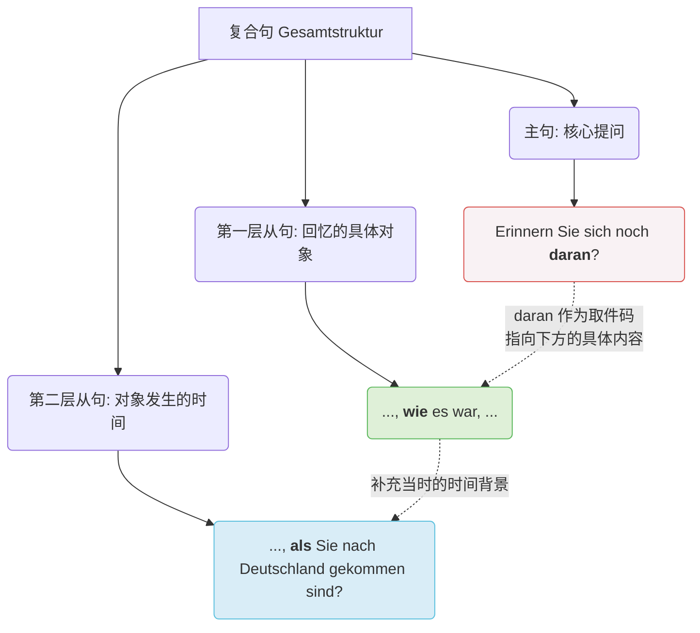
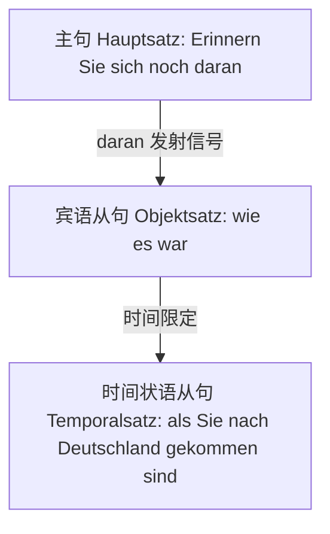
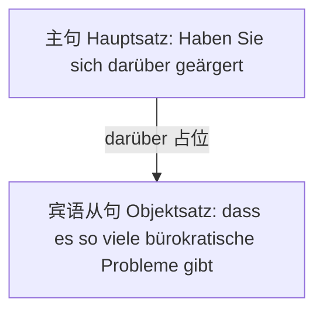
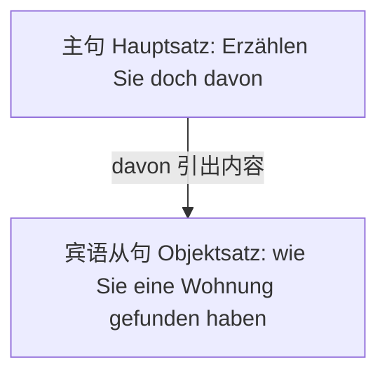
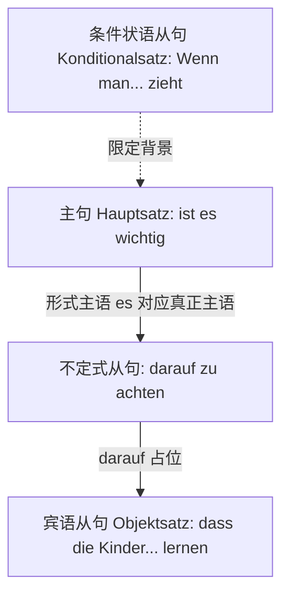
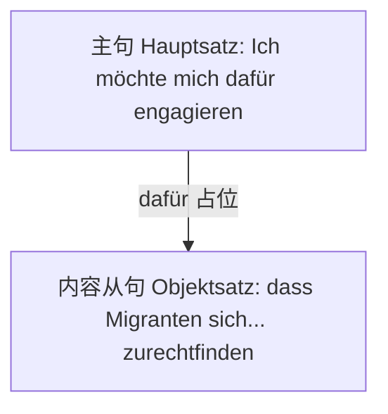

![[image-217.png|1120x297]]

# 题目解析

下面我将为您详细拆解这组题目，不仅知其然，更带您知其所以然，帮您建立更稳固的语法体系。

### 1、逐题精析与纠正

**题目类型：** 动词的固定介词搭配（Verben mit festen Präpositionen）与代副词（Pronominaladverbien / da-Wörter）作为从句占位符的用法。

**题干与待填空句子提取：**

1. Erinnern Sie sich noch _____, wie es war, als Sie nach Deutschland gekommen sind?
2. Haben Sie sich _____ geärgert, dass es so viele bürokratische Probleme gibt?
3. Erzählen Sie doch _____, wie Sie eine Wohnung gefunden haben.
4. Wenn man mit seiner Familie in ein fremdes Land zieht, ist es wichtig _____ zu achten, dass die Kinder schnell die neue Sprache lernen.
5. Ich möchte mich _____ engagieren, dass Migranten sich in der neuen Umgebung schnell zurechtfinden.

**[第 1 题]**：Erinnern Sie sich noch **daran**, wie es war, als Sie nach Deutschland gekommen sind?

- **德汉对照翻译**：您还记得您初来德国时是怎样的情形吗？
- **语法复习**：
    - `sich erinnern an + Akkusativ` (B 1)：回忆起、记得某人/某事。
    - `als` 引导的时间状语从句 (A 2)：表示过去发生的一次性事件。
- **填空分析**：
    - **当前作答**：`daran`（完全正确）。
    - **常见错误形式**：填成 `an` 或 `an das`。
    - **错误原因/母语负迁移**：中文里“记得”后面直接跟内容（记得当时的情形）。德语中，介词不能直接连接一个完整的从句（wie...）。当介词宾语是一个完整的从句时，主句中必须用一个“代副词”来占位（Platzhalter）。因为 `an` 是元音开头，所以 da 后面要加 r，变成 daran。

**[第 2 题]**：Haben Sie sich **darüber** geärgert, dass es so viele bürokratische Probleme gibt?

- **德汉对照翻译**：您有没有因为存在这么多官僚主义问题而感到生气？
- **语法复习**：
    - `sich ärgern über + Akkusativ` (B 1)：对……感到生气/恼火。
    - `dass` 引导的宾语从句 (A 2)：作主句中 darüber 指代的具体内容。
- **填空分析**：
    - **当前作答**：`darüber`（完全正确）。
    - **常见错误形式**：`daüber` 或直接用 `über`。
    - **错误原因/认知根源**：忽略了拼写规则。由于 `über` 是元音 (ü) 开头，da 和 über 之间必须插入辅音 r 起连接作用，否则发音会不连贯。

**[第 3 题]**：Erzählen Sie doch **davon**, wie Sie eine Wohnung gefunden haben.

- **德汉对照翻译**：请您讲讲您是如何找到房子的吧。
- **语法复习**：
    - `erzählen von + Dativ` (A 2/B 1)：讲述关于……的事情。
    - `wie` 引导的疑问从句作宾语从句 (A 2)。
- **填空分析**：
    - **当前作答**：`davon`（完全正确）。
    - **常见错误形式**：`darvon`。
    - **错误原因/认知根源**：过度概括了加 r 的规则。`von` 是辅音 (v) 开头，因此直接在 da 后面加上 von 即可，不需要画蛇添足加 r。

**[第 4 题]**：Wenn man mit seiner Familie in ein fremdes Land zieht, ist es wichtig **darauf** zu achten, dass die Kinder schnell die neue Sprache lernen.

- **德汉对照翻译**：当一个人带着家人搬到一个陌生的国家时，重要的是要注意让孩子们尽快学习新语言。
- **语法复习**：
    - `achten auf + Akkusativ` (B 1)：注意、留意。
    - `es ist wichtig, ... zu + Infinitiv` (A 2)：带 zu 的不定式结构，作真正的主语。
    - `wenn` 引导的条件状语从句 (A 2)。
- **填空分析**：
    - **当前作答**：`darauf`（完全正确）。
    - **常见错误形式**：`auf` 或 `dass` 引导的从句位置错乱。
    - **错误原因/母语负迁移**：受中文“注意让孩子学习”直译影响，漏掉介词结构。德语中，`achten` 离不开 `auf`，当后面的内容是一个 dass-从句时，主句必须派 `darauf` 这个“先锋”出来站岗。

**[第 5 题]**：Ich möchte mich **dafür** engagieren, dass Migranten sich in der neuen Umgebung schnell zurechtfinden.

- **德汉对照翻译**：我想致力于让移民在新的环境中迅速适应（找到方向）。
- **语法复习**：
    - `sich engagieren für + Akkusativ` (B 2)：投身于、致力于……。
    - `sich zurechtfinden` (B 2)：适应、找到方向、熟悉情况。
- **填空分析**：
    - **当前作答**：`dafür`（完全正确）。
    - **常见错误形式**：`darfür`。
    - **错误原因/认知根源**：同第 3 题，`für` 为辅音开头，不需要加 r 连接，直接使用 `dafür` 即可。

---

### 2、深度教学解析（聚焦：代副词 / da-词作占位符）

这五道题表面上考查的是不同的动词搭配，核心其实是在考查同一个语法现象：**代副词（Pronominaladverbien）在主句中作为从句的占位符（Platzhalter）**。

- **核心规则：**

    当一个动词带有固定的介词搭配（如 denken an, warten auf），且其要表达的宾语内容不是一个简单的名词，而是一个**完整的从句**（dass-从句、w-疑问从句）或**带 zu 的不定式结构**时，德语不允许用介词直接连接从句。

    我们必须在主句中使用 **da(r) + 介词** 提前“预告”后面的内容。它就像一个指示牌，告诉听众：“注意了，介词的内容太长，我把它放在后面的从句里了！”

    _构词规则_：

    1. 介词以辅音开头（von, für, mit, bei）：**da + 介词** (davon, dafür, damit, dabei)
    2. 介词以元音开头（an, auf, über, um）：**dar + 介词** (daran, darauf, darüber, darum)
        
- **正反对比例证（极易踩坑的边界）：**

    **注意！da-词只能指代“事物”或“整件事”。如果介词搭配的对象是“人”，绝对不能用 da-词！**

    - **正例（指事）**：Ich warte **darauf**, dass er anruft.（我在等他打电话来。——指代一件事）
    - **正例（指人）**：Ich warte auf **ihn**.（我在等**他**。——指代人，用 介词 + 人称代词）
    - **反例（致命错误）**：~~Ich warte darauf, meinen Bruder.~~ (错误！不能用 darauf 指代哥哥)
- **防错要点（口诀）：**

    > **“指事指物用 da 词，从句面前当先锋；若是元音加个 r，遇到活人现原形 (介词+代词)。”**

- **小试牛刀：**

    请尝试判断并填空（填 da-词 或 介词+代词）：

    1. Ich interessiere mich ______ , wie das Gerät funktioniert. (sich interessieren für)
    2. Das ist mein neuer Kollege. Ich habe dir gestern ______ erzählt. (erzählen von)

    _(答案：1. dafür - 指代后面的 wie 从句； 2. von ihm - 指代前面的男同事人)_

---

### 3、总结与回顾

- **您的学习建议**：

    您在这组练习中表现出了极高的准确率，说明您不仅熟记了右侧便签上的动词介词搭配，还准确掌握了 da-词 的拼写和占位功能。

    **终极建议**：在未来的 B 1-B 2 学习中，背诵动词时，请务必连同**反身代词（sich）+ 介词（如 auf/an）+ 要求的格（Akk/Dat）**作为**一个完整的公式**一起记忆。比如不要只背 "erinnern"，要背 "sich erinnern an + Akk."。这会帮您在未来的口语表达和长难句写作中建立近乎肌肉记忆的准确度。继续保持这种严谨的学习状态！

# 句子解析

**一、 句法结构分析**

**目标句子：** Erinnern Sie sich noch daran, wie es war, als Sie nach Deutschland gekommen sind?

**中文翻译：** 您还记得，当初您刚来德国时是什么样的情形吗？

**句式判定：** 这是一个嵌套式的复合疑问句。它包含一个主句，以及两个层层递进的从句。

全局逻辑如下：

- **主句 (Hauptsatz)：** Erinnern Sie sich noch daran? (您还记得“那件事”吗？)
- **第一层从句 (宾语从句)：** ..., wie es war, ... (“那件事”的具体内容：是什么样的情形)
- **第二层从句 (时间状语从句)：** ..., als Sie nach Deutschland gekommen sind? (情形发生的具体时间：当您来到德国时)

**二、 单词深度拆解**

**1. 主句部分：Erinnern Sie sich noch daran?**

- **Erinnern**：动词，原形为 _erinnern_。在这里因为主语是尊称 Sie，所以变位为第一/第三人称复数形式。它与后面的 sich 和 daran 共同构成了固定搭配 _sich (Akk.) erinnern an (Akk.)_（回忆起某事）。因为是一般疑问句，动词放在句首。
- **Sie**：人称代词，尊称“您”，第一格 (Nominativ)，作主句主语。
- **sich**：反身代词 (Reflexivpronomen)，第四格 (Akkusativ)。由于主语是 Sie，反身代词固定为 sich。
- **noch**：副词，意思是“仍然、还”，表示动作状态的延续。
- **daran**：**代副词 (Pronominaladverb)**。这是本句的灵魂。由 _da_ + _r_ (发音占位符) + _an_ 组成。因为 _sich erinnern_ 固定搭配介词 _an_，但我们要回忆的内容不是一个简单的名词，而是一整个从句（wie es war...），因此用 daran 在主句中作为一个“占位符”。

**语法难点生动类比：**

你可以把代副词（比如 daran）想象成一张**“大件快递取件码”**。

动词词组 _sich erinnern an_ 就像一个固执的收件人，它必须看到带有 _an_ 的包裹才肯罢休。如果包裹很小，比如一本书（das Buch），可以直接拿给它（sich erinnern an das Buch）。

但现在，你要让它回忆的是“当年你来德国时的情形”——这是一整个巨大的从句包裹！主句的空间太小，塞不下这么长的一句话。于是，你在这个位置塞给它一张取件码 **daran**，告诉它：“别急，你的 _an_ 就在这儿，前面的 _da_ 意思是‘请凭此码去逗号后面提取巨大的从句包裹’！”

**2. 第一层从句：..., wie es war, ...**

- **wie**：疑问副词 (Interrogativadverb)，这里作从属连词，引导宾语从句，意思是“如何、怎样”。
- **es**：人称代词，第三人称单数中性，第一格。这里是一个“形式主语”，用来泛指当时的“情况、局势”。
- **war**：动词，原形为 _sein_（是），这里是过去时 (Präteritum) 的第三人称单数形式，与主语 es 保持一致。表示“当时的情况是...”。从句中动词必须放在句尾（但在它后面又嵌套了一个从句，所以用逗号隔开了）。

**3. 第二层从句：..., als Sie nach Deutschland gekommen sind?**

- **als**：从属连词 (Subjunktion)，意思是“当……时候”。**注意：** 德语中表示“当...时候”，如果是过去发生且仅发生一次的事件，必须用 als；如果是多次发生或现在/将来的事件，则用 wenn。
- **Sie**：人称代词，尊称“您”，第一格，作从句主语。
- **nach**：介词，表示方向“去、前往”，固定支配第三格 (Dativ)。
- **Deutschland**：名词，中性，第三格。通常带有国家名的词不加冠词。
- **gekommen**：动词，原形为 _kommen_（来），这里是它的第二分词 (Partizip II) 形式。
- **sind**：动词，原形为 _sein_。因为 _kommen_ 是表示位置移动的动词，所以它的现在完成时 (Perfekt) 必须用 _sein_ 来作为助动词，而不是 _haben_。在从句中，变位动词（这里是 sind）必须放在整个句子的最后面。

**三、 视觉化句法逻辑图**

为了让你清晰看到“取件码”是如何运作的，请看下方的句法结构树：

代码段

在为你逐句拆解之前，我们需要先破解这五句话共同的“核心语法密码”——**代副词（Pronominaladverbien）的“占位”功能**。

**💡 生动类比：插头与无线信号发射器**

想象一下，德语里的“动词+介词”固定搭配（例如 _sich erinnern an_）就像一个**“带孔的插座”**。

- 如果你想接一个普通的名词（比如“那件事”），它就像一个**“小插头”**，可以直接插进去：Ich erinnere mich _an die Sache_。
- 但是，如果你想接的是一整个完整的从句（比如“你刚来德国时是什么样子的”），这个从句太庞大，就像一台**“巨型电器”**，根本无法直接塞进 _an_ 这个小插座孔里。

这时候怎么办？德语发明了**代副词（如 daran, darüber, davon 等）**。你可以把它当作一个**“无线信号发射器”**：把它插进主句的插座里占住位置，然后由它向后发射信号，将逻辑完美连接到后面的庞大从句上。

接下来，我们就用这个逻辑，为你补全这五句话，并进行极其细致的“庖丁解牛”。

---

**【句式一深度解析】**

**德语原句：** Erinnern Sie sich noch **daran**, wie es war, als Sie nach Deutschland gekommen sind?

**中文翻译：** 您还记得，您刚来德国时是什么样子的吗？

**句式判定：** 主从复合句（Satzgefüge）

**全局句法：** 主句（核心矩阵）向后引出由 _wie_ 引导的宾语从句（间接疑问句），而在该宾语从句内部，又嵌套了一个由 _als_ 引导的时间状语从句。

**逻辑关系图 (Mermaid)：**

代码段

**单词逐一拆解：**

- **Erinnern**：动词原形 _erinnern_。现在时 (Präsens) 第二人称尊称变位。与 sich 构成反身动词 _sich erinnern an_（回忆起）。
- **Sie**：人称代词 (Personalpronomen)。第三人称尊称复数，主格 (Nominativ) 作主语。
- **sich**：反身代词 (Reflexivpronomen)。第四格 (Akkusativ)，配合主语。
- **noch**：副词 (Adverb)。意为“还，仍然”。
- **daran**：代副词 (Pronominaladverb)。**填空答案**。由 da+r+an 构成，在主句中作为介词宾语占位，指代后面的从句。
- **wie**：疑问副词 (Interrogativadverb)。引导间接疑问句。
- **es**：人称代词。第三人称单数中性，主格，此处作形式主语（Dummy-Subjekt）。
- **war**：动词 _sein_（是）。过去时 (Präteritum) 第三人称单数变位。
- **als**：从属连词 (Subjunktion)。引导时间状语从句，表示过去发生的一次性事件。
- **Sie**：人称代词。主格，作从句主语。
- **nach**：介词 (Präposition)。支配第三格 (Dativ)，表示前往某个国家或城市的方向。
- **Deutschland**：名词 (Nomen)。中性，第三格。
- **gekommen**：动词 _kommen_（来）的第二分词 (Partizip Perfekt)。
- **sind**：动词 _sein_ 的现在时尊称变位。作为助动词 (Hilfsverb) 与 gekommen 构成完成时，并==因从句语序被置于句末==。

---

**【句式二深度解析】**

**德语原句：** Haben Sie sich **darüber** geärgert, dass es so viele bürokratische Probleme gibt?

**中文翻译：** 您有没有因为这里有如此多官僚主义的问题而感到生气？

**句式判定：** 主从复合句（Satzgefüge）

**全局句法：** 核心主句为现在完成时，通过占位符 _darüber_ 引出由 _dass_ 引导的宾语从句。

**逻辑关系图 (Mermaid)：**

代码段

**单词逐一拆解：**

- **Haben**：动词 _haben_。现在时尊称变位，作为助动词构成完成时。
- **Sie**：人称代词。主格，主语。
- **sich**：反身代词。第四格。
- **darüber**：代副词。**填空答案**。因为 _sich ärgern über_（对...生气）支配介词 _über_，故用 da+r+über 占位。
- **geärgert**：动词 _ärgern_ 的第二分词。
- **dass**：从属连词。引导解释具体内容的宾语从句。
- **es**：人称代词。主格，固定搭配 _es gibt_（有）的形式主语。
- **so**：副词。修饰 viele，意为“如此，这么”。
- **viele**：不定代词/形容词 (Indefinitpronomen)。复数第四格。
- **bürokratische**：形容词 (Adjektiv)。因为前面的 viele 具有零冠词特征，形容词按强变化 (starke Deklination)，复数第四格词尾为 -e。
- **Probleme**：名词。中性复数，第四格 (Akkusativ) 作为 _es gibt_ 的逻辑宾语。
- **gibt**：动词 _geben_。现在时第三人称单数，因从句语序置于句末。

---

**【句式三深度解析】**

**德语原句：** Erzählen Sie doch **davon**, wie Sie eine Wohnung gefunden haben.

**中文翻译：** 您就讲讲看，您是怎么找到房子的吧。

**句式判定：** 主从复合句（祈使句基调）

**全局句法：** 带有祈使意味的主句，向后引出 _wie_ 引导的间接疑问句作宾语。

**逻辑关系图 (Mermaid)：**

代码段

**单词逐一拆解：**

- **Erzählen**：动词 _erzählen_（讲述）。尊称祈使句形式（动词原形+Sie）。
- **Sie**：人称代词。主格。
- **doch**：情态小品词 (Modalpartikel)。无实质翻译，用于软化语气，表达“鼓励、劝说”（您就讲讲嘛）。
- **davon**：代副词。**填空答案**。搭配 _erzählen von_（讲述关于...），支配第三格，此处占位。
- **wie**：疑问副词。引导方式/方法。
- **Sie**：人称代词。主格，从句主语。
- **eine**：不定冠词 (unbestimmter Artikel)。阴性第四格。
- **Wohnung**：名词。阴性，第四格 (Akkusativ)，作宾语。
- **gefunden**：动词 _finden_（找到）的第二分词。
- **haben**：动词 _haben_。现在时尊称变位，助动词。

---

**【句式四深度解析】**

**德语原句：** Wenn man mit seiner Familie in ein fremdes Land zieht, ist es wichtig **darauf** zu achten, dass die Kinder schnell die neue Sprache lernen.

**中文翻译：** 当一个人带着他的家人搬到一个陌生的国家时，重要的是要注意让孩子们快速学习新语言。

**句式判定：** 多重嵌套复合句

**全局句法：** 结构极为精妙。最前方是 _Wenn_ 条件/时间从句；核心主句是 _ist es wichtig_；而它真正的逻辑主语是后面的带 _zu_ 不定式从句（_darauf zu achten_）；在这个不定式中，又用占位符引出了最深层的 _dass_ 宾语从句。

**逻辑关系图 (Mermaid)：**

代码段

**单词逐一拆解：**

- **Wenn**：从属连词。引导条件/时间从句（当...时 / 如果）。
- **man**：不定代词。单数主格，泛指“人们/一个人”。
- **mit**：介词。支配第三格。
- **seiner**：物主冠词 (Possessivartikel)。由于 _Familie_ 是阴性，且受 _mit_ 支配，所以变形为阴性第三格 -er。
- **Familie**：名词。阴性第三格。
- **in**：双格介词 (Wechselpräposition)。表示移动的方向（搬去...），此处支配第四格。
- **ein**：不定冠词。中性第四格。
- **fremdes**：形容词（陌生的）。由于前面是不定冠词，中性第四格形容词实行强变化，加 -es。
- **Land**：名词。中性第四格。
- **zieht**：动词 _ziehen_（搬迁）。现在时第三人称单数。
- **ist**：动词 _sein_。主句动词，因为条件从句占据了第一位 (Position 1)，所以动词紧随其后在第二位。
- **es**：人称代词。形式主语，代指后面的带 zu 不定式。
- **wichtig**：形容词。作表语（重要的）。
- **darauf**：代副词。**填空答案**。搭配 _achten auf_（注意...），支配第四格，在此引出深层从句。
- **zu**：不定式小品词 (Infinitivpartikel)。
- **achten**：动词原形。与 zu 构成不定式。
- **dass**：从属连词。引导宾语从句。
- **die**：定冠词 (bestimmter Artikel)。复数主格。
- **Kinder**：名词。中性复数主格，从句主语。
- **schnell**：副词（快速地）。
- **die**：定冠词。阴性第四格。
- **neue**：形容词。定冠词后的弱变化 (schwache Deklination)，阴性第四格加 -e。
- **Sprache**：名词。阴性第四格，宾语。
- **lernen**：动词 _lernen_。现在时复数第三人称。

---

**【句式五深度解析】**

**德语原句：** Ich möchte mich **dafür** engagieren, dass Migranten sich in der neuen Umgebung schnell zurechtfinden.

**中文翻译：** 我想致力于（让）移民能够在新环境中迅速适应。

**句式判定：** 主从复合句

**全局句法：** 带有情态动词的主句，通过代副词引出表达具体目的/内容的宾语从句。

**逻辑关系图 (Mermaid)：**

代码段

**单词逐一拆解：**

- **Ich**：人称代词。第一人称单数，主格。
- **möchte**：情态动词 _mögen_ 的第二虚拟式 (Konjunktiv II)，常作独立情态动词表达礼貌的意愿（想要）。
- **mich**：反身代词。第一人称单数第四格，配合主语。
- **dafür**：代副词。**填空答案**。固定搭配 _sich engagieren für_（投身于/致力于...），支配第四格，占位引出从句。
- **engagieren**：动词原形。置于句末。
- **dass**：从属连词。
- **Migranten**：名词 _Migrant_（移民，源自 n-Deklination 弱变化名词）的复数形式。主格，从句主语。
- **sich**：反身代词。复数第四格，构成 _sich zurechtfinden_（找到方向，适应）。
- **in**：双格介词。此处表示静态位置（在...环境中），支配第三格。
- **der**：定冠词。阴性第三格。
- **neuen**：形容词。定冠词后的弱变化，所有第三格一律加 -en。
- **Umgebung**：名词。阴性第三格。
- **schnell**：副词。
- **zurechtfinden**：可分动词 (trennbares Verb)。由于在 dass 从句中，前缀不分离，直接全拼写在句末，并根据主语作复数第三人称变位（与原形同形）。

---

**【进阶自我考核：看看你是否真正掌握了“插头转换器”的奥秘】**

请尝试运用刚刚学习的逻辑，为下面的三个句子填上正确的代副词。

（提示：先回想动词搭配的介词是什么！）

1. Ich freue mich _____ , dass du morgen kommst. (我很期待你明天能来。)
2. Wir sprechen _____ , wie wir das Problem lösen können. (我们正在讨论如何解决这个问题。)
3. Er träumt _____ , ein eigenes Haus zu bauen. (他梦想着建一栋属于自己的房子。)

> **解析与答案对照：**
> 
> 1. **darauf**。搭配：_sich freuen auf_ (Akk.) 表示对未来发生之事的期待。
>     
> 2. **darüber**。搭配：_sprechen über_ (Akk.) 表示谈论某个话题。
>     
> 3. **davon**。搭配：_träumen von_ (Dat.) 表示梦想着某事。

语言的学习就像搭建乐高，理清了每个砖块（单词）的接口（变格变位），再复杂的城堡（长句）也能被你轻松拆解。祝你德语学习愉快，Viel Erfolg!

# 01

德语第二虚拟式（Konjunktiv II）是一个系统性很强的语法点，核心在于理解其**“非现实性”**以及**“两个时间维度（现在 vs. 过去）”**。

根据您提供的AnyBlock文档链接（AnyBlock是一个增强Markdown块处理的插件，通常支持将列表、表格或Mermaid代码渲染为图表），我为您准备了两种相关的可视化表达：

1. **思维导图（基于Markdown嵌套列表结构，AnyBlock通用支持）**
2. **核心流程图（使用Mermaid语法，AnyBlock通用支持）**

---

[list 2 mermaid]

- 1
    - 德语第二虚拟式 全览
        - 非现实的现在/将来。
    - 非现实的过去。

### 一、 德语第二虚拟式全知识点思维导图

您可以使用 AnyBlock 将以下 Markdown 列表渲染为思维导图模式。

### 二、 K II 时间与形式判定流程图

这是一个使用 **Mermaid** 语法的流程图，帮助您在做题或写作时快速决定使用哪种虚拟式形式。您可以在 Markdown 的 Mermaid 块中直接使用。

### 三、 系统讲解：第二虚拟式所有知识点总结表

|**知识点分类**|**核心概念/公式**|**例子 (附直陈式事实对照)**|
|---|---|---|
|**I. 概念**|描述假设、愿望、礼貌，**与事实相反**。||
|**II. 现在形式 (替代)**|`würde` + 动词原形|Ich _würde_ dich _anrufen_. (我(如果怎样)就会给你打电话。- 事实：现在没打)|
|**III. 现在形式 (原始)**|过去时词干 + 变音 + `e` 等|Du _könntest_ mitkommen. (你(本来)可以一起来。- 事实：你没来)|
|**IV. 过去形式**|`hätte` / `wäre` + Partizip II|Er _wäre_ _geblieben_. (他(当时)本来会留下的。- 事实：当时走了)|
|**V. 条件句**|Wenn S + V(KII)..., (dann) V(KII) + S...|Wenn ich reich _wäre_, _kaufte_ ich ein Haus. (如果我有钱，我就买房。- 事实：没钱不买)|
|**VI. 愿望句**|(Wenn) S + doch/nur + V(KII)!|_Wäre_ ich doch gesund! (但愿我健康就好了！- 事实：有病)|
|**VII. 礼貌/建议**|常用 _könnten_, _würden_, _hätte gern_|Ich _hätte gern_ einen Tee. (我想要杯茶。- 比 Ich will 礼貌)|
|**VIII. 高阶：情态过去**|`hätte` + Inf. + 情态Inf.|Sie _hätte_ _kommen sollen_. (她本该来的。- 事实：当时没来)|
