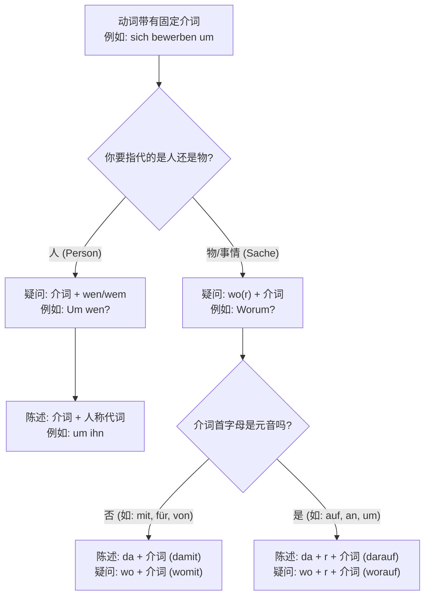

> [!quote] 
> 常用于[[⭐必背所有知识点整理考察整理#^sykfxg|从句]] , 指代之前的时间地点，宾语。 或引导从句。
> 包含了[[支配介词宾语的动词#支配介词宾语的动词]]章节所有知识点。
# 代副词

### 第一部分：什么是“代副词”？（神器的“语言压缩包”）

想象一下，你刚搬到德国，手里提着一个巨大的行李箱，里面装着“你的护照、租房合同、工作签证申请表”。每次向别人介绍时，你都要把这些东西全念一遍，是不是很累？

德语里有一种语法，叫作**动词的固定介词搭配（Verben mit Präpositionen）**。比如：

- warten **auf** (等待...)
- sprechen **über** (谈论...)
- sich erinnern **an** (回忆起...)

如果你在等你的长期居留卡（die Niederlassungserlaubnis），完整句子是：

> _Ich warte **auf die Niederlassungserlaubnis**._ (我在等长期居留卡。)

但如果别人已经知道你在等什么，你还想再提这件事，重复一长串名词就显得很笨重。这时候，**代副词**就闪亮登场了！它就像电脑里的**ZIP 压缩包**，直接把“介词 + 那个长长的名词”压缩成一个小巧的词：

> _Ich warte **darauf**._ (我在等**它**。)

这就是代副词的核心魅力：**高效、简洁、避免重复**！

---

### 第二部分：代副词的“制造配方”与结构图表

代副词的拼写其实非常像搭积木。我们分为**陈述句/回答（说“这个/那个”）**和**疑问句（问“什么”）**两种情况。

#### 1. 陈述句中的代副词（指代已知事物）

- **公式 1：da + 介词** （如果介词以辅音开头）
    - da + mit = **damit**
    - da + von = **davon**
    - da + für = **dafür**
- **公式 2：da + r + 介词** （如果介词以**元音** a, e, i, o, u 开头）
    - _类比：两个元音（a 和 a）撞在一起发音很拗口，所以德国人请来了字母 **"r"** 充当“万能胶水”，把它们粘起来！_
    - da + r + auf = **darauf**
    - da + r + über = **darüber**
    - da + r + an = **daran**

#### 2. 疑问句中的代副词（用来提问）

- **公式 1：wo + 介词** （辅音开头）
    - wo + mit = **womit**
    - wo + für = **wofür**
- **公式 2：wo + r + 介词** （元音开头，同样需要“胶水 r”）
    - wo + r + auf = **worauf**
    - wo + r + an = **woran**

为了让你脑海中有个清晰的判断路径，我为你绘制了一张逻辑决策图：

代码段

---

### 第三部分：生死攸关的铁律——“对物不对人”！

这是 B 1-B 2 级别考试中最容易踩的坑。**代副词（da-/wo-）绝对、永远、只能用于“事物”或“概念”，绝对不能用于“人”或“有生命的动物”！** 如果对象是人，必须老老实实使用 **“介词 + 人称代词（宾格/与格）”**。

让我们来看看具体的移民生活场景对比：

**场景 1：看医生 (Arztbesuch) —— 动词: warten auf (A) 等待**

- 等待**事物（化验结果）**：
    - 问：**Worauf** warten Sie? (您在等什么？)
    - 答：Ich warte auf die Blutergebnisse. Ich warte **darauf**. (我在等它。)
- 等待**人（主治医生）**：
    - 问：**Auf wen** warten Sie? _(绝不能说 Worauf!)_
    - 答：Ich warte auf den Arzt. Ich warte **auf ihn**. _(绝不能说 darauf!)_

**场景 2：找工作 (Jobsuche) —— 动词: sprechen über (A) 谈论**

- 谈论**事物（工作合同）**：
    - 问：**Worüber** sprecht ihr? (你们在谈论什么？)
    - 答：Wir sprechen über den Arbeitsvertrag. Wir sprechen **darüber**. (我们在谈论这个。)
- 谈论**人（新来的老板）**：
    - 问：**Über wen** sprecht ihr?
    - 答：Wir sprechen über den neuen Chef. Wir sprechen **über ihn**.

---

### 第四部分：B 2 的高光时刻——代副词作为“预告员”（Korrelat）

如果你想在 B 2 口语和写作考试中拿到高分，这一招必须掌握！

当动词的固定搭配后面跟的不是一个简单的名词，而是一整个**从句（dass-Satz）**或**带 zu 的不定式（zu-Infinitiv）**时，代副词会在主句里充当“预告员”的角色。

_类比：代副词就像演唱会主持人，站在舞台（主句）上拿着麦克风说：“女士们先生们，接下来有请重量级嘉宾（从句）登场！”_

**场景 3：行政手续 (Behördengänge) —— 动词: sich vorbereiten auf (A) 为...做准备**

你正在为“延长签证”这件事做准备。“延长签证”（mein Visum zu verlängern）是一个动作，一句话。

- 普通表达：Ich bereite mich auf die Visumsverlängerung vor. (名词，略显生硬)
- **高级 B 2 表达：** Ich bereite mich **darauf** vor, mein Visum **zu verlängern**.

    _(这里的 darauf 就在预告后半句的内容：我正在为**这件事**做准备，什么事呢？延长我的签证。)_

**场景 4：租房纠纷 (Mietprobleme) —— 动词: sich ärgern über (A) 对...感到生气**

房东总是无缘无故涨房租，你很生气。

- **高级 B 2 表达：** Ich ärgere mich **darüber**, **dass** der Vermieter die Miete ständig erhöht.

    _(darüber 预告了后面的 dass 从句。)_

---

### 课堂实战练习 (Dein Turn!)

语言是练出来的。结合上面讲的规则，请尝试将以下几个移民生活中的中文句子翻译成德语。关注动词的固定介词搭配，并判断是“人”还是“物”。

1. _(找房场景 - 动词 achten auf A 注意)_ 你在注意副食支出（die Nebenkosten）吗？是的，我在注意**这个**。
2. _(工作场景 - 动词 sich bewerben um A 申请)_ 你在申请**什么**？我在申请 IT 开发者的职位（die Stelle als IT-Entwickler）。
3. _(医疗场景 - 动词 erinnern an A 提醒)_ 护士提醒**他**，明天要空腹来。_(提示：人称代词！并且后半句用 dass-从句)_

你可以将练习写在笔记本上，反复琢磨其中的逻辑。记住，德语语法的学习就像在德国市政厅办理手续，虽然一开始看着条条框框非常严苛，但只要你掌握了它的办事逻辑和规则，一切都会变得无比高效且顺理成章！Viel Erfolg! (祝你成功！)
