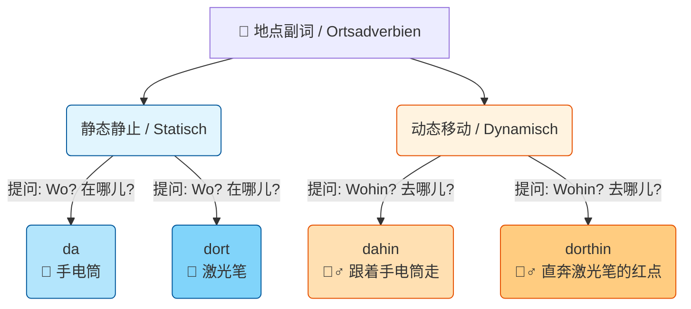

# 方位副词

Hallo！太棒了！你能敏锐地察觉到 `da` 和 `dort` 是**静态（静止不动）**的，这说明你的德语语感已经建立得非常好了！很多人学了很久都会把静态和动态搞混，而你已经成功跨过了这道坎。

---

### 第一步：复习静态双雄 —— `da` vs. `dort` (回答 "Wo?")

既然你已经知道它们是静态的，那我们只需搞清楚它们的**“精确度”**和**“距离感”**。

#### 1. `da` = 🔦 手电筒的光晕（模糊、广泛、通常较近）

`da` 是一个非常万能、甚至有点“随便”的词。它指的是一个相对模糊的区域，有时候甚至可以翻译成“这里”。

- **生活场景（租房/生病）：**
    - _Ist der Hausmeister da?_ (房管在吗？—— 意思是：他在这片区域/这栋楼里吗？不用指明具体在哪个房间。)
    - _Es tut genau da weh._ (医生，我正是“这块儿”疼。—— 捂着肚子，指的是一个大概的区域。)

#### 2. `dort` = 🔴 激光笔的红点（精确、具体、通常较远）

`dort` 必须是明确指向远处的某一个具体的点，带有强烈的指示性：“就在那儿！”

- **生活场景（行政办事）：**
    - _Die Ausländerbehörde ist dort drüben._ (外管局就在“那边”。—— 你通常同时会伸出手指，明确指向马路对面的一栋楼。)
    - _Unterschreiben Sie bitte dort!_ (请在“那儿”签字！—— 办事员用笔敲着合同上的某个横线。)

---

### 第二步：动态升级 —— 加入魔法后缀 `-hin`

在德语里，** `-hin` 代表一个动作“远离说话人，向目标移动”**。

只要你在静态词后面加上 `-hin`，它就瞬间通上了电，变成了动态词，用来回答 **Wohin?（去哪儿？）**。

#### 3. `dahin` = 🚶‍♂️ 驶向手电筒的光晕（大方向、或代指上文提过的地方）

由于 `da` 比较模糊，所以 `dahin` 通常指“往那个大致方向走”，或者更常见的是：**代指你们刚刚在对话中提到的那个地方**（不强调具体的物理方位）。

- **生活场景（找工作/日常）：**
    - _Ich habe morgen ein Vorstellungsgespräch bei Siemens. Ich fahre jetzt **dahin**._

        (我明天在西门子有个面试。我现在要开车“去那儿”。—— 这里的 `dahin` 只是代指西门子这家公司，不是在指路。)

    - _Stell den Karton einfach **dahin**._ (把纸箱随便放“那边”吧。—— 搬家时，你随意指了一个角落。)

#### 4. `dorthin` = 🏃‍♂️ 直奔激光笔的红点（精确的物理移动目标）

由于 `dort` 是激光笔，所以 `dorthin` 强调的是物理空间上，明确朝着远处的一个**极其精确的点**移动。

- **生活场景（指路/安顿）：**
    - _Sehen Sie den leeren Schalter? Bitte gehen Sie **dorthin**._

        (您看到那个空着的柜台了吗？请您“去那儿”。—— 办事大厅里，工作人员明确指引你走向特定的 5 号柜台。)

    - _Stell den Schrank bitte genau **dorthin**._

        (请把衣柜精确地放在“那儿”。—— 你指着卧室墙角预留好的一个正方形空地。)

---

### 快速总结对照表

|**德语词**|**状态**|**提问词**|**类比意象**|**中文翻译**|
|---|---|---|---|---|
|**da**|静态|Wo? (在哪)|🔦 手电筒 (模糊/较近)|在那里 / 在这里|
|**dort**|静态|Wo? (在哪)|🔴 激光笔 (精确/较远)|在那儿 (远指)|
|**dahin**|动态|Wohin? (去哪)|🚶‍♂️ 走向手电筒|往那边去 / 去提到的那儿|
|**dorthin**|动态|Wohin? (去哪)|🏃‍♂️ 直奔激光笔|径直朝那儿走去|

---

### 💡 大师的 B 2 小贴士 (B 2-Tipp)

在真实的德国日常口语（Umgangssprache）中，德国人非常喜欢偷懒。他们经常会把 `dahin` 甚至 `dorthin` 简称为 ** `da ... hin` **（把词拆开）。

例如：

- 标准语：_Ich gehe **dahin**._
- 口语：_Ich gehe **da** mal **hin**._ (我过去看一眼/我走一趟。)

    作为 B 2 的学习者，你写作文和邮件时要用合在一起的规范形式，但听力里听到拆开的，你要能秒懂！
