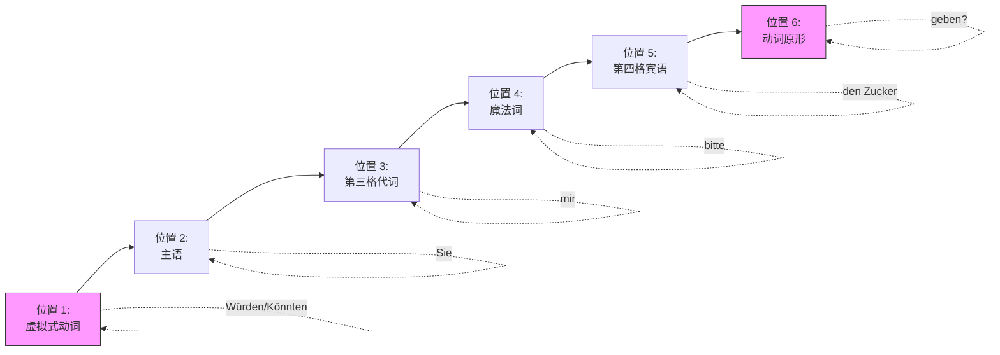

# Würden und Könnten

![[image-340.png|1024x675]]
ID: 1774612227712

太棒了！看来你已经准备好迎接德语礼貌等级的“天花板”——**第二虚拟式 (Konjunktiv II)** 了！

图片里的练习非常经典，它正是教你如何在德国社会中做到“彬彬有礼”。在德国，无论是去外管局 (Ausländerbehörde) 办签证，还是在公司和同事沟通，熟练使用 **Würden** 和 **Könnten**，你的德语听起来就会像加了高级润滑油一样顺滑，别人也会更乐意帮助你。

---

### 🎭 核心概念剖析：Würden vs. Könnten 的微妙心理学

虽然它们都是“委婉请求”的终极武器，但语气上有一点点极其微妙的侧重。我们来打个比方：
ID: 1774612227716

* **Könnten Sie ...? (您能... 吗？)**：侧重于**可能性/能力**。
* **潜台词**：“您客观上有空/有条件帮我这个忙吗？” (对应英语的 *Could you...?*)
* **Würden Sie ...? (您愿意... 吗？)**：侧重于**主观意愿**。
* **潜台词**：“您主观上愿意费心帮我一下吗？” (对应英语的 *Would you...?*)

**💡 大师秘籍 (Geheimtipp)**：在日常交流中，这两个句型基本上可以**完全互换**！德国人听到其中任何一个，都会觉得你非常有教养。如果在句子里加上一个神奇的魔法词 **bitte (请)**，你的请求就无可挑剔了。

---

### 📊 句型结构拆解图 (Mermaid)

在做题之前，我们先用图表把德语的“框形结构 (Klammerstruktur)”印在你的脑子里。记住，**变位的虚拟式动词在第二位，真正的动作（动词原形）永远被踢到句子的最后面！**
ID: 1774612227718

---

### 📝 你的作业解答 (Lösungen)

根据上面的结构，我们来把图片里的题目一口气解决掉。我为你加上了 **bitte**，这在日常生活中是极其推荐的习惯！
ID: 1774612227721

**2. (mir den Weg zum Bahnhof sagen) 告诉我怎么去火车站**

* *Würden Sie mir bitte den Weg zum Bahnhof sagen?*
* *Könnten Sie mir bitte den Weg zum Bahnhof sagen?*

**3. (mir den Stift geben) 给我那支笔**

* *Würden Sie mir bitte den Stift geben?*
* *Könnten Sie mir bitte den Stift geben?*

**4. (das Radio leiser machen) 把收音机声音关小点** (注意，这句题目里没有 mir)

* *Würden Sie bitte das Radio leiser machen?*
* *Könnten Sie bitte das Radio leiser machen?*

**5. (mir das Wörterbuch geben) 给我那本字典**

* *Würden Sie mir bitte das Wörterbuch geben?*
* *Könnten Sie mir bitte das Wörterbuch geben?*

**6. (mir die Rechnung erklären) 给我解释一下账单**

* *Würden Sie mir bitte die Rechnung erklären?*
* *Könnten Sie mir bitte die Rechnung erklären?*
*(大师注：这句话在德国看医生、修车或者退租的时候超级实用！德国的账单经常像天书一样，这时候抛出这句，对方一定会耐心给你解释。)*

---

### 🇩🇪 移民实战演练

为了让你这半年的 B 2 冲刺更有针对性，我们把视角拉回到你的移民生活中。
ID: 1774612227725

假设你现在正在**市政厅 (Bürgeramt)** 办理户口登记 (Anmeldung)，但是工作人员说话太快了，你没听懂。这时候千万别只说一个生硬的 *"Was?"* (什么？)。

你需要用上今天学的终极礼貌大招。你能试着用 **Könnten Sie...** 或 **Würden Sie...** 加上动词 **wiederholen (重复)** 或者说得慢一点 **(langsamer sprechen)**，来造一个求助的句子吗？

**写下你的句子，我来为你检验这块“B 2 敲门砖”是否足够闪亮！**
