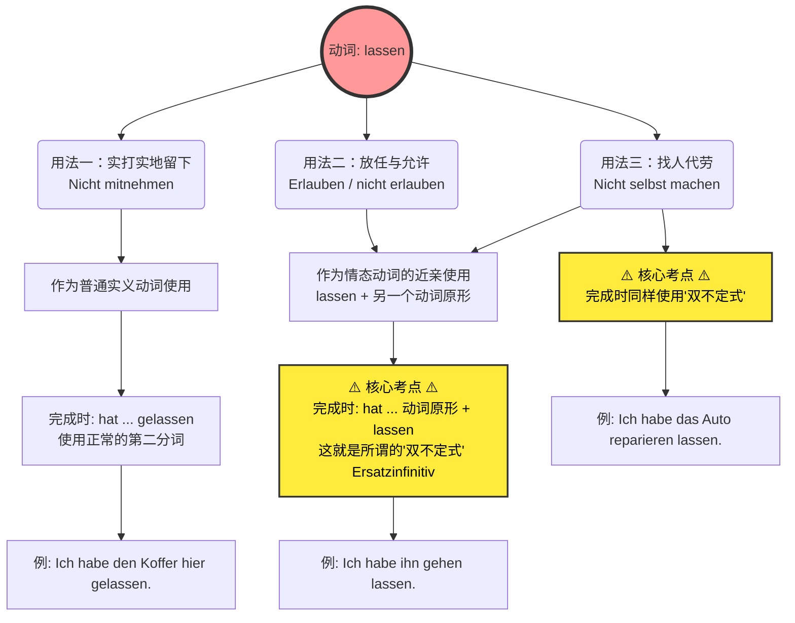

# lassen

- [!] 错题：[[lassen错误#1]]

### 为什么 `werden` 和 `lassen` 能享受“单独开篇”的 VIP 待遇？

在德语里，绝大多数动词都是“单面人”，比如 `essen`（吃）就是吃，`schlafen`（睡）就是睡。但 `werden` 和 `lassen` 是德语动词界的**“瑞士军刀”**和**“变形金刚”**。它们不仅词义多变，更要命的是，**它们在不同的语境下，会改变整个句子的语法结构。**

- **关于 `werden`（B 2 核心中的核心）：** 它不仅可以作实义动词表示“变成”（Ich werde alt. 我变老了），它还是**将来时**的助动词（Ich werde nach Deutschland fliegen. 我将飞往德国），更是**被动语态**的核心助动词（Das Haus wird gebaut. 房子正在被建造）。在德国的职场、租房合同、政府公文中，被动语态满天飞，没有 `werden` 你寸步难行。
- **关于 `lassen`（也就是你图片里的主角）：** 它不仅可以当普通的实义动词（留下），还能像**情态动词**一样带出另一个动词（允许/让别人做）。最让初学者头疼的是，**它在变成完成时（Perfekt）的时候，有两种截然不同的变法（正常变位 vs. 双不定式）**。

如果不把它们单独拿出来把规则讲透，学习者到了 B 1/B 2 阶段遇到各种长难句绝对会一头雾水。

---

### 图解解析：`lassen` 的三重影分身

为了让你更直观地理解，我为你准备了一张图表，梳理了图片中 `lassen` 的三种核心用法以及它们在完成时（Perfekt）中的致命考点。

代码段

现在，我们结合你未来在德国的生活场景，把图片里的三个例子揉碎了喂给你：

#### 第一层境界：不带走 (Nicht mitnehmen) —— “实打实地留下”

- **书上例句：** Kann ich meine Koffer hier **lassen**? （我可以把行李箱留在这吗？）
- **大师解析：** 在这里，`lassen` 就是一个普普通通的动词，意思是“把某物留在某地”。
- **移民生活场景：** 你刚到德国，去外管局（Ausländerbehörde）办居留卡，工作人员需要审核你的材料原件。你可以问：
    - _Kann ich meinen Pass hier **lassen**?_ (我可以把护照留在这里吗？)
- **语法重点（现在完成时）：** 因为它是普通动词，所以过去分词规规矩矩地变成 **gelassen**。
    - _Ich habe meinen Pass hier **gelassen**._ (我把护照留在那里了。)

#### 第二层境界：（不）允许 (Erlauben) —— “放任、让步”

- **书上例句：** Ich **lasse** mein Kind nicht **fernsehen**. (我不让/不允许我的孩子看电视。)
- **大师解析：** 这里 `lassen` 充当了类似 `dürfen` (允许) 的角色，句子里出现了第二个动词 `fernsehen`（看电视）。
- **移民生活场景：** 你在德国租房，房东立了规矩，不允许在阳台烧烤（很常见的德国生活痛点）：
    - _Der Vermieter **lässt** uns nicht auf dem Balkon **grillen**._ (房东不让我们在阳台烧烤。)
- **语法重点（现在完成时）：** **注意！前方高能！** 图片里标了红色的 ⚠️ 警告符号。当 `lassen` 后面跟着另一个动词时，它的完成时**绝对不能**用 gelassen，而是要用**动词原形 + lassen 的原形**（这叫 Ersatzinfinitiv 替代不定式，B 1/B 2 必考）。
    - _Ich habe mein Kind nicht **fernsehen lassen**._ (不是 fernsehen gelassen!)

#### 第三层境界：不自己做 (Nicht selbst machen) —— “花钱消灾 / 找人代劳”

- **书上例句：** Ich **lasse** meine Haare **schneiden**. (我让人给我剪头发。)
- **大师解析：** 这是 `lassen` 最地道、最高频的用法！中文我们说“我去剪头发”，但在德语逻辑里，如果你说 _Ich schneide meine Haare_，德国人会以为你自己拿着剪刀对着镜子剪。在德国，只要是**请别人/雇别人**帮你做的事，都必须用 `lassen`！
- **移民生活场景：** 德国人工费极贵，很多事德国人喜欢 DIY。但如果你的车坏了，你自己修不了，送去了修车厂（Werkstatt）：
    - _Ich **lasse** mein Auto **reparieren**._ (我让别人修我的车。)
- **语法重点（现在完成时）：** 和第二层境界一样，带有第二个动词，完成时使用**双不定式**：
    - _Ich habe mein Auto **reparieren lassen**._ (我把车送去修了。)

---

总结一下，`werden` 和 `lassen` 之所以要单独拎出来，是因为它们有着**改变句子结构**的魔力，尤其是 `lassen` 在完成时里的“双不定式”现象，是打破初学者原有语法认知的一个巨大挑战。

这三个场景在德国每一天的生活中都会遇到。为了检验你是不是真的掌握了 `lassen` 的“双不定式”魔法，给你布置一个小任务：

**如果昨天你的家里水管坏了，你花钱请了一位水管工（Klempner）来修好了它。请你用德语的“现在完成时（Perfekt）”结合 `lassen`，告诉我：“我（昨天）找人修了水管（das Wasserrohr reparieren）”，这句话应该怎么说呢？**
