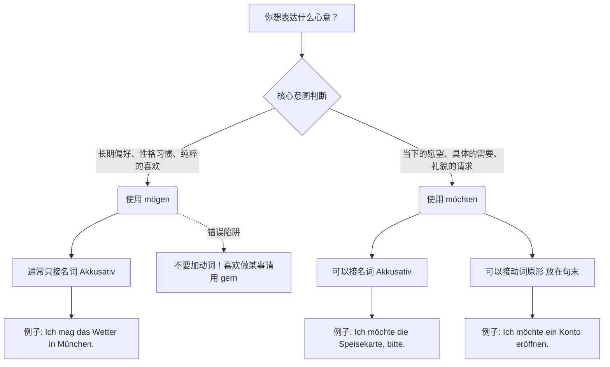

# möchten mögen 区别用法，意思，全面掌握

为了让你一秒记住它们的核心区别，我们先来打个生动的比方：

- **mögen** 就像你身上的**“永久纹身”**，代表你骨子里的喜好、长期的品味或对某人某物的态度。
- **möchten** 就像你在餐厅里的**“限时点单”**，代表你此刻具体的愿望，或者有求于人时包装精美的礼貌用语。

让我们掰开揉碎了全面掌握它们。

---

### 一、 核心揭秘：它们其实是“一家人”

很多教材不会一开始就告诉你一个残酷（但有趣）的真相：**möchten 其实根本不是一个独立的动词！**

它是 mögen 的**第二虚拟式（Konjunktiv II）**。在德语里，第二虚拟式常用来表达“非现实”或“委婉/礼貌”。但是，因为 möchten 实在太常用了，现代德语干脆把它当成一个独立的情态动词来教。

所以：

- **mögen** = 喜欢（直白的客观事实）
- **möchten** = （如果可以的话）我想要...（委婉的个人意愿）

---

### 二、 Mögen 表达长期喜好

**1. 核心用法：mögen + 名词（第四格 Akkusativ）**

当你指着某样东西、某个人，想表达“我挺喜欢它/他”时，用 mögen。

- **变位（不规则，需死记）：**

    ich mag, du magst, er/sie/es mag

    wir mögen, ihr mögt, sie/Sie mögen

- **移民生活实战场景：**
    - _租房：_ Ich **mag** diese Wohnung, sie ist sehr hell. (我喜欢这套公寓，它很宽敞明亮。——表达你的长期品味)
    - _职场：_ Mein neuer Chef ist nett. Ich **mag** ihn. (我的新老板人不错。我喜欢他。——表达人际关系上的好感)
    - _生活：_ Mein Kind **mag** keine Kartoffeln. (我家的孩子不爱吃土豆。——陈述客观习惯)

**🚫 德语大师的防坑警告（极度重要！）：**

在现代标准德语中，**尽量不要用 mögen + 动词原形** 来表达“喜欢做某事”！

很多初学者会受英语 "I like to play football" 的影响，造出 "Ich mag Fußball spielen" 这样的句子。虽然有些地区口语能听懂，但并不地道。

✅ **正确姿势：** 表达“喜欢做某事”，我们通常用动词 + **gern**（副词：乐意地）。

- 错误：Ich mag in Deutschland leben.
- 正确：Ich lebe **gern** in Deutschland. (我喜欢住在德国。)

---

### 三、 Möchten：你的“限时点单”（表达当下愿望或礼貌请求）

这是你在德国办签证、看医生、找工作时**使用频率最高**的词。它不代表你骨子里有多热爱这件事，只代表你“现在需要/想要”。

**1. 核心用法 A：möchten + 名词（第四格 Akkusativ）**

“我想要某物”。

- **变位（注意 ich 和 er/sie/es 是一样的）：**
    ich möchte, du möchtest, er/sie/es möchte
    wir möchten, ihr möchtet, sie/Sie möchten

- **移民生活实战场景：**
    - _餐厅：_ Ich **möchte** bitte einen Kaffee. (我想要一杯咖啡。——你不是在表达你热爱咖啡，而是你现在就要点一杯。)
    - _看医生：_ Ich **möchte** einen Termin für nächste Woche. (我想预约一个下周的时间。)

**2. 核心用法 B：möchten + 动词原形（放在句子最后！）**

“我想做某事”。这是情态动词的标准框架结构。

- **移民生活实战场景：**
    - _市政厅（Bürgeramt）：_ Ich **möchte** meine Adresse **ummelden**. (我想更改我的注册地址。——极其典型的行政用语)
    - _职场：_ Ich **möchte** mich um diese Stelle **bewerben**. (我想申请这个职位。)
    - _医疗：_ Ich **möchte** mich krankschreiben **lassen**. (我想开张病假条。)

---

### 四、 视觉化总结与对比

为了帮助你更好地理解这个决策过程， 我为你生成了一个判断流程图。这个图表是使用 Mermaid 工具生成的，它可以将类似 Markdown 的文本转化为直观的图表 。我们使用了自上而下（TD）的流程图结构 ，节点（如 A、B）通过箭头（-->）连接，代表选择的流向 。

+4

代码段

---

### 五、 德语大师的实战检验

光看不练假把式！既然我们的目标是半年内冲刺B2，就必须立刻把知识转化为肌肉记忆。请根据上面讲的“纹身（长期偏好）” vs “点单（当下愿望）”逻辑，尝试把以下三个极其常见的移民生活场景翻译成德语：

1. **找房场景：** “我喜欢这个街区 (das Viertel)，我想要租(mieten)这套公寓(die Wohnung)。”
2. **看病场景：** “我不喜欢这家医院 (das Krankenhaus)，但我现在想预约一位皮肤科医生 (der Hautarzt)。”
3. **交友场景：** “你喜欢喝啤酒(das Bier)吗？你现在想喝一杯吗？” (提示：前者用名词，后者用名词或动词都可以)

**下一步：**

Would you like me to review your translations for these three practice sentences and provide corrections, or should we move straight into the detailed rules of using "gern" to express your hobbies?
