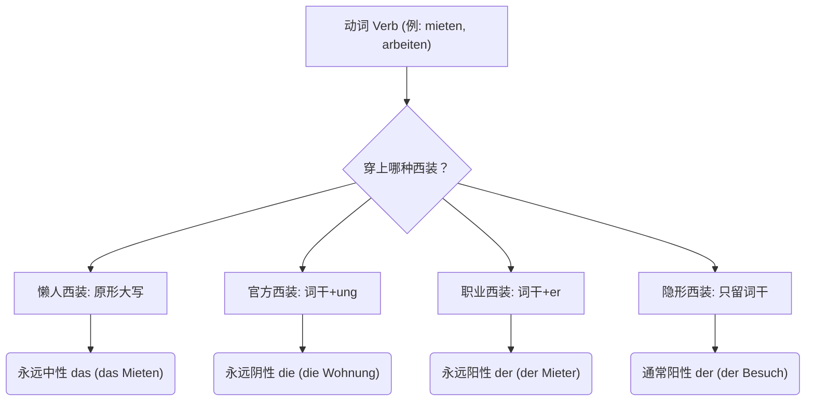

# 动词名词化

今天我们要攻克的 B 1-B 2 核心堡垒叫做——**动词名词化 (Nominalisierung von Verben)**。

这不仅是 B 2 考试（尤其是阅读和写作）的必考重点，更是你在德国生存的“护身符”。无论是去外管局（Ausländerbehörde）办签证、签租房合同，还是看医生，德国人极其偏爱使用名词。

### 👨‍💼 什么是“动词变名词”？一个生动的类比

想象一下，**动词**就像是穿着工作服在工地上跑来跑去的**“工人”**，他们负责执行具体的动作（比如：跑、建、修）。 而**名词**，就像是穿上了高级西装、坐在办公室里的**“经理”**。

德国的官方语言（Behördendeutsch）非常高冷且严谨，他们觉得让“工人”在正式文件里跑来跑去太不体面了，所以他们喜欢给这些“工人”套上西装，把动作变成一个静止的、抽象的概念（名词）。把动词变名词，就是一场**“职场换装游戏”**。

我们先通过下面这张图表，直观地看看动词都有哪几种“西装”可以穿：

代码段

---

### 👔 详细拆解：给动词穿上四件不同的“西装”

#### 1. 懒人西装：原形直接大写 (Das-Nominalisierung)

这是最简单的变法，直接把动词的第一个字母大写，前面加上中性冠词 **das**。它强调的是**动作正在进行的那个纯粹的状态**。

- **规则**：das + 动词原形（首字母大写）
- **移民生活场景（医疗与规则）**：
    - _rauchen_ (抽烟) ➔ **das Rauchen** (抽烟这件事)
    - _lesen_ (阅读) ➔ **das Lesen** (阅读这件事)
- **大师例句**：
    - **Das Rauchen** ist im Krankenhaus streng verboten. (医院内严格禁止吸烟。)
    - _大师点评：与其说 "Sie dürfen hier nicht rauchen" (你不能在这抽烟 - B 1 水平)，护士更喜欢用名词化的表达，显得冷酷且不可抗拒。_

#### 2. 官方西装：词干 + ung (Die-Nominalisierung)

这是 B 2 级别**最最最重要**的一个后缀！它是德国公务员的最爱。只要看到 **-ung**，你就能闻到一股浓浓的“官方文件”味道。它通常表示动作的**过程或产生的结果**。

- **规则**：去掉词尾 -en，加上 -ung。冠词永远是 **die**，复数永远加 -en。
- **移民生活场景（行政事务与租房）**：
    - _anmelden_ (登记/注册) ➔ **die Anmeldung** (落户登记，你在德国最重要的一张纸！)
    - _kündigen_ (解约/辞职) ➔ **die Kündigung** (解约信/辞退)
    - _überweisen_ (转账) ➔ **die Überweisung** (转账单/医生的转诊单)
- **大师例句**：
    - Für **die Anmeldung** bei der Stadt brauchen Sie Ihren Pass. (在市政厅进行落户登记时，您需要您的护照。)
    - Ihre **Kündigung** für die Wohnung muss schriftlich erfolgen. (您的房屋解约必须以书面形式进行。)

#### 3. 职业西装：词干 + er (Der-Nominalisierung)

这个后缀用来赋予动词“人格”，专门用来揪出**执行动作的那个人**（或者机器）。

- **规则**：去掉词尾 -en，加上 -er。表示男性或统称时冠词是 **der**（变女性加 -in 变成 die）。
- **移民生活场景（找工作与租房）**：
    - _mieten_ (租) ➔ **der Mieter** (租客) / **die Mieterin** (女租客)
    - _arbeiten_ (工作) + _geben_ (给) ➔ **der Arbeitgeber** (给你工作的人 = 雇主)
    - _arbeiten_ (工作) + _nehmen_ (拿) ➔ **der Arbeitnehmer** (拿工作的人 = 雇员)
- **大师例句**：
    - **Der Arbeitgeber** muss den Arbeitsvertrag unterschreiben. (雇主必须签署劳动合同。)

#### 4. 隐形西装：只留词干，裸奔上阵

这是一种非常古老且地道的变法。动词粗暴地砍掉词尾 -en，有时候甚至内部的元音都会发生变化。这种词通常表示一个**抽象概念或事件**。

- **规则**：动词词干（有时需变音）。冠词绝大多数是 **der**。
- **移民生活场景（日常交际与事务）**：
    - _besuchen_ (拜访) ➔ **der Besuch** (探访/客人)
    - _umziehen_ (搬家) ➔ **der Umzug** (搬家)
    - _kaufen_ (买) ➔ **der Kauf** (购买)
- **大师例句**：
    - Nach dem **Umzug** müssen Sie Ihre neue Adresse mitteilen. (搬家后您必须通知您的新地址。)

---

### 🚀 B 2 核心提分技巧：从“动词风格”到“名词风格”

为什么我们要花这么大力气学动词变名词？因为在 B 2 考试的写作（Schreiben）和阅读（Lesen）中，频繁考查一种句型转换：**Verbalstil (动词风格) ➔ Nominalstil (名词风格)**。

在 B 1 阶段，你习惯用连词（Wenn, Weil, Bevor）引导一个长长的动词从句；

到了 B 2 阶段，你需要用**介词 + 名词**把整个从句压缩成一个小短语，这就是传说中的“穿西装”。

**对比一下：**

- **B 1 (动词风格 - 穿工作服)**:

    _Wenn_ Sie die Wohnung _kündigen_, müssen Sie drei Monate warten.

    (当您解约房子时，您必须等三个月。)

- **B 2 (名词风格 - 穿西装)**:

    _Bei der_ **Kündigung** der Wohnung müssen Sie drei Monate warten.

    (在房屋解约时，您必须等三个月。)

看到了吗？句子瞬间变得干练、正式、具有法律效力！

---

为了检验你是否真正掌握了这个 B 2 核心技巧，你能尝试用今天学到的词缀 **-ung**，把下面这个 B 1 级别的从句改写成 B 2 级别的名词风格（Nominalstil）吗？

**请改写：**

"**Wenn** ich mich bei der Ausländerbehörde **anmelde**, brauche ich meinen Pass." (当我在外管局登记时，我需要我的护照。)

_(提示：使用 anmelden 的名词形式，并将 'Wenn ich mich ... anmelde' 浓缩为 'Bei der ...')_
